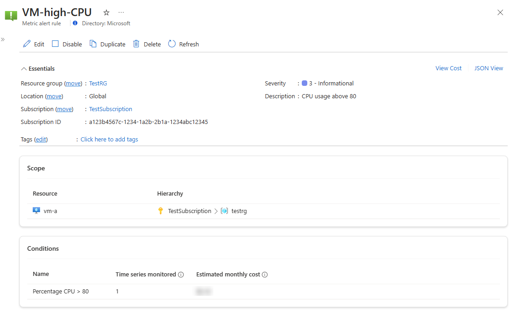
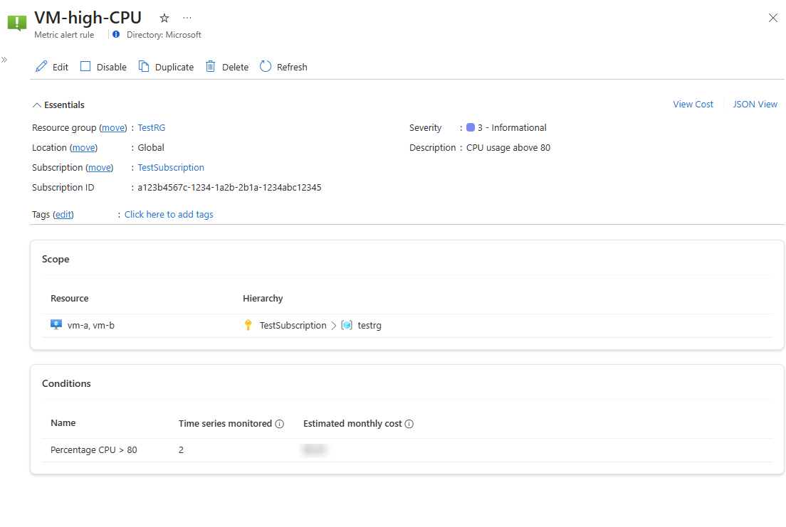
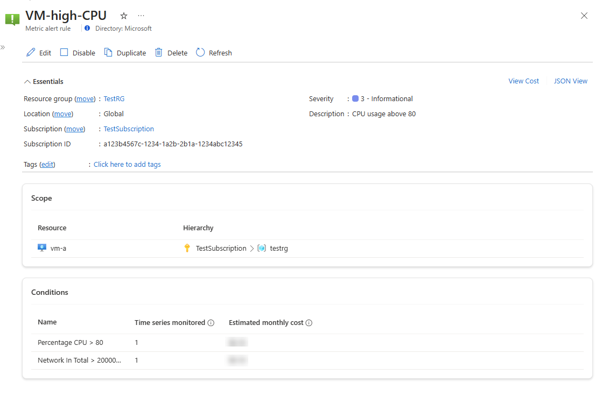
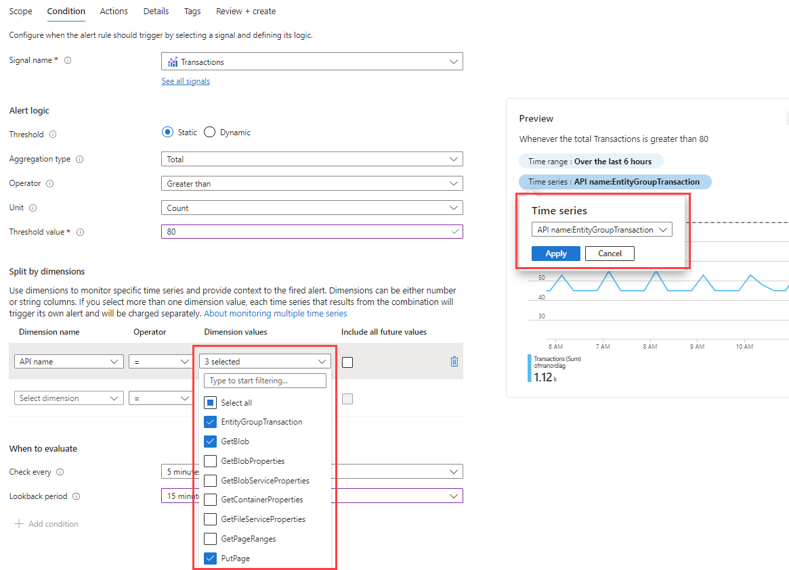
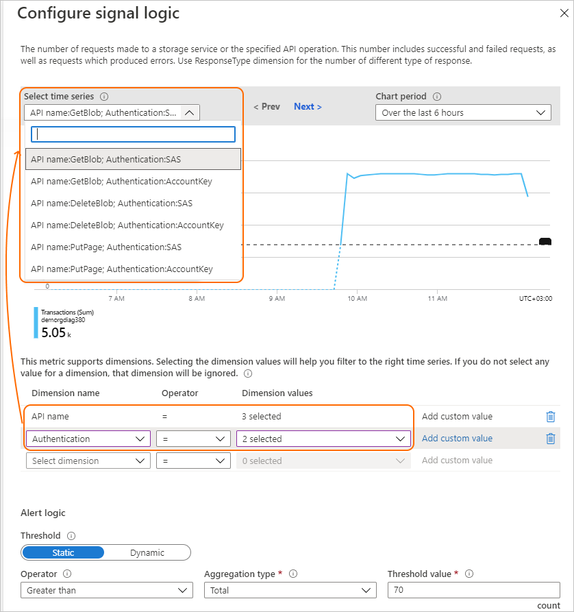
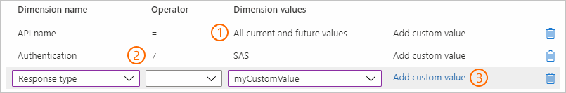

# Monitor multiple time series in a single metric alert rule

A single metric alert rule can be used to monitor one or many metric time series. This capability makes it easier to monitor resources at scale.

## Metric time series

A metric time series is a series of measurements, or "metric values," captured over a period of time.

For example:

- The CPU utilization of a virtual machine
- The incoming bytes (ingress) to a storage account
- The number of failed requests of a web application

## Alert rule on a single time series

An alert rule monitors a single time series when it meets all the following conditions:

-	It monitors a single target resource.
-	It contains a single condition.
-	It evaluates a metric without choosing dimensions (assuming the metric supports dimensions).

An example of such an alert rule, with only the relevant properties shown:

-	**Target resource**: *myVM1*
-	**Metric**: *Percentage CPU*
-	**Operator**: *Greater Than*
-	**Threshold**: *70*

For this alert rule, a single metric time series is monitored:

-	Percentage CPU where *Resource*=’myVM1’ > 70%

## Alert rule on multiple time series

An alert rule monitors multiple time series if it uses at least one of the following features:

-	Multiple resources
-	Multiple conditions
-	Multiple dimensions

## Multiple resources (multi-resource)

A single metric alert rule can monitor multiple resources, provided the resources are of the same type and exist in the same Azure region. Using this type of rule reduces complexity and the total number of alert rules you have to maintain.

An example of such an alert rule:

-	**Target resource**: *myVM1, myVM2*
-	**Metric**: *Percentage CPU*
-	**Operator**: *Greater Than*
-	**Threshold**: *70*

For this alert rule, two metric time series are monitored separately:

-	Percentage CPU where *Resource*=’myVM1’ > 70%
-	Percentage CPU where *Resource*=’myVM2’ > 70%

In a multi-resource alert rule, the condition is evaluated separately for each of the resources (or more accurately, for each of the metric time series corresponded to each resource). As a result, alerts are also fired for each resource separately.

For example, assume we've set the preceding alert rule to monitor for CPU above 70%. In the evaluated time period, that is, the last 5 minutes:

-	The *Percentage CPU* of *myVM1* is greater than 70%.
-	The *Percentage CPU* of *myVM2* is at 50%.

The alert rule triggers on *myVM1* but not *myVM2*. These triggered alerts are independent. They can also resolve at different times depending on the individual behavior of each of the virtual machines.

For more information about multi-resource alert rules and the resource types supported for this capability, see [Monitoring at scale using metric alerts in Azure Monitor](alerts-types.md#monitor-multiple-resources).

> [!NOTE]
> In a metric alert rule that monitors multiple resources, only a single condition is allowed.

## Multiple conditions (multi-condition)

A single metric alert rule can also monitor up to five conditions per alert rule.

For example:

- **Target resource**: *myVM1*
- Condition1
  - **Metric**: *Percentage CPU*
  - **Operator**: *Greater Than*
  - **Threshold**: *70*
- Condition2
  -	**Metric**: *Network In Total*
  -	**Operator**: *Greater Than*
  -	**Threshold**: *20 MB*

For this alert rule, two metric time series are being monitored:

- The *Percentage CPU* where *Resource*=’myVM1’ > 70%.
- The *Network In Total* where *Resource*=’myVM1’ > 20 MB.

An AND operator is used between the conditions. The alert rule fires an alert when *all* conditions are met. The fired alert resolves if at least one of the conditions is no longer met.

> [!NOTE]
> There are restrictions when you use dimensions in an alert rule with multiple conditions. For more information, see [Restrictions when using dimensions in a metric alert rule with multiple conditions](alerts-troubleshoot-metric.md#restrictions-when-you-use-dimensions-in-a-metric-alert-rule-with-multiple-conditions).

## Multiple dimensions (multi-dimension)

A single metric alert rule can also monitor multiple dimension values of a metric. The dimensions of a metric are name-value pairs that carry more data to describe the metric value. For example, the **Transactions** metric of a storage account has a dimension called **API name**. This dimension describes the name of the API called by each transaction, for example, GetBlob, DeleteBlob, and PutPage. The use of dimensions is optional, but it allows filtering the metric and only monitoring specific time series, instead of monitoring the metric as an aggregate of all the dimensional values put together.

For example, you can choose to have an alert fired when the number of transactions is high across all API names (which is the aggregated data). Or you can further break it down into only alerting when the number of transactions is high for specific API names.

An example of an alert rule monitoring multiple dimensions is:

- **Target resource**: *myStorage1*
- **Metric**: *Transactions*
- **Dimensions**:
  * API name = *GetBlob, DeleteBlob, PutPage*
- **Operator**: *Greater Than*
- **Threshold**: *70*

For this alert rule, three metric time series are being monitored:

- Transactions where *Resource*=’myStorage1’ and *API Name*=’GetBlob’ > 70
- Transactions where *Resource*=’myStorage1’ and *API Name*=’DeleteBlob’ > 70
- Transactions where *Resource*=’myStorage1’ and *API Name*=’PutPage’ > 70

A multi-dimension metric alert rule can also monitor multiple dimension values from *different* dimensions of a metric. In this case, the alert rule *separately* monitors all the dimension value combinations of the selected dimension values.

An example of this type of alert rule:

- **Target resource**: *myStorage1*
- **Metric**: *Transactions*
- **Dimensions**:
  * API name = *GetBlob, DeleteBlob, PutPage*
  * Authentication = *SAS, AccountKey*
- **Operator**: *Greater Than*
- **Threshold**: *70*

For this alert rule, six metric time series are being monitored separately:

- Transactions where *Resource*=’myStorage1’ and *API Name*=’GetBlob’ and *Authentication*=’SAS’ > 70
- Transactions where *Resource*=’myStorage1’ and *API Name*=’GetBlob’ and *Authentication*=’AccountKey’ > 70
- Transactions where *Resource*=’myStorage1’ and *API Name*=’DeleteBlob’ and *Authentication*=’SAS’ > 70
- Transactions where *Resource*=’myStorage1’ and *API Name*=’DeleteBlob’ and *Authentication*=’AccountKey’ > 70
- Transactions where *Resource*=’myStorage1’ and *API Name*=’PutPage’ and *Authentication*=’SAS’ > 70
- Transactions where *Resource*=’myStorage1’ and *API Name*=’PutPage’ and *Authentication*=’AccountKey’ > 70

### Advanced multi-dimension features

- **Select all current and future dimensions**: You can choose to monitor all possible values of a dimension, including future values. Such an alert rule will scale automatically to monitor all values of the dimension without you needing to modify the alert rule every time a dimension value is added or removed.
- **Exclude dimensions**: Selecting the **≠** (exclude) operator for a dimension value is equivalent to selecting all other values of that dimension, including future values.
- **Add new and custom dimensions**: The dimension values displayed in the Azure portal are based on metric data collected in the last day. If the dimension value you're looking for isn't yet emitted, you can add a custom dimension value.
- **Match dimensions with a prefix**: You can choose to monitor all dimension values that start with a specific pattern by selecting the **Starts with** operator and entering a custom prefix.

## Metric alerts pricing

The pricing of metric alert rules is available on the [Azure Monitor pricing page](https://azure.microsoft.com/pricing/details/monitor/).

When you create a metric alert rule, the provided price estimation is based on the selected features and the number of monitored time series. This number is determined from the rule configuration and current metric values. The monthly charge is based on actual evaluations of the time series, so it can differ from the original estimation if some time series don't have data to evaluate, or if the alert rule uses features that can make it scale dynamically.

For example, an alert rule can show a high price estimation if it uses the multi-dimension feature, and a large number of dimension values combinations are selected, which results in the monitoring of many time series. But the actual charge for that alert rule can be lower if not all the time series resulting from the dimension values combinations actually have data to evaluate.

## Number of time series monitored by a single alert rule

To prevent excess costs, each alert rule can monitor up to 5,000 time series by default. To lift this limit from your subscription, open a support ticket.

## Next steps

Learn more about monitoring at scale by using metric alerts and [dynamic thresholds](../alerts/alerts-dynamic-thresholds.md).
