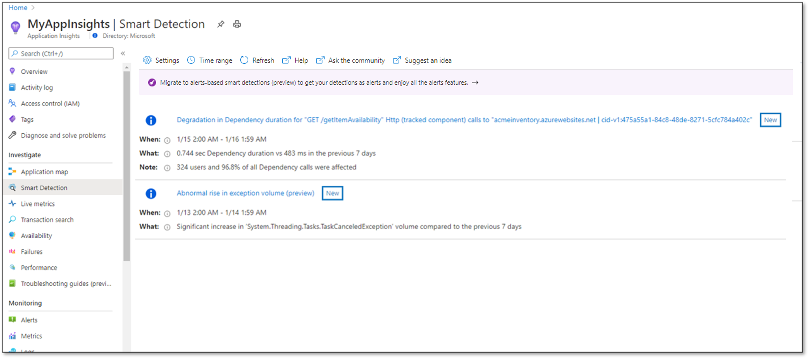
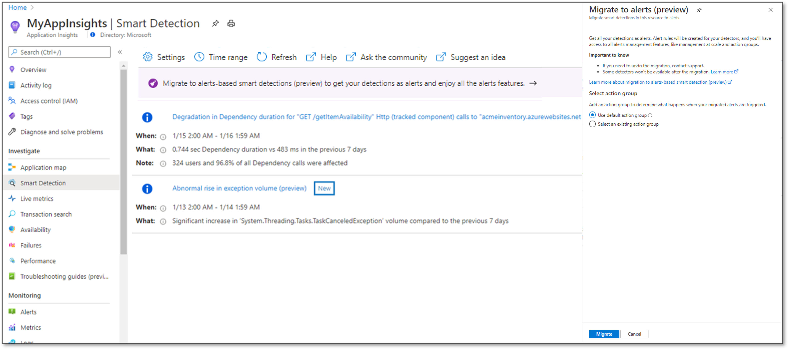
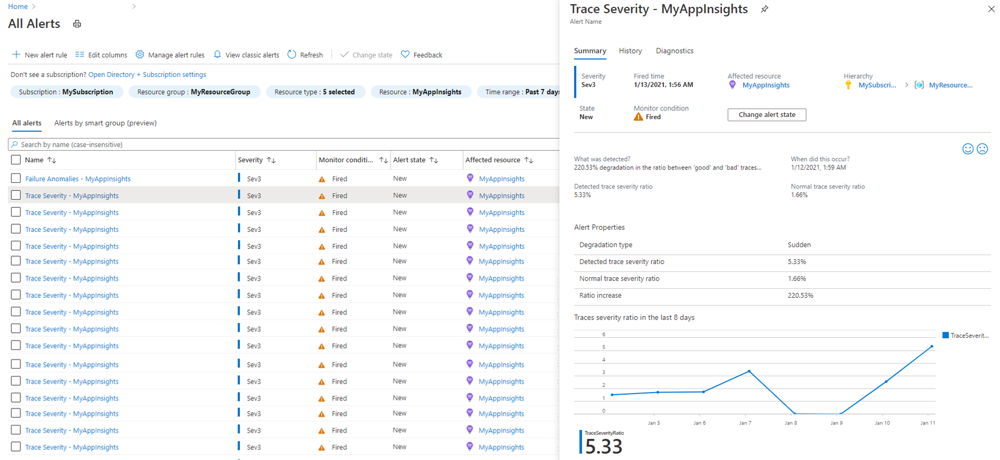
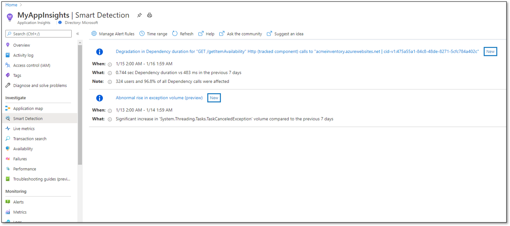
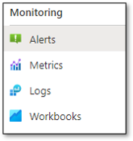
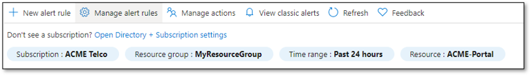
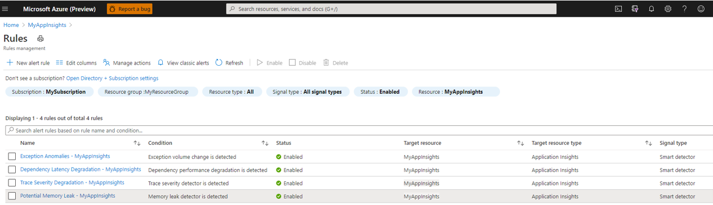

# Migrate Azure Monitor Application Insights smart detection to alerts (Preview)

This article describes the process of migrating Application Insights smart detection to alerts. The migration creates alert rules for the different smart detection modules. You can manage and configure these rules just like any other Azure Monitor alert rules. You can also configure action groups for these rules, providing you with multiple methods of  actions or notifications on new detections.

## Benefits of migration to alerts

With the migration, smart detection now allows you to take advantage of the full capabilities of Azure Monitor alerts, including:

- **Rich Notification options for all detectors** - [Action groups](../alerts/action-groups.md) allow you to configure multiple types of notifications and actions that are triggered when an alert is fired. You can configure notification by email, SMS, voice call or push notifications, and actions such as calling a secure webhook, Logic App, automation runbook, and more. Action groups further management at scale by allowing you to configure actions once and use them across multiple alert rules.
- **At-scale management** of smart detection alerts using the Azure Monitor alerts experience and API.
- **Rule based suppression of notifications** - [Action Rules](../alerts/alerts-action-rules.md) help you define or suppress actions at any Azure Resource Manager scope (Azure subscription, resource group, or target resource). They have various filters that help you narrow down the specific subset of alert instances that you want to act on. 

## Migrated smart detection capabilities

A new set of alert rules is created when migrating an Application Insights resource.  One rule is created for each of the migrated smart detection capabilities. The following table maps the pre-migration smart detection capabilities to post-migration alert rules:

| Smart detection rule name  <sup>(1)</sup>          | Alert rule name <sup>(2)</sup> |
| -------------------------                          | ------------------------------ |
| Degradation in server response time                | Response latency degradation - *\<Application Insights resource name\>*  |
| Degradation in dependency duration                 | Dependency latency degradation - *\<Application Insights resource name\>*|
| Degradation in trace severity ratio (preview)      | Trace severity degradation - *\<Application Insights resource name\>*|
| Abnormal rise in exception volume (preview)        | Exception anomalies - *\<Application Insights resource name\>*|
| Potential memory leak detected (preview)           | Potential memory leak - *\<Application Insights resource name\>*|
| Slow page load time                                | *discontinued* <sup>(3)</sup>  |
| Slow server response time                          | *discontinued* <sup>(3)</sup>  |
| Long dependency duration                           | *discontinued* <sup>(3)</sup>  |
| Potential security issue detected (preview)        | *discontinued* <sup>(3)</sup>  |
| Abnormal rise in daily data volume (preview)       | *discontinued* <sup>(3)</sup>  |

<sup>(1)</sup> Name of rule as appears in smart detection Settings blade  
<sup>(2)</sup> Name of new alert rule after migration  
<sup>(3)</sup> These smart detection capabilities aren't converted to alerts, because of low usage and reassessment of detection effectiveness. These detectors will no longer be supported for this resource once its migration is completed. 

 > [!NOTE]
 > The **Failure Anomalies** smart detector is already created as an alert rule and therefore does not require migration, it is not covered in this document.
 
The migration doesn't change the algorithmic design and behavior of smart detection. The same detection performance is expected before and after the change.

You need to apply the migration to each Application Insights resource separately. For resources that aren't explicitly migrated, smart detection will continue to work as before.

### Action group configuration for the new smart detection alert rules

As part of migration, each new alert rule is automatically configured with an action group. The migration can assign a default action group for each rule. The default action group is configured according to the rule notification before the migration:

- If the **smart detection rule had the default email or no notifications configured**, then the new alert rule is configured with an action group named  “Application Insights Smart Detection".
    - If the migration tool finds an existing action group with that name, it links the new alert rule to that action group.  
    - Otherwise, it creates a new action group with that name. The new group in configured for "Email Azure Resource Manager Role" actions and sends notification to your Azure Resource Manager Monitoring Contributor and Monitoring Reader users.

- If the **default email notification was changed** before migration, then an action group called "Application Insights Smart Detection \<n\>" is created, with an email action sending notifications to the previously configured email addresses.

Instead of using the default action group, you select an existing action group that will be configured for all the new alert rules.

## Executing smart detection migration process

### Migrate your smart detection using the Azure portal

To migrate smart detection in your resource, take the following steps:

1. Select **Smart detection** under the **Investigate** heading in your Application Insights resource left-side menu.

2. Click on the banner reading **"Migrate smart detection to alerts (Preview)**. The migration dialog is opened.

   

3. Check the option "Migrate all Application Insights resources in this subscription", or leave it unchecked if you want to migrate only the current resource you are in. 
   > [!NOTE]
   > Checking this option will impact all **existing** Application Insights resources (that were not migrated yet). As long as the migration to alerts is in preview, new Application Insights resources will still be created with non-alerts smart detection.


4. Select an action group to be configured for the new alert rules. You can choose between using the default action group (as explained above) or using one of your existing action groups.

5. Select **Migrate** to start the migration process.

   

After the migration, new alert rules are created for your Application Insight resource, as explained above.

### Migrate your smart detection using Azure CLI

You can start the smart detection migration using the following Azure CLI command. The command triggers the pre-configured migration process as described previously.

```azurecli
az rest --method POST --uri /subscriptions/{subscriptionId}/providers/Microsoft.AlertsManagement/migrateFromSmartDetection?api-version=2021-01-01-preview --body @body.txt
```

For migrating a single Application Insights resource, body.txt should include:

```json
{
      "scope": [
"/subscriptions/{subscriptionId}/resourceGroups/{resourceGroupName} /providers/microsoft.insights/components/{resourceName} "
      ],
      "actionGroupCreationPolicy" : "{Auto/Custom}",
      "customActionGroupName" : "{actionGroupName}"           
}
```
For migrating all the Application Insights resources in a subscription, body.txt should include:

```json
{
      "scope": [
	"/subscriptions/{subscriptionId} "
      ],
      "actionGroupCreationPolicy" : "{Auto/Custom}",
      "customActionGroupName" : "{actionGroupName}"           
}
```
**ActionGroupCreationPolicy** selects the policy for migrating the email settings in the smart detection rules into action groups. Allowed values are:

- **'Auto'**, which uses the default action groups as described in this document
- **'Custom'**, which creates all alert rules with the action group specified in **'customActionGroupName'**.
- *\<blank\>* - If **ActionGroupCreationPolicy** isn't specified, the 'Auto' policy is used.

### Migrate your smart detection using Azure Resource Manager templates

You can trigger the smart detection migration to alerts for a specific Application Insights resource, using Azure Resource Manager templates. Using this method you would need to:

- Create a smart detection alert rule for each for the supported detectors
- Modify the Application Insight properties to indicate that the migration was completed

This method allows you to control which alert rules to create, define your own alert rule name and description, and select any action group you desire for each rule.

The following templates should be used for this purpose (edit as needed to provide your Subscription ID, and Application Insights Resource Name)

```json
{
    "$schema": "https://schema.management.azure.com/schemas/2015-01-01/deploymentTemplate.json#",
    "contentVersion": "1.0.0.0",
	"parameters": {
		"applicationInsightsResourceName": {
			"type": "string"
		},
		"actionGroupName": {
			"type": "string",
			"defaultValue": "Application Insights Smart Detection"
		},
		"actionGroupResourceGroup": {
			"type": "string",
			"defaultValue": "[resourceGroup().Name]"
		}
	},
	"variables": {
		"applicationInsightsResourceId": "[concat('/subscriptions/',subscription().subscriptionId,'/resourceGroups/',resourceGroup().Name,'/providers/microsoft.insights/components/',parameters('applicationInsightsResourceName'))]",
		"actionGroupId": "[concat('/subscriptions/',subscription().subscriptionId,'/resourceGroups/',parameters('actionGroupResourceGroup'),'/providers/microsoft.insights/ActionGroups/',parameters('actionGroupName'))]",
		"requestPerformanceDegradationDetectorRuleName": "[concat('Response Latency Degradation - ', parameters('applicationInsightsResourceName'))]",
		"dependencyPerformanceDegradationDetectorRuleName": "[concat('Dependency Latency Degradation - ', parameters('applicationInsightsResourceName'))]",
		"traceSeverityDetectorRuleName": "[concat('Trace Severity Degradation - ', parameters('applicationInsightsResourceName'))]",
		"exceptionVolumeChangedDetectorRuleName": "[concat('Exception Anomalies - ', parameters('applicationInsightsResourceName'))]",
		"memoryLeakRuleName": "[concat('Potential Memory Leak - ', parameters('applicationInsightsResourceName'))]"
	},
	"resources": [
		{
			"name": "[variables('requestPerformanceDegradationDetectorRuleName')]",
			"type": "Microsoft.AlertsManagement/smartdetectoralertrules",
			"location": "global",
			"apiVersion": "2019-03-01",
			"properties": {
				"description": "Response Latency Degradation notifies you of an unusual increase in latency in your app response to requests.",
				"state": "Enabled",
				"severity": "Sev3",
				"frequency": "PT24H",
				"detector": {
					"id": "RequestPerformanceDegradationDetector"
				},
				"scope": [
					"[variables('applicationInsightsResourceId')]"
				],
				"actionGroups": {	
					"groupIds": [
						"[variables('actionGroupId')]"
					]
				}
			}
		},
		{
			"name": "[variables('dependencyPerformanceDegradationDetectorRuleName')]",
			"type": "Microsoft.AlertsManagement/smartdetectoralertrules",
			"location": "global",
			"apiVersion": "2019-03-01",
			"properties": {
				"description": "Dependency Latency Degradation notifies you of an unusual increase in response by a dependency your app is calling (e.g. REST API or database)",
				"state": "Enabled",
				"severity": "Sev3",
				"frequency": "PT24H",
				"detector": {
					"id": "DependencyPerformanceDegradationDetector"
				},
				"scope": [
					"[variables('applicationInsightsResourceId')]"
				],
				"actionGroups": {
					"groupIds": [
						"[variables('actionGroupId')]"
					]
				}
			}
		},
		{
			"name": "[variables('traceSeverityDetectorRuleName')]",
			"type": "Microsoft.AlertsManagement/smartdetectoralertrules",
			"location": "global",
			"apiVersion": "2019-03-01",
			"properties": {
				"description": "Trace Severity Degradation notifies you of an unusual increase in the severity of the traces generated by your app.",
				"state": "Enabled",
				"severity": "Sev3",
				"frequency": "PT24H",
				"detector": {
					"id": "TraceSeverityDetector"
				},
				"scope": [
					"[variables('applicationInsightsResourceId')]"
				],
				"actionGroups": {
					"groupIds": [
						"[variables('actionGroupId')]"
					]
				}
			}
		},
		{
			"name": "[variables('exceptionVolumeChangedDetectorRuleName')]",
			"type": "Microsoft.AlertsManagement/smartdetectoralertrules",
			"location": "global",
			"apiVersion": "2019-03-01",
			"properties": {
				"description": "Exception Anomalies notifies you of an unusual rise in the rate of exceptions thrown by your app.",
				"state": "Enabled",
				"severity": "Sev3",
				"frequency": "PT24H",
				"detector": {
					"id": "ExceptionVolumeChangedDetector"
				},
				"scope": [
					"[variables('applicationInsightsResourceId')]"
				],
				"actionGroups": {
					"groupIds": [
						"[variables('actionGroupId')]"
					]
				}
			}
		},
		{
			"name": "[variables('memoryLeakRuleName')]",
			"type": "Microsoft.AlertsManagement/smartdetectoralertrules",
			"location": "global",
			"apiVersion": "2019-03-01",
			"properties": {
				"description": "Potential Memory Leak notifies you of increased memory consumption pattern by your app which may indicate a potential memory leak.",
				"state": "Enabled",
				"severity": "Sev3",
				"frequency": "PT24H",
				"detector": {
					"id": "MemoryLeakDetector"
				},
				"scope": [
					"[variables('applicationInsightsResourceId')]"
				],
				"actionGroups": {
					"groupIds": [
						"[variables('actionGroupId')]"
					]
				}
			}
		},
		{
			"name": "[concat(parameters('applicationInsightsResourceName'),'/migrationToAlertRulesCompleted')]",
			"type": "Microsoft.Insights/components/ProactiveDetectionConfigs",
			"location": "[resourceGroup().location]",
			"apiVersion": "2018-05-01-preview",
			"properties": {
				"name": "migrationToAlertRulesCompleted",
				"sendEmailsToSubscriptionOwners": false,
				"customEmails": [],
				"enabled": true
			},
			"dependsOn": [
				"[resourceId('Microsoft.AlertsManagement/smartdetectoralertrules', variables('requestPerformanceDegradationDetectorRuleName'))]",
				"[resourceId('Microsoft.AlertsManagement/smartdetectoralertrules', variables('dependencyPerformanceDegradationDetectorRuleName'))]",
				"[resourceId('Microsoft.AlertsManagement/smartdetectoralertrules', variables('traceSeverityDetectorRuleName'))]",
				"[resourceId('Microsoft.AlertsManagement/smartdetectoralertrules', variables('exceptionVolumeChangedDetectorRuleName'))]",
				"[resourceId('Microsoft.AlertsManagement/smartdetectoralertrules', variables('memoryLeakRuleName'))]"
			]
		}
	]
}
```

## Viewing your alerts after the migration

Following the migration process, you can view your smart detection alerts by selecting the Alerts entry in your Application Insights resource left-side menu. Select **Signal Type** to be **Smart Detector** to filter and present only the smart detection alerts. You can select an alert to see its detection details.



You can also still see the available detections in the smart detection feed of your Application Insights resource.



## Managing smart detection alert rules settings after the migration

### Managing alert rules settings using the Azure portal

After the migration is complete, you access the new smart detection alert rules in a similar way to other alert rules defined for the resource:

1. Select **Alerts** under the **Monitoring** heading in your Application Insights resource left-side menu.

   

2. Select **Manage Alert Rules**

   

3. Select **Signal Type** to be **Smart Detector** to filter and present the smart detection alert rules.

   

### Enabling / disabling smart detection alert rules 

Smart detection alert rules can be enabled or disabled through the portal UI or programmatically, just like any other alert rule.

If a specific smart detection rule was disabled before the migration, the new alert rule will be disabled as well.

### Configuring action group for your alert rules

You can create and manage action groups for the new smart detection alert rules just like for any other Azure Monitor alert rule. 

### Managing alert rule settings using Azure Resource Manager templates

After completing the migration, you can use Azure Resource Manager templates to configure settings for smart detection alert rule settings.

> [!NOTE]
> After completion of migration, smart detection settings must be configured using smart detection alert rule templates, and can no longer be configured using the [Application Insights Resource Manager template](./proactive-arm-config.md#smart-detection-rule-configuration).

This Azure Resource Manager template example demonstrates configuring an **Response Latency Degradation** alert rule in an **Enabled** state with a severity of 2.
* Smart detection is a global service, therefore rule location is created in the **global** location.
* "id" property should change according to the specific detector configured. The value must be one of:

  - **FailureAnomaliesDetector**
  - **RequestPerformanceDegradationDetector**
  - **DependencyPerformanceDegradationDetector**
  - **ExceptionVolumeChangedDetector**
  - **TraceSeverityDetector**  
  - **MemoryLeakDetector**
 
```json
{
    "$schema": "https://schema.management.azure.com/schemas/2015-01-01/deploymentTemplate.json#",
    "contentVersion": "1.0.0.0",
    "resources": [
        {
            "type": "microsoft.alertsmanagement/smartdetectoralertrules",
            "apiVersion": "2019-03-01",
            "name": "Response Latency Degradation - my-app",
            "location": "global", 
            "properties": {
                  "description": "Response Latency Degradation notifies you of an unusual increase in latency in your app response to requests.",
                  "state": "Enabled",
                  "severity": "2",
                  "frequency": "PT24H",
                  "detector": {
                  "id": "RequestPerformanceDegradationDetector"
                  },
                  "scope": ["/subscriptions/00000000-1111-2222-3333-444444444444/resourceGroups/MyResourceGroup/providers/microsoft.insights/components/my-app"],
                  "actionGroups": {
                        "groupIds": ["/subscriptions/00000000-1111-2222-3333-444444444444/resourcegroups/MyResourceGroup/providers/microsoft.insights/actiongroups/MyActionGroup"]
                  }
            }
        }
    ]
}
```


## Next Steps

- [Learn more about alerts in Azure](./alerts-overview.md)
- [Learn more about smart detection in Application Insights](./proactive-diagnostics.md)
