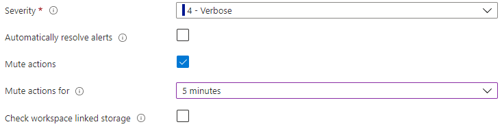

# Troubleshoot log alerts in Azure Monitor  

This article describes how to resolve common issues with log alerts in Azure Monitor. It also provides solutions to common problems with the functionality and configuration of log alerts.

You can use log alerts to evaluate resources logs every set frequency by using a [Log Analytics](../logs/log-analytics-tutorial.md) query, and fire an alert that's based on the results. Rules can trigger one or more actions using [Action Groups](./action-groups.md). To learn more about functionality and terminology of log alerts, see [Log alerts in Azure Monitor](alerts-unified-log.md).

> [!NOTE]
> This article doesn't consider cases where the Azure portal shows that an alert rule was triggered but a notification isn't received. For such cases, see [Action or notification on my alert did not work as expected](./alerts-troubleshoot.md#action-or-notification-on-my-alert-did-not-work-as-expected).

## Log alert didn't fire

### Data ingestion time for logs

Azure Monitor processes terabytes of customers' logs from across the world, which can cause [logs ingestion latency](../logs/data-ingestion-time.md).

Logs are semi-structured data and are inherently more latent than metrics. If you're experiencing more than a 4-minute delay in fired alerts, you should consider using [metric alerts](alerts-metric-overview.md). You can send data to the metric store from logs using [metric alerts for logs](alerts-metric-logs.md).

To mitigate latency, the system retries the alert evaluation multiple times. After the data arrives, the alert fires, which in most cases don't equal the log record time.

### Actions are muted or alert rule is defined to resolve automatically

Log alerts provide an option to mute fired alert actions for a set amount of time using **Mute actions** and to only fire once per condition being met using **Automatically resolve alerts**. 

A common issue is that you think that the alert didn't fire, but it was actually the rule configuration.



### Alert scope resource has been moved, renamed, or deleted

When you author an alert rule, Log Analytics creates a permission snapshot for your user ID. This snapshot is saved in the rule and contains the rule scope resource, Azure Resource Manager ID. If the rule scope resource moves, gets renamed, or is deleted, all log alert rules that refer to that resource will break. To work correctly, alert rules need to be recreated using the new Azure Resource Manager ID.

### Metric measurement alert rule with splitting using the legacy Log Analytics API

[Metric measurement](alerts-unified-log.md#calculation-of-a-value) is a type of log alert that's based on summarized time series results. You can use these rules to group by columns to [split alerts](alerts-unified-log.md#split-by-alert-dimensions). If you're using the legacy Log Analytics API, splitting doesn't work as expected because it doesn't support grouping.

You can use the current ScheduledQueryRules API to set **Aggregate On** in [Metric measurement](alerts-unified-log.md#calculation-of-a-value) rules, which work as expected. To learn more about switching to the current ScheduledQueryRules API, see [Upgrade to the current Log Alerts API from legacy Log Analytics Alert API]](/previous-versions/azure/azure-monitor/alerts/alerts-log-api-switch).

## Log alert fired unnecessarily

A configured [log alert rule in Azure Monitor](./alerts-log.md) might be triggered unexpectedly. The following sections describe some common reasons.

### Alert triggered by partial data

Azure Monitor processes terabytes of customers' logs from across the world, which can cause [logs ingestion latency](../logs/data-ingestion-time.md).

Logs are semi-structured data and are inherently more latent than metrics. If you're experiencing many misfires in fired alerts, you should consider using [metric alerts](alerts-metric-overview.md). You can send data to the metric store from logs using [metric alerts for logs](alerts-metric-logs.md).

Log alerts work best when you try to detect data in the logs. It works less well when you try to detect lack of data in the logs, like alerting on virtual machine heartbeat. 

There are built-in capabilities to prevent false alerts, but they can still occur on very latent data (over ~30 minutes) and data with latency spikes.

## Log alert was disabled

The following sections list some reasons why Azure Monitor might disable a log alert rule. After those section, there's an [example of the activity log that is sent when a rule is disabled](#activity-log-example-when-rule-is-disabled).

### Alert scope no longer exists or was moved

When the scope resources of an alert rule are no longer valid, rule execution fails, and billing stops.

If a log alert fails continuously for a week, Azure Monitor disables it.

### Query used in a log alert isn't valid

When a log alert rule is created, the query is validated for correct syntax. But sometimes, the query provided in the log alert rule can start to fail. Some common reasons are:

- Rules were created via the API, and validation was skipped by the user.
- The query [runs on multiple resources](../logs/cross-workspace-query.md), and one or more of the resources was deleted or moved.
- The [query fails](../logs/api/errors.md) because:
    - The logging solution wasn't [deployed to the workspace](../insights/solutions.md#install-a-monitoring-solution), so tables aren't created.
    - Data stopped flowing to a table in the query for more than 30 days.
    - [Custom logs tables](../agents/data-sources-custom-logs.md) aren't yet created, because the data flow hasn't started.
- Changes in [query language](/azure/kusto/query/) include a revised format for commands and functions, so the query provided earlier is no longer valid.

[Azure Advisor](../../advisor/advisor-overview.md) warns you about this behavior. It adds a recommendation about the affected log alert rule. The category used is 'High Availability' with medium impact and a description of 'Repair your log alert rule to ensure monitoring'.

## Alert rule quota was reached

For details about the number of log search alert rules per subscription and maximum limits of resources, see [Azure Monitor service limits](../service-limits.md).

### Recommended Steps
    
If you've reached the quota limit, the following steps might help resolve the issue.

1. Delete or disable log search alert rules that aren’t used anymore.
1. Use [splitting of alerts by dimensions](alerts-unified-log.md#split-by-alert-dimensions) to reduce rules count. These rules can monitor many resources and detection cases.
1. If you need the quota limit to be increased, continue to open a support request, and provide the following information:

    - The Subscription IDs and Resource IDs for which the quota limit needs to be increased
    - The reason for quota increase
    - The resource type for the quota increase, such as **Log Analytics** or **Application Insights**
    - The requested quota limit

### To check the current usage of new log alert rules
	
#### From the Azure portal

1. On the Alerts screen in Azure Monitor, select **Alert rules**.
1. In the **Subscription** dropdown control, filter to the subscription you want. (Make sure you don't filter to a specific resource group, resource type, or resource.)
1. In the **Signal type** dropdown control, select **Log Search**.
1. Verify that the **Status** dropdown control is set to **Enabled**.

The total number of log search alert rules is displayed above the rules list.

#### From API

- PowerShell - [Get-AzScheduledQueryRule](/powershell/module/az.monitor/get-azscheduledqueryrule)
- CLI: [az monitor scheduled-query list](/cli/azure/monitor/scheduled-query#az-monitor-scheduled-query-list)
- REST API - [List by subscription](/rest/api/monitor/scheduledqueryrule-2021-08-01/scheduled-query-rules/list-by-subscription)

## Activity log example when rule is disabled

If query fails for seven days continuously, Azure Monitor disables the log alert and stops the billing of the rule. You can see the exact time when Azure Monitor disabled the log alert in the [Azure activity log](../../azure-monitor/essentials/activity-log.md). 

See this example:

```json
{
    "caller": "Microsoft.Insights/ScheduledQueryRules",
    "channels": "Operation",
    "claims": {
        "http://schemas.xmlsoap.org/ws/2005/05/identity/claims/spn": "Microsoft.Insights/ScheduledQueryRules"
    },
    "correlationId": "abcdefg-4d12-1234-4256-21233554aff",
    "description": "Alert: test-bad-alerts is disabled by the System due to : Alert has been failing consistently with the same exception for the past week",
    "eventDataId": "f123e07-bf45-1234-4565-123a123455b",
    "eventName": {
        "value": "",
        "localizedValue": ""
    },
    "category": {
        "value": "Administrative",
        "localizedValue": "Administrative"
    },
    "eventTimestamp": "2019-03-22T04:18:22.8569543Z",
    "id": "/SUBSCRIPTIONS/<subscriptionId>/RESOURCEGROUPS/<ResourceGroup>/PROVIDERS/MICROSOFT.INSIGHTS/SCHEDULEDQUERYRULES/TEST-BAD-ALERTS",
    "level": "Informational",
    "operationId": "",
    "operationName": {
        "value": "Microsoft.Insights/ScheduledQueryRules/disable/action",
        "localizedValue": "Microsoft.Insights/ScheduledQueryRules/disable/action"
    },
    "resourceGroupName": "<Resource Group>",
    "resourceProviderName": {
        "value": "MICROSOFT.INSIGHTS",
        "localizedValue": "Microsoft Insights"
    },
    "resourceType": {
        "value": "MICROSOFT.INSIGHTS/scheduledqueryrules",
        "localizedValue": "MICROSOFT.INSIGHTS/scheduledqueryrules"
    },
    "resourceId": "/SUBSCRIPTIONS/<subscriptionId>/RESOURCEGROUPS/<ResourceGroup>/PROVIDERS/MICROSOFT.INSIGHTS/SCHEDULEDQUERYRULES/TEST-BAD-ALERTS",
    "status": {
        "value": "Succeeded",
        "localizedValue": "Succeeded"
    },
    "subStatus": {
        "value": "",
        "localizedValue": ""
    },
    "submissionTimestamp": "2019-03-22T04:18:22.8569543Z",
    "subscriptionId": "<SubscriptionId>",
    "properties": {
        "resourceId": "/SUBSCRIPTIONS/<subscriptionId>/RESOURCEGROUPS/<ResourceGroup>/PROVIDERS/MICROSOFT.INSIGHTS/SCHEDULEDQUERYRULES/TEST-BAD-ALERTS",
        "subscriptionId": "<SubscriptionId>",
        "resourceGroup": "<ResourceGroup>",
        "eventDataId": "12e12345-12dd-1234-8e3e-12345b7a1234",
        "eventTimeStamp": "03/22/2019 04:18:22",
        "issueStartTime": "03/22/2019 04:18:22",
        "operationName": "Microsoft.Insights/ScheduledQueryRules/disable/action",
        "status": "Succeeded",
        "reason": "Alert has been failing consistently with the same exception for the past week"
    },
    "relatedEvents": []
}
```

## Query syntax validation error
If you get an error message that says "Couldn't validate the query syntax because the service can't be reached", it could be either:
- A query syntax error.
- A problem connecting to the service that validates the query.

Try the following steps to resolve the problem:
1. Try running the query in Azure Monitor Logs, and fix any syntax issues.
2. If your query syntax is valid, check the connection to the service.
  - Flush the DNS cache on your local machine, by opening a command prompt and running the following command: `ipconfig /flushdns`, and then check again. If you still get the same error message, try the next step.
  - Copy and paste this URL into the browser: [https://api.loganalytics.io/v1/version](https://api.loganalytics.io/v1/version). If you get an error, contact your IT administrator to allow  the IP addresses associated with **api.loganalytics.io** listed [here](../app/ip-addresses.md#application-insights-and-log-analytics-apis).


## Next steps

- Learn about [log alerts in Azure](./alerts-unified-log.md).
- Learn more about [configuring log alerts](../logs/log-query-overview.md).
- Learn more about [log queries](../logs/log-query-overview.md).
