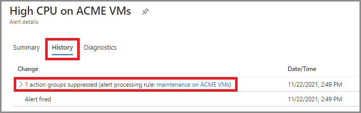
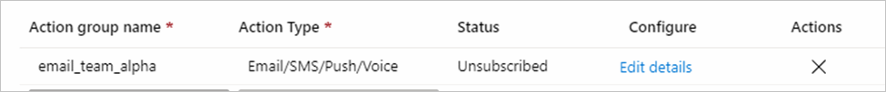
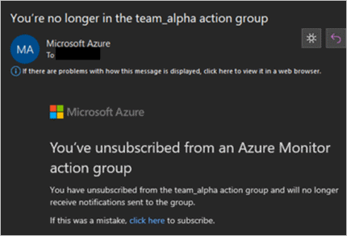
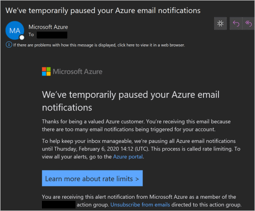
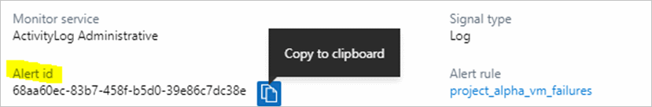

# Troubleshooting problems in Azure Monitor alerts

This article discusses common problems in Azure Monitor alerting and notifications. Azure Monitor alerts proactively notify you when important conditions are found in your monitoring data. They allow you to identify and address issues before the users of your system notice them. For more information on alerting, see [Overview of alerts in Microsoft Azure](./alerts-overview.md).

You can see fired alerts in the Azure portal.

Refer to these articles for troubleshooting information about metric or log alerts that are not behaving as expected:

- [Troubleshoot Azure Monitor metric alerts](alerts-troubleshoot-metric.md)
- [Troubleshoot Azure Monitor log alerts](alerts-troubleshoot-log.md)

If the alert fires as intended according to the Azure portal but the proper notifications do not occur, use the information in the rest of this article to troubleshoot that problem.

## Action or notification on my alert did not work as expected

If you can see a fired alert in the Azure portal, but have an issue with some of its actions or notifications, see the following sections.

## Did not receive expected email

If you can see a fired alert in the Azure portal, but did not receive the email that you have configured about it, follow these steps:

1. **Was the email suppressed by an [alert processing rule](../alerts/alerts-action-rules.md)**?

    Check by clicking on the fired alert in the portal, and look at the history tab for suppressed [action groups](./action-groups.md):

    

1. **Is the type of action "Email Azure Resource Manager Role"?**

    This action only looks at Azure Resource Manager role assignments that are at the subscription scope, and of type *User*.  Make sure that you have assigned the role at the subscription level, and not at the resource level or resource group level.

1. **Are your email server and mailbox accepting external emails?**

    Verify that emails from these three addresses are not blocked:
      - azure-noreply@microsoft.com  
      - azureemail-noreply@microsoft.com
      - alerts-noreply@mail.windowsazure.com

    It is common that internal mailing lists or distribution lists block emails from external email addresses. You must allow mail from the above email addresses.  
    To test, add a regular work email address (not a mailing list) to the action group and see if alerts arrive to that email.

1. **Was the email processed by inbox rules or a spam filter?**

    Verify that there are no inbox rules that delete those emails or move them to a side folder. For example, inbox rules could catch specific senders or specific words in the subject. Also, check:

   - The spam settings of your email client (like Outlook, Gmail)
   - The sender limits / spam settings / quarantine settings of your email server (like Exchange, Microsoft 365, G-suite)
   - The settings of your email security appliance, if any (like Barracuda, Cisco).

1. **Have you accidentally unsubscribed from the action group?**

    The alert emails provide a link to unsubscribe from the action group. To check if you have accidentally unsubscribed from this action group, either:

    1. Open the action group in the portal and check the Status column:

    

    2. Search your email for the unsubscribe confirmation:

    

    To subscribe again – either use the link in the unsubscribe confirmation email you have received, or remove the email address from the action group, and then add it back again. 
 
1. **Have you been rated limited due to many emails going to a single email address?**

    Email is [rate limited](alerts-rate-limiting.md) to no more than 100 emails every hour to each email address. If you pass this threshold, additional email notifications are dropped.  Check if you have received a message indicating that your email address has been temporarily rate limited: 
 
   

   If you would like to receive high-volume of notifications without rate limiting, consider using a different action, such as webhook, logic app, Azure function, or automation runbooks, none of which are rate limited. 

## Did not receive expected SMS, voice call, or push notification

If you can see a fired alert in the portal, but did not receive the SMS, voice call or push notification that you have configured about it, follow these steps: 

1. **Was the action suppressed by an [alert suppression rule](../alerts/alerts-action-rules.md)?**

    Check by clicking on the fired alert in the portal, and look at the history tab for suppressed [action groups](./action-groups.md): 

    

   If that was unintentional, you can modify, disable, or delete the alert processing rule.
 
1. **SMS / voice:  Is your phone number correct?**

   Check the SMS action for typos in the country code or phone number.
 
1. **SMS / voice: have you been rate limited?**

    SMS and voice calls are rate limited to no more than one notification every five minutes per phone number. If you pass this threshold, the notifications will be dropped.

      - Voice call – check your call history and see if you had a different call from Azure in the preceding five minutes.
      - SMS - check your SMS history for a message indicating that your phone number has been rate limited.

    If you would like to receive high-volume of notifications without rate limiting, consider using a different action, such as webhook, logic app, Azure function, or automation runbooks, none of which are rate limited. 
 
1. **SMS: Have you accidentally unsubscribed from the action group?**

    Open your SMS history and check if you have opted out of SMS delivery from this specific action group (using the DISABLE action_group_short_name reply) or from all action groups (using the  STOP reply). To subscribe again, either send the relevant SMS command (ENABLE action_group_short_name or START), or remove the SMS action from the action group, and then add it back again.  For more information, see [SMS alert behavior in action groups](alerts-sms-behavior.md).

1. **Have you accidentally blocked the notifications on your phone?**

   Most mobile phones allow you to block calls or SMS from specific phone numbers or short codes, or to block push notifications from specific apps (such as the Azure mobile app). To check if you accidentally blocked the notifications on your phone, search the documentation specific for your phone operating system and model, or test with a different phone and phone number.

## Expected another type of action to trigger, but it did not 
   
If you can see a fired alert in the portal, but its configured action did not trigger, follow these steps:

1. **Was the action suppressed by an alert processing rule?**

    Check by clicking on the fired alert in the portal, and look at the history tab for suppressed [action groups](./action-groups.md):

    
 
    If that was unintentional, you can modify, disable, or delete the alert processing rule.

1. **Did a webhook not trigger?**

    1. **Have the source IP addresses been blocked?**
    
       Add the [IP addresses](../app/ip-addresses.md) that the webhook is called from to your allowlist.

    1. **Does your webhook endpoint work correctly?**

       Verify the webhook endpoint you have configured is correct and the endpoint is working correctly. Check your webhook logs or instrument its code so you could investigate (for example, log the incoming payload).

    1. **Are you calling Slack or Microsoft Teams?**  
    Each of these endpoints expects a specific JSON format. Follow [these instructions](../alerts/action-groups-logic-app.md) to configure a logic app action instead.

    1. **Did your webhook become unresponsive or return errors?** 

        The webhook response timeout period is 10 seconds. When the HTTP endpoint does not respond or when the following HTTP status codes are returned, the webhook call is retried up to two times:
        
    - `408`
    -  `429`
    - `503`
    - `504`
   
        One retry occurs after 10 seconds and another retry occurs after 100 seconds. If the second retry fails, the endpoint is not called again for 15 minutes for any action group.

## Action or notification happened more than once 

If you have received a notification for an alert (such as an email or an SMS) more than once, or the alert's action (such as webhook or Azure function) was triggered multiple times, follow these steps: 

1. **Is it really the same alert?** 

    In some cases, multiple similar alerts are fired at around the same time. So, it might just seem like the same alert triggered its actions multiple times. For example, an activity log alert rule might be configured to fire both when an event has started, and when it has finished (succeeded or failed), by not filtering on the event status field. 

    To check if these actions or notifications came from different alerts, examine the alert details, such as its timestamp and either the alert ID or its correlation ID. Alternatively, check the list of fired alerts in the portal. If that is the case, you would need to adapt the alert rule logic or otherwise configure the alert source. 

1. **Does the action repeat in multiple action groups?** 

    When an alert is fired, each of its action groups is processed independently. So, if an action (such as an email address) appears in multiple triggered action groups, it would be called once per action group. 

    To check which action groups were triggered, check the alert history tab. You would see there both action groups defined in the alert rule, and action groups added to the alert by alert processing rules: 

    

## Action or notification has an unexpected content
Action Groups uses two different email providers to ensure email notification delivery. The primary email provider is very resilient and quick but occasionally suffers outages. In this case, the secondary email provider handles email requests. The secondary provider is only a fallback solution. Due to provider differences, an email sent from our secondary provider may have a degraded email experience. The degradation results in slightly different email formatting and content. Since email templates differ in the two systems, maintaining parity across the two systems is not feasible. You can know that you are recieving a degraded experience, if there is a note at the top of your email notification that says: 

"This is a degraded email experience. That means the formatting may be off or details could be missing. For more infomration on the degraded email experience, read here."

If your notification does not contain this note and you have received the alert, but believe some of its fields are missing or incorrect, follow these steps: 

1. **Did you pick the correct format for the action?** 

    Each action type (email, webhook, etc.) has two formats – the default, legacy format, and the [newer common schema format](../alerts/alerts-common-schema.md). When you create an action group, you specify the format you want per action – different actions in the action groups may have different formats. 

    For example, for webhook action: 

    

    Check if the format specified at the action level is what you expect. For example, you may have developed code that responds to alerts (webhook, function, logic app, etc.), expecting one format, but later in the action you or another person specified a different format.  

    Also, check the payload format (JSON) for [activity log alerts](../alerts/activity-log-alerts-webhook.md), for [log search alerts](../alerts/alerts-log-webhook.md) (both Application Insights and log analytics), for [metric alerts](alerts-metric-near-real-time.md#payload-schema), for the [common alert schema](../alerts/alerts-common-schema.md), and for the deprecated [classic metric alerts](./alerts-webhooks.md).

 
1. **Activity log alerts: Is the information available in the activity log?** 

    [Activity log alerts](./activity-log-alerts.md) are alerts that are based on events written to the Azure Activity Log, such as events about creating, updating, or deleting Azure resources, service health and resource health events, or findings from Azure Advisor and Azure Policy. If you have received an alert based on the activity log but some fields that you need are missing or incorrect, first check the events in the activity log itself. If the Azure resource did not write the fields you are looking for in its activity log event, those fields will not be included in the corresponding alert. 

## Alert processing rule is not working as expected 

If you can see a fired alert in the portal, but a related alert processing rule did not work as expected, follow these steps: 

1. **Is the alert processing rule enabled?** 

    Check the alert processing rule status field to verify that the related action role is enabled. By default, the portal rule list only shows rules that are enabled, but you can change the filter to show all rules. 

    :::image type="content" source="media/alerts-troubleshoot/alerts-troubleshoot-alert-processing-rules-status.png" alt-text="Screenshot of alert processing rule list highlighting the status field and status filter.":::
   
    If it is not enabled, you can enable the alert processing rule by selecting it and clicking Enable. 

1. **Is it a service health alert?** 

    Service health alerts (monitor service = "Service Health") are not affected by alert processing rules. 

1. **Did the alert processing rule act on your alert?** 

    Check if the alert processing rule has processed your alert by clicking on the fired alert in the portal, and look at the history tab.

    Here is an example of alert processing rule suppressing all action groups: 
 
     

    Here is an example of an alert processing rule adding another action group:

    
 

1. **Does the alert processing rule scope and filter match the fired alert?** 

    If you think the alert processing rule should have fired but didn't, or that it shouldn't have fired but it did, carefully examine the alert processing rule scope and filter conditions versus the properties of the fired alert. 

## How to find the alert ID of a fired alert

When opening a case about a specific fired alert (such as – if you did not receive its email notification), you will need to provide the alert ID. 

To locate it, follow these steps:

1. In the Azure portal, navigate to the list of fired alerts, and find that specific alert. You can use the filters to help you locate it. 

1. Click on the alert to open the alert details. 

1. Scroll down in the alert fields of the first tab (the summary tab) until you locate it, and copy it. That field also includes a "Copy to clipboard" helper button you can use.  

    

## Problem creating, updating, or deleting alert processing rules in the Azure portal

If you received an error while trying to create, update or delete an [alert processing rule](../alerts/alerts-action-rules.md), follow these steps: 

1. **Did you receive a permission error?**  

    You should either have the [Monitoring Contributor built-in role](../../role-based-access-control/built-in-roles.md#monitoring-contributor), or the specific permissions related to alert processing rules and alerts.

1. **Did you verify the alert processing rule parameters?**  

    Check the [alert processing rule documentation](../alerts/alerts-action-rules.md), or the [alert processing rule PowerShell Set-AzActionRule](/powershell/module/az.alertsmanagement/set-azalertprocessingrule) command. 

## Next steps
- If using a log alert, also see [Troubleshooting Log Alerts](./alerts-troubleshoot-log.md).
- Go back to the [Azure portal](https://portal.azure.com) to check if you've solved your issue with guidance above.
