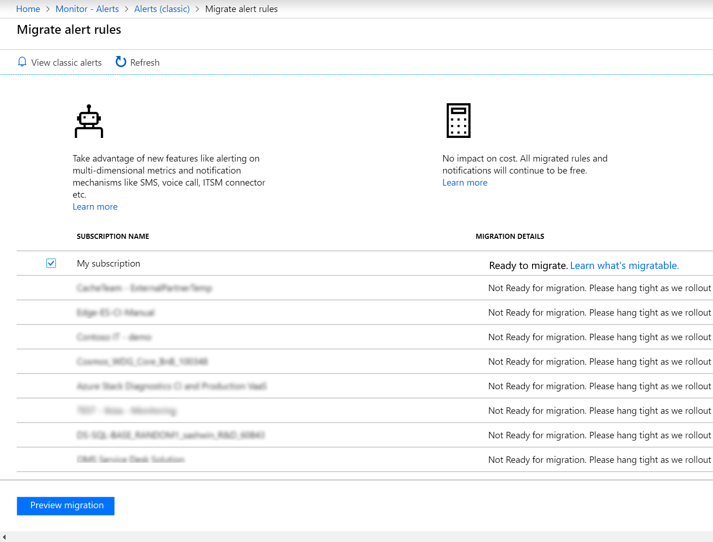
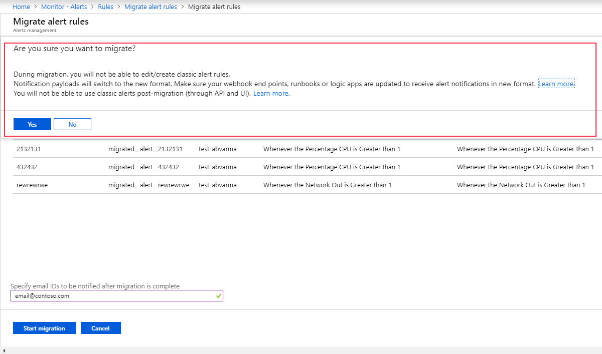

# Use the voluntary migration tool to migrate your classic alert rules

As [previously announced](monitoring-classic-retirement.md), classic alerts in Azure Monitor are retired for public cloud users, though still in limited use until **31 May 2021**. Classic alerts for Azure Government cloud and Azure China 21Vianet will retire on **29 February 2024**.

A migration tool is available in the Azure portal to customers who used classic alert rules and who want to trigger migration themselves. This article explains how to use the migration tool.

## Before you migrate

The migration process converts classic alert rules to new, equivalent alert rules, and creates action groups. In preparation, be aware of the following points:

- Both the notification payload format and the APIs to create and manage new alert rules are different from classic alert rules because they support more features. [Learn how to prepare for the migration](alerts-prepare-migration.md).

- Some classic alert rules cannot be migrated by using the tool. [Learn which rules cannot be migrated and what to do with them](alerts-understand-migration.md#manually-migrating-classic-alerts-to-newer-alerts).

    > [!NOTE]
    > The migration process won't impact the evaluation of your classic alert rules. They'll continue to run and send alerts until they're migrated and the new alert rules take effect.

## How to use the migration tool

To trigger the migration of your classic alert rules in the Azure portal, follow these steps:

1. In [Azure portal](https://portal.azure.com), select **Monitor**.

1. Select **Alerts**, and then select **Manage alert rules** or **View classic alerts**.

1. Select **Migrate to new rules** to go to the migration landing page. This page shows a list of all your subscriptions and their migration status:

    

    All subscriptions that can be migrated by using the tool are marked as **Ready to migrate**.

    > [!NOTE]
    > The migration tool is rolling out in phases to all the subscriptions that use classic alert rules. In the early phases of the rollout, you might see some subscriptions marked as not ready for migration.

1. Select one or more subscriptions, and then select **Preview migration**.

    The resulting page shows the details of classic alert rules that will be migrated for one subscription at a time. You can also select **Download the migration details for this subscription** to get the details in a CSV format.

    

1. Specify one or more email addresses to be notified of migration status. You'll receive email when the migration is complete or if any action is needed from you.

1. Select **Start Migration**. Read the information shown in the confirmation dialog box and confirm that you're ready to start the migration process.

    > [!IMPORTANT]
    > After you initiate migration for a subscription, you won't be able to edit or create classic alert rules for that subscription. This restriction ensures that no changes to your classic alert rules are lost during migration to the new rules. Although you won't be able to change your classic alert rules, they'll still continue to run and to provide alerts until they've been migrated. After the migration is complete for your subscription, you can't use classic alert rules anymore.

    

1. When migration is complete, or if action is required from you, you'll receive an email at the addresses that you provided earlier. You can also periodically check the status at the migration landing page in the portal.

## Frequently asked questions

### Why is my subscription listed as not ready for migration?

The migration tool is rolling out to customers in phases. In the early phases, most or all of your subscriptions might be marked as **Not ready for migration**. 

When a subscription becomes ready for migration, the subscription owner will receive an email message stating that the tool is available. Keep an eye out for this message.

### Who can trigger the migration?

Users who have the Monitoring Contributor role assigned to them at the subscription level can trigger the migration. [Learn more about Azure role-based access control for the migration process](alerts-understand-migration.md#who-can-trigger-the-migration).

### How long will the migration take?

Migration is completed for most subscriptions in under an hour. You can keep track of the migration progress on the migration landing page. During the migration, be assured that your alerts are still running either in the classic alerts system or in the new one.

### What can I do if I run into a problem during migration?

See the [troubleshooting guide](alerts-understand-migration.md#common-problems-and-remedies) for help with problems you might face during migration. If any action is needed from you to complete the migration, you'll be notified at the email addresses you provided when you set up the tool.

## Next steps

- [Prepare for the migration](alerts-prepare-migration.md)
- [Understand how the migration tool works](alerts-understand-migration.md)