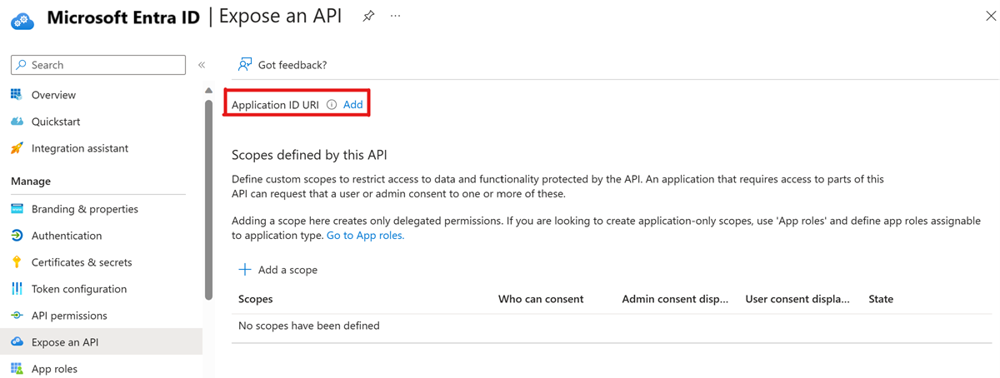
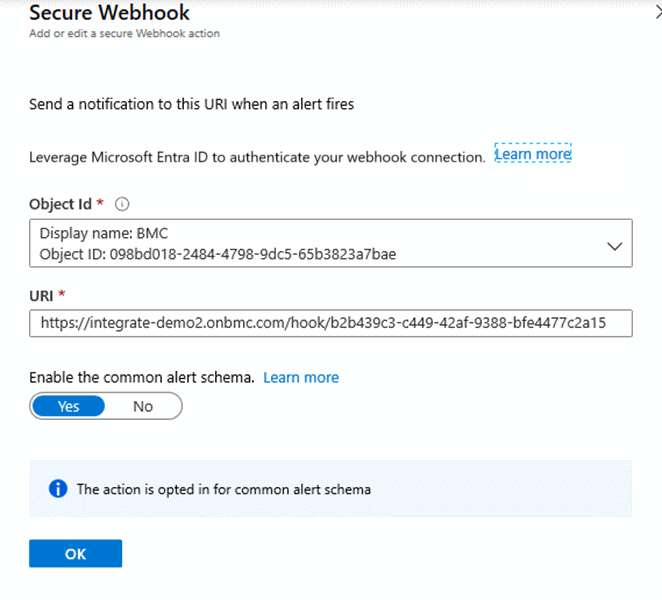

# Configure Azure to connect ITSM tools using Secure Export

This article provides information about how to configure the Azure in order to use "Secure Export".
In order to use "Secure Export", follow these steps:

1. [Register your app with Azure AD.](./itsm-connector-secure-webhook-connections-azure-configuration.md#register-with-azure-active-directory)
1. [Define Service principal.](./itsm-connector-secure-webhook-connections-azure-configuration.md#define-service-principal)
1. [Create a Secure Webhook action group.](./itsm-connector-secure-webhook-connections-azure-configuration.md#create-a-secure-webhook-action-group)
1. Configure your partner environment.
    Secure Export supports connections with the following ITSM tools:
    * [ServiceNow](./itsmc-secure-webhook-connections-servicenow.md)
    * [BMC Helix](./itsmc-secure-webhook-connections-bmc.md)

## Register with Azure Active Directory

Follow these steps to register the application with Azure AD:

1. Follow the steps in [Register an application with the Microsoft identity platform](../../active-directory/develop/quickstart-register-app.md).
2. In Azure AD, select **Expose application**.
3. Select **Set** for **Application ID URI**.

   
4. Select **Save**.

## Define service principal

The Action Group service is a first party application therefore it has permission to acquire authentication tokens from your AAD application in order to authentication with Service now.
As an optional step you can define application role in the created app’s manifest, which can allow you to further restrict, access in a way that only certain applications with that specific role can send messages. This role has to be then assigned to the Action Group service principal (Requires tenant admin privileges).

This step can be done through the same [PowerShell commands](../alerts/action-groups.md#secure-webhook-powershell-script).

## Create a Secure Webhook action group

After your application is registered with Azure AD, you can create work items in your ITSM tool based on Azure alerts, by using the Secure Webhook action in action groups.

Action groups provide a modular and reusable way of triggering actions for Azure alerts. You can use action groups with metric alerts, Activity Log alerts, and Azure Log Analytics alerts in the Azure portal.
To learn more about action groups, see [Create and manage action groups in the Azure portal](../alerts/action-groups.md).

To add a webhook to an action, follow these instructions for Secure Webhook:

1. In the [Azure portal](https://portal.azure.com/), search for and select **Monitor**. The **Monitor** pane consolidates all your monitoring settings and data in one view.
2. Select **Alerts** > **Manage actions**.
3. Select [Add action group](../alerts/action-groups.md#create-an-action-group-by-using-the-azure-portal), and fill in the fields.
4. Enter a name in the **Action group name** box, and enter a name in the **Short name** box. The short name is used in place of a full action group name when notifications are sent using this group.
5. Select **Secure Webhook**.
6. Select these details:
   1. Select the object ID of the Azure Active Directory instance that you registered.
   2. For the URI, paste in the webhook URL that you copied from the [ITSM tool environment](#configure-the-itsm-tool-environment).
   3. Set **Enable the common Alert Schema** to **Yes**. 

   The following image shows the configuration of a sample Secure Webhook action:

   

## Configure the ITSM tool environment

The configuration contains two steps:

1. Get the URI for the secure export definition.
2. Definitions according to the flow of the ITSM tool.

## Next steps

* [ServiceNow Secure Export Configuration](./itsmc-secure-webhook-connections-servicenow.md)
* [BMC Secure Export Configuration](./itsmc-secure-webhook-connections-bmc.md)
