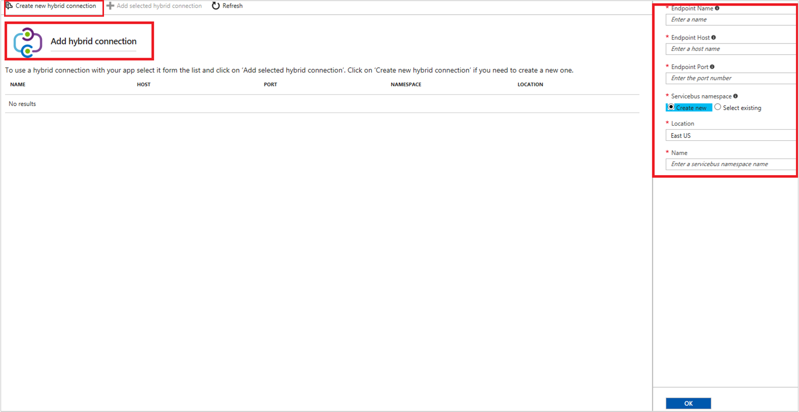

# Connect System Center Service Manager with IT Service Management Connector

This article provides information about how to configure the connection between your System Center Service Manager instance and the IT Service Management Connector (ITSMC) in Log Analytics to centrally manage your work items.

The following sections provide details about how to connect your System Center Service Manager product to ITSMC in Azure.

## Prerequisites

Ensure the following prerequisites are met:

- ITSMC installed. More information: [Adding the IT Service Management Connector Solution](./itsmc-definition.md).
- The Service Manager Web application (Web app) is deployed and configured. Information on Web app is [here](#create-and-deploy-service-manager-web-app-service).
- Hybrid connection created and configured. More information: [Configure the hybrid Connection](#configure-the-hybrid-connection).
- Supported versions of Service Manager:  2012 R2 or 2016.
- User role:  [Advanced operator](/previous-versions/system-center/service-manager-2010-sp1/ff461054(v=technet.10)).
- Today the alerts that are sent from Azure Monitor can create in System Center Service Manager Incidents.

> [!NOTE]
> - ITSM Connector can only connect to cloud-based ServiceNow instances. On-premises ServiceNow instances are currently not supported.
> - In order to use custom [templates](./itsmc-definition.md#define-a-template) as a part of the actions the parameter "ProjectionType" in the SCSM template should be mapped to "IncidentManagement!System.WorkItem.Incident.ProjectionType"

## Connection procedure

Use the following procedure to connect your System Center Service Manager instance to ITSMC:

1. In Azure portal, go to **All Resources** and look for **ServiceDesk(YourWorkspaceName)**

2. Under **WORKSPACE DATA SOURCES** click **ITSM Connections**.

	

3. At the top of the right pane, click **Add**.

4. Provide the information as described in the following table, and click **OK** to create the connection.

> [!NOTE]
> All these parameters are mandatory.

| **Field** | **Description** |
| --- | --- |
| **Connection Name**   | Type a name for the System Center Service Manager instance that you want to connect with ITSMC.  You use this name later when you configure work items in this instance/ view detailed log analytics. |
| **Partner type**   | Select **System Center Service Manager**. |
| **Server URL**   | Type the URL of the Service Manager Web app. More information about Service Manager Web app is [here](#create-and-deploy-service-manager-web-app-service).
| **Client ID**   | Type the client ID that you generated (using the automatic script) for authenticating the Web app. More information about the automated script is [here.](./itsmc-service-manager-script.md)|
| **Client Secret**   | Type the client secret, generated for this ID.   |
| **Sync Data**   | Select the Service Manager work items that you want to sync through ITSMC.  These work items are imported into Log Analytics. **Options:**  Incidents, Change Requests.|
| **Data Sync Scope** | Type the number of past days that you want the data from. **Maximum limit**: 120 days. |
| **Create new configuration item in ITSM solution** | Select this option if you want to create the configuration items in the ITSM product. When selected, Log Analytics creates the affected CIs as configuration items (in case of non-existing CIs) in the supported ITSM system. **Default**: disabled. |

**When successfully connected, and synced**:

- Selected work items from Service Manager are imported into Azure **Log Analytics.** You can view the summary of these work items on the IT Service Management Connector tile.

- You can create incidents from Log Analytics alerts or from log records, or from Azure alerts in this Service Manager instance.

Learn more: [Create ITSM work items from Azure alerts](./itsmc-definition.md#create-itsm-work-items-from-azure-alerts).

## Create and deploy Service Manager web app service

To connect the on-premises Service Manager with ITSMC in Azure, Microsoft has created a Service Manager Web app on the GitHub.

To set up the ITSM Web app for your Service Manager, do the following:

- **Deploy the Web app** – Deploy the Web app, set the properties, and authenticate with Azure AD. You can deploy the web app by using the [automated script](./itsmc-service-manager-script.md) that Microsoft has provided you.
- **Configure the hybrid connection** - [Configure this connection](#configure-the-hybrid-connection), manually.

### Deploy the web app
Use the automated [script](./itsmc-service-manager-script.md) to deploy the Web app, set the properties, and authenticate with Azure AD.

Run the script by providing the following required details:

- Azure subscription details
- Resource group name
- Location
- Service Manager server details (server name, domain, user name, and password)
- Site name prefix for your Web app
- ServiceBus Namespace.

The script creates the Web app using the name that you specified (along with few additional strings to make it unique). It generates the **Web app URL**, **client ID** and **client secret**.

Save the values, you use them when you create a connection with ITSMC.

**Check the Web app installation**

1. Go to **Azure portal** > **Resources**.
2. Select the Web app, click **Settings** > **Application Settings**.
3. Confirm the information about the Service Manager instance that you provided at the time of deploying the app through the script.

## Configure the hybrid connection

Use the following procedure to configure the hybrid connection that connects the Service Manager instance with ITSMC in Azure.

1. Find the Service Manager Web app, under **Azure Resources**.
2. Click **Settings** > **Networking**.
3. Under **Hybrid Connections**, click **Configure your hybrid connection endpoints**.

    
4. In the **Hybrid Connections** blade, click **Add hybrid connection**.

    

5. In the **Add Hybrid Connections** blade, click **Create new hybrid Connection**.

    

6. Type the following values:

   - **EndPoint Name**: Specify a name for the new Hybrid connection.
   - **EndPoint Host**: FQDN of the Service Manager management server.
   - **EndPoint Port**: Type 5724
   - **Servicebus namespace**: Use an existing servicebus namespace or create a new one.
   - **Location**: select the location.
   - **Name**: Specify a name to the servicebus if you are creating it.

     
6. Click **OK** to close the **Create hybrid connection** blade and start creating the hybrid connection.

    Once the Hybrid connection is created, it is displayed under the blade.

7. After the hybrid connection is created, select the connection and click **Add selected hybrid connection**.

    

### Configure the listener setup

Use the following procedure to configure the listener setup for the hybrid connection.

1. In the **Hybrid Connections** blade, click **Download the Connection Manager** and install it on the machine where System Center Service Manager instance is running.

    Once the installation is complete, **Hybrid Connection Manager UI** option is available under **Start** menu.

2. Click **Hybrid Connection Manager UI** , you will be prompted for your Azure credentials.

3. Login with your Azure credentials and select your subscription where the Hybrid connection was created.

4. Click **Save**.

Your hybrid connection is successfully connected.

> [!NOTE]
> 
> After the hybrid connection is created, verify and test the connection by visiting the deployed Service Manager Web app. Ensure the connection is successful before you try to connect to ITSMC in Azure.

The following sample image shows the details of a successful connection:

## Next steps

* [ITSM Connector Overview](itsmc-overview.md)
* [Create ITSM work items from Azure alerts](./itsmc-definition.md#create-itsm-work-items-from-azure-alerts)
* [Troubleshooting problems in ITSM Connector](./itsmc-resync-servicenow.md)