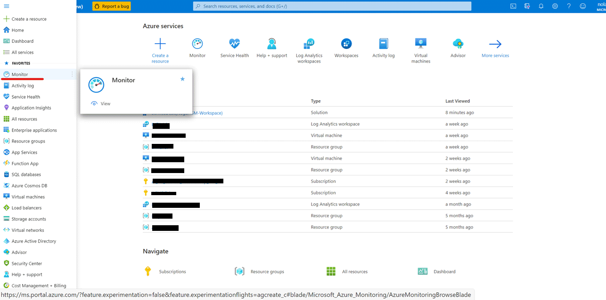
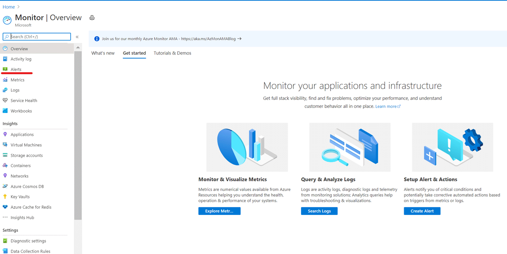
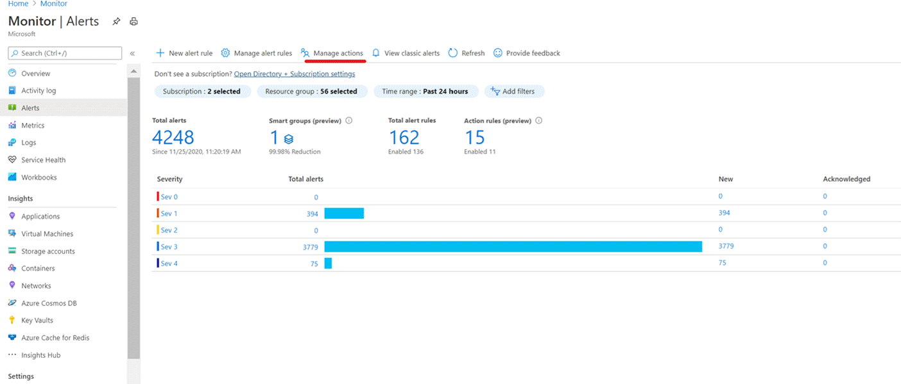
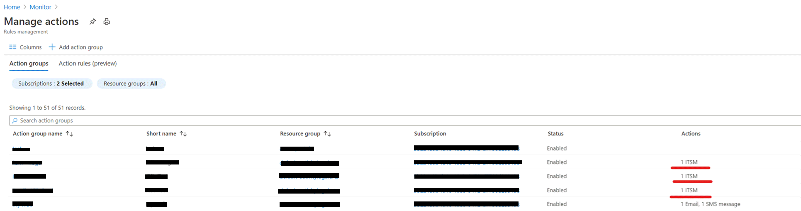
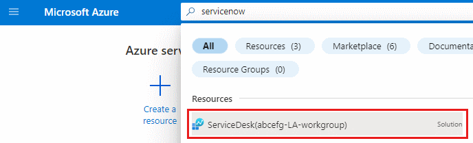
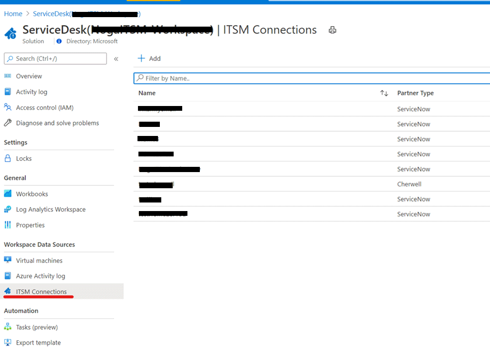
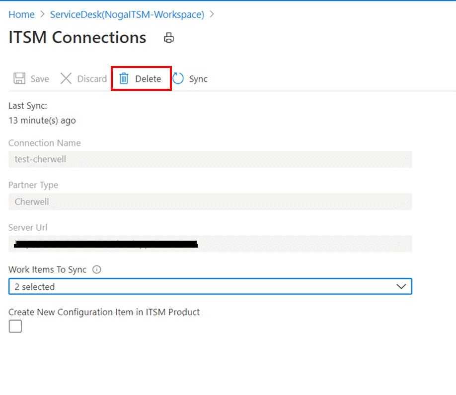

# Deletion of unused ITSM connectors

The process of deletion of unused connector contain 2 phases:

1. Deletion of the associated actions: all the actions that are associated with the ITSM connector should be deleted. This should be done in order not to have actions without connector that might cause errors in your subscription.

2. Deletion of the unused ITSM connector.

## Deletion of the associated actions

1. In order to find the action group you should go into “Monitor”
    

2. Select “Alerts”
    
3. Select “Manage Actions”
    
4. Select all the ITSM connectors that is connected to Cherwell
    
5. Delete the action group
    

## Deletion of the unused ITSM connector

1. You should search and select “ServiceDesk” LA in the top search bar
    
2. Select the “ITSM Connections” and select the Cherwell connector
    
3. Select “Delete”
    

## Next steps

* [Troubleshooting problems in ITSM Connector](./itsmc-resync-servicenow.md)
