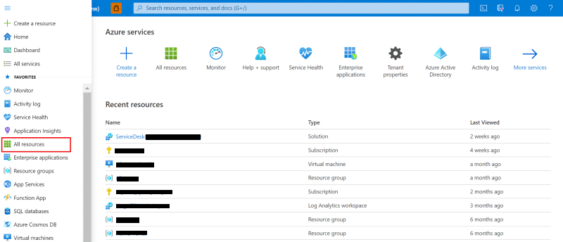
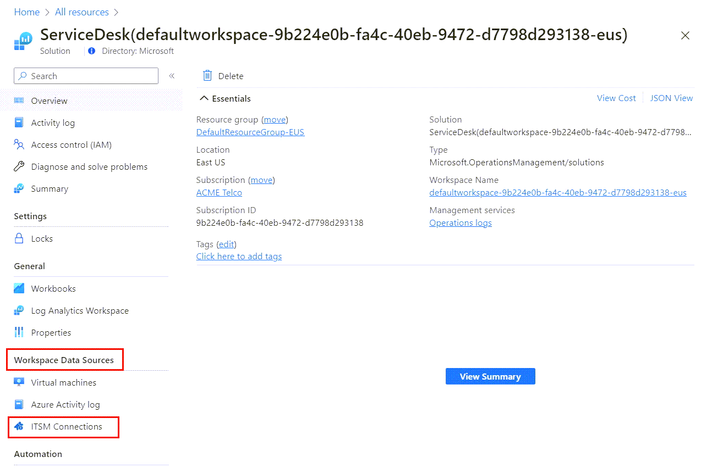
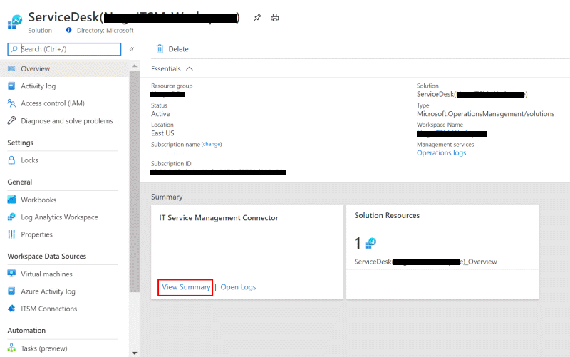
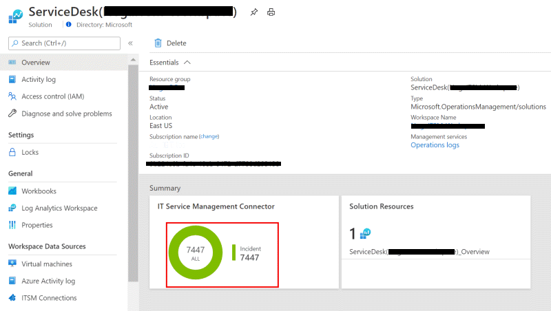
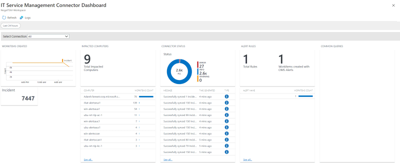

# Investigate errors by using the ITSMC dashboard

This article contains information about the IT Service Management Connector (ITSMC) dashboard. The dashboard helps you to investigate the status of your connector.

## View errors

To view errors in the dashboard:

1. Select **All resources**, and then find **ServiceDesk(*your workspace name*)**.

   

2. Under **Workspace Data Sources** on the left pane, select **ITSM Connections**:

   

3. Under **Summary**, in the **IT Service Management Connector** area, select **View Summary**:

   

4. When a graph appears in the **IT Service Management Connector** area, select it:

   

5. The dashboard appears. Use it to review the status and the errors in your connector.
   
   

## Understand dashboard elements

The dashboard contains information on the alerts that were sent to the ITSM tool through this connector. The dashboard is split into four parts.

### Created work items 

In the **WORK ITEMS CREATED** area, the graph and the table below it contain the count of the work items per type. If you select the graph or the table, you can see more details about the work items.

### Affected computers 

In the **IMPACTED COMPUTERS** area, the table lists computers and their associated work items. By selecting rows in the tables, you can get more details about the computers.

The table contains a limited number of rows. If you want to see all the rows, select **See all**.

### Connector status 

In the **CONNECTOR STATUS** area, the graph and the table below it contain messages about the status of the connector. By selecting the graph or rows in the table, you can get more details about the messages.

The table contains a limited number of rows. If you want to see all the rows, select **See all**.

To learn more about the messages in the table, see [this article](itsmc-dashboard-errors.md).

### Alert rules 

In the **ALERT RULES** area, the table contains information on the number of alert rules that were detected. By selecting rows in the table, you can get more details about the detected rules.
    
The table contains a limited number of rows. If you want to see all the rows, select **See all**.

