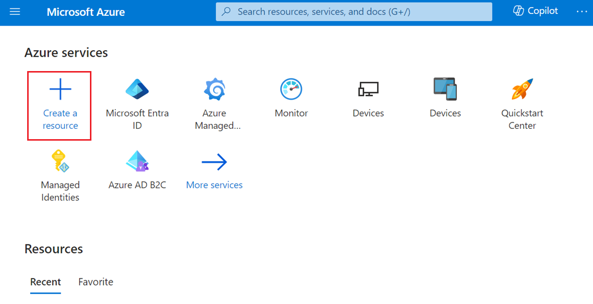
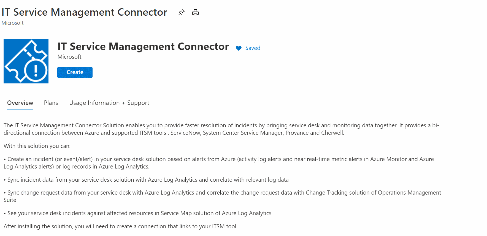
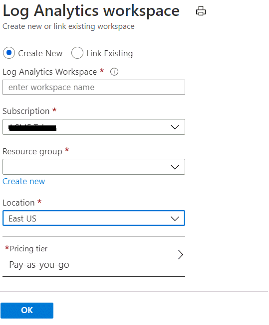
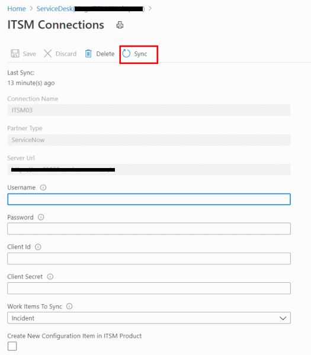
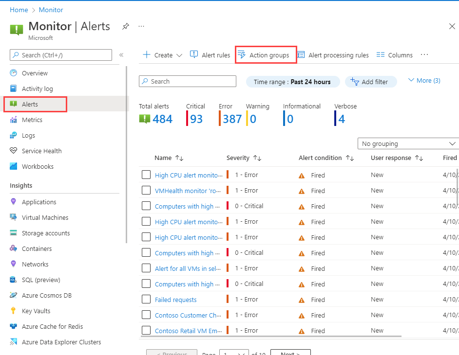
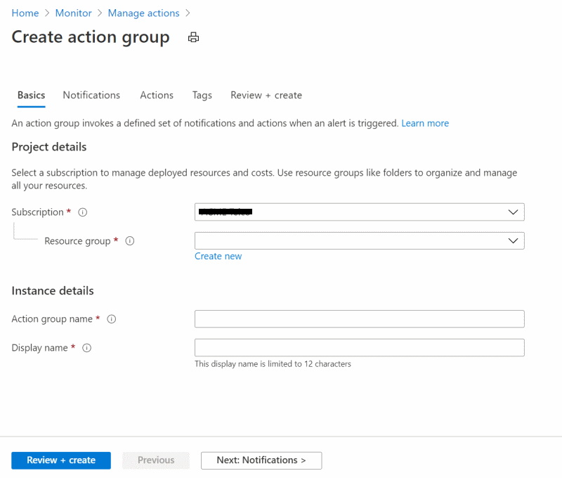
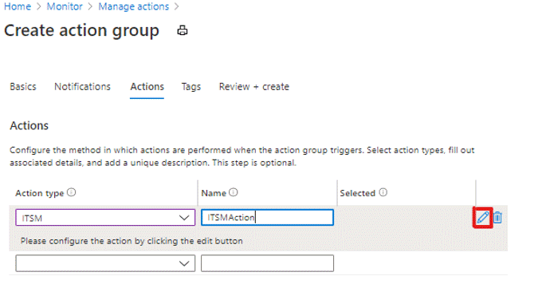
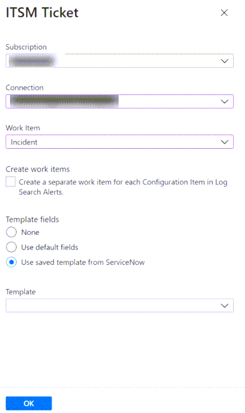
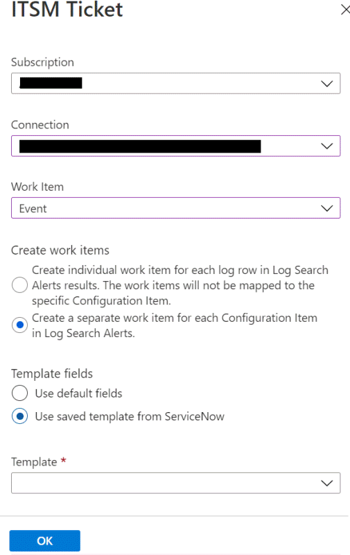

# Connect Azure to ITSM tools by using IT Service Management Solution

:::image type="icon" source="media/itsmc-overview/itsmc-symbol.png":::

This article provides information about how to configure IT Service Management Connector (ITSMC) in Log Analytics to centrally manage your IT Service Management (ITSM) work items.

## Add IT Service Management Connector

Before you can create a connection, you need to install ITSMC.

1. In the Azure portal, select **Create a resource**:

   

2. Search for **IT Service Management Connector** in Azure Marketplace. Then select **Create**:

   

3. In the **LA Workspace** section, select the Log Analytics workspace where you want to install ITSMC.
   > [!NOTE]
   > You can install ITSMC in Log Analytics workspaces only in the following regions: East US, West US 2, South Central US, West Central US, US Gov Arizona, US Gov Virginia, Canada Central, West Europe, South UK, Southeast Asia, Japan East, Central India, and Australia Southeast.

4. In the **Log Analytics workspace** section, select the resource group where you want to create the ITSMC resource:

   
   
   > [!NOTE]
   > As part of the ongoing transition from Microsoft Operations Management Suite (OMS) to Azure Monitor, OMS workspaces are now called *Log Analytics workspaces*.

5. Select **OK**.

When the ITSMC resource is deployed, a notification appears at the upper-right corner of the window.

## Create an ITSM connection

After you've installed ITSMC, you must prep your ITSM tool to allow the connection from ITSMC. Based on the ITSM product that you're connecting to, select one of the following links for instructions:

- [ServiceNow](./itsmc-connections-servicenow.md)
- [System Center Service Manager](./itsmc-connections-scsm.md)
- [Cherwell](./itsmc-connections-cherwell.md)
- [Provance](./itsmc-connections-provance.md)

After you've prepped your ITSM tool, complete these steps to create a connection:

1. In **All resources**, look for **ServiceDesk(*your workspace name*)**:

   

1. Under **Workspace Data Sources** on the left pane, select **ITSM Connections**:

   

1. Select **Add Connection**.

1. Specify the connection settings according to the ITSM product that you're using:

    - [ServiceNow](./itsmc-connections-servicenow.md)
    - [System Center Service Manager](./itsmc-connections-scsm.md)
    - [Cherwell](./itsmc-connections-cherwell.md)
    - [Provance](./itsmc-connections-provance.md)

   > [!NOTE]
   > By default, ITSMC refreshes the connection's configuration data once every 24 hours. To refresh your connection's data instantly to reflect any edits or template updates that you make, select the **Sync** button on your connection's pane:
   >
   > 

## Create ITSM work items from Azure alerts

After you create your ITSM connection, you can use ITMC to create work items in your ITSM tool based on Azure alerts. To create the work items, you'll use the ITSM action in action groups.

Action groups provide a modular and reusable way to trigger actions for your Azure alerts. You can use action groups with metric alerts, activity log alerts, and Log Analytics alerts in the Azure portal.

> [!NOTE]
> After you create the ITSM connection, you need to wait 30 minutes for the sync process to finish.

### Define a template

Certain work item types can use templates that you define in the ITSM tool. By using templates, you can define fields that will be automatically populated according to fixed values for an action group. You can define which template you want to use as a part of the definition of an action group. You can find in ServiceNow docs information about how to create templates - (here)[https://docs.servicenow.com/bundle/paris-platform-administration/page/administer/form-administration/task/t_CreateATemplateUsingTheTmplForm.html].

To create an action group:

1. In the Azure portal, select  **Alerts**.
2. On the menu at the top of the screen, select **Manage actions**:

    

   The **Create action group** window appears.

3. Select the **Subscription** and **Resource group** where you want to create your action group. Provide values in **Action group name** and **Display name** for your action group. Then select **Next: Notifications**.

    

4. On the **Notifications** tab, select **Next: Actions**.
5. On the **Actions** tab, select **ITSM** in the **Action Type** list. For **Name**, provide a name for the action. Then select the pen button that represents **Edit details**.

    

6. In the **Subscription** list, select the subscription that contains your Log Analytics workspace. In the **Connection** list, select your ITSM connector name. It will be followed by your workspace name. An example is *MyITSMConnector(MyWorkspace)*.

7. Select a **Work Item** type.

8. In the last section of the interface for creating an ITSM action group, you can define how many work items will be created for each alert.

   > [!NOTE]
   > This section is relevant only for log search alerts. For all other alert types, you'll create one work item per alert.

   * If you selected **Incident** or **Alert** in the **Work Item** drop-down list, you have the option to create individual work items for each configuration item.
    
     
    
     * If you select the **Create individual work items for each Configuration Item** check box, every configuration item in every alert will create a new work item. Because several alerts will occur for the same affected configuration items, there will be more than one work item for each configuration item.

       For example, an alert that has three configuration items will create three work items. An alert that has one configuration item will create one work item.
        
     * If you clear the **Create individual work items for each Configuration Item** check box, ITSMC will create a single work item for each alert rule and append to it all affected configuration items. A new work item will be created if the previous one is closed.

       >[!NOTE]
       > In this case, some of the fired alerts won't generate new work items in the ITSM tool.

       For example, an alert that has three configuration items will create one work item. If an alert for the same alert rule as the previous example has one configuration item, that configuration item will be attached to the list of affected configuration items in the created work item. An alert for a different alert rule that has one configuration item will create one work item.

   * If you selected **Event** in the **Work Item** drop-down list, you can choose to create individual work items for each log entry or for each configuration item.
    
     

     * If you select **Create individual work items for each Log Entry (Configuration item field is not filled. Can result in large number of work items.)**, a work item will be created for each row in the search results of the log search alert query. The description property in the payload of the work item will contain the row from the search results.
      
     * If you select **Create individual work items for each Configuration Item**, every configuration item in every alert will create a new work item. Each configuration item can have more than one work item in the ITSM system. This option is the same as the selecting the check box that appears after you select **Incident** as the work item type.
9. As a part of the action definition you can define predefined fields that will contain constant values as a part of the payload. According to the work item type there are 3 options that can be used as a part of the payload:
    * **None**: Use a regular payload to ServiceNow without any extra predefined fields and values.
    * **Use default fields**: Using a set of fields and values that will be sent automatically as a part of the payload to ServiceNow. Those fields are not flexible and the values are defined in ServiceNow lists.
    * **Use saved templates from ServiceNow**: Using a predefine set of fields and values that was defined as a part of a template definition in ServiceNow. If you already defined the template in ServiceNow you can use it from the **Template** list otherwise you can define it in ServiceNow, for more [details](#define-a-template).

10. Select **OK**.

When you create or edit an Azure alert rule, use an action group, which has an ITSM action. When the alert triggers, the work item is created or updated in the ITSM tool.

> [!NOTE]
> For information about the pricing of the ITSM action, see the [pricing page](https://azure.microsoft.com/pricing/details/monitor/) for action groups.
>
> The short description field in the alert rule definition is limited to 40 characters when you send it by using the ITSM action.

## Next steps

* [Troubleshoot problems in ITSMC](./itsmc-resync-servicenow.md)
