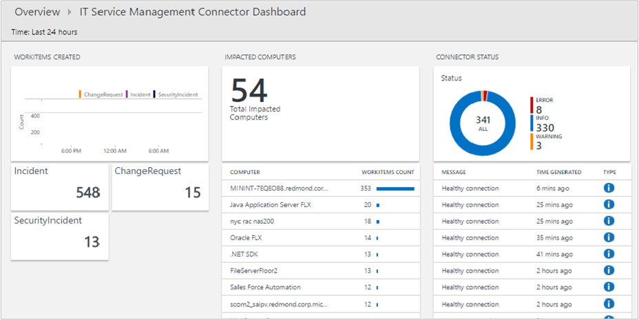

# Troubleshoot problems in IT Service Management Connector

This article discusses common problems in IT Service Management Connector (ITSMC) and how to troubleshoot them.

Azure Monitor proactively notifies you in alerts when it finds important conditions in your monitoring data. These alerts help you identify and address problems before the users of your system notice them.

You can select how you want to receive alerts. You can choose mail, SMS, or webhook, or even automate a solution. 

An alternative is to be notified through ITSMC. ITSMC gives you the option to send alerts to an external ticketing system such as ServiceNow.

## Use the dashboard to analyze incident and change request data

Depending on your configuration when you set up a connection, ITSMC can sync up to 120 days of incident and change request data. To get the log record schema for this data, see the [Data synced from your ITSM product](./itsmc-synced-data.md) article.

You can visualize the incident and change request data by using the ITSMC dashboard:

The dashboard also provides information about connector status. You can use that information as a starting point to analyze problems with the connections. For more information, see [Error investigation using the dashboard](./itsmc-dashboard.md).

## Use Service Map to visualize incidents

You can also visualize the incidents synced against the affected computers in Service Map.

Service Map automatically discovers the application components on Windows and Linux systems and maps the communication between services. It allows you to view your servers as you think of them: as interconnected systems that deliver critical services. 

Service Map shows connections between servers, processes, and ports across any TCP-connected architecture. Other than the installation of an agent, no configuration is required. For more information, see [Using Service Map](../vm/service-map.md).

If you're using Service Map, you can view the service desk items created in IT Service Management (ITSM) solutions, as shown in this example:

## Resolve problems

The following sections identify common symptoms, possible causes, and resolutions. 

### A connection to the ITSM system fails and you get an "Error in saving connection" message

**Cause**: The cause can be one of these options:

* Credentials are incorrect.
* Privileges are insufficient.
* For Service Manager connections: The web app was incorrectly deployed.

**Resolution**:

* For ServiceNow, Cherwell, and Provance connections:
  * Ensure that you correctly entered the username, password, client ID, and client secret for each of the connections.  
  * For ServiceNow, ensure that you have [sufficient privileges](itsmc-connections-servicenow.md#install-the-user-app-and-create-the-user-role) in the corresponding ITSM product.

* For Service Manager connections:  
  * Ensure that the web app is successfully deployed and that the hybrid connection is created. To verify that the connection is successfully established with the on-premises Service Manager computer, go to the web app URL as described in the [documentation for making a hybrid connection](./itsmc-connections-scsm.md#configure-the-hybrid-connection).  

### Duplicate work items are created

**Cause**: The cause can be one of these two options:

* More than one ITSM action is defined for the alert.
* The alert is resolved.

**Resolution**: There can be two solutions:

* Make sure that you have a single ITSM action group per alert.
* ITSMC doesn't support matching work items' status updates when an alert is resolved. Create a new resolved work item.

### Work items are not created

**Cause**: There can be several reasons for this:

* Code was modified on the ServiceNow side.
* Permissions are misconfigured.
* ServiceNow rate limits are too high or too low.
* A refresh token is expired.
* ITSMC was deleted.

**Resolution**: Check the [dashboard](itsmc-dashboard.md) and review the errors in the section for connector status. Then review the [common errors and their resolutions](itsmc-dashboard-errors.md).

### You can't create an ITSM action for an action group

**Cause**: A newly created ITSMC instance has yet to finish the initial sync.

**Resolution**: Review the [common errors and their resolutions](itsmc-dashboard-errors.md).

### Sync connection 

**Cause**: There can be several reasons for this:

* Templates aren't shown as a part of the action definition dropdown and an error message is shown: "Can't retrieve the template configuration, see the connector logs for more information."
* Values aren't shown in the dropdowns of the default fields as a part of the action definition and an error message is shown: "No values found for the following fields: \<field names\>."
* Incidents/Events aren't created in ServiceNow.

**Resolution**: 
* [Sync the connector](itsmc-resync-servicenow.md).
* Check the [dashboard](itsmc-dashboard.md) and review the errors in the section for connector status. Then review the [common errors and their resolutions](itsmc-dashboard-errors.md)

### In the incidents received from ServiceNow, the configuration item is blank 
**Cause**: There can be several reasons for this:
* The alert isn't a log alert. Configuration items are only supported by log alerts.
* The search results do not include the **Computer** or **Resource** column.
* The values in the configuration item field do not match an entry in the CMDB.

**Resolution**: 
* Check if the alert is a log alert. If it isn't a log alert, configuration items are not supported.
* If the search results do not have  a Computer or Resource column, add them to the query. When you are defining a query in Log Search alerts you need to have in the query result the Configuration items names with one of the label names "Computer",  "Resource", "_ResourceId" or "ResourceId”. This mapping will enable to map the configuration items to the ITSM payload
* Check that the values in the Computer and Resource columns are identical to the values in the CMDB. If they are not, add a new entry to the CMDB with the matching values.
