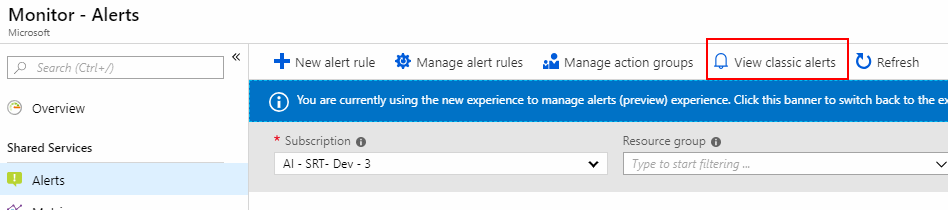

# Unified alerting & monitoring in Azure Monitor replaces classic alerting & monitoring

Azure Monitor is a unified monitoring stack that supports ‘One Metric’ and ‘One Alerts’ across Azure resources. See more information in this [blog post](https://azure.microsoft.com/blog/new-full-stack-monitoring-capabilities-in-azure-monitor/). The new Azure monitoring and alerting platforms has been built to be faster, smarter, and extensible – keeping pace with the growing expanse of cloud computing and in-line with Microsoft Intelligent Cloud philosophy.

With the new Azure monitoring and alerting platform in place, classic alerts in Azure Monitor are retired for public cloud users, though still in limited use until **31 May 2021**. Classic alerts for Azure Government cloud and Azure China 21Vianet will retire on **29 February 2024**.

  

We encourage you to get started and recreate your alerts in the new platform.

> [!IMPORTANT]
> Classic Alert rules created on Activity Log will not be deprecated or migrated. All classic alert rules created on Activity Log can be accessed and used as-is from the new Azure Monitor - Alerts. For more information, see [Create, view, and manage activity log alerts using Azure Monitor](./alerts-activity-log.md). Similarly, Alerts on Service Health can be accessed and used as-is from the new Service Health section. For details, see [alerts on service health notifications](../../service-health/alerts-activity-log-service-notifications-portal.md).

## Unified Metrics and Alerts for Azure resources

In March 2018, we released the next generation of alerting for Azure resources. The newer metric platform and alerting is faster and provides more granularity using dimensions. Dimensions allow you to slice and filter to specific value combination, condition, or operation. The newer metric alerts use action groups allowing more notifications and automation actions. See more information on [managing metric alerts using Azure Monitor](./alerts-metric.md).

Newer metrics for Azure resources are available as:

- **Azure Monitor Standard platform metrics** – which provides popular pre-populated metrics from various Azure services and products. For more information, see this article on [Supported metrics on Azure Monitor](./alerts-metric-near-real-time.md#metrics-and-dimensions-supported) and [Support metric alerts on Azure Monitor](./alerts-metric-overview.md#supported-resource-types-for-metric-alerts).
- **Azure Monitor Custom metrics** – which provides metrics from user driven sources including the Azure Diagnostics agent. For more information, see this article on [Custom metrics in Azure Monitor](../essentials/metrics-custom-overview.md). Using custom metrics, you can also publish metrics collected by [Windows Azure Diagnostics agent](../essentials/collect-custom-metrics-guestos-resource-manager-vm.md) and [InfluxData Telegraf agent](../essentials/collect-custom-metrics-linux-telegraf.md).

## Retirement of Classic monitoring and alerting platform

As stated earlier, older classic monitoring and alerting are retired for public cloud users. It includes the closure of related APIs, Azure portal interface, and services in it, though still in limited use until **31 May 2021**. Classic alerts for Azure Government cloud and Azure China 21Vianet will retire on **29 February 2024**.

Specifically, the retirement scope is for classic metrics currently available in the [Alerts (classic) section](./alerts-classic.overview.md) of Azure portal and accessible as [microsoft.insights/alertrules](/rest/api/monitor/alertrules) resources.

This means:

- Classic monitoring and alerts service will be retired and no longer available for creation of new alert rules.
- Any alert rules that continue to exist in Alerts (classic) will continue to execute and fire notifications.
- Most classic alert rules will be migrated. The process will be seamless without any downtime and customers will have no loss in monitoring coverage.
- Fired notifications will include new payloads structure. Target will need to be adapted to work with the new structure.
- Some [classic alert rules that cannot be automatically migrated](alerts-understand-migration.md#manually-migrating-classic-alerts-to-newer-alerts) and will require manual action from users to continue to run.

> [!IMPORTANT]
> Azure Monitor has rolled out a [tool to voluntarily migrate](alerts-using-migration-tool.md) their classic alert rules to the new platform. Remaining rules will be migrated automatically once the service is retired. Customers will need to ensure automation consuming classic alert rule payload is adapted to handle the new payload from [Unified Metrics and Alerts for other Azure resources](#unified-metrics-and-alerts-for-azure-resources), after migration of the classic alert rules. For more information, see [prepare for classic alert rule migration](alerts-prepare-migration.md).

## Pricing for Migrated Alert Rules

We're rolling out a migration tool to help you migrate your Azure Monitor [classic alerts](./alerts-classic.overview.md) to the new alerts experience. The migrated alert rules and corresponding migrated action groups (email, webhook, or LogicApp) will remain free of charge. The functionality you had with classic alerts including the ability to edit the threshold, aggregation type, and the aggregation granularity will continue to be available for free with your migrated alert rule. However, if you edit the migrated alert rule to use any of the new alert platform features, notifications or action types, a corresponding charge will apply. For more information on the pricing for alert rules and notifications, see [Azure Monitor Pricing](https://azure.microsoft.com/pricing/details/monitor/).

The following are examples of cases where you'll incur a charge for your alert rule:

- Any new (non-migrated) alert rule created beyond free units, on the new Azure Monitor platform
- Any data ingested and retained beyond free units included by Azure Monitor
- Any multi-test web tests executed by Application Insights
- Any custom metrics stored beyond free units included in Azure Monitor
- Any migrated alert rules that are edited to use newer metric alert features like frequency, multiple resources/dimensions, [Dynamic Thresholds](../alerts/alerts-dynamic-thresholds.md), changing resource/signal, and so on.
- Any migrated action groups that are edited to use newer notifications, or action types like SMS, Voice Call and/or ITSM integration.

## Next steps

* Learn about the [new unified Azure Monitor](../overview.md).
* Learn more about the new [Azure Alerts](./alerts-overview.md).