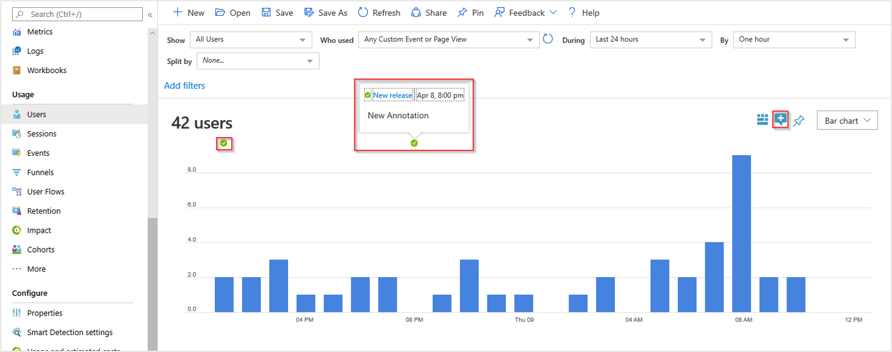
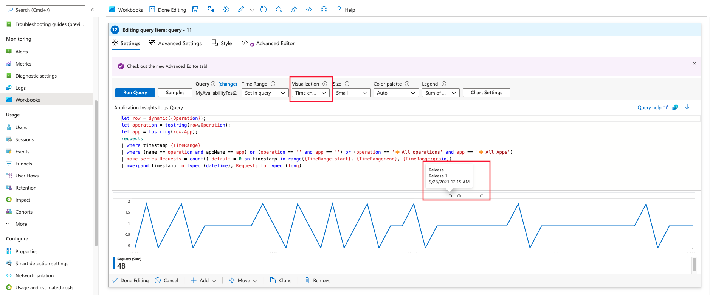
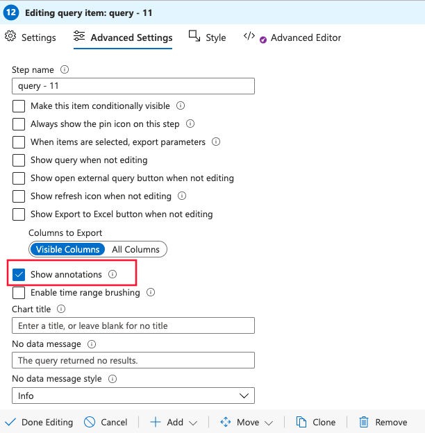

# Annotations on metric charts in Application Insights

Annotations show where you deployed a new build, or other significant events. Annotations make it easy to see whether your changes had any effect on your application's performance. They can be automatically created by the [Azure Pipelines](/azure/devops/pipelines/tasks/) build system. You can also create annotations to flag any event you like by creating them from PowerShell.

## Release annotations with Azure Pipelines build

Release annotations are a feature of the cloud-based Azure Pipelines service of Azure DevOps.

### Install the Annotations extension (one time)

To be able to create release annotations, you'll need to install one of the many Azure DevOps extensions available in the Visual Studio Marketplace.

1. Sign in to your [Azure DevOps](https://azure.microsoft.com/services/devops/) project.
   
1. On the Visual Studio Marketplace [Release Annotations extension](https://marketplace.visualstudio.com/items/ms-appinsights.appinsightsreleaseannotations) page, select your Azure DevOps organization, and then select **Install** to add the extension to your Azure DevOps organization.
   
   
   
You only need to install the extension once for your Azure DevOps organization. You can now configure release annotations for any project in your organization.

### Configure release annotations

Create a separate API key for each of your Azure Pipelines release templates.

1. Sign in to the [Azure portal](https://portal.azure.com) and open the Application Insights resource that monitors your application. Or if you don't have one, [create a new Application Insights resource](./app-insights-overview.md).
   
1. Open the **API Access** tab and copy the **Application Insights ID**.
   
   

1. In a separate browser window, open or create the release template that manages your Azure Pipelines deployments.
   
1. Select **Add task**, and then select the **Application Insights Release Annotation** task from the menu.
   
   

   > [!NOTE]
   > The Release Annotation task currently supports only Windows-based agents; it won't run on Linux, macOS, or other types of agents.
   
1. Under **Application ID**, paste the Application Insights ID you copied from the **API Access** tab.
   
   
   
1. Back in the Application Insights **API Access** window, select **Create API Key**. 
   
   
   
1. In the **Create API key** window, type a description, select **Write annotations**, and then select **Generate key**. Copy the new key.
   
   
   
1. In the release template window, on the **Variables** tab, select **Add** to create a variable definition for the new API key.

1. Under **Name**, enter `ApiKey`, and under **Value**, paste the API key you copied from the **API Access** tab.
   
   
   
1. Select **Save** in the main release template window to save the template.


   > [!NOTE]
   > Limits for API keys are described in the [REST API rate limits documentation](https://dev.applicationinsights.io/documentation/Authorization/Rate-limits).

## View annotations


   > [!NOTE]
   > Release annotations are not currently available in the Metrics pane of Application Insights

Now, whenever you use the release template to deploy a new release, an annotation is sent to Application Insights. The annotations can be viewed in the following locations:

The **Usage** pane where you also have the ability to manually create release annotations:



In any log-based workbook query where the visualization displays time along the x-axis.



To enable annotations in your workbook go to **Advanced Settings** and select **Show annotations**.



Select any annotation marker to open details about the release, including requestor, source control branch, release pipeline, and environment.

## Create custom annotations from PowerShell
You can use the CreateReleaseAnnotation PowerShell script from GitHub to create annotations from any process you like, without using Azure DevOps.

1. Make a local copy of CreateReleaseAnnotation.ps1:

    ```powershell
    
    # Copyright (c) Microsoft Corporation. All rights reserved. 
    # Licensed under the MIT License. See License.txt in the project root for license information. 
    
    # Sample usage .\CreateReleaseAnnotation.ps1 -applicationId "<appId>" -apiKey "<apiKey>" -releaseFilePath "<path to .exe with file version>" -releaseProperties @{"ReleaseDescription"="Release with annotation";"TriggerBy"="John Doe"}
    param(
        [parameter(Mandatory = $true)][string]$applicationId,
        [parameter(Mandatory = $true)][string]$apiKey,
        [parameter(Mandatory = $true)][string]$releaseFilePath,
        [parameter(Mandatory = $false)]$releaseProperties
    )
    
    $releaseName = (Get-Item $releaseFilePath).VersionInfo.FileVersion
    Write-Host "Creating release annotation $releaseName in ApplicationInsights" -ForegroundColor Cyan
    
    # background info on how fwlink works: After you submit a web request, many sites redirect through a series of intermediate pages before you finally land on the destination page.
    # So when calling Invoke-WebRequest, the result it returns comes from the final page in any redirect sequence. Hence, I set MaximumRedirection to 0, as this prevents the call to 
    # be redirected. By doing this, we get a response with status code 302, which indicates that there is a redirection link from the response body. We grab this redirection link and 
    # construct the url to make a release annotation.
    # Here's how this logic is going to works
    # 1. Client send http request, such as:  http://go.microsoft.com/fwlink/?LinkId=625115
    # 2. FWLink get the request and find out the destination URL for it, such as:  http://www.bing.com
    # 3. FWLink generate a new http response with status code “302” and with destination URL “http://www.bing.com”. Send it back to Client.
    # 4. Client, such as a powershell script, knows that status code “302” means redirection to new a location, and the target location is “http://www.bing.com”
    function GetRequestUrlFromFwLink($fwLink)
    {
        $request = Invoke-WebRequest -Uri $fwLink -MaximumRedirection 0 -UseBasicParsing -ErrorAction Ignore
        if ($request.StatusCode -eq "302") {
            return $request.Headers.Location
        }
        
        return $null
    }
    
    function CreateAnnotation($grpEnv)
    {
        $retries = 1
        $success = $false
        while (!$success -and $retries -lt 6) {
            $location = "$grpEnv/applications/$applicationId/Annotations?api-version=2015-11"
                
            Write-Host "Invoke a web request for $location to create a new release annotation. Attempting $retries"
            set-variable -Name createResultStatus -Force -Scope Local -Value $null
            set-variable -Name createResultStatusDescription -Force -Scope Local -Value $null
            set-variable -Name result -Force -Scope Local
    
            try {
                $result = Invoke-WebRequest -Uri $location -Method Put -Body $bodyJson -Headers $headers -ContentType "application/json; charset=utf-8" -UseBasicParsing
            } catch {
                if ($_.Exception){
                    if($_.Exception.Response) {
                        $createResultStatus = $_.Exception.Response.StatusCode.value__
                        $createResultStatusDescription = $_.Exception.Response.StatusDescription
                    }
                    else {
                        $createResultStatus = "Exception"
                        $createResultStatusDescription = $_.Exception.Message
                    }
                }
            }
    
            if ($result -eq $null) {
                if ($createResultStatus -eq $null) {
                    $createResultStatus = "Unknown"
                }
                if ($createResultStatusDescription -eq $null) {
                    $createResultStatusDescription = "Unknown"
                }
            }
            else {
                    $success = $true			         
            }
    
            if ($createResultStatus -eq 409 -or $createResultStatus -eq 404 -or $createResultStatus -eq 401) # no retry when conflict or unauthorized or not found
            {
                break
            }
    
            $retries = $retries + 1
            sleep 1
        }
    
        $createResultStatus
        $createResultStatusDescription
        return
    }
    
    # Need powershell version 3 or greater for script to run
    $minimumPowershellMajorVersion = 3
    if ($PSVersionTable.PSVersion.Major -lt $minimumPowershellMajorVersion) {
       Write-Host "Need powershell version $minimumPowershellMajorVersion or greater to create release annotation"
       return
    }
    
    $currentTime = (Get-Date).ToUniversalTime()
    $annotationDate = $currentTime.ToString("MMddyyyy_HHmmss")
    set-variable -Name requestBody -Force -Scope Script
    $requestBody = @{}
    $requestBody.Id = [GUID]::NewGuid()
    $requestBody.AnnotationName = $releaseName
    $requestBody.EventTime = $currentTime.GetDateTimeFormats("s")[0] # GetDateTimeFormats returns an array
    $requestBody.Category = "Deployment"
    
    if ($releaseProperties -eq $null) {
        $properties = @{}
    } else {
        $properties = $releaseProperties    
    }
    $properties.Add("ReleaseName", $releaseName)
    
    $requestBody.Properties = ConvertTo-Json($properties) -Compress
    
    $bodyJson = [System.Text.Encoding]::UTF8.GetBytes(($requestBody | ConvertTo-Json))
    $headers = New-Object "System.Collections.Generic.Dictionary[[String],[String]]"
    $headers.Add("X-AIAPIKEY", $apiKey)
    
    set-variable -Name createAnnotationResult1 -Force -Scope Local -Value $null
    set-variable -Name createAnnotationResultDescription -Force -Scope Local -Value ""
    
    # get redirect link from fwlink
    $requestUrl = GetRequestUrlFromFwLink("http://go.microsoft.com/fwlink/?prd=11901&pver=1.0&sbp=Application%20Insights&plcid=0x409&clcid=0x409&ar=Annotations&sar=Create%20Annotation")
    if ($requestUrl -eq $null) {
        $output = "Failed to find the redirect link to create a release annotation"
        throw $output
    }
    
    $createAnnotationResult1, $createAnnotationResultDescription = CreateAnnotation($requestUrl)
    if ($createAnnotationResult1) 
    {
         $output = "Failed to create an annotation with Id: {0}. Error {1}, Description: {2}." -f $requestBody.Id, $createAnnotationResult1, $createAnnotationResultDescription
         throw $output
    }
    
    $str = "Release annotation created. Id: {0}." -f $requestBody.Id
    Write-Host $str -ForegroundColor Green
    
    ```
   
1. Use the steps in the preceding procedure to get your Application Insights ID and create an API key from your Application Insights **API Access** tab.
   
1. Call the PowerShell script with the following code, replacing the angle-bracketed placeholders with your values. The `-releaseProperties` are optional. 
   
   ```powershell
   
        .\CreateReleaseAnnotation.ps1 `
         -applicationId "<applicationId>" `
         -apiKey "<apiKey>" `
         -releaseName "<releaseName>" `
         -releaseProperties @{
             "ReleaseDescription"="<a description>";
             "TriggerBy"="<Your name>" }
   ```

You can modify the script, for example to create annotations for the past.

## Next steps

* [Create work items](./diagnostic-search.md#create-work-item)
* [Automation with PowerShell](./powershell.md)

