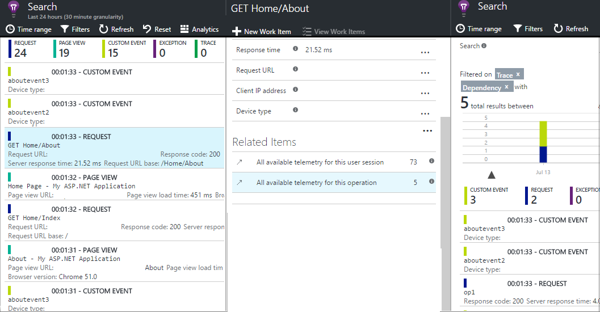

# Application Insights API for custom events and metrics

Insert a few lines of code in your application to find out what users are doing with it, or to help diagnose issues. You can send telemetry from device and desktop apps, web clients, and web servers. Use the [Azure Application Insights](../../azure-monitor/app/app-insights-overview.md) core telemetry API to send custom events and metrics, and your own versions of standard telemetry. This API is the same API that the standard Application Insights data collectors use.

> [!NOTE]
> `TrackMetric()` is no longer the preferred method of sending custom metrics for your .NET based applications. In [version 2.60-beta 3](https://github.com/Microsoft/ApplicationInsights-dotnet/blob/develop/CHANGELOG.md#version-260-beta3) of the Application Insights .NET SDK a new method, [`TelemetryClient.GetMetric()`](https://docs.microsoft.com/dotnet/api/microsoft.applicationinsights.telemetryclient.getmetric?view=azure-dotnet) was introduced. As of the Application Insights .NET SDK [version 2.72](https://docs.microsoft.com/dotnet/api/microsoft.applicationinsights.telemetryclient.getmetric?view=azure-dotnet) this functionality is now part of the stable release.

## API summary

The core API is uniform across all platforms, apart from a few variations like `GetMetric`(.NET only).

| Method | Used for |
| --- | --- |
| [`TrackPageView`](#page-views) |Pages, screens, blades, or forms. |
| [`TrackEvent`](#trackevent) |User actions and other events. Used to track user behavior or to monitor performance. |
| [`GetMetric`](#getmetric) |Zero and multi-dimensional metrics, centrally configured aggregation, C# only. |
| [`TrackMetric`](#trackmetric) |Performance measurements such as queue lengths not related to specific events. |
| [`TrackException`](#trackexception) |Logging exceptions for diagnosis. Trace where they occur in relation to other events and examine stack traces. |
| [`TrackRequest`](#trackrequest) |Logging the frequency and duration of server requests for performance analysis. |
| [`TrackTrace`](#tracktrace) |Diagnostic log messages. You can also capture third-party logs. |
| [`TrackDependency`](#trackdependency) |Logging the duration and frequency of calls to external components that your app depends on. |

You can [attach properties and metrics](#properties) to most of these telemetry calls.

## <a name="prep"></a>Before you start

If you don't have a reference on Application Insights SDK yet:

* Add the Application Insights SDK to your project:

  * [ASP.NET project](../../azure-monitor/app/asp-net.md)
  * [ASP.NET Core project](../../azure-monitor/app/asp-net-core.md)
  * [Java project](../../azure-monitor/app/java-get-started.md)
  * [Node.js project](../../azure-monitor/app/nodejs.md)
  * [JavaScript in each webpage](../../azure-monitor/app/javascript.md) 
* In your device or web server code, include:

    *C#:* `using Microsoft.ApplicationInsights;`

    *Visual Basic:* `Imports Microsoft.ApplicationInsights`

    *Java:* `import com.microsoft.applicationinsights.TelemetryClient;`

    *Node.js:* `var applicationInsights = require("applicationinsights");`

## Get a TelemetryClient instance

Get an instance of `TelemetryClient` (except in JavaScript in webpages):

*C#*

```csharp
private TelemetryClient telemetry = new TelemetryClient();
```

*Visual Basic*

```vb
Private Dim telemetry As New TelemetryClient
```

*Java*

```java
private TelemetryClient telemetry = new TelemetryClient();
``` 

*Node.js*

```javascript
var telemetry = applicationInsights.defaultClient;
```

TelemetryClient is thread-safe.

For ASP.NET and Java projects, incoming HTTP Requests are automatically captured. You might want to create additional instances of TelemetryClient for other module of your app. For instance, you may have one TelemetryClient instance in your middleware class to report business logic events. You can set properties such as UserId and DeviceId to identify the machine. This information is attached to all events that the instance sends. 

*C#*

```csharp
TelemetryClient.Context.User.Id = "...";
TelemetryClient.Context.Device.Id = "...";
```

*Java*

```java
telemetry.getContext().getUser().setId("...");
telemetry.getContext().getDevice().setId("...");
```

In Node.js projects, you can use `new applicationInsights.TelemetryClient(instrumentationKey?)` to create a new instance, but this is recommended only for scenarios that require isolated configuration from the singleton `defaultClient`.

## TrackEvent

In Application Insights, a *custom event* is a data point that you can display in [Metrics Explorer](../../azure-monitor/app/metrics-explorer.md) as an aggregated count, and in [Diagnostic Search](../../azure-monitor/app/diagnostic-search.md) as individual occurrences. (It isn't related to MVC or other framework "events.")

Insert `TrackEvent` calls in your code to count various events. How often users choose a particular feature, how often they achieve particular goals, or maybe how often they make particular types of mistakes.

For example, in a game app, send an event whenever a user wins the game:

*JavaScript*

```javascript
appInsights.trackEvent("WinGame");
```

*C#*

```csharp
telemetry.TrackEvent("WinGame");
```

*Visual Basic*

```vb
telemetry.TrackEvent("WinGame")
```

*Java*

```java
telemetry.trackEvent("WinGame");
```

*Node.js*

```javascript
telemetry.trackEvent({name: "WinGame"});
```

### Custom events in Analytics

The telemetry is available in the `customEvents` table in [Application Insights Analytics](analytics.md). Each row represents a call to `trackEvent(..)` in your app.

If [sampling](../../azure-monitor/app/sampling.md) is in operation, the itemCount property shows a value greater than 1. For example itemCount==10 means that of 10 calls to trackEvent(), the sampling process only transmitted one of them. To get a correct count of custom events, you should therefore use code such as `customEvents | summarize sum(itemCount)`.

## GetMetric

### Examples

*C#*

```csharp
#pragma warning disable CA1716  // Namespace naming

namespace User.Namespace.Example01
{
    using System;
    using Microsoft.ApplicationInsights;
    using Microsoft.ApplicationInsights.DataContracts;

    /// <summary>
    /// Most simple cases are one-liners.
    /// This is all possible without even importing an additional namespace.
    /// </summary>

    public class Sample01
    {
        /// <summary />
        public static void Exec()
        {
            // *** SENDING METRICS ***

            // Recall how you send custom telemetry with Application Insights in other cases, e.g. Events.
            // The following will result in an EventTelemetry object to be sent to the cloud right away.
            TelemetryClient client = new TelemetryClient();
            client.TrackEvent("SomethingInterestingHappened");

            // Metrics work very similar. However, the value is not sent right away.
            // It is aggregated with other values for the same metric, and the resulting summary (aka "aggregate" is sent automatically every minute.
            // To mark this difference, we use a pattern that is similar, but different from the established TrackXxx(..) pattern that sends telemetry right away:

            client.GetMetric("CowsSold").TrackValue(42);

            // *** MULTI-DIMENSIONAL METRICS ***

            // The above example shows a zero-dimensional metric.
            // Metrics can also be multi-dimensional.
            // In the initial version we are supporting up to 2 dimensions, and we will add support for more in the future as needed.
            // Here is an example for a one-dimensional metric:

            Metric animalsSold = client.GetMetric("AnimalsSold", "Species");

            animalsSold.TrackValue(42, "Pigs");
            animalsSold.TrackValue(24, "Horses");

            // The values for Pigs and Horses will be aggregated separately from each other and will result in two distinct aggregates.
            // You can control the maximum number of number data series per metric (and thus your resource usage and cost).
            // The default limits are no more than 1000 total data series per metric, and no more than 100 different values per dimension.
            // We discuss elsewhere how to change them.
            // We use a common .NET pattern: TryXxx(..) to make sure that the limits are observed.
            // If the limits are already reached, Metric.TrackValue(..) will return False and the value will not be tracked. Otherwise it will return True.
            // This is particularly useful if the data for a metric originates from user input, e.g. a file:

            Tuple<int, string> countAndSpecies = ReadSpeciesFromUserInput();
            int count = countAndSpecies.Item1;
            string species = countAndSpecies.Item2;

            if (!animalsSold.TrackValue(count, species))

            {
                client.TrackTrace($"Data series or dimension cap was reached for metric {animalsSold.Identifier.MetricId}.", SeverityLevel.Error);
            }

            // You can inspect a metric object to reason about its current state. For example:
            int currentNumberOfSpecies = animalsSold.GetDimensionValues(1).Count;
        }

        private static void ResetDataStructure()
        {
            // Do stuff
        }

        private static Tuple<int, string> ReadSpeciesFromUserInput()
        {
            return Tuple.Create(18, "Cows");
        }

        private static int AddItemsToDataStructure()
        {
            // Do stuff
            return 5;
        }
    }
}
```

## TrackMetric

> [!NOTE]
> Microsoft.ApplicationInsights.TelemetryClient.TrackMetric is not the preferred method for sending metrics. Metrics should always be pre-aggregated across a time period before being sent. Use one of the GetMetric(..) overloads to get a metric object for accessing SDK pre-aggregation capabilities. If you are implementing your own pre-aggregation logic, you can 
use the TrackMetric() method to send the resulting aggregates. If your application requires sending a separate telemetry item at every occasion without aggregation across time, you likely have a use case for event telemetry; see TelemetryClient.TrackEvent 
(Microsoft.ApplicationInsights.DataContracts.EventTelemetry).

Application Insights can chart metrics that are not attached to particular events. For example, you could monitor a queue length at regular intervals. With metrics, the individual measurements are of less interest than the variations and trends, and so statistical charts are useful.

In order to send metrics to Application Insights, you can use the `TrackMetric(..)` API. There are two ways to send a metric:

* Single value. Every time you perform a measurement in your application, you send the corresponding value to Application Insights. For example, assume that you have a metric describing the number of items in a container. During a particular time period, you first put three items into the container and then you remove two items. Accordingly, you would call `TrackMetric` twice: first passing the value `3` and then the value `-2`. Application Insights stores both values on your behalf.

* Aggregation. When working with metrics, every single measurement is rarely of interest. Instead a summary of what happened during a particular time period is important. Such a summary is called _aggregation_. In the above example, the aggregate metric sum for that time period is `1` and the count of the metric values is `2`. When using the aggregation approach, you only invoke `TrackMetric` once per time period and send the aggregate values. This is the recommended approach since it can significantly reduce the cost and performance overhead by sending fewer data points to Application Insights, while still collecting all relevant information.

### Examples

#### Single values

To send a single metric value:

*JavaScript*

 ```javascript
appInsights.trackMetric("queueLength", 42.0);
 ```

*C#*

```csharp
var sample = new MetricTelemetry();
sample.Name = "metric name";
sample.Value = 42.3;
telemetryClient.TrackMetric(sample);
```

*Java*

```java
telemetry.trackMetric("queueLength", 42.0);
```

*Node.js*

 ```javascript
telemetry.trackMetric({name: "queueLength", value: 42.0});
 ```

### Custom metrics in Analytics

The telemetry is available in the `customMetrics` table in [Application Insights Analytics](analytics.md). Each row represents a call to `trackMetric(..)` in your app.

* `valueSum` - This is the sum of the measurements. To get the mean value, divide by `valueCount`.
* `valueCount` - The number of measurements that were aggregated into this `trackMetric(..)` call.

## Page views

In a device or webpage app, page view telemetry is sent by default when each screen or page is loaded. But you can change that to track page views at additional or different times. For example, in an app that displays tabs or blades, you might want to track a page whenever the user opens a new blade.

User and session data is sent as properties along with page views, so the user and session charts come alive when there is page view telemetry.

### Custom page views

*JavaScript*

```javascript
appInsights.trackPageView("tab1");
```

*C#*

```csharp
telemetry.TrackPageView("GameReviewPage");
```

*Visual Basic*

```vb
telemetry.TrackPageView("GameReviewPage")
```

*Java*

```java
telemetry.trackPageView("GameReviewPage");
```

If you have several tabs within different HTML pages, you can specify the URL too:

```javascript
appInsights.trackPageView("tab1", "http://fabrikam.com/page1.htm");
```

### Timing page views

By default, the times reported as **Page view load time** are measured from when the browser sends the request, until the browser's page load event is called.

Instead, you can either:

* Set an explicit duration in the [trackPageView](https://github.com/Microsoft/ApplicationInsights-JS/blob/master/API-reference.md#trackpageview) call: `appInsights.trackPageView("tab1", null, null, null, durationInMilliseconds);`.
* Use the page view timing calls `startTrackPage` and `stopTrackPage`.

*JavaScript*

```javascript
// To start timing a page:
appInsights.startTrackPage("Page1");

...

// To stop timing and log the page:
appInsights.stopTrackPage("Page1", url, properties, measurements);
```

The name that you use as the first parameter associates the start and stop calls. It defaults to the current page name.

The resulting page load durations displayed in Metrics Explorer are derived from the interval between the start and stop calls. It's up to you what interval you actually time.

### Page telemetry in Analytics

In [Analytics](analytics.md) two tables show data from browser operations:

* The `pageViews` table contains data about the URL and page title
* The `browserTimings` table contains data about client performance, such as the time taken to process the incoming data

To find how long the browser takes to process different pages:

```kusto
browserTimings
| summarize avg(networkDuration), avg(processingDuration), avg(totalDuration) by name
```

To discover the popularities of different browsers:

```kusto
pageViews
| summarize count() by client_Browser
```

To associate page views to AJAX calls, join with dependencies:

```kusto
pageViews
| join (dependencies) on operation_Id 
```

## TrackRequest

The server SDK uses TrackRequest to log HTTP requests.

You can also call it yourself if you want to simulate requests in a context where you don't have the web service module running.

However, the recommended way to send request telemetry is where the request acts as an <a href="#operation-context">operation context</a>.

## Operation context

You can correlate telemetry items together by associating them with operation context. The standard request-tracking module does this for exceptions and other events that are sent while an HTTP request is being processed. In [Search](../../azure-monitor/app/diagnostic-search.md) and [Analytics](analytics.md), you can easily find any events associated with the request using its operation ID.

See [Telemetry correlation in Application Insights](../../azure-monitor/app/correlation.md) for more details on correlation.

When tracking telemetry manually, the easiest way to ensure telemetry correlation by using this pattern:

*C#*

```csharp
// Establish an operation context and associated telemetry item:
using (var operation = telemetryClient.StartOperation<RequestTelemetry>("operationName"))
{
    // Telemetry sent in here will use the same operation ID.
    ...
    telemetryClient.TrackTrace(...); // or other Track* calls
    ...

    // Set properties of containing telemetry item--for example:
    operation.Telemetry.ResponseCode = "200";

    // Optional: explicitly send telemetry item:
    telemetryClient.StopOperation(operation);

} // When operation is disposed, telemetry item is sent.
```

Along with setting an operation context, `StartOperation` creates a telemetry item of the type that you specify. It sends the telemetry item when you dispose the operation, or if you explicitly call `StopOperation`. If you use `RequestTelemetry` as the telemetry type, its duration is set to the timed interval between start and stop.

Telemetry items reported within a scope of operation become 'children' of such operation. Operation contexts could be nested.

In Search, the operation context is used to create the **Related Items** list:



See [Track custom operations with Application Insights .NET SDK](../../azure-monitor/app/custom-operations-tracking.md) for more information on custom operations tracking.

### Requests in Analytics

In [Application Insights Analytics](analytics.md), requests show up in the `requests` table.

If [sampling](../../azure-monitor/app/sampling.md) is in operation, the itemCount property will show a value greater than 1. For example itemCount==10 means that of 10 calls to trackRequest(), the sampling process only transmitted one of them. To get a correct count of requests and average duration segmented by request names, use code such as:

```kusto
requests
| summarize count = sum(itemCount), avgduration = avg(duration) by name
```

## TrackException

Send exceptions to Application Insights:

* To [count them](../../azure-monitor/app/metrics-explorer.md), as an indication of the frequency of a problem.
* To [examine individual occurrences](../../azure-monitor/app/diagnostic-search.md).

The reports include the stack traces.

*C#*

```csharp
try
{
    ...
}
catch (Exception ex)
{
    telemetry.TrackException(ex);
}
```

*Java*

```java
try {
    ...
} catch (Exception ex) {
    telemetry.trackException(ex);
}
```

*JavaScript*

```javascript
try
{
    ...
}
catch (ex)
{
    appInsights.trackException(ex);
}
```

*Node.js*

```javascript
try
{
    ...
}
catch (ex)
{
    telemetry.trackException({exception: ex});
}
```

The SDKs catch many exceptions automatically, so you don't always have to call TrackException explicitly.

* ASP.NET: [Write code to catch exceptions](../../azure-monitor/app/asp-net-exceptions.md).
* Java EE: [Exceptions are caught automatically](../../azure-monitor/app/java-get-started.md#exceptions-and-request-failures).
* JavaScript: Exceptions are caught automatically. If you want to disable automatic collection, add a line to the code snippet that you insert in your webpages:

```javascript
({
    instrumentationKey: "your key",
    disableExceptionTracking: true
})
```

### Exceptions in Analytics

In [Application Insights Analytics](analytics.md), exceptions show up in the `exceptions` table.

If [sampling](../../azure-monitor/app/sampling.md) is in operation, the `itemCount` property shows a value greater than 1. For example itemCount==10 means that of 10 calls to trackException(), the sampling process only transmitted one of them. To get a correct count of exceptions segmented by type of exception, use code such as:

```kusto
exceptions
| summarize sum(itemCount) by type
```

Most of the important stack information is already extracted into separate variables, but you can pull apart the `details` structure to get more. Since this structure is dynamic, you should cast the result to the type you expect. For example:

```kusto
exceptions
| extend method2 = tostring(details[0].parsedStack[1].method)
```

To associate exceptions with their related requests, use a join:

```kusto
exceptions
| join (requests) on operation_Id
```

## TrackTrace

Use TrackTrace to help diagnose problems by sending a "breadcrumb trail" to Application Insights. You can send chunks of diagnostic data and inspect them in [Diagnostic Search](../../azure-monitor/app/diagnostic-search.md).

In .NET [Log adapters](../../azure-monitor/app/asp-net-trace-logs.md) use this API to send third-party logs to the portal.

In Java for [Standard loggers like Log4J, Logback](../../azure-monitor/app/java-trace-logs.md) use Application Insights Log4j or Logback Appenders to send third-party logs to the portal.

*C#*

```csharp
telemetry.TrackTrace(message, SeverityLevel.Warning, properties);
```

*Java*

```java
telemetry.trackTrace(message, SeverityLevel.Warning, properties);
```

*Node.js*

```javascript
telemetry.trackTrace({
    message: message,
    severity: applicationInsights.Contracts.SeverityLevel.Warning,
    properties: properties
});
```

*Client/Browser-side JavaScript*

```javascript
trackTrace(message: string, properties?: {[string]:string}, severityLevel?: AI.SeverityLevel)
```

Log a diagnostic event such as entering or leaving a method.

 Parameter | Description
---|---
`message` | Diagnostic data. Can be much longer than a name.
`properties` | Map of string to string: Additional data used to [filter exceptions](https://azure.microsoft.com/documentation/articles/app-insights-api-custom-events-metrics/#properties) in the portal. Defaults to empty.
`severityLevel` | Supported values: [SeverityLevel.ts](https://github.com/Microsoft/ApplicationInsights-JS/blob/master/JavaScript/JavaScriptSDK.Interfaces/Contracts/Generated/SeverityLevel.ts)

You can search on message content, but (unlike property values) you can't filter on it.

The size limit on `message` is much higher than the limit on properties.
An advantage of TrackTrace is that you can put relatively long data in the message. For example, you can encode POST data there.  

In addition, you can add a severity level to your message. And, like other telemetry, you can add property values to help you filter or search for different sets of traces. For example:

*C#*

```csharp
var telemetry = new Microsoft.ApplicationInsights.TelemetryClient();
telemetry.TrackTrace("Slow database response",
                SeverityLevel.Warning,
                new Dictionary<string,string> { {"database", db.ID} });
```

*Java*

```java
Map<String, Integer> properties = new HashMap<>();
properties.put("Database", db.ID);
telemetry.trackTrace("Slow Database response", SeverityLevel.Warning, properties);
```

In [Search](../../azure-monitor/app/diagnostic-search.md), you can then easily filter out all the messages of a particular severity level that relate to a particular database.

### Traces in Analytics

In [Application Insights Analytics](analytics.md), calls to TrackTrace show up in the `traces` table.

If [sampling](../../azure-monitor/app/sampling.md) is in operation, the itemCount property shows a value greater than 1. For example itemCount==10 means that of 10 calls to `trackTrace()`, the sampling process only transmitted one of them. To get a correct count of trace calls, you should use therefore code such as `traces | summarize sum(itemCount)`.

## TrackDependency

Use the TrackDependency call to track the response times and success rates of calls to an external piece of code. The results appear in the dependency charts in the portal.

*C#*

```csharp
var success = false;
var startTime = DateTime.UtcNow;
var timer = System.Diagnostics.Stopwatch.StartNew();
try
{
    success = dependency.Call();
}
catch(Exception ex) 
{
    success = false;
    telemetry.TrackException(ex);
    throw new Exception("Operation went wrong", ex);
}
finally
{
    timer.Stop();
    telemetry.TrackDependency("DependencyType", "myDependency", "myCall", startTime, timer.Elapsed, success);
}
```

*Java*

```java
boolean success = false;
long startTime = System.currentTimeMillis();
try {
    success = dependency.call();
}
finally {
    long endTime = System.currentTimeMillis();
    long delta = endTime - startTime;
    RemoteDependencyTelemetry dependencyTelemetry = new RemoteDependencyTelemetry("My Dependency", "myCall", delta, success);
    telemetry.setTimeStamp(startTime);
    telemetry.trackDependency(dependencyTelemetry);
}
```

*JavaScript*

```javascript
var success = false;
var startTime = new Date().getTime();
try
{
    success = dependency.Call();
}
finally
{
    var elapsed = new Date() - startTime;
    telemetry.trackDependency({
        dependencyTypeName: "myDependency",
        name: "myCall",
        duration: elapsed,
        success: success
    });
}
```

Remember that the server SDKs include a [dependency module](../../azure-monitor/app/asp-net-dependencies.md) that discovers and tracks certain dependency calls automatically--for example, to databases and REST APIs. You have to install an agent on your server to make the module work. 

In Java, certain dependency calls can be automatically tracked using [Java Agent](../../azure-monitor/app/java-agent.md).

You use this call if you want to track calls that the automated tracking doesn't catch, or if you don't want to install the agent.

To turn off the standard dependency-tracking module in C#, edit [ApplicationInsights.config](../../azure-monitor/app/configuration-with-applicationinsights-config.md) and delete the reference to `DependencyCollector.DependencyTrackingTelemetryModule`. In Java, please do not install java agent if you do not want to collect standard dependencies automatically.

### Dependencies in Analytics

In [Application Insights Analytics](analytics.md), trackDependency calls show up in the `dependencies` table.

If [sampling](../../azure-monitor/app/sampling.md) is in operation, the itemCount property shows a value greater than 1. For example itemCount==10 means that of 10 calls to trackDependency(), the sampling process only transmitted one of them. To get a correct count of dependencies segmented by target component, use code such as:

```kusto
dependencies
| summarize sum(itemCount) by target
```

To associate dependencies with their related requests, use a join:

```kusto
dependencies
| join (requests) on operation_Id
```

## Flushing data

Normally, the SDK sends data at fixed intervals (typically 30 secs) or whenever buffer is full (typically 500 items). However, in some cases, you might want to flush the buffer--for example, if you are using the SDK in an application that shuts down.

*C#*

 ```csharp
telemetry.Flush();
// Allow some time for flushing before shutdown.
System.Threading.Thread.Sleep(5000);
```

*Java*

```java
telemetry.flush();
//Allow some time for flushing before shutting down
Thread.sleep(5000);
```

*Node.js*

```javascript
telemetry.flush();
```

The function is asynchronous for the [server telemetry channel](https://www.nuget.org/packages/Microsoft.ApplicationInsights.WindowsServer.TelemetryChannel/).

Ideally, flush() method should be used in the shutdown activity of the Application.

## Authenticated users

In a web app, users are (by default) identified by cookies. A user might be counted more than once if they access your app from a different machine or browser, or if they delete cookies.

If users sign in to your app, you can get a more accurate count by setting the authenticated user ID in the browser code:

*JavaScript*

```javascript
// Called when my app has identified the user.
function Authenticated(signInId) {
    var validatedId = signInId.replace(/[,;=| ]+/g, "_");
    appInsights.setAuthenticatedUserContext(validatedId);
    ...
}
```

In an ASP.NET web MVC application, for example:

*Razor*

```cshtml
@if (Request.IsAuthenticated)
{
    <script>
        appInsights.setAuthenticatedUserContext("@User.Identity.Name
            .Replace("\\", "\\\\")"
            .replace(/[,;=| ]+/g, "_"));
    </script>
}
```

It isn't necessary to use the user's actual sign-in name. It only has to be an ID that is unique to that user. It must not include spaces or any of the characters `,;=|`.

The user ID is also set in a session cookie and sent to the server. If the server SDK is installed, the authenticated user ID is sent as part of the context properties of both client and server telemetry. You can then filter and search on it.

If your app groups users into accounts, you can also pass an identifier for the account (with the same character restrictions).

```javascript
appInsights.setAuthenticatedUserContext(validatedId, accountId);
```

In [Metrics Explorer](../../azure-monitor/app/metrics-explorer.md), you can create a chart that counts **Users, Authenticated**, and **User accounts**.

You can also [search](../../azure-monitor/app/diagnostic-search.md) for client data points with specific user names and accounts.

## <a name="properties"></a>Filtering, searching, and segmenting your data by using properties

You can attach properties and measurements to your events (and also to metrics, page views, exceptions, and other telemetry data).

*Properties* are string values that you can use to filter your telemetry in the usage reports. For example, if your app provides several games, you can attach the name of the game to each event so that you can see which games are more popular.

There's a limit of 8192 on the string length. (If you want to send large chunks of data, use the message parameter of TrackTrace.)

*Metrics* are numeric values that can be presented graphically. For example, you might want to see if there's a gradual increase in the scores that your gamers achieve. The graphs can be segmented by the properties that are sent with the event, so that you can get separate or stacked graphs for different games.

For metric values to be correctly displayed, they should be greater than or equal to 0.

There are some [limits on the number of properties, property values, and metrics](#limits) that you can use.

*JavaScript*

```javascript
appInsights.trackEvent
    ("WinGame",
        // String properties:
        {Game: currentGame.name, Difficulty: currentGame.difficulty},
        // Numeric metrics:
        {Score: currentGame.score, Opponents: currentGame.opponentCount}
        );

appInsights.trackPageView
    ("page name", "http://fabrikam.com/pageurl.html",
        // String properties:
        {Game: currentGame.name, Difficulty: currentGame.difficulty},
        // Numeric metrics:
        {Score: currentGame.score, Opponents: currentGame.opponentCount}
        );
```

*C#*

```csharp
// Set up some properties and metrics:
var properties = new Dictionary <string, string>
    {{"game", currentGame.Name}, {"difficulty", currentGame.Difficulty}};
var metrics = new Dictionary <string, double>
    {{"Score", currentGame.Score}, {"Opponents", currentGame.OpponentCount}};

// Send the event:
telemetry.TrackEvent("WinGame", properties, metrics);
```

*Node.js*

```javascript
// Set up some properties and metrics:
var properties = {"game": currentGame.Name, "difficulty": currentGame.Difficulty};
var metrics = {"Score": currentGame.Score, "Opponents": currentGame.OpponentCount};

// Send the event:
telemetry.trackEvent({name: "WinGame", properties: properties, measurements: metrics});
```

*Visual Basic*

```vb
' Set up some properties:
Dim properties = New Dictionary (Of String, String)
properties.Add("game", currentGame.Name)
properties.Add("difficulty", currentGame.Difficulty)

Dim metrics = New Dictionary (Of String, Double)
metrics.Add("Score", currentGame.Score)
metrics.Add("Opponents", currentGame.OpponentCount)

' Send the event:
telemetry.TrackEvent("WinGame", properties, metrics)
```

*Java*

```java
Map<String, String> properties = new HashMap<String, String>();
properties.put("game", currentGame.getName());
properties.put("difficulty", currentGame.getDifficulty());

Map<String, Double> metrics = new HashMap<String, Double>();
metrics.put("Score", currentGame.getScore());
metrics.put("Opponents", currentGame.getOpponentCount());

telemetry.trackEvent("WinGame", properties, metrics);
```

> [!NOTE]
> Take care not to log personally identifiable information in properties.
>
>

### Alternative way to set properties and metrics

If it's more convenient, you can collect the parameters of an event in a separate object:

```csharp
var event = new EventTelemetry();

event.Name = "WinGame";
event.Metrics["processingTime"] = stopwatch.Elapsed.TotalMilliseconds;
event.Properties["game"] = currentGame.Name;
event.Properties["difficulty"] = currentGame.Difficulty;
event.Metrics["Score"] = currentGame.Score;
event.Metrics["Opponents"] = currentGame.Opponents.Length;

telemetry.TrackEvent(event);
```

> [!WARNING]
> Don't reuse the same telemetry item instance (`event` in this example) to call Track*() multiple times. This may cause telemetry to be sent with incorrect configuration.
>
>

### Custom measurements and properties in Analytics

In [Analytics](analytics.md), custom metrics and properties show in the `customMeasurements` and `customDimensions` attributes of each telemetry record.

For example, if you have added a property named "game" to your request telemetry, this query counts the occurrences of different values of "game", and show the average of the custom metric "score":

```kusto
requests
| summarize sum(itemCount), avg(todouble(customMeasurements.score)) by tostring(customDimensions.game)
```

Notice that:

* When you extract a value from the customDimensions or customMeasurements JSON, it has dynamic type, and so you must cast it `tostring` or `todouble`.
* To take account of the possibility of [sampling](../../azure-monitor/app/sampling.md), you should use `sum(itemCount)`, not `count()`.

## <a name="timed"></a> Timing events

Sometimes you want to chart how long it takes to perform an action. For example, you might want to know how long users take to consider choices in a game. You can use the measurement parameter for this.

*C#*

```csharp
var stopwatch = System.Diagnostics.Stopwatch.StartNew();

// ... perform the timed action ...

stopwatch.Stop();

var metrics = new Dictionary <string, double>
    {{"processingTime", stopwatch.Elapsed.TotalMilliseconds}};

// Set up some properties:
var properties = new Dictionary <string, string>
    {{"signalSource", currentSignalSource.Name}};

// Send the event:
telemetry.TrackEvent("SignalProcessed", properties, metrics);
```

*Java*

```java
long startTime = System.currentTimeMillis();

// Perform timed action

long endTime = System.currentTimeMillis();
Map<String, Double> metrics = new HashMap<>();
metrics.put("ProcessingTime", endTime-startTime);

// Setup some properties
Map<String, String> properties = new HashMap<>();
properties.put("signalSource", currentSignalSource.getName());

// Send the event
telemetry.trackEvent("SignalProcessed", properties, metrics);
```

## <a name="defaults"></a>Default properties for custom telemetry

If you want to set default property values for some of the custom events that you write, you can set them in a TelemetryClient instance. They are attached to every telemetry item that's sent from that client.

*C#*

```csharp
using Microsoft.ApplicationInsights.DataContracts;

var gameTelemetry = new TelemetryClient();
gameTelemetry.Context.Properties["Game"] = currentGame.Name;
// Now all telemetry will automatically be sent with the context property:
gameTelemetry.TrackEvent("WinGame");
```

*Visual Basic*

```vb
Dim gameTelemetry = New TelemetryClient()
gameTelemetry.Context.Properties("Game") = currentGame.Name
' Now all telemetry will automatically be sent with the context property:
gameTelemetry.TrackEvent("WinGame")
```

*Java*

```java
import com.microsoft.applicationinsights.TelemetryClient;
import com.microsoft.applicationinsights.TelemetryContext;
...


TelemetryClient gameTelemetry = new TelemetryClient();
TelemetryContext context = gameTelemetry.getContext();
context.getProperties().put("Game", currentGame.Name);

gameTelemetry.TrackEvent("WinGame");
```

*Node.js*

```javascript
var gameTelemetry = new applicationInsights.TelemetryClient();
gameTelemetry.commonProperties["Game"] = currentGame.Name;

gameTelemetry.TrackEvent({name: "WinGame"});
```

Individual telemetry calls can override the default values in their property dictionaries.

*For JavaScript web clients*, use JavaScript telemetry initializers.

*To add properties to all telemetry*, including the data from standard collection modules, [implement `ITelemetryInitializer`](../../azure-monitor/app/api-filtering-sampling.md#add-properties).

## Sampling, filtering, and processing telemetry

You can write code to process your telemetry before it's sent from the SDK. The processing includes data that's sent from the standard telemetry modules, such as HTTP request collection and dependency collection.

[Add properties](../../azure-monitor/app/api-filtering-sampling.md#add-properties) to telemetry by implementing `ITelemetryInitializer`. For example, you can add version numbers or values that are calculated from other properties.

[Filtering](../../azure-monitor/app/api-filtering-sampling.md#filtering) can modify or discard telemetry before it's sent from the SDK by implementing `ITelemetryProcessor`. You control what is sent or discarded, but you have to account for the effect on your metrics. Depending on how you discard items, you might lose the ability to navigate between related items.

[Sampling](../../azure-monitor/app/api-filtering-sampling.md) is a packaged solution to reduce the volume of data that's sent from your app to the portal. It does so without affecting the displayed metrics. And it does so without affecting your ability to diagnose problems by navigating between related items such as exceptions, requests, and page views.

[Learn more](../../azure-monitor/app/api-filtering-sampling.md).

## Disabling telemetry

To *dynamically stop and start* the collection and transmission of telemetry:

*C#*

```csharp
using  Microsoft.ApplicationInsights.Extensibility;

TelemetryConfiguration.Active.DisableTelemetry = true;
```

*Java*

```java
telemetry.getConfiguration().setTrackingDisabled(true);
```

To *disable selected standard collectors*--for example, performance counters, HTTP requests, or dependencies--delete or comment out the relevant lines in [ApplicationInsights.config](../../azure-monitor/app/configuration-with-applicationinsights-config.md). You can do this, for example, if you want to send your own TrackRequest data.

*Node.js*

```javascript
telemetry.config.disableAppInsights = true;
```

To *disable selected standard collectors*--for example, performance counters, HTTP requests, or dependencies--at initialization time, chain configuration methods to your SDK initialization code:

```javascript
applicationInsights.setup()
    .setAutoCollectRequests(false)
    .setAutoCollectPerformance(false)
    .setAutoCollectExceptions(false)
    .setAutoCollectDependencies(false)
    .setAutoCollectConsole(false)
    .start();
```

To disable these collectors after initialization, use the Configuration object: `applicationInsights.Configuration.setAutoCollectRequests(false)`

## <a name="debug"></a>Developer mode

During debugging, it's useful to have your telemetry expedited through the pipeline so that you can see results immediately. You also get additional messages that help you trace any problems with the telemetry. Switch it off in production, because it may slow down your app.

*C#*

```csharp
TelemetryConfiguration.Active.TelemetryChannel.DeveloperMode = true;
```

*Visual Basic*

```vb
TelemetryConfiguration.Active.TelemetryChannel.DeveloperMode = True
```

*Node.js*

For Node.js, you can enable developer mode by enabling internal logging via `setInternalLogging` and setting `maxBatchSize` to 0, which causes your telemetry to be sent as soon as it is collected.

```js
applicationInsights.setup("ikey")
  .setInternalLogging(true, true)
  .start()
applicationInsights.defaultClient.config.maxBatchSize = 0;
```

## <a name="ikey"></a> Setting the instrumentation key for selected custom telemetry

*C#*

```csharp
var telemetry = new TelemetryClient();
telemetry.InstrumentationKey = "---my key---";
// ...
```

## <a name="dynamic-ikey"></a> Dynamic instrumentation key

To avoid mixing up telemetry from development, test, and production environments, you can [create separate Application Insights resources](../../azure-monitor/app/create-new-resource.md ) and change their keys, depending on the environment.

Instead of getting the instrumentation key from the configuration file, you can set it in your code. Set the key in an initialization method, such as global.aspx.cs in an ASP.NET service:

*C#*

```csharp
protected void Application_Start()
{
    Microsoft.ApplicationInsights.Extensibility.
    TelemetryConfiguration.Active.InstrumentationKey =
        // - for example -
        WebConfigurationManager.Settings["ikey"];
    ...
}
```

*JavaScript*

```javascript
appInsights.config.instrumentationKey = myKey;
```

In webpages, you might want to set it from the web server's state, rather than coding it literally into the script. For example, in a webpage generated in an ASP.NET app:

*JavaScript in Razor*

```cshtml
<script type="text/javascript">
// Standard Application Insights webpage script:
var appInsights = window.appInsights || function(config){ ...
// Modify this part:
}({instrumentationKey:  
    // Generate from server property:
    @Microsoft.ApplicationInsights.Extensibility.
        TelemetryConfiguration.Active.InstrumentationKey;
}) // ...
```

```java
    String instrumentationKey = "00000000-0000-0000-0000-000000000000";

    if (instrumentationKey != null)
    {
        TelemetryConfiguration.getActive().setInstrumentationKey(instrumentationKey);
    }
```

## TelemetryContext

TelemetryClient has a Context property, which contains values that are sent along with all telemetry data. They are normally set by the standard telemetry modules, but you can also set them yourself. For example:

```csharp
telemetry.Context.Operation.Name = "MyOperationName";
```

If you set any of these values yourself, consider removing the relevant line from [ApplicationInsights.config](../../azure-monitor/app/configuration-with-applicationinsights-config.md), so that your values and the standard values don't get confused.

* **Component**: The app and its version.
* **Device**: Data about the device where the app is running. (In web apps, this is the server or client device that the telemetry is sent from.)
* **InstrumentationKey**: The Application Insights resource in Azure where the telemetry appears. It's usually picked up from ApplicationInsights.config.
* **Location**: The geographic location of the device.
* **Operation**: In web apps, the current HTTP request. In other app types, you can set this to group events together.
  * **ID**: A generated value that correlates different events, so that when you inspect any event in Diagnostic Search, you can find related items.
  * **Name**: An identifier, usually the URL of the HTTP request.
  * **SyntheticSource**: If not null or empty, a string that indicates that the source of the request has been identified as a robot or web test. By default, it is excluded from calculations in Metrics Explorer.
* **Properties**: Properties that are sent with all telemetry data. It can be overridden in individual Track* calls.
* **Session**: The user's session. The ID is set to a generated value, which is changed when the user has not been active for a while.
* **User**: User information.

## Limits

[!INCLUDE [application-insights-limits](../../../includes/application-insights-limits.md)]

To avoid hitting the data rate limit, use [sampling](../../azure-monitor/app/sampling.md).

To determine how long data is kept, see [Data retention and privacy](../../azure-monitor/app/data-retention-privacy.md).

## Reference docs

* [ASP.NET reference](https://msdn.microsoft.com/library/dn817570.aspx)
* [Java reference](http://dl.windowsazure.com/applicationinsights/javadoc/)
* [JavaScript reference](https://github.com/Microsoft/ApplicationInsights-JS/blob/master/API-reference.md)
* [Android SDK](https://github.com/Microsoft/ApplicationInsights-Android)
* [iOS SDK](https://github.com/Microsoft/ApplicationInsights-iOS)

## SDK code

* [ASP.NET Core SDK](https://github.com/Microsoft/ApplicationInsights-aspnetcore)
* [ASP.NET 5](https://github.com/Microsoft/ApplicationInsights-dotnet)
* [Windows Server packages](https://github.com/Microsoft/applicationInsights-dotnet-server)
* [Java SDK](https://github.com/Microsoft/ApplicationInsights-Java)
* [Node.js SDK](https://github.com/Microsoft/ApplicationInsights-Node.js)
* [JavaScript SDK](https://github.com/Microsoft/ApplicationInsights-JS)
* [All platforms](https://github.com/Microsoft?utf8=%E2%9C%93&query=applicationInsights)

## Questions

* *What exceptions might Track_() calls throw?*

    None. You don't need to wrap them in try-catch clauses. If the SDK encounters problems, it will log messages in the debug console output and--if the messages get through--in Diagnostic Search.
* *Is there a REST API to get data from the portal?*

    Yes, the [data access API](https://dev.applicationinsights.io/). Other ways to extract data include [export from Analytics to Power BI](../../azure-monitor/app/export-power-bi.md ) and [continuous export](../../azure-monitor/app/export-telemetry.md).

## <a name="next"></a>Next steps

* [Search events and logs](../../azure-monitor/app/diagnostic-search.md)
* [Troubleshooting](../../azure-monitor/app/troubleshoot-faq.md)
