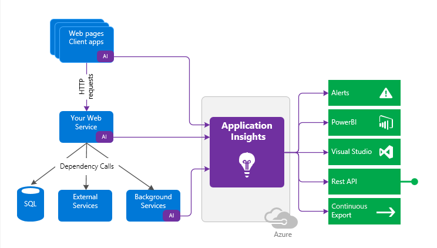

# Application Insights overview

Application Insights is a feature of [Azure Monitor](../overview.md) that provides extensible application performance management (APM) and monitoring for live web apps. Developers and DevOps professionals can use Application Insights to:

- Automatically detect performance anomalies.
- Help diagnose issues by using powerful analytics tools.
- See what users actually do with apps.
- Help continuously improve app performance and usability.

Application Insights:

- Supports a wide variety of platforms, including .NET, Node.js, Java, and Python.
- Works for apps hosted on-premises, hybrid, or on any public cloud.
- Integrates with DevOps processes.
- Has connection points to many development tools.
- Can monitor and analyze telemetry from mobile apps by integrating with Visual Studio [App Center](https://appcenter.ms/).

## How Application Insights works

To use Application Insights, you either install a small instrumentation package (SDK) in your app, or enable Application Insights by using the Application Insights agent. For languages and platforms that support the Application Insights agent, see [Supported languages](./platforms.md).

You can instrument the web app, any background components, and the JavaScript in the web pages themselves. The app and its components don't have to be hosted in Azure.

The instrumentation monitors your app and directs the telemetry data to an Application Insights resource by using a unique instrumentation key. The impact on your app's performance is small. Tracking calls are non-blocking, and are batched and sent in a separate thread. 

You can pull in telemetry like performance counters, Azure diagnostics, or Docker logs from host environments. You can also set up web tests that periodically send synthetic requests to your web service. All these telemetry streams are integrated into Azure Monitor. In the Azure portal, you can apply powerful analytics and search tools to the raw data.

The following diagram shows how Application Insights instrumentation in an app sends telemetry to an Application Insights resource.

## What Application Insights monitors

Application Insights helps development teams understand app performance and usage. Application Insights monitors:

- Request rates, response times, and failure rates

  Find out which pages are most popular, at what times of day, and where users are. See which pages perform best. If response times and failure rates are high when there are more requests, there might be a resourcing problem.

- Dependency rates, response times, and failure rates, to show whether external services are slowing down performance

- Exceptions

  Analyze the aggregated statistics, or pick specific instances and drill into the stack trace and related requests. Application Insights reports both server and browser exceptions.

- Page views and load performance reported by users' browsers

- AJAX calls from web pages, including rates, response times, and failure rates

- User and session counts

- Performance counters from Windows or Linux server machines, such as CPU, memory, and network usage

- Host diagnostics from Docker or Azure

- Diagnostic trace logs from apps, so you can correlate trace events with requests

- Custom events and metrics in client or server code that track business events, like items sold

## Where to see Application Insights data

There are many ways to explore Application Insights telemetry. For more information, see the following articles:

- [Smart detection in Application Insights](./proactive-diagnostics.md)

  Set up automatic alerts that adapt to your app's normal telemetry patterns and trigger when something is outside the usual pattern. You can also set alerts on specified levels of custom or standard metrics. For more information, see [Create, view, and manage log alerts using Azure Monitor](../alerts/alerts-log.md).

- [Application Map: Triage distributed applications](./app-map.md)

  Explore the components of your app, with key metrics and alerts.

- [Profile live Azure App Service apps with Application Insights](./profiler.md)

  Inspect the execution profiles of sampled requests.

- [Usage analysis with Application Insights](./usage-overview.md)

  Analyze user segmentation and retention.

- [Use Search in Application Insights](./diagnostic-search.md)

  Apply transaction search for instance data. Search and filter events such as requests, exceptions, dependency calls, log traces, and page views.

- [Advanced features of the Azure metrics explorer](../essentials/metrics-charts.md)

  Explore, filter, and segment aggregated data such as request, failure, and exception rates, response times, and page load times.

- [Application Insights overview dashboard](./overview-dashboard.md)

  Combine data from multiple resources and share with others. Use the dashboard for multi-component apps and for continuous display in the team room.

- [Live Metrics Stream: Monitor and diagnose with one-second latency](./live-stream.md)

  When you deploy a new build, watch these near-realtime performance indicators to make sure everything works as expected.

- [Log queries in Azure Monitor](../logs/log-query-overview.md)

  Ask questions about your app's performance and usage by using the powerful Kusto query language (KQL).

- [Debug your applications with Application Insights in Visual Studio](./visual-studio.md)

  See performance data in the code, and go to code from stack traces.

- [Debug snapshots on exceptions in .NET apps](./snapshot-debugger.md)

  Use the Snapshot Debugger to debug snapshots sampled from live operations, with parameter values.

- [Feed Power BI from Application Insights](./export-power-bi.md)

  Integrate usage metrics with other business intelligence.

- [Use the Application Insights REST API to build custom solutions](https://dev.applicationinsights.io/)

  Write code to run queries over your metrics and raw data.

- [Export telemetry from Application Insights](./export-telemetry.md)

  Use continuous export to bulk export raw data to storage as soon as it arrives.

## How to use Application Insights

There are several ways to get started with Application Insights. Begin with whatever works best for you, and you can add others later.

### Prerequisites

- You need an Azure account. Application Insights is hosted in Azure, and sends its telemetry to Azure for analysis and presentation. If you don't have an Azure subscription, you can [sign up for free](https://azure.microsoft.com/free). If your organization already has an Azure subscription, an administrator can [add you to it](/azure/active-directory/fundamentals/add-users-azure-active-directory).

- The basic [Application Insights pricing plan](https://azure.microsoft.com/pricing/details/application-insights/) has no charge until your app has substantial usage. 

### Get started

To use Application Insights at run time, you can instrument your web app on the server. This approach is ideal for apps that are already deployed, because it avoids any updates to the app code.

See the following articles for details and instructions:

- [Application monitoring for Azure App Service overview](./azure-web-apps.md)
- [Deploy the Azure Monitor Application Insights Agent on Azure virtual machines and Azure virtual machine scale sets](./azure-vm-vmss-apps.md)
- [Deploy Azure Monitor Application Insights Agent for on-premises servers](./status-monitor-v2-overview.md)
- [Azure Monitor OpenTelemetry-based auto-instrumentation for Java applications](java-in-process-agent.md)

You can also add Application Insights to your app code at development time. This approach lets you customize and add to telemetry collection.

See the following articles for details and instructions:

- [Configure Application Insights for your ASP.NET website](./asp-net.md)
- [Application Insights for ASP.NET Core applications](./asp-net-core.md)
- [Application Insights for .NET console applications](./console.md)
- [Application Insights for web pages](./javascript.md)
- [Monitor your Node.js services and apps with Application Insights](./nodejs.md)
- [Set up Azure Monitor for your Python application](./opencensus-python.md)

For all supported languages, platforms, and frameworks, see [Supported languages](./platforms.md).

### Monitor

After you set up Application Insights, monitor your app.

- Set up [availability web tests](./monitor-web-app-availability.md).
- Use the default [application dashboard](./overview-dashboard.md) for your team room, to track load, responsiveness, and performance. Monitor your dependencies, page loads, and AJAX calls.
- Discover which requests are the slowest and fail most often.
- Watch [Live Stream](./live-stream.md) when you deploy a new release, to know immediately about any degradation.

### Detect and diagnose

When you receive an alert or discover a problem:

- Assess how many users are affected.
- Correlate failures with exceptions, dependency calls, and traces.
- Examine profiler, snapshots, stack dumps, and trace logs.

### Measure, learn, and build

- Plan to measure how customers use new user experience or business features.
- Write custom telemetry into your code.
- [Measure the effectiveness](./usage-overview.md) of each new feature that you deploy.
- Base the next development cycle on evidence from your telemetry.

## Next steps

- [Instrument your web pages](./javascript.md) for page view, AJAX, and other client-side telemetry.
- [Analyze mobile app usage](../app/mobile-center-quickstart.md) by integrating with Visual Studio App Center.
- [Monitor availability with URL ping tests](./monitor-web-app-availability.md) to your website from Application Insights servers.

<!-- ## Support and feedback
* Questions and Issues:
  * [Troubleshooting][qna]
  * [Microsoft Q&A question page](/answers/topics/azure-monitor.html)
  * [StackOverflow](https://stackoverflow.com/questions/tagged/ms-application-insights)
* Your suggestions:
  * [UserVoice](https://feedback.azure.com/d365community/forum/8849e04d-1325-ec11-b6e6-000d3a4f09d0)
* Blog:
  * [Application Insights blog](https://azure.microsoft.com/blog/tag/application-insights) -->

<!--Link references-->

[android]: ../app/mobile-center-quickstart.md
[azure]: ../../insights-perf-analytics.md
[client]: ./javascript.md
[desktop]: ./windows-desktop.md
[greenbrown]: ./asp-net.md
[ios]: ../app/mobile-center-quickstart.md
[java]: ./java-in-process-agent.md
[knowUsers]: app-insights-web-track-usage.md
[platforms]: ./platforms.md
[portal]: https://portal.azure.com/
[qna]: ../faq.yml
[redfield]: ./status-monitor-v2-overview.md

