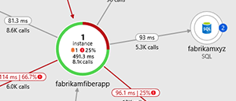
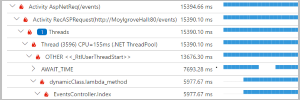
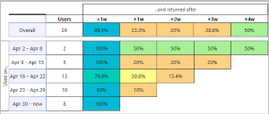
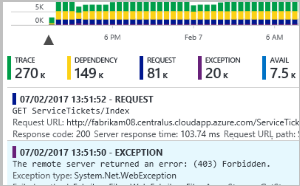
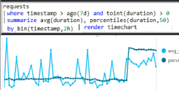
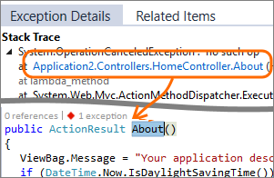
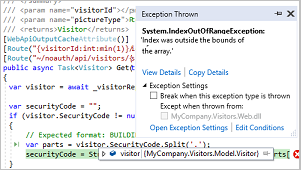
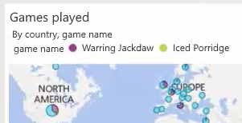

# What is Application Insights?
Application Insights is an extensible Application Performance Management (APM) service for web developers on multiple platforms. Use it to monitor your live web application. It will automatically detect performance anomalies. It includes powerful analytics tools to help you diagnose issues and to understand what users actually do with your app.  It's designed to help you continuously improve  performance and usability. It works for apps on a wide variety of platforms including .NET, Node.js and Java EE, hosted on-premises, hybrid, or any public cloud. It integrates with your DevOps process, and has connection points to a variety of development tools. It can monitor and analyze telemetry from mobile apps by integrating with Visual Studio App Center.

## How does Application Insights work?
You install a small instrumentation package in your application, and set up an Application Insights resource in the Microsoft Azure portal. The instrumentation monitors your app and sends telemetry data to the portal. (The application can run anywhere - it doesn't have to be hosted in Azure.)

You can instrument not only the web service application, but also any background components, and the JavaScript in the web pages themselves. 

In addition, you can pull in telemetry from the host environments such as performance counters, Azure diagnostics, or Docker logs. You can also set up web tests that periodically send synthetic requests to your web service.

All these telemetry streams are integrated in the Azure portal, where you can apply powerful analytic and search tools to the raw data.

### What's the overhead?
The impact on your app's performance is very small. Tracking calls are non-blocking, and are batched and sent in a separate thread.

## What does Application Insights monitor?

Application Insights is aimed at the development team, to help you understand how your app is performing and how it's being used. It monitors:

* **Request rates, response times, and failure rates** - Find out which pages are most popular, at what times of day, and where your users are. See which pages perform best. If your response times and failure rates go high when there are more requests, then perhaps you have a resourcing problem. 
* **Dependency rates, response times, and failure rates** - Find out whether external services are slowing you down.
* **Exceptions** - Analyze the aggregated statistics, or pick specific instances and drill into the stack trace and related requests. Both server and browser exceptions are reported.
* **Page views and load performance** - reported by your users' browsers.
* **AJAX calls** from web pages - rates, response times, and failure rates.
* **User and session counts**.
* **Performance counters** from your Windows or Linux server machines, such as CPU, memory, and network usage. 
* **Host diagnostics** from Docker or Azure. 
* **Diagnostic trace logs** from your app - so that you can correlate trace events with requests.
* **Custom events and metrics** that you write yourself in the client or server code, to track business events such as items sold or games won.

## Where do I see my telemetry?

There are plenty of ways to explore your data. Check out these articles:

|  |  |
| --- | --- |
| [**Smart detection and manual alerts**](../../azure-monitor/app/proactive-diagnostics.md) Automatic alerts adapt to your app's normal patterns of telemetry and trigger when there's something outside the usual pattern. You can also [set alerts](../../azure-monitor/app/alerts.md) on particular levels of custom or standard metrics. | |
| [**Application map**](../../azure-monitor/app/app-map.md) The components of your app, with key metrics and alerts. |  |
| [**Profiler**](../../azure-monitor/app/profiler.md) Inspect the execution profiles of sampled requests. | |
| [**Usage analysis**](../../azure-monitor/app/usage-overview.md) Analyze user segmentation and retention.| |
| [**Diagnostic search for instance data**](../../azure-monitor/app/diagnostic-search.md) Search and filter events such as requests, exceptions, dependency calls, log traces, and page views.  | |
| [**Metrics Explorer for aggregated data**](../../azure-monitor/app/metrics-explorer.md) Explore, filter, and segment aggregated data such as rates of requests, failures, and exceptions; response times, page load times. | |
| [**Dashboards**](../../azure-monitor/app/overview-dashboard.md) Mash up data from multiple resources and share with others. Great for multi-component applications, and for continuous display in the team room. | |
| [**Live Metrics Stream**](../../azure-monitor/app/live-stream.md) When you deploy a new build, watch these near-real-time performance indicators to make sure everything works as expected. | |
| [**Analytics**](../../azure-monitor/app/analytics.md) Answer tough questions about your app's performance and usage by using this powerful query language. | |
| [**Visual Studio**](../../azure-monitor/app/visual-studio.md) See performance data in the code. Go to code from stack traces.| |
| [**Snapshot debugger**](../../azure-monitor/app/snapshot-debugger.md) Debug snapshots sampled from live operations, with parameter values.| |
| [**Power BI**](../../azure-monitor/app/export-power-bi.md ) Integrate usage metrics with other business intelligence.| |
| [**REST API**](https://dev.applicationinsights.io/) Write code to run queries over your metrics and raw data.|  |
| [**Continuous export**](../../azure-monitor/app/export-telemetry.md) Bulk export of raw data to storage as soon as it arrives. | |

## How do I use Application Insights?

### Monitor
Install Application Insights in your app, set up [availability web tests](../../azure-monitor/app/monitor-web-app-availability.md), and:

* Check-out the default [application dashboard](../../azure-monitor/app/overview-dashboard.md) for your team room to keep an eye on load, responsiveness, and the performance of your dependencies, page loads, and AJAX calls.
* Discover which are the slowest and most failing requests.
* Watch [Live Stream](../../azure-monitor/app/live-stream.md) when you deploy a new release, to know immediately about any degradation.

### Detect, Diagnose
When you receive an alert or discover a problem:

* Assess how many users are affected.
* Correlate failures with exceptions, dependency calls, and traces.
* Examine profiler, snapshots, stack dumps, and trace logs.

### Build, Measure, Learn
[Measure the effectiveness](../../azure-monitor/app/usage-overview.md) of each new feature that you deploy.

* Plan to measure how customers use new UX or business features.
* Write custom telemetry into your code.
* Base the next development cycle on hard evidence from your telemetry.

## Get started
Application Insights is one of the many services hosted within Microsoft Azure, and telemetry is sent there for analysis and presentation. So before you do anything else, you'll need a subscription to [Microsoft Azure](https://azure.com). It's free to sign up, and if you choose the basic [pricing plan](https://azure.microsoft.com/pricing/details/application-insights/) of Application Insights, there's no charge until your application has grown to have substantial usage. If your organization already has a subscription, they could add your Microsoft account to it.

There are several ways to get started. Begin with whichever works best for you. You can add the others later.

* **At run time: instrument your web app on the server.** Ideal for applications already deployed. Avoids any update to the code.
  * [**ASP.NET or ASP.NET Core applications hosted on Azure Web Apps**](../../azure-monitor/app/azure-web-apps.md)
  * [**ASP.NET applications hosted in IIS on Azure VM or Azure virtual machine scale set**](../../azure-monitor/app/azure-vm-vmss-apps.md)
  * [**ASP.NET applications hosted in IIS on-premises VM**](../../azure-monitor/app/monitor-performance-live-website-now.md)
* **At development time: add Application Insights to your code.** Allows you to customize telemetry collection and send additional telemetry.
  * [ASP.NET Applications](../../azure-monitor/app/asp-net.md)
  * [ASP.NET Core Applications](../../azure-monitor/app/asp-net-core.md)
  * [.NET Console Applications](../../azure-monitor/app/console.md)
  * [Java](../../azure-monitor/app/java-get-started.md)
  * [Node.js](../../azure-monitor/app/nodejs.md)
  * [Other platforms](../../azure-monitor/app/platforms.md)
* **[Instrument your web pages](../../azure-monitor/app/javascript.md)** for page view, AJAX, and other client-side telemetry.
* **[Analyze mobile app usage](../../azure-monitor/learn/mobile-center-quickstart.md)** by integrating with Visual Studio App Center.
* **[Availability tests](../../azure-monitor/app/monitor-web-app-availability.md)** - ping your website regularly from our servers.

## Next steps
Get started at runtime with:

* [Azure VM and Azure virtual machine scale set IIS-hosted apps](../../azure-monitor/app/azure-vm-vmss-apps.md)
* [IIS server](../../azure-monitor/app/monitor-performance-live-website-now.md)
* [Azure Web Apps](../../azure-monitor/app/azure-web-apps.md)

Get started at development time with:

* [ASP.NET](../../azure-monitor/app/asp-net.md)
* [ASP.NET Core](../../azure-monitor/app/asp-net-core.md)
* [Java](../../azure-monitor/app/java-get-started.md)
* [Node.js](../../azure-monitor/app/nodejs.md)

## Support and feedback
* Questions and Issues:
  * [Troubleshooting][qna]
  * [MSDN Forum](https://social.msdn.microsoft.com/Forums/vstudio/home?forum=ApplicationInsights)
  * [StackOverflow](https://stackoverflow.com/questions/tagged/ms-application-insights)
* Your suggestions:
  * [UserVoice](https://feedback.azure.com/forums/357324-application-insights/filters/top)
* Blog:
  * [Application Insights blog](https://azure.microsoft.com/blog/tag/application-insights)

## Videos

- External video: [configuring Application Insights with an ASP.NET application](https://www.youtube.com/watch?v=blnGAVgMAfA).
- External video: [configuring Application Insights with ASP.NET Core and Visual Studio](https://www.youtube.com/watch?v=NoS9UhcR4gA&t).
- External video: [configuring Application Insights with ASP.NET Core and Visual Studio Code](https://youtu.be/ygGt84GDync).

<!--Link references-->

[android]: ../../azure-monitor/learn/mobile-center-quickstart.md
[azure]: ../../insights-perf-analytics.md
[client]: ../../azure-monitor/app/javascript.md
[desktop]: ../../azure-monitor/app/windows-desktop.md
[greenbrown]: ../../azure-monitor/app/asp-net.md
[ios]: ../../azure-monitor/learn/mobile-center-quickstart.md
[java]: ../../azure-monitor/app/java-get-started.md
[knowUsers]: app-insights-web-track-usage.md
[platforms]: ../../azure-monitor/app/platforms.md
[portal]: https://portal.azure.com/
[qna]: ../../azure-monitor/app/troubleshoot-faq.md
[redfield]: ../../azure-monitor/app/monitor-performance-live-website-now.md
