# Application Map: Triage Distributed Applications

Application Map helps you spot performance bottlenecks or failure hotspots across all components of your distributed application. Each node on the map represents an application component or its dependencies; and has health KPI and alerts status. You can click through from any component to more detailed diagnostics, such as Application Insights events. If your app uses Azure services, you can also click through to Azure diagnostics, such as SQL Database Advisor recommendations.

## What is a Component?

Components are independently deployable parts of your distributed/microservices application. Developers and operations teams have code-level visibility or access to telemetry generated by these application components. 

* Components are different from "observed" external dependencies such as SQL, EventHub etc. which your team/organization may not have access to (code or telemetry).
* Components run on any number of server/role/container instances.
* Components can be separate Application Insights instrumentation keys (even if subscriptions are different) or different roles reporting to a single Application Insights instrumentation key. The preview map experience shows the components regardless of how they are set up.

## Composite Application Map

You can see the full application topology across multiple levels of related application components. Components could be different Application Insights resources, or different roles in a single resource. The app map finds components by following HTTP dependency calls made between servers with the Application Insights SDK installed. 

This experience starts with progressive discovery of the components. When you first load the application map, a set of queries is triggered to discover the components related to this component. A button at the top-left corner will update with the number of components in your application as they are discovered. 

On clicking "Update map components", the map is refreshed with all components discovered until that point. Depending on the complexity of your application, this may take a minute to load.

If all of the components are roles within a single Application Insights resource, then this discovery step is not required. The initial load for such an application will have all its components.

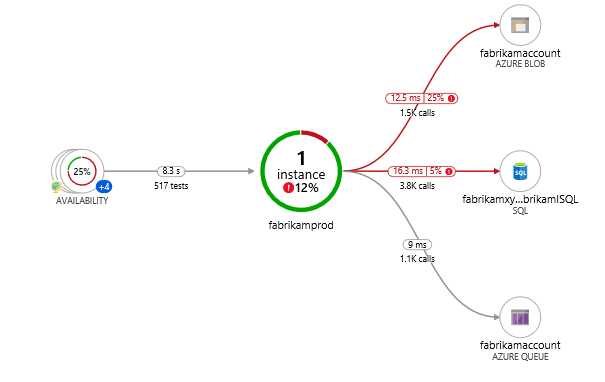

One of the key objectives with this experience is to be able to visualize complex topologies with hundreds of components.

Click on any component to see related insights and go to the performance and failure triage experience for that component.


### Investigate failures

Select **investigate failures** to launch the failures pane.

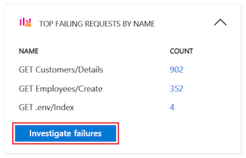

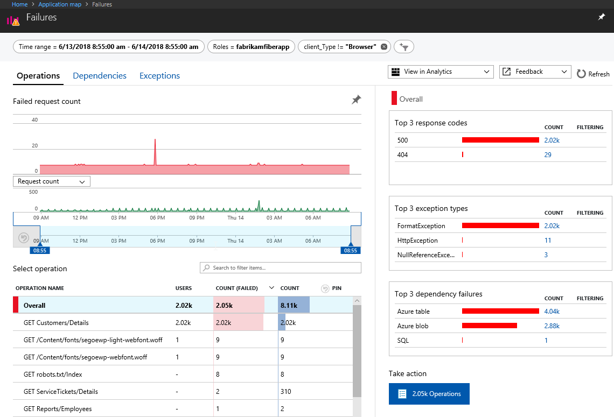

### Investigate performance

To troubleshoot performance problems, select **investigate performance**.

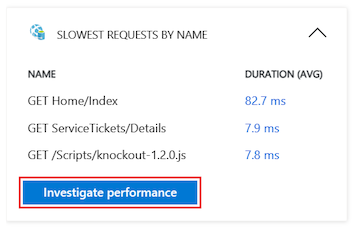

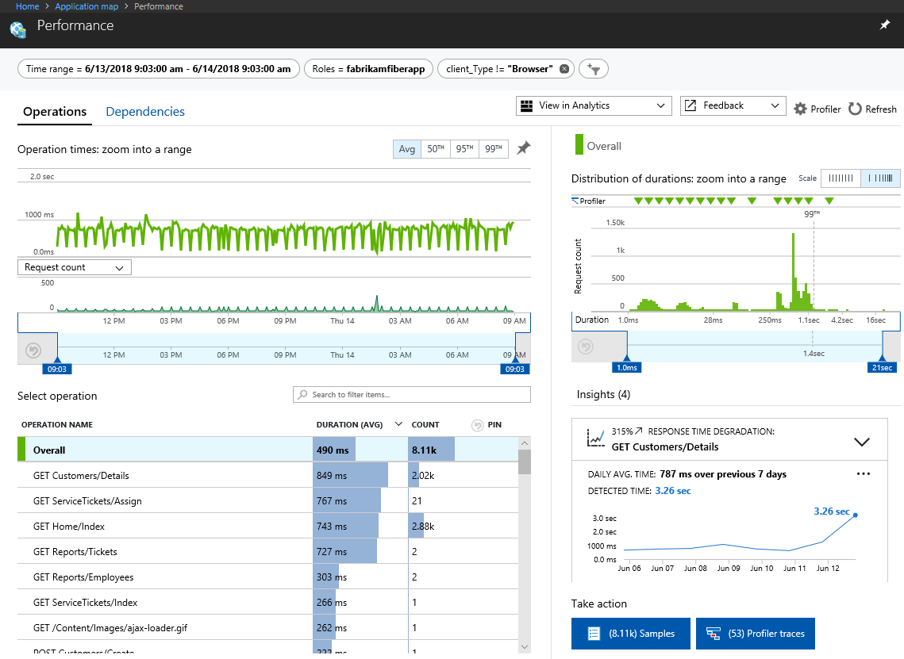

### Go to details

Select **go to details** to explore the end-to-end transaction experience, which can offer views down to the call stack level.

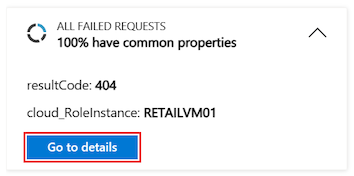

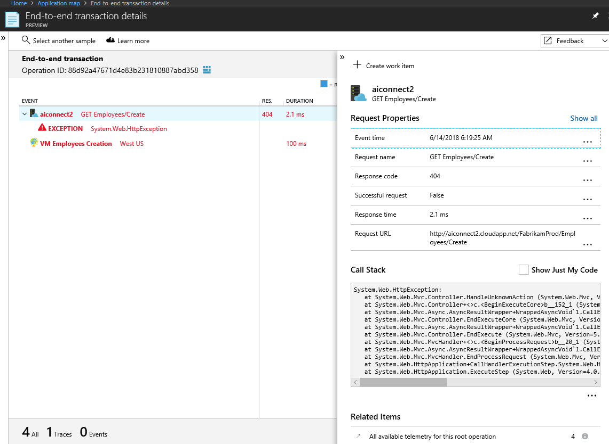

### View in Analytics

To query and investigate your applications data further, click **view in analytics**.


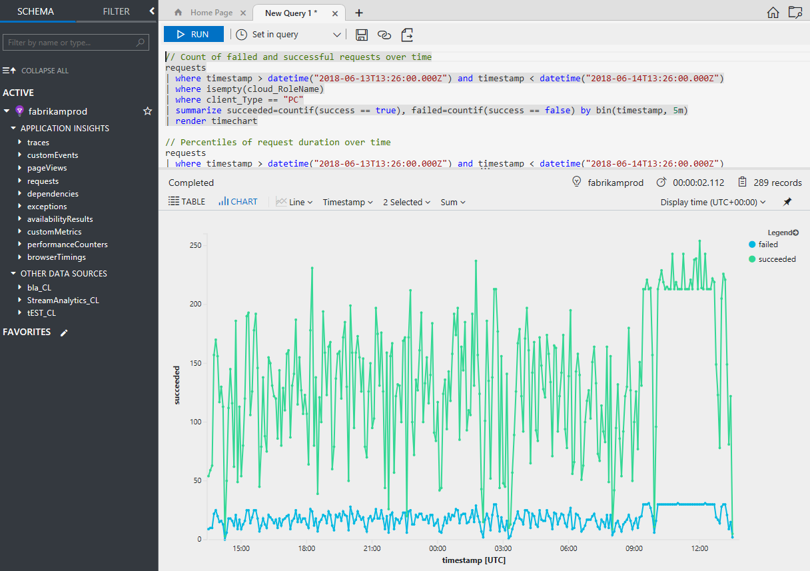

### Alerts

To view active alerts and the underlying rules that cause the alerts to be triggered, select **alerts**.


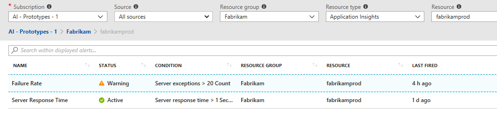

## Set cloud role name

Application Map uses the **cloud role name** property to identify the components on the map. The Application Insights SDK automatically adds the cloud role name property to the telemetry emitted by components. For example, the SDK will add a web site name or service role name to the cloud role name property. However, there are cases where you may want to override the default value. To override cloud role name and change what gets displayed on the Application Map:

### .NET/.NET Core

**Write custom TelemetryInitializer as below.**

```csharp
using Microsoft.ApplicationInsights.Channel;
using Microsoft.ApplicationInsights.Extensibility;

namespace CustomInitializer.Telemetry
{
    public class MyTelemetryInitializer : ITelemetryInitializer
    {
        public void Initialize(ITelemetry telemetry)
        {
            if (string.IsNullOrEmpty(telemetry.Context.Cloud.RoleName))
            {
                //set custom role name here
                telemetry.Context.Cloud.RoleName = "Custom RoleName";
                telemetry.Context.Cloud.RoleInstance = "Custom RoleInstance";
            }
        }
    }
}
```

**ASP.NET apps: Load initializer to the active TelemetryConfiguration**

In ApplicationInsights.config :

```xml
    <ApplicationInsights>
      <TelemetryInitializers>
        <!-- Fully qualified type name, assembly name: -->
        <Add Type="CustomInitializer.Telemetry.MyTelemetryInitializer, CustomInitializer"/>
        ...
      </TelemetryInitializers>
    </ApplicationInsights>
```

An alternate method for ASP.NET Web apps is to instantiate the initializer in code, for example in Global.aspx.cs:

```csharp
 using Microsoft.ApplicationInsights.Extensibility;
 using CustomInitializer.Telemetry;

    protected void Application_Start()
    {
        // ...
        TelemetryConfiguration.Active.TelemetryInitializers.Add(new MyTelemetryInitializer());
    }
```

> [!NOTE]
> Adding initializer using `ApplicationInsights.config` or using `TelemetryConfiguration.Active` is not valid for ASP.NET Core applications. 

**ASP.NET Core apps: Load initializer to the TelemetryConfiguration**

For [ASP.NET Core](asp-net-core.md#adding-telemetryinitializers) applications, adding a new `TelemetryInitializer` is done by adding it to the Dependency Injection container, as shown below. This is done in `ConfigureServices` method of your `Startup.cs` class.

```csharp
 using Microsoft.ApplicationInsights.Extensibility;
 using CustomInitializer.Telemetry;
 public void ConfigureServices(IServiceCollection services)
{
    services.AddSingleton<ITelemetryInitializer, MyTelemetryInitializer>();
}
```

### Node.js

```javascript
var appInsights = require("applicationinsights");
appInsights.setup('INSTRUMENTATION_KEY').start();
appInsights.defaultClient.context.tags["ai.cloud.role"] = "your role name";
appInsights.defaultClient.context.tags["ai.cloud.roleInstance"] = "your role instance";
```

### Alternate method for Node.js

```javascript
var appInsights = require("applicationinsights");
appInsights.setup('INSTRUMENTATION_KEY').start();

appInsights.defaultClient.addTelemetryProcessor(envelope => {
    envelope.tags["ai.cloud.role"] = "your role name";
    envelope.tags["ai.cloud.roleInstance"] = "your role instance"
});
```

### Java

If you use Spring Boot with the Application Insights Spring Boot starter, the only required change is to set your custom name for the application in the application.properties file.

`spring.application.name=<name-of-app>`

The Spring Boot starter will automatically assign cloud role name to the value you enter for the spring.application.name property.

For further information on Java correlation and how to configure cloud role name for non-SpringBoot applications checkout this [section](https://docs.microsoft.com/azure/application-insights/application-insights-correlation#role-name) on correlation.

### Client/browser-side JavaScript

```javascript
appInsights.queue.push(() => {
appInsights.context.addTelemetryInitializer((envelope) => {
  envelope.tags["ai.cloud.role"] = "your role name";
  envelope.tags["ai.cloud.roleInstance"] = "your role instance";
});
});
```

### Understanding cloud role name within the context of the Application Map

As far as how to think about **cloud role name**, it can be helpful to look at an Application Map that has multiple cloud role names present:

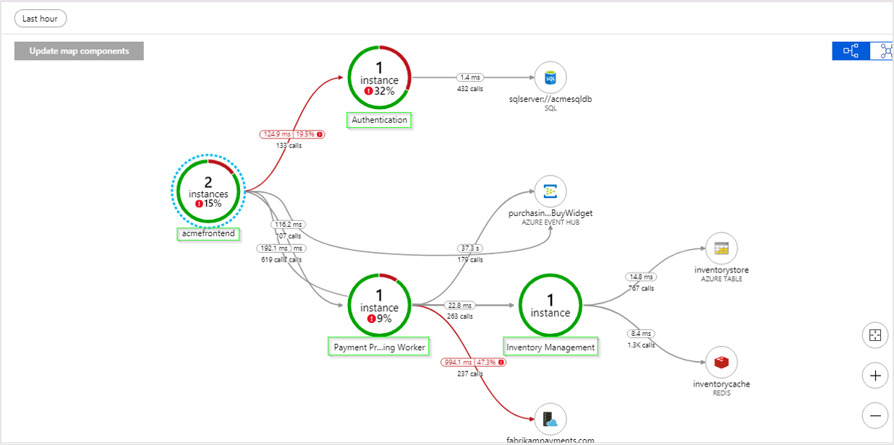

In the Application Map above each of the names in green boxes are cloud role name values for different aspects of this particular distributed application. So for this app its roles consist of: `Authentication`, `acmefrontend`, `Inventory Management`,  a `Payment Processing Worker Role`. 

In the case of this app each of those cloud role names also represents a different unique Application Insights resource with their own instrumentation keys. Since the owner of this application has access to each of those four disparate Application Insights resources, Application Map is able to stitch together a map of the underlying relationships.

For the [official definitions](https://github.com/Microsoft/ApplicationInsights-dotnet/blob/39a5ef23d834777eefdd72149de705a016eb06b0/Schema/PublicSchema/ContextTagKeys.bond#L93):

```
   [Description("Name of the role the application is a part of. Maps directly to the role name in azure.")]
    [MaxStringLength("256")]
    705: string 	 CloudRole = "ai.cloud.role";
    
    [Description("Name of the instance where the application is running. Computer name for on-premises, instance name for Azure.")]
    [MaxStringLength("256")]
    715: string 	 CloudRoleInstance = "ai.cloud.roleInstance";
```

Alternatively, **cloud role instance** can be helpful for scenarios where **cloud role name** tells you the problem is somewhere in your web front-end, but you might be running your web front-end across multiple load-balanced servers so being able to drill in a layer deeper via Kusto queries and knowing if the issue is impacting all web front-end servers/instances or just one can be extremely important.

A scenario where you might want to override the value for cloud role instance could be if your app is running in a containerized environment where just knowing the individual server might not be enough information to locate a given issue.

For more information about how to override the cloud role name property with telemetry initializers, see [Add properties: ITelemetryInitializer](api-filtering-sampling.md#add-properties-itelemetryinitializer).

## Troubleshooting

If you're having trouble getting Application Map to work as expected, try these steps:

### General

1. Make sure you're using an officially supported SDK. Unsupported/community SDKs might not support correlation.

    Refer to this [article](https://docs.microsoft.com/azure/application-insights/app-insights-platforms) for a list of supported SDKs.

2. Upgrade all components to the latest SDK version.

3. If you're using Azure Functions with C#, upgrade to [Functions V2](https://docs.microsoft.com/azure/azure-functions/functions-versions).

4. Confirm [cloud role name](#set-cloud-role-name) is correctly configured.

5. If you're missing a dependency, make sure it's in the list of [auto-collected dependencies](https://docs.microsoft.com/azure/application-insights/auto-collect-dependencies). If not, you can still track it manually with a [track dependency call](https://docs.microsoft.com/azure/application-insights/app-insights-api-custom-events-metrics#trackdependency).

### Too many nodes on the map

Application Map constructs an application node for each unique cloud role name present in your request telemetry and a dependency node for each unique combination of type, target, and cloud role name in your dependency telemetry. If there are more than 10,000 nodes in your telemetry, Application Map will not be able to fetch all the nodes and links, so your map will be incomplete. If this happens, a warning message will appear when viewing the map.

In addition, Application Map only supports up to 1000 separate ungrouped nodes rendered at once. Application Map reduces visual complexity by grouping dependencies together that have the same type and callers, but if your telemetry has too many unique cloud role names or too many dependency types, that grouping will be insufficient, and the map will be unable to render.

To fix this, you'll need to change your instrumentation to properly set the cloud role name, dependency type, and dependency target fields.

* Dependency target should represent the logical name of a dependency. In many cases, it’s equivalent to the server or resource name of the dependency. For example, in the case of HTTP dependencies it is set to the hostname. It should not contain unique IDs or parameters that change from one request to another.

* Dependency type should represent the logical type of a dependency. For example, HTTP, SQL or Azure Blob are typical dependency types. It should not contain unique IDs.

* The purpose of cloud role name is described in the [above section](https://docs.microsoft.com/azure/azure-monitor/app/app-map#set-cloud-role-name).

## Portal feedback

To provide feedback, use the feedback option.

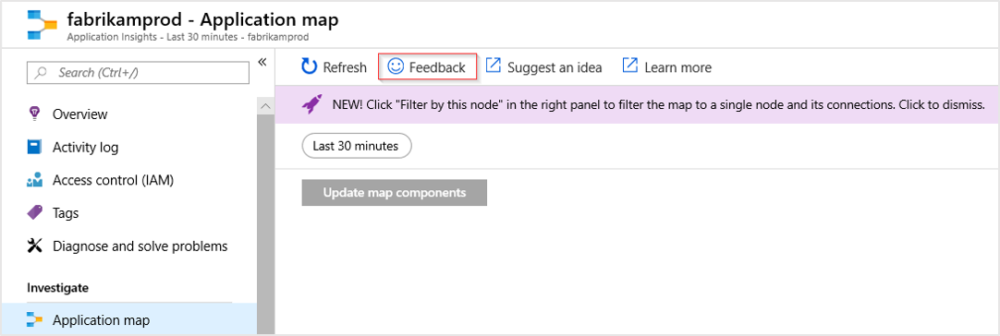

## Next steps

* [Understanding correlation](https://docs.microsoft.com/azure/application-insights/application-insights-correlation)
