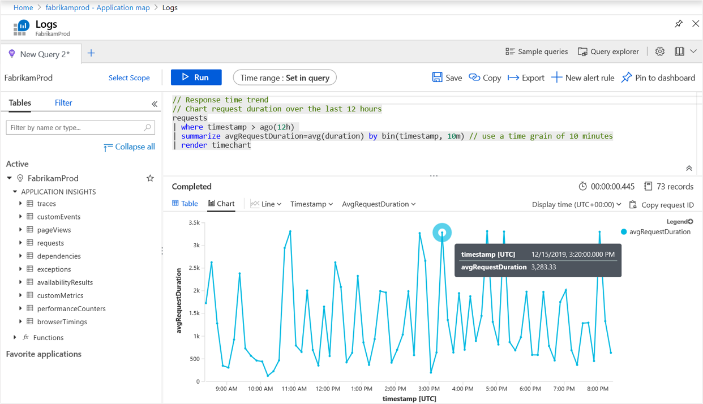

# Application Map: Triage distributed applications

Application Map helps you spot performance bottlenecks or failure hotspots across all components of your distributed application. Each node on the map represents an application component or its dependencies and has health KPI and alerts status. You can select any component to get more detailed diagnostics, such as Application Insights events. If your app uses Azure services, you can also select Azure diagnostics, such as SQL Database Advisor recommendations.

Application Map also features [Intelligent view](#application-map-intelligent-view-public-preview) to assist with fast service health investigations.

## What is a component?

Components are independently deployable parts of your distributed or microservice application. Developers and operations teams have code-level visibility or access to telemetry generated by these application components. For example:

* Components are different from "observed" external dependencies, such as Azure SQL and Azure Event Hubs, which your team or organization might not have access to (code or telemetry).
* Components run on any number of server, role, or container instances.
* Components can be separate Application Insights resources, even if subscriptions are different. They can also be different roles that report to a single Application Insights resource. The preview map experience shows the components regardless of how they're set up.

## Composite application map

You can see the full application topology across multiple levels of related application components. Components can be different Application Insights resources or different roles in a single resource. The application map finds components by following HTTP dependency calls made between servers with the Application Insights SDK installed.

This experience starts with progressive discovery of the components. When you first load Application Map, a set of queries is triggered to discover the components related to this component. A button at the upper-left corner updates with the number of components in your application as they're discovered.

When you select **Update map components**, the map is refreshed with all components discovered until that point. Depending on the complexity of your application, this update might take a minute to load.

If all the components are roles within a single Application Insights resource, this discovery step isn't required. The initial load for such an application will have all its components.


One of the key objectives with this experience is to be able to visualize complex topologies with hundreds of components.

Select any component to see related insights and go to the performance and failure triage experience for that component.


### Investigate failures

Select **Investigate failures** to open the **Failures** pane.


### Investigate performance

To troubleshoot performance problems, select **Investigate performance**.


### Go to details

The **Go to details** button displays the end-to-end transaction experience, which offers views at the call stack level.


### View in Logs (Analytics)

To query and investigate your applications data further, select **View in Logs (Analytics)**.




### Alerts

To view active alerts and the underlying rules that cause the alerts to be triggered, select **Alerts**.


## Set or override cloud role name

Application Map uses the **cloud role name** property to identify the components on the map.

Follow this guidance to manually set or override cloud role names and change what appears on the application map.

> [!NOTE]
> The Application Insights SDK or Agent automatically adds the cloud role name property to the telemetry emitted by components in an Azure App Service environment.

# [.NET/.NetCore](#tab/net)

**Write custom TelemetryInitializer**

```csharp
using Microsoft.ApplicationInsights.Channel;
using Microsoft.ApplicationInsights.Extensibility;

namespace CustomInitializer.Telemetry
{
    public class MyTelemetryInitializer : ITelemetryInitializer
    {
        public void Initialize(ITelemetry telemetry)
        {
            if (string.IsNullOrEmpty(telemetry.Context.Cloud.RoleName))
            {
                //set custom role name here
                telemetry.Context.Cloud.RoleName = "Custom RoleName";
                telemetry.Context.Cloud.RoleInstance = "Custom RoleInstance";
            }
        }
    }
}
```

**ASP.NET apps: Load initializer in the active TelemetryConfiguration**

In `ApplicationInsights.config`:

```xml
    <ApplicationInsights>
      <TelemetryInitializers>
        <!-- Fully qualified type name, assembly name: -->
        <Add Type="CustomInitializer.Telemetry.MyTelemetryInitializer, CustomInitializer"/>
        ...
      </TelemetryInitializers>
    </ApplicationInsights>
```

An alternate method for ASP.NET Web apps is to instantiate the initializer in code, for example, in `Global.aspx.cs`:

```csharp
 using Microsoft.ApplicationInsights.Extensibility;
 using CustomInitializer.Telemetry;

    protected void Application_Start()
    {
        // ...
        TelemetryConfiguration.Active.TelemetryInitializers.Add(new MyTelemetryInitializer());
    }
```

> [!NOTE]
> Adding an initializer by using `ApplicationInsights.config` or `TelemetryConfiguration.Active` isn't valid for ASP.NET Core applications.

**ASP.NET Core apps: Load an initializer to TelemetryConfiguration**

For [ASP.NET Core](asp-net-core.md#adding-telemetryinitializers) applications, to add a new `TelemetryInitializer` instance, you add it to the Dependency Injection container, as shown. You do this step in the `ConfigureServices` method of your `Startup.cs` class.

```csharp
 using Microsoft.ApplicationInsights.Extensibility;
 using CustomInitializer.Telemetry;
 public void ConfigureServices(IServiceCollection services)
{
    services.AddSingleton<ITelemetryInitializer, MyTelemetryInitializer>();
}
```

# [Java](#tab/java)

The cloud role name is set as shown in this example:

```json
{
  "role": {
    "name": "my cloud role name"
  }
}
```

You can also set the cloud role name via the environment variable or system property. For more information,
see [Configuring cloud role name](./java-standalone-config.md#cloud-role-name).

# [Node.js](#tab/nodejs)

```javascript
var appInsights = require("applicationinsights");
appInsights.setup('INSTRUMENTATION_KEY').start();
appInsights.defaultClient.context.tags["ai.cloud.role"] = "your role name";
appInsights.defaultClient.context.tags["ai.cloud.roleInstance"] = "your role instance";
```

### Alternate method for Node.js

```javascript
var appInsights = require("applicationinsights");
appInsights.setup('INSTRUMENTATION_KEY').start();

appInsights.defaultClient.addTelemetryProcessor(envelope => {
    envelope.tags["ai.cloud.role"] = "your role name";
    envelope.tags["ai.cloud.roleInstance"] = "your role instance"
});
```

# [JavaScript](#tab/javascript)

```javascript
appInsights.queue.push(() => {
appInsights.addTelemetryInitializer((envelope) => {
  envelope.tags["ai.cloud.role"] = "your role name";
  envelope.tags["ai.cloud.roleInstance"] = "your role instance";
});
});
```

# [Python](#tab/python)

For Python, you can use [OpenCensus Python telemetry processors](api-filtering-sampling.md#opencensus-python-telemetry-processors).

```python
def callback_function(envelope):
   envelope.tags['ai.cloud.role'] = 'new_role_name'

# AzureLogHandler
handler.add_telemetry_processor(callback_function)

# AzureExporter
exporter.add_telemetry_processor(callback_function)
```
---

### Understand the cloud role name within the context of an application map

To help you understand the concept of *cloud role names*, look at an application map that has multiple cloud role names present.


In the application map shown, each of the names in green boxes is a cloud role name value for different aspects of this particular distributed application. For this app, its roles consist of `Authentication`, `acmefrontend`, `Inventory Management`, and `Payment Processing Worker Role`.

In this app, each of the cloud role names also represents a different unique Application Insights resource with its own instrumentation keys. Because the owner of this application has access to each of those four disparate Application Insights resources, Application Map can stitch together a map of the underlying relationships.

For the [official definitions](https://github.com/Microsoft/ApplicationInsights-dotnet/blob/39a5ef23d834777eefdd72149de705a016eb06b0/Schema/PublicSchema/ContextTagKeys.bond#L93):

```
   [Description("Name of the role the application is a part of. Maps directly to the role name in azure.")]
    [MaxStringLength("256")]
    705: string      CloudRole = "ai.cloud.role";

    [Description("Name of the instance where the application is running. Computer name for on-premises, instance name for Azure.")]
    [MaxStringLength("256")]
    715: string      CloudRoleInstance = "ai.cloud.roleInstance";
```

Alternatively, *cloud role instance* can be helpful for scenarios where a cloud role name tells you the problem is somewhere in your web front end. But you might be running multiple load-balanced servers across your web front end. Being able to drill in a layer deeper via Kusto queries and knowing if the issue is affecting all web front-end servers or instances or just one can be important.

A scenario when you might want to override the value for cloud role instance could be if your app is running in a containerized environment. In this case, just knowing the individual server might not be enough information to locate a specific issue.

For more information about how to override the cloud role name property with telemetry initializers, see [Add properties: ITelemetryInitializer](api-filtering-sampling.md#addmodify-properties-itelemetryinitializer).

## Application Map Intelligent view (public preview)

The following sections discuss Intelligent view.

### Intelligent view summary

Application Map **Intelligent view** is designed to aid in service health investigations. It applies machine learning to quickly identify potential root causes of issues by filtering out noise. The machine learning model learns from Application Map's historical behavior to identify dominant patterns and anomalies that indicate potential causes of an incident.

In large distributed applications, there's always some degree of noise coming from "benign" failures, which might cause Application Map to be noisy by showing many red edges. Intelligent view shows only the most probable causes of service failure and removes node-to-node red edges (service-to-service communication) in healthy services. Intelligent view highlights the edges in red that should be investigated. It also offers actionable insights for the highlighted edge.

### Intelligent view benefits

> [!div class="checklist"]
> * Reduces time to resolution by highlighting only failures that need to be investigated
> * Provides actionable insights on why a certain red edge was highlighted
> * Enables Application Map to be used for large distributed applications seamlessly (by focusing only on  edges marked in red)

### Enable Intelligent view in Application Map

Enable the **Intelligent view** toggle. Optionally, to change the sensitivity of the detections, select **Low**, **Medium**, or **High**. For more information, see the troubleshooting question about [sensitivity](#how-does-intelligent-view-sensitivity-work).

:::image type="content" source="media/app-map/intelligent-view-toggle.png" alt-text="Screenshot that shows the Application Map user interface with options to toggle Intelligent view and provide feedback." lightbox="media/app-map/intelligent-view-toggle.png":::

After you enable **Intelligent view**, select one of the highlighted edges to see the "actionable insights." The insights appear in the pane on the right and explain why the edge was highlighted.

:::image type="content" source="media/app-map/intelligent-view-highlight-explanation.png" alt-text="Screenshot that shows the Application Map user interface section about actionable insights." lightbox="media/app-map/intelligent-view-highlight-explanation.png":::

To begin troubleshooting, select **Investigate failures**. In the **Failures** pane that opens, investigate if the detected issue is the root cause. If no edges are red, the machine learning model didn't find potential incidents in the dependencies of your application.

To provide feedback, select the **Feedback** button on the map.

### How does Intelligent view determine where red edges are highlighted?

Intelligent view uses the patented AIOps machine learning model to highlight what's truly important in an application map.

Some example considerations include:

* Failure rates
* Request counts
* Durations
* Anomalies in the data
* Types of dependency

For comparison, the normal view only utilizes the raw failure rate.

### How does Intelligent view sensitivity work?

Intelligent view sensitivity adjusts the probability that a service issue will be detected.

Adjust sensitivity to achieve the desired confidence level in highlighted edges.

|Sensitivity setting | Result |
|---------|---------|
|High     | Fewer edges will be highlighted. |
|Medium (default)     | A balanced number of edges will be highlighted. |
|Low     | More edges will be highlighted. |

### Limitations of Intelligent view

Intelligent view has some limitations:

* Large distributed applications might take a minute to load Intelligent view.
* Time frames of up to seven days are supported.

To provide feedback, see [Portal feedback](#portal-feedback).

## Troubleshooting

If you're having trouble getting Application Map to work as expected, try these steps.

### General

1. Make sure you're using an officially supported SDK. Unsupported or community SDKs might not support correlation.

    For a list of supported SDKs, see [Application Insights: Languages, platforms, and integrations](./platforms.md).

1. Upgrade all components to the latest SDK version.

1. If you're using Azure Functions with C#, upgrade to [Azure Functions V2](../../azure-functions/functions-versions.md).

1. Confirm the [cloud role name](#set-or-override-cloud-role-name) is correctly configured.

1. If you're missing a dependency, make sure it's in the list of [autocollected dependencies](./auto-collect-dependencies.md). If not, you can still track it manually with a [track dependency call](./api-custom-events-metrics.md#trackdependency).

### Too many nodes on the map

Application Map constructs an application node for each unique cloud role name present in your request telemetry. A dependency node is also constructed for each unique combination of type, target, and cloud role name.

If there are more than 10,000 nodes in your telemetry, Application Map can't fetch all the nodes and links, so your map will be incomplete. If this scenario occurs, a warning message appears when you view the map.

Application Map only supports up to 1,000 separate ungrouped nodes rendered at once. Application Map reduces visual complexity by grouping dependencies together that have the same type and callers.

If your telemetry has too many unique cloud role names or too many dependency types, that grouping will be insufficient and the map won't render.

To fix this issue, you'll need to change your instrumentation to properly set the cloud role name, dependency type, and dependency target fields.

* Dependency target should represent the logical name of a dependency. In many cases, it's equivalent to the server or resource name of the dependency. For example, if there are HTTP dependencies, it's set to the hostname. It shouldn't contain unique IDs or parameters that change from one request to another.

* Dependency type should represent the logical type of a dependency. For example, HTTP, SQL, or Azure Blob are typical dependency types. It shouldn't contain unique IDs.

* The purpose of cloud role name is described in the [Set or override cloud role name](#set-or-override-cloud-role-name) section.

### Intelligent view

Common troubleshooting questions about Intelligent view.

#### Why isn't this edge highlighted, even with low sensitivity?

A dependency might appear to be failing but the model doesn't indicate it's a potential incident:

* If this dependency has been failing for a while, the model might believe it's a regular state and not highlight the edge for you. It focuses on problem-solving in RT.
* If this dependency has a minimal effect on the overall performance of the app, that can also make the model ignore it.
* If none of the above is correct, use the **Feedback** option and describe your experience. You can help us improve future model versions.

#### Why is the edge highlighted?

If an edge is highlighted, the explanation from the model should point you to the most important features that made the model give this dependency a high probability score. The recommendation isn't based solely on failures but on other indicators like unexpected latency in dominant flows.

#### Why doesn't Intelligent view load?

If **Intelligent view** doesn't load:

1. Set the configured time frame to six days or less.
1. The **Try preview** button must be selected to opt in.

   :::image type="content" source="media/app-map/intelligent-view-try-preview.png" alt-text="Screenshot that shows the Try preview button in the Application Map user interface." lightbox="media/app-map/intelligent-view-try-preview.png":::

#### Why does Intelligent view take a long time to load?

Avoid selecting **Update map components**.

Enable **Intelligent view** only for a single Application Insights resource.

:::image type="content" source="media/app-map/intelligent-view-update-map-components.png" alt-text="Screenshot that shows the Update map components button in the Application Map user interface." lightbox="media/app-map/intelligent-view-update-map-components.png":::

## Portal feedback

To provide feedback, use the feedback option.


## Next steps

* To learn more about how correlation works in Application Insights, see [Telemetry correlation](correlation.md).
* The [end-to-end transaction diagnostic experience](transaction-diagnostics.md) correlates server-side telemetry from across all your Application Insights-monitored components into a single view.
* For advanced correlation scenarios in ASP.NET Core and ASP.NET, see [Track custom operations](custom-operations-tracking.md).
