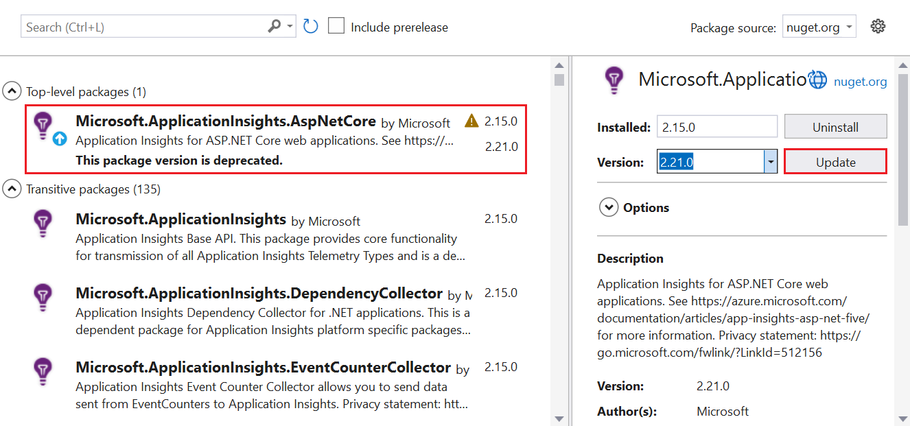

# Application Insights for ASP.NET Core applications

This article describes how to enable Application Insights for an [ASP.NET Core](https://docs.microsoft.com/aspnet/core) application. When you complete the instructions in this article, Application Insights will collect requests, dependencies, exceptions, performance counters, heartbeats, and logs from your ASP.NET Core application.

The example we'll use here is an [MVC application](https://docs.microsoft.com/aspnet/core/tutorials/first-mvc-app) that targets `netcoreapp3.0`. You can apply these instructions to all ASP.NET Core applications.

## Supported scenarios

The [Application Insights SDK for ASP.NET Core](https://nuget.org/packages/Microsoft.ApplicationInsights.AspNetCore) can monitor your applications no matter where or how they run. If your application is running and has network connectivity to Azure, telemetry can be collected. Application Insights monitoring is supported everywhere .NET Core is supported. Support covers:
* **Operating system**: Windows, Linux, or Mac.
* **Hosting method**: In process or out of process.
* **Deployment method**: Framework dependent or self-contained.
* **Web server**: IIS (Internet Information Server) or Kestrel.
* **Hosting platform**: The Web Apps feature of Azure App Service, Azure VM, Docker, Azure Kubernetes Service (AKS), and so on.
* **.NET Core Runtime version**: 1.XX, 2.XX, or 3.XX
* **IDE**: Visual Studio, VS Code, or command line.

> [!NOTE]
> ASP.NET Core 3.X requires [Application Insights 2.8.0](https://www.nuget.org/packages/Microsoft.ApplicationInsights.AspNetCore/2.8.0) or later.

## Prerequisites

- A functioning ASP.NET Core application. If you need to create an ASP.NET Core application, follow this [ASP.NET Core tutorial](https://docs.microsoft.com/aspnet/core/getting-started/).
- A valid Application Insights instrumentation key. This key is required to send any telemetry to Application Insights. If you need to create a new Application Insights resource to get an instrumentation key, see [Create an Application Insights resource](https://docs.microsoft.com/azure/azure-monitor/app/create-new-resource).

## Enable Application Insights server-side telemetry (Visual Studio)

1. Open your project in Visual Studio.

    > [!TIP]
    > If you want to, you can set up source control for your project so you can track all the changes that Application Insights makes. To enable source control, select **File** > **Add to Source Control**.

2. Select **Project** > **Add Application Insights Telemetry**.

3. Select **Get Started**. This selection's text might vary, depending on your version of Visual Studio. Some earlier versions use a **Start Free** button instead.

4. Select your subscription. Then select **Resource** > **Register**.

5. After adding Application Insights to your project, check to confirm that you're using the latest stable release of the SDK. Go to **Project** > **Manage NuGet Packages** > **Microsoft.ApplicationInsights.AspNetCore**. If you need to, choose **Update**.

     

6. If you followed the optional tip and added your project to source control, go to **View** > **Team Explorer** > **Changes**. Then select each file to see a diff view of the changes made by Application Insights telemetry.

## Enable Application Insights server-side telemetry (no Visual Studio)

1. Install the [Application Insights SDK NuGet package for ASP.NET Core](https://nuget.org/packages/Microsoft.ApplicationInsights.AspNetCore). We recommend that you always use the latest stable version. Find full release notes for the SDK on the [open-source GitHub repo](https://github.com/Microsoft/ApplicationInsights-aspnetcore/releases).

    The following code sample shows the changes to be added to your project's `.csproj` file.

    ```xml
        <ItemGroup>
          <PackageReference Include="Microsoft.ApplicationInsights.AspNetCore" Version="2.13.1" />
        </ItemGroup>
    ```

2. Add `services.AddApplicationInsightsTelemetry();` to the `ConfigureServices()` method in your `Startup` class, as in this example:

    ```csharp
        // This method gets called by the runtime. Use this method to add services to the container.
        public void ConfigureServices(IServiceCollection services)
        {
            // The following line enables Application Insights telemetry collection.
            services.AddApplicationInsightsTelemetry();
    
            // This code adds other services for your application.
            services.AddMvc();
        }
    ```

3. Set up the instrumentation key.

    Although you can provide the instrumentation key as an argument to `AddApplicationInsightsTelemetry`, we recommend that you specify the instrumentation key in configuration. The following code sample shows how to specify an instrumentation key in `appsettings.json`. Make sure `appsettings.json` is copied to the application root folder during publishing.

    ```json
        {
          "ApplicationInsights": {
            "InstrumentationKey": "putinstrumentationkeyhere"
          },
          "Logging": {
            "LogLevel": {
              "Default": "Warning"
            }
          }
        }
    ```

    Alternatively, specify the instrumentation key in either of the following environment variables:

    * `APPINSIGHTS_INSTRUMENTATIONKEY`

    * `ApplicationInsights:InstrumentationKey`

    For example:

    * `SET ApplicationInsights:InstrumentationKey=putinstrumentationkeyhere`

    * `SET APPINSIGHTS_INSTRUMENTATIONKEY=putinstrumentationkeyhere`

    * `APPINSIGHTS_INSTRUMENTATIONKEY` is typically used in [Azure Web Apps](https://docs.microsoft.com/azure/azure-monitor/app/azure-web-apps?tabs=net), but can also be used in all places where this SDK is supported. (If you are doing codeless web app monitoring, this format is required if you aren't using connection strings.)

    In lieu of setting instrumentation keys you can now also use [Connection Strings](https://docs.microsoft.com/azure/azure-monitor/app/sdk-connection-string?tabs=net).

    > [!NOTE]
    > An instrumentation key specified in code wins over the environment variable `APPINSIGHTS_INSTRUMENTATIONKEY`, which wins over other options.

## Run your application

Run your application and make requests to it. Telemetry should now flow to Application Insights. The Application Insights SDK automatically collects incoming web requests to your application, along with the following telemetry as well.

### Live Metrics

[Live Metrics](https://docs.microsoft.com/azure/application-insights/app-insights-live-stream) can be used to quickly verify if Application Insights monitoring is configured correctly. While it might take a few minutes before telemetry starts appearing in the portal and analytics, Live Metrics would show CPU usage of the running process in near real-time. It can also show other telemetry like Requests, Dependencies, Traces, etc.

### ILogger logs

Logs emitted via `ILogger` of severity `Warning` or greater are automatically captured. Follow [ILogger docs](ilogger.md#control-logging-level) to customize which log levels are captured by Application Insights.

### Dependencies

Dependency collection is enabled by default. [This](asp-net-dependencies.md#automatically-tracked-dependencies) article explains the dependencies that are automatically collected, and also contain steps to do manual tracking.

### Performance counters

Support for [performance counters](https://azure.microsoft.com/documentation/articles/app-insights-web-monitor-performance/) in ASP.NET Core is limited:

* SDK versions 2.4.1 and later collect performance counters if the application is running in Azure Web Apps (Windows).
* SDK versions 2.7.1 and later collect performance counters if the application is running in Windows and targets `NETSTANDARD2.0` or later.
* For applications targeting the .NET Framework, all versions of the SDK support performance counters.
* SDK Versions 2.8.0 and later support cpu/memory counter in Linux. No other counter is supported in Linux. The recommended way to get system counters in Linux (and other non-Windows environments) is by using [EventCounters](#eventcounter)

### EventCounter

`EventCounterCollectionModule` is enabled by default, and it will collect a default set of counters from .NET Core 3.X apps. The [EventCounter](eventcounters.md) tutorial lists the default set of counters collected. It also has instructions on customizing the list.

## Enable client-side telemetry for web applications

The preceding steps are enough to help you start collecting server-side telemetry. If your application has client-side components, follow the next steps to start collecting [usage telemetry](https://docs.microsoft.com/azure/azure-monitor/app/usage-overview).

1. In `_ViewImports.cshtml`, add injection:

    ```cshtml
        @inject Microsoft.ApplicationInsights.AspNetCore.JavaScriptSnippet JavaScriptSnippet
    ```

2. In `_Layout.cshtml`, insert `HtmlHelper` at the end of the `<head>` section but before any other script. If you want to report any custom JavaScript telemetry from the page, inject it after this snippet:

    ```cshtml
        @Html.Raw(JavaScriptSnippet.FullScript)
        </head>
    ```
    
Alternatively to using the `FullScript` the `ScriptBody` is available starting in SDK v2.14. Use this if you need to control the `<script>` tag to set a Content Security Policy:

```cshtml
 <script> // apply custom changes to this script tag.
     @Html.Raw(JavaScriptSnippet.ScriptBody)
 </script>
```

The `.cshtml` file names referenced earlier are from a default MVC application template. Ultimately, if you want to properly enable client-side monitoring for your application, the JavaScript snippet must appear in the `<head>` section of each page of your application that you want to monitor. You can accomplish this goal for this application template by adding the JavaScript snippet to `_Layout.cshtml`. 

If your project doesn't include `_Layout.cshtml`, you can still add [client-side monitoring](https://docs.microsoft.com/azure/azure-monitor/app/website-monitoring). You can do this by adding the JavaScript snippet to an equivalent file that controls the `<head>` of all pages within your app. Or you can add the snippet to multiple pages, but this solution is difficult to maintain and we generally don't recommend it.

## Configure the Application Insights SDK

You can customize the Application Insights SDK for ASP.NET Core to change the default configuration. Users of the Application Insights ASP.NET SDK might be familiar with changing configuration by using `ApplicationInsights.config` or by modifying `TelemetryConfiguration.Active`. You change configuration differently for ASP.NET Core. Add the ASP.NET Core SDK to the application and configure it by using ASP.NET Core built-in [dependency injection](https://docs.microsoft.com/aspnet/core/fundamentals/dependency-injection). Make almost all configuration changes in the `ConfigureServices()` method of your `Startup.cs` class, unless you're directed otherwise. The following sections offer more information.

> [!NOTE]
> In ASP.NET Core applications, changing configuration by modifying `TelemetryConfiguration.Active` isn't supported.

### Using ApplicationInsightsServiceOptions

You can modify a few common settings by passing `ApplicationInsightsServiceOptions` to `AddApplicationInsightsTelemetry`, as in this example:

```csharp
public void ConfigureServices(IServiceCollection services)
{
    Microsoft.ApplicationInsights.AspNetCore.Extensions.ApplicationInsightsServiceOptions aiOptions
                = new Microsoft.ApplicationInsights.AspNetCore.Extensions.ApplicationInsightsServiceOptions();
    // Disables adaptive sampling.
    aiOptions.EnableAdaptiveSampling = false;

    // Disables QuickPulse (Live Metrics stream).
    aiOptions.EnableQuickPulseMetricStream = false;
    services.AddApplicationInsightsTelemetry(aiOptions);
}
```

Full List of settings in `ApplicationInsightsServiceOptions`

|Setting | Description | Default
|---------------|-------|-------
|EnablePerformanceCounterCollectionModule  | Enable/Disable `PerformanceCounterCollectionModule` | true
|EnableRequestTrackingTelemetryModule   | Enable/Disable `RequestTrackingTelemetryModule` | true
|EnableEventCounterCollectionModule   | Enable/Disable `EventCounterCollectionModule` | true
|EnableDependencyTrackingTelemetryModule   | Enable/Disable `DependencyTrackingTelemetryModule` | true
|EnableAppServicesHeartbeatTelemetryModule  |  Enable/Disable `AppServicesHeartbeatTelemetryModule` | true
|EnableAzureInstanceMetadataTelemetryModule   |  Enable/Disable `AzureInstanceMetadataTelemetryModule` | true
|EnableQuickPulseMetricStream | Enable/Disable LiveMetrics feature | true
|EnableAdaptiveSampling | Enable/Disable Adaptive Sampling | true
|EnableHeartbeat | Enable/Disable Heartbeats feature, which periodically (15-min default) sends a custom metric named 'HeartbeatState' with information about the runtime like .NET Version, Azure Environment information, if applicable, etc. | true
|AddAutoCollectedMetricExtractor | Enable/Disable AutoCollectedMetrics extractor, which is a TelemetryProcessor that sends pre-aggregated metrics about Requests/Dependencies before sampling takes place. | true
|RequestCollectionOptions.TrackExceptions | Enable/Disable reporting of unhandled Exception tracking by the Request collection module. | false in NETSTANDARD2.0 (because Exceptions are tracked with ApplicationInsightsLoggerProvider), true otherwise.

See the [configurable settings in `ApplicationInsightsServiceOptions`](https://github.com/microsoft/ApplicationInsights-dotnet/blob/develop/NETCORE/src/Shared/Extensions/ApplicationInsightsServiceOptions.cs) for the most up-to-date list.

### Sampling

The Application Insights SDK for ASP.NET Core supports both fixed-rate and adaptive sampling. Adaptive sampling is enabled by default. 

For more information, see [Configure adaptive sampling for ASP.NET Core applications](../../azure-monitor/app/sampling.md#configuring-adaptive-sampling-for-aspnet-core-applications).

### Adding TelemetryInitializers

Use [telemetry initializers](https://docs.microsoft.com/azure/azure-monitor/app/api-filtering-sampling#addmodify-properties-itelemetryinitializer) when you want to define global properties that are sent with all telemetry.

Add any new `TelemetryInitializer` to the `DependencyInjection` container as shown in the following code. The SDK automatically picks up any `TelemetryInitializer` that's added to the `DependencyInjection` container.

```csharp
public void ConfigureServices(IServiceCollection services)
{
    services.AddSingleton<ITelemetryInitializer, MyCustomTelemetryInitializer>();
}
```

### Removing TelemetryInitializers

Telemetry initializers are present by default. To remove all or specific telemetry initializers, use the following sample code *after* you call `AddApplicationInsightsTelemetry()`.

```csharp
public void ConfigureServices(IServiceCollection services)
{
    services.AddApplicationInsightsTelemetry();

    // Remove a specific built-in telemetry initializer
    var tiToRemove = services.FirstOrDefault<ServiceDescriptor>
                        (t => t.ImplementationType == typeof(AspNetCoreEnvironmentTelemetryInitializer));
    if (tiToRemove != null)
    {
        services.Remove(tiToRemove);
    }

    // Remove all initializers
    // This requires importing namespace by using Microsoft.Extensions.DependencyInjection.Extensions;
    services.RemoveAll(typeof(ITelemetryInitializer));
}
```

### Adding telemetry processors

You can add custom telemetry processors to `TelemetryConfiguration` by using the extension method `AddApplicationInsightsTelemetryProcessor` on `IServiceCollection`. You use telemetry processors in [advanced filtering scenarios](https://docs.microsoft.com/azure/azure-monitor/app/api-filtering-sampling#itelemetryprocessor-and-itelemetryinitializer). Use the following example.

```csharp
public void ConfigureServices(IServiceCollection services)
{
    // ...
    services.AddApplicationInsightsTelemetry();
    services.AddApplicationInsightsTelemetryProcessor<MyFirstCustomTelemetryProcessor>();

    // If you have more processors:
    services.AddApplicationInsightsTelemetryProcessor<MySecondCustomTelemetryProcessor>();
}
```

### Configuring or removing default TelemetryModules

Application Insights uses telemetry modules to automatically collect useful telemetry about specific workloads without requiring manual tracking by user.

The following automatic-collection modules are enabled by default. These modules are responsible for automatically collecting telemetry. You can disable or configure them to alter their default behavior.

* `RequestTrackingTelemetryModule` - Collects RequestTelemetry from incoming web requests.
* `DependencyTrackingTelemetryModule` - Collects DependencyTelemetry from outgoing http calls and sql calls.
* `PerformanceCollectorModule` - Collects Windows PerformanceCounters.
* `QuickPulseTelemetryModule` - Collects telemetry for showing in Live Metrics portal.
* `AppServicesHeartbeatTelemetryModule` - Collects heart beats (which are sent as custom metrics), about Azure App Service environment where application is hosted.
* `AzureInstanceMetadataTelemetryModule` -  Collects heart beats (which are sent as custom metrics), about Azure VM environment where application is hosted.
* `EventCounterCollectionModule` -  Collects [EventCounters.](eventcounters.md) This module is a new feature and is available in SDK Version 2.8.0 and higher.

To configure any default `TelemetryModule`, use the extension method `ConfigureTelemetryModule<T>` on `IServiceCollection`, as shown in the following example.

```csharp
using Microsoft.ApplicationInsights.DependencyCollector;
using Microsoft.ApplicationInsights.Extensibility.PerfCounterCollector;

public void ConfigureServices(IServiceCollection services)
{
    services.AddApplicationInsightsTelemetry();

    // The following configures DependencyTrackingTelemetryModule.
    // Similarly, any other default modules can be configured.
    services.ConfigureTelemetryModule<DependencyTrackingTelemetryModule>((module, o) =>
            {
                module.EnableW3CHeadersInjection = true;
            });

    // The following removes all default counters from EventCounterCollectionModule, and adds a single one.
    services.ConfigureTelemetryModule<EventCounterCollectionModule>(
            (module, o) =>
            {
                module.Counters.Clear();
                module.Counters.Add(new EventCounterCollectionRequest("System.Runtime", "gen-0-size"));
            }
        );

    // The following removes PerformanceCollectorModule to disable perf-counter collection.
    // Similarly, any other default modules can be removed.
    var performanceCounterService = services.FirstOrDefault<ServiceDescriptor>(t => t.ImplementationType == typeof(PerformanceCollectorModule));
    if (performanceCounterService != null)
    {
        services.Remove(performanceCounterService);
    }
}
```

Starting with 2.12.2 version, [`ApplicationInsightsServiceOptions`](#using-applicationinsightsserviceoptions) contains easy
option to disable any of the default modules.

### Configuring a telemetry channel

The default channel is `ServerTelemetryChannel`. You can override it as the following example shows.

```csharp
using Microsoft.ApplicationInsights.Channel;

    public void ConfigureServices(IServiceCollection services)
    {
        // Use the following to replace the default channel with InMemoryChannel.
        // This can also be applied to ServerTelemetryChannel.
        services.AddSingleton(typeof(ITelemetryChannel), new InMemoryChannel() {MaxTelemetryBufferCapacity = 19898 });

        services.AddApplicationInsightsTelemetry();
    }
```

### Disable telemetry dynamically

If you want to disable telemetry conditionally and dynamically, you may resolve `TelemetryConfiguration` instance with ASP.NET Core dependency injection container anywhere in your code and set `DisableTelemetry` flag on it.

```csharp
    public void ConfigureServices(IServiceCollection services)
    {
        services.AddApplicationInsightsTelemetry();
    }

    public void Configure(IApplicationBuilder app, IHostingEnvironment env, TelemetryConfiguration configuration)
    {
        configuration.DisableTelemetry = true;
        ...
    }
```

The above does not prevent any auto collection modules from collecting telemetry. Only the sending of telemetry to Application Insights gets disabled with the above approach. If a particular auto collection module is not desired, it is best to [remove the telemetry module](#configuring-or-removing-default-telemetrymodules)

## Frequently asked questions

### Does Application Insights support ASP.NET Core 3.X?

Yes. Update to [Application Insights SDK for ASP.NET Core](https://nuget.org/packages/Microsoft.ApplicationInsights.AspNetCore) version 2.8.0 or higher. Older versions of the SDK do not support ASP.NET Core 3.X.

Also, if you are using Visual Studio based instructions from [here](#enable-application-insights-server-side-telemetry-visual-studio), update to the latest version of Visual Studio 2019 (16.3.0) to onboard. Previous versions of Visual Studio do not support automatic onboarding for ASP.NET Core 3.X apps.

### How can I track telemetry that's not automatically collected?

Get an instance of `TelemetryClient` by using constructor injection, and call the required `TrackXXX()` method on it. We don't recommend creating new `TelemetryClient` instances in an ASP.NET Core application. A singleton instance of `TelemetryClient` is already registered in the `DependencyInjection` container, which shares `TelemetryConfiguration` with rest of the telemetry. Creating a new `TelemetryClient` instance is recommended only if it needs a configuration that's separate from the rest of the telemetry.

The following example shows how to track additional telemetry from a controller.

```csharp
using Microsoft.ApplicationInsights;

public class HomeController : Controller
{
    private TelemetryClient telemetry;

    // Use constructor injection to get a TelemetryClient instance.
    public HomeController(TelemetryClient telemetry)
    {
        this.telemetry = telemetry;
    }

    public IActionResult Index()
    {
        // Call the required TrackXXX method.
        this.telemetry.TrackEvent("HomePageRequested");
        return View();
    }
```

For more information about custom data reporting in Application Insights, see [Application Insights custom metrics API reference](https://docs.microsoft.com/azure/azure-monitor/app/api-custom-events-metrics/).

### Some Visual Studio templates used the UseApplicationInsights() extension method on IWebHostBuilder to enable Application Insights. Is this usage still valid?

While the extension method `UseApplicationInsights()` is still supported, it is marked obsolete in Application Insights SDK version 2.8.0 onwards. It will be removed in the next major version of the SDK. The recommended way to enable Application Insights telemetry is by using `AddApplicationInsightsTelemetry()` because it provides overloads to control some configuration. Also, in ASP.NET Core 3.X apps, `services.AddApplicationInsightsTelemetry()` is the only way to enable application insights.

### I'm deploying my ASP.NET Core application to Web Apps. Should I still enable the Application Insights extension from Web Apps?

If the SDK is installed at build time as shown in this article, you don't need to enable the [Application Insights extension](https://docs.microsoft.com/azure/azure-monitor/app/azure-web-apps) from the App Service portal. Even if the extension is installed, it will back off when it detects that the SDK is already added to the application. If you enable Application Insights from the extension, you don't have to install and update the SDK. But if you enable Application Insights by following instructions in this article, you have more flexibility because:

   * Application Insights telemetry will continue to work in:
       * All operating systems, including Windows, Linux, and Mac.
       * All publish modes, including self-contained or framework dependent.
       * All target frameworks, including the full .NET Framework.
       * All hosting options, including Web Apps, VMs, Linux, containers, Azure Kubernetes Service, and non-Azure hosting.
       * All .NET Core versions including preview versions.
   * You can see telemetry locally when you're debugging from Visual Studio.
   * You can track additional custom telemetry by using the `TrackXXX()` API.
   * You have full control over the configuration.

### Can I enable Application Insights monitoring by using tools like Status Monitor?

No. [Status Monitor](https://docs.microsoft.com/azure/azure-monitor/app/monitor-performance-live-website-now) and [Status Monitor v2](https://docs.microsoft.com/azure/azure-monitor/app/status-monitor-v2-overview) currently support ASP.NET 4.x only.

### Is Application Insights automatically enabled for my ASP.NET Core 2.0 application?

The `Microsoft.AspNetCore.All` 2.0 metapackage included the Application Insights SDK (version 2.1.0). If you run the application under Visual Studio debugger, Visual Studio enables Application Insights and shows telemetry locally in the IDE itself. Telemetry wasn't sent to the Application Insights service unless an instrumentation key was specified. We recommend following the instructions in this article to enable Application Insights, even for 2.0 apps.

### If I run my application in Linux, are all features supported?

Yes. Feature support for the SDK is the same in all platforms, with the following exceptions:

* The SDK collects [Event Counters](https://docs.microsoft.com/azure/azure-monitor/app/eventcounters) on Linux because [Performance Counters](https://docs.microsoft.com/azure/azure-monitor/app/performance-counters) are only supported in Windows. Most metrics are the same.
* Even though `ServerTelemetryChannel` is enabled by default, if the application is running in Linux or MacOS, the channel doesn't automatically create a local storage folder to keep telemetry temporarily if there are network issues. Because of this limitation, telemetry is lost when there are temporary network or server issues. To work around this issue, configure a local folder for the channel:

```csharp
using Microsoft.ApplicationInsights.Channel;
using Microsoft.ApplicationInsights.WindowsServer.TelemetryChannel;

    public void ConfigureServices(IServiceCollection services)
    {
        // The following will configure the channel to use the given folder to temporarily
        // store telemetry items during network or Application Insights server issues.
        // User should ensure that the given folder already exists
        // and that the application has read/write permissions.
        services.AddSingleton(typeof(ITelemetryChannel),
                                new ServerTelemetryChannel () {StorageFolder = "/tmp/myfolder"});
        services.AddApplicationInsightsTelemetry();
    }
```

### Is this SDK supported for the new .NET Core 3.X Worker Service template applications?

This SDK requires `HttpContext`, and hence does not work in any non-HTTP applications, including the .NET Core 3.X Worker Service applications. Refer to [this](worker-service.md) document for enabling application insights in such applications, using the newly released Microsoft.ApplicationInsights.WorkerService SDK.

## Open-source SDK

[Read and contribute to the code](https://github.com/microsoft/ApplicationInsights-dotnet#recent-updates).

## Next steps

* [Explore user flows](../../azure-monitor/app/usage-flows.md) to understand how users navigate through your app.
* [Configure a snapshot collection](https://docs.microsoft.com/azure/application-insights/app-insights-snapshot-debugger) to see the state of source code and variables at the moment an exception is thrown.
* [Use the API](../../azure-monitor/app/api-custom-events-metrics.md) to send your own events and metrics for a detailed view of your app's performance and usage.
* Use [availability tests](../../azure-monitor/app/monitor-web-app-availability.md) to check your app constantly from around the world.
* [Dependency Injection in ASP.NET Core](https://docs.microsoft.com/aspnet/core/fundamentals/dependency-injection)
