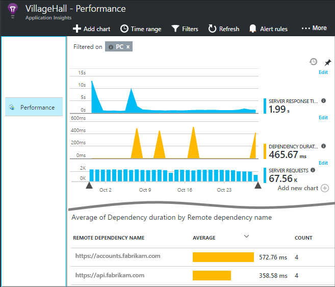
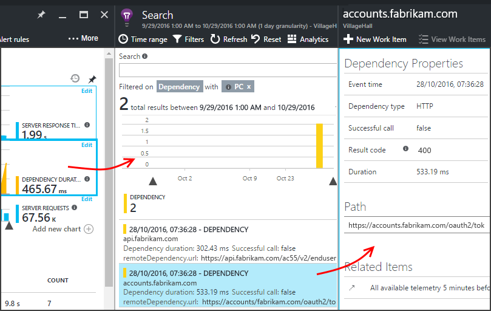
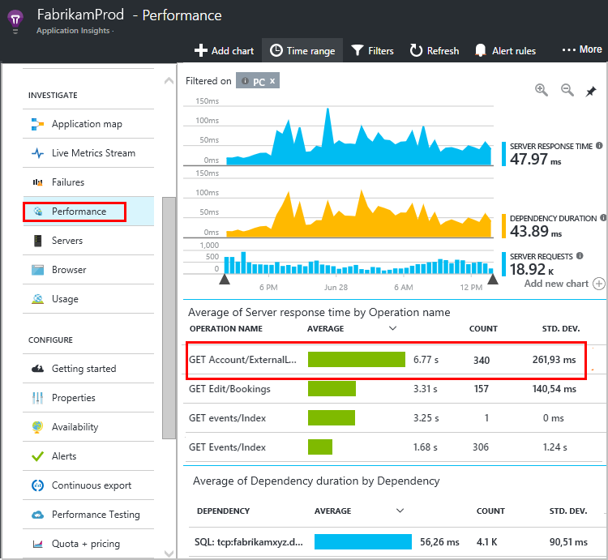
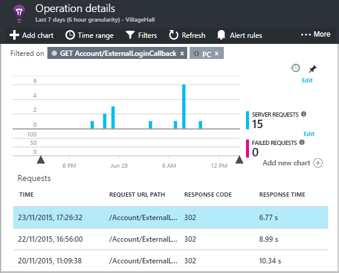
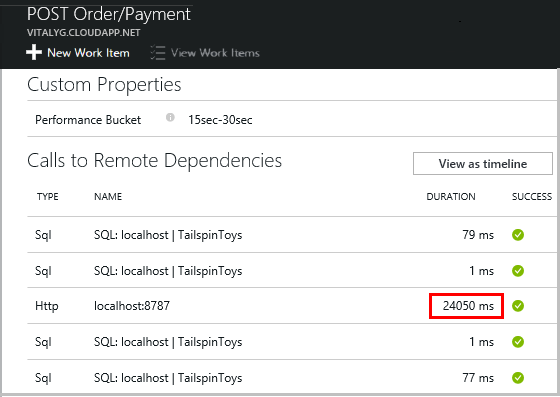
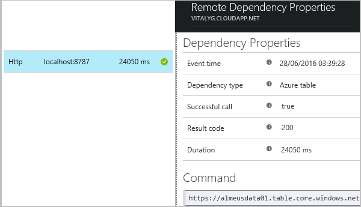
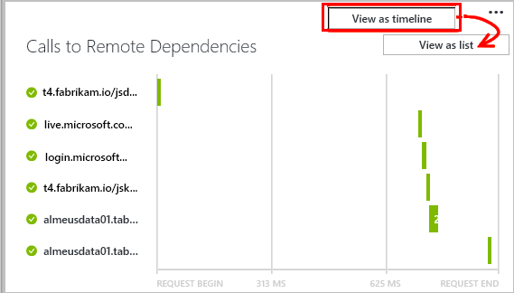
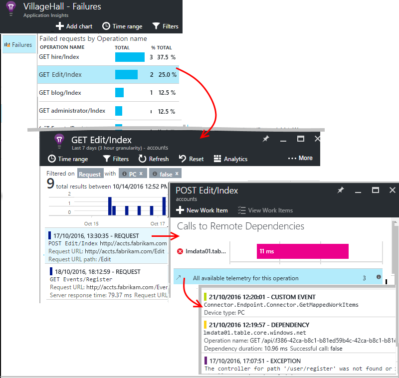

# Dependency Tracking in Azure Application Insights 

A *dependency* is an external component that is called by your app. It's typically a service called using HTTP, or a database, or a file system. [Application Insights](../../azure-monitor/app/app-insights-overview.md) measures the duration of dependency calls, whether its failing or not, along with additional information like name of dependency and so on. You can investigate specific dependency calls, and correlate them to requests and exceptions.

## Automatically tracked dependencies

Application Insights SDKs for .NET and .NET Core ships with `DependencyTrackingTelemetryModule` which is a Telemetry Module that automatically collects dependencies. This dependency collection is enabled automatically for [ASP.NET](https://docs.microsoft.com/azure/azure-monitor/app/asp-net) and [ASP.NET Core](https://docs.microsoft.com/azure/azure-monitor/app/asp-net-core) applications, when configured as per the linked official docs. `DependencyTrackingTelemetryModule` is shipped as [this](https://www.nuget.org/packages/Microsoft.ApplicationInsights.DependencyCollector/) NuGet package, and is brought automatically when using either of the NuGet packages `Microsoft.ApplicationInsights.Web` or `Microsoft.ApplicationInsights.AspNetCore`.

 `DependencyTrackingTelemetryModule` currently tracks the following dependencies automatically:

|Dependencies |Details|
|---------------|-------|
|Http/Https | Local or Remote http/https calls |
|WCF calls| Only tracked automatically if Http-based bindings are used.|
|SQL | Calls made with `SqlClient`. See [this](##advanced-sql-tracking-to-get-full-sql-query) for capturing SQL query .  |
|[Azure storage (Blob, Table, Queue )](https://www.nuget.org/packages/WindowsAzure.Storage/) | Calls made with Azure Storage Client. |
|[EventHub Client SDK](https://www.nuget.org/packages/Microsoft.Azure.EventHubs) | Version 1.1.0 and above. |
|[ServiceBus Client SDK](https://www.nuget.org/packages/Microsoft.Azure.ServiceBus)| Version 3.0.0 and above. |
|Azure Cosmos DB | Only tracked automatically if HTTP/HTTPS is used. TCP mode won't be captured by Application Insights. |


## Setup automatic dependency tracking in Console Apps

To automatically track dependencies from .NET/.NET Core console apps, install the Nuget package `Microsoft.ApplicationInsights.DependencyCollector`, and initialize `DependencyTrackingTelemetryModule` as follows:

```csharp
    DependencyTrackingTelemetryModule depModule = new DependencyTrackingTelemetryModule();
    depModule.Initialize(TelemetryConfiguration.Active);
```

### How automatic dependency monitoring works?

Dependencies are automatically collected by using one of the following techniques:

* Using byte code instrumentation around select methods. (InstrumentationEngine either from StatusMonitor or Azure Web App Extension)
* EventSource callbacks
* DiagnosticSource callbacks (in the latest .NET/.NET Core SDKs)

## Manually tracking dependencies

The following are some examples of dependencies, which aren't automatically collected, and hence require manual tracking.

* Azure Cosmos DB is tracked automatically only if [HTTP/HTTPS](../../cosmos-db/performance-tips.md#networking) is used. TCP mode won't be captured by Application Insights.
* Redis

For those dependencies not automatically collected by SDK, you can track them manually using the [TrackDependency API](api-custom-events-metrics.md#trackdependency) that is used by the standard auto collection modules.

For example, if you build your code with an assembly that you didn't write yourself, you could time all the calls to it, to find out what contribution it makes to your response times. To have this data displayed in the dependency charts in Application Insights, send it using `TrackDependency`.

```csharp

    var startTime = DateTime.UtcNow;
    var timer = System.Diagnostics.Stopwatch.StartNew();
    try
    {
        // making dependency call
        success = dependency.Call();
    }
    finally
    {
        timer.Stop();
        telemetryClient.TrackDependency("myDependencyType", "myDependencyCall", "myDependencyData",  startTime, timer.Elapsed, success);
    }
```

Alternatively, `TelemetryClient` provides extension methods `StartOperation` and `StopOperation` which can be used to manually track dependencies, as shown [here](custom-operations-tracking.md#outgoing-dependencies-tracking)

If you want to switch off the standard dependency tracking module, remove the reference to DependencyTrackingTelemetryModule in [ApplicationInsights.config](../../azure-monitor/app/configuration-with-applicationinsights-config.md) for ASP.NET applications. For ASP.NET Core applications, follow instructions [here](asp-net-core.md#configuring-or-removing-default-telemetrymodules).

## Tracking AJAX calls from Web Pages

For web pages, Application Insights JavaScript SDK automatically collects AJAX calls as dependencies as described [here](javascript.md#ajax-performance). This document focuses on dependencies from server components.

## Advanced SQL tracking to get full SQL Query

For SQL calls, the name of the server and database is always collected and stored as name of the collected `DependencyTelemetry`. There's an additional field called 'data', which can contain the full SQL query text.

For ASP.NET Core applications, there's no additional step required to get the full SQL Query.

For ASP.NET applications, full SQL query is collected with the help of byte code instrumentation, which requires instrumentation engine. Additional platform-specific steps, as described below, are required.

| Platform | Step(s) Needed to get full SQL Query |
| --- | --- |
| Azure Web App |In your web app control panel, [open the Application Insights blade](../../azure-monitor/app/azure-web-apps.md) and enable SQL Commands under .NET |
| IIS Server (Azure VM, on-prem, and so on.) | [Install Status Monitor on your server where application is running](../../azure-monitor/app/monitor-performance-live-website-now.md) and restart IIS.
| Azure Cloud Service |[Use startup task](../../azure-monitor/app/cloudservices.md) to [Install Status Monitor](monitor-performance-live-website-now.md#download) |
| IIS Express | Not supported

In the above cases, the correct way of validating that instrumentation engine is correctly installed is by validating that the SDK version of collected `DependencyTelemetry` is 'rddp'. 'rdddsd' or 'rddf' indicates dependencies are collected via DiagnosticSource or EventSource callbacks, and hence full SQL query won't be captured.

## Where to find dependency data

* [Application Map](#application-map) visualizes dependencies between your app and neighboring components.
* [Performance, browser, and failure blades](#performance-and-failure-blades) show server dependency data.
* [Browsers blade](#ajax-calls) shows AJAX calls from your users' browsers.
* Click through from slow or failed requests to check their dependency calls.
* [Analytics](#analytics) can be used to query dependency data.

## Application Map

Application Map acts as a visual aid to discovering dependencies between the components of your application. It is automatically generated from the telemetry from your app. This example shows AJAX calls from the browser scripts and REST calls from the server app to two external services.


* **Navigate from the boxes** to relevant dependency and other charts.
* **Pin the map** to the [dashboard](../../azure-monitor/app/app-insights-dashboards.md), where it will be fully functional.

[Learn more](../../azure-monitor/app/app-map.md).

## Performance and failure blades

The performance blade shows the duration of dependency calls made by the server app. There's a summary chart and a table segmented by call.



Click through the summary charts or the table items to search raw occurrences of these calls.



**Failure counts** are shown on the **Failures** blade. A failure is any return code that is not in the range 200-399, or unknown.

## AJAX Calls

The Browsers blade shows the duration and failure rate of AJAX calls from [JavaScript in your web pages](../../azure-monitor/app/javascript.md). They are shown as Dependencies.

## <a name="diagnosis"></a> Diagnose slow requests

Each request event is associated with the dependency calls, exceptions and other events that are tracked while your app is processing the request. So if some requests are doing badly, you can find out whether it's because of slow responses from a dependency.

Let's walk through an example of that.

### Tracing from requests to dependencies

Open the Performance blade, and look at the grid of requests:



The top one is taking long. Let's see if we can find out where the time is spent.

Click that row to see individual request events:



Click any long-running instance to inspect it further, and scroll down to the remote dependency calls related to this request:



It looks like most of the time servicing this request was spent in a call to a local service.

Select that row to get more information:



Looks like this dependency is where the problem is. We've pinpointed the problem, so now we just need to find out why that call is taking so long.

### Request timeline

In a different case, there is no dependency call that is particularly long. But by switching to the timeline view, we can see where the delay occurred in our internal processing:



There seems to be a large gap after the first dependency call, so we should look at our code to see why that is.

### Profile your live site

No idea where the time goes? The [Application Insights profiler](../../azure-monitor/app/profiler.md) traces HTTP calls to your live site and shows you the functions in your code that took the longest time.

## Failed requests

Failed requests might also be associated with failed calls to dependencies. Again, we can click through to track down the problem.


Click through to an occurrence of a failed request, and look at its associated events.



## Analytics

You can track dependencies in the [Kusto query language](/azure/kusto/query/). Here are some examples.

* Find any failed dependency calls:

```

    dependencies | where success != "True" | take 10
```

* Find AJAX calls:

```

    dependencies | where client_Type == "Browser" | take 10
```

* Find dependency calls associated with requests:

```

    dependencies
    | where timestamp > ago(1d) and  client_Type != "Browser"
    | join (requests | where timestamp > ago(1d))
      on operation_Id  
```


* Find AJAX calls associated with page views:

```

    dependencies
    | where timestamp > ago(1d) and  client_Type == "Browser"
    | join (browserTimings | where timestamp > ago(1d))
      on operation_Id
```

## Video

> [!VIDEO https://channel9.msdn.com/events/Connect/2016/112/player]

## Frequently asked questions

### *How does automatic dependency collector report failed calls to dependencies?*

* Failed dependency calls will have 'success' field set to False. `DependencyTrackingTelemetryModule` does not report `ExceptionTelemetry`. The full data model for dependency is described [here](data-model-dependency-telemetry.md).

## Open-source SDK
Like every Application Insights SDK, dependency collection module is also open-source. Read and contribute to the code, or report issues at [the official GitHub repo](https://github.com/Microsoft/ApplicationInsights-dotnet-server).


## Next steps

* [Exceptions](../../azure-monitor/app/asp-net-exceptions.md)
* [User & page data](../../azure-monitor/app/javascript.md)
* [Availability](../../azure-monitor/app/monitor-web-app-availability.md)
