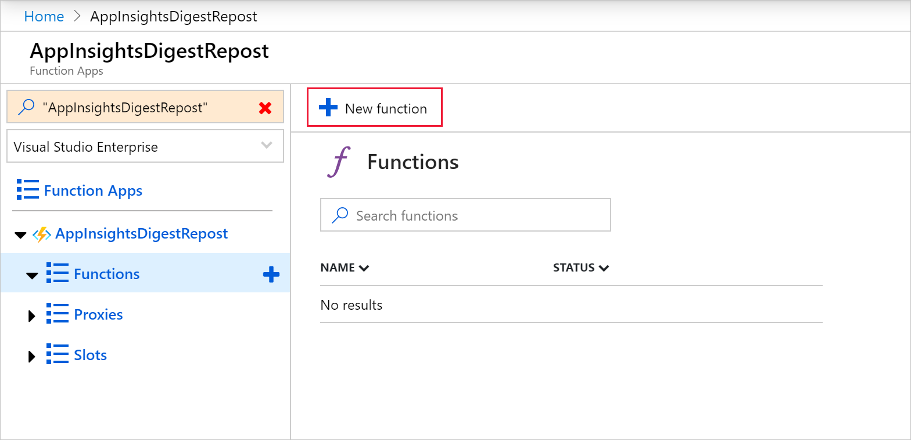
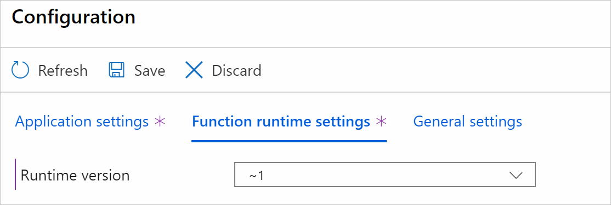
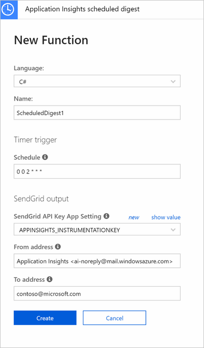
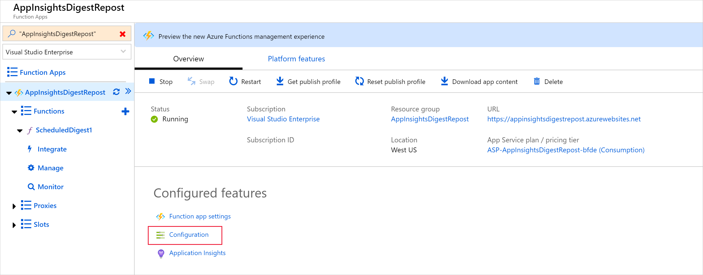
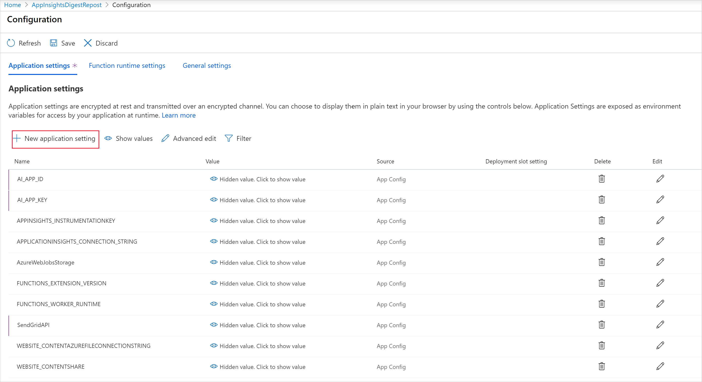
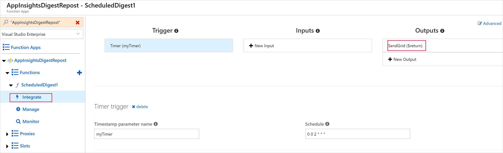
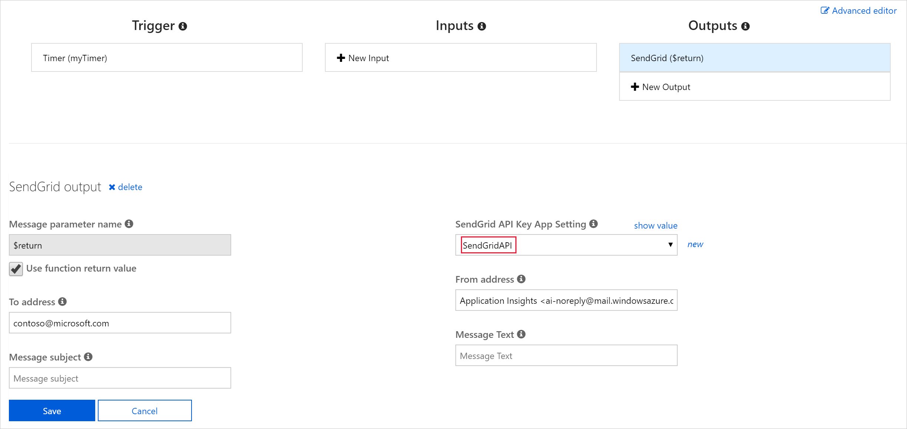
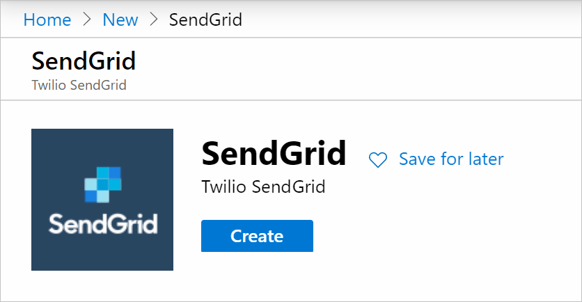

# Automate custom reports with Application Insights data

Periodical reports help keep a team informed on how their business-critical services are doing. Developers, DevOps/SRE teams, and their managers can be productive with automated reports that reliably deliver insights without requiring everyone to sign in to the portal. Such reports can also help identify gradual increases in latencies, load, or failure rates that might not trigger any alert rules.

Each enterprise has its unique reporting needs, such as:

* Specific percentile aggregations of metrics or custom metrics in a report.
* Different reports for daily, weekly, and monthly roll-ups of data for different audiences.
* Segmentation by custom attributes like region or environment.
* AI resources grouped together in a single report, even if they might be in different subscriptions or resource groups.
* Separate reports that contain sensitive metrics sent to selective audiences.
* Reports to stakeholders who might not have access to the portal resources.

> [!NOTE]
> The weekly Application Insights digest email didn't allow any customization and will be discontinued in favor of the custom options listed here. The last weekly digest email was sent on June 11, 2018. Configure one of the following options to get similar custom reports. Use the query that's suggested in this article.

## Automate custom report emails

You can [programmatically query Application Insights](/rest/api/application-insights/) data to generate custom reports on a schedule. The following options can help you get started quickly:

* [Automate reports with Power Automate](../logs/logicapp-flow-connector.md).
* [Automate reports with Azure Logic Apps](automate-with-logic-apps.md).
* Use the **Application Insights scheduled digest** [Azure Functions](../../azure-functions/functions-get-started.md) template in the **Monitoring** scenario. This function uses SendGrid to deliver the email.

    

## Sample query for a weekly digest email
The following query shows joining across multiple datasets for a weekly digest email-like report. Customize it as required and use it with any of the options previously listed to automate a weekly report.

```AIQL
let period=7d;
requests
| where timestamp > ago(period)
| summarize Row = 1, TotalRequests = sum(itemCount), FailedRequests = sum(toint(success == 'False')),
    RequestsDuration = iff(isnan(avg(duration)), '------', tostring(toint(avg(duration) * 100) / 100.0))
| join (
dependencies
| where timestamp > ago(period)
| summarize Row = 1, TotalDependencies = sum(itemCount), FailedDependencies = sum(success == 'False'),
    DependenciesDuration = iff(isnan(avg(duration)), '------', tostring(toint(avg(duration) * 100) / 100.0))
) on Row | join (
pageViews
| where timestamp > ago(period)
| summarize Row = 1, TotalViews = sum(itemCount)
) on Row | join (
exceptions
| where timestamp > ago(period)
| summarize Row = 1, TotalExceptions = sum(itemCount)
) on Row | join (
availabilityResults
| where timestamp > ago(period)
| summarize Row = 1, OverallAvailability = iff(isnan(avg(toint(success))), '------', tostring(toint(avg(toint(success)) * 10000) / 100.0)),
    AvailabilityDuration = iff(isnan(avg(duration)), '------', tostring(toint(avg(duration) * 100) / 100.0))
) on Row
| project TotalRequests, FailedRequests, RequestsDuration, TotalDependencies, FailedDependencies, DependenciesDuration, TotalViews, TotalExceptions, OverallAvailability, AvailabilityDuration
```

## Application Insights scheduled digest report

1. Create an Azure Functions app. Application Insights **On** is required only if you want to monitor your new Azure Functions app with Application Insights.

   See the Azure Functions documentation to learn how to [create a function app](../../azure-functions/functions-get-started.md).

1. After your new Azure Functions app has finished deployment, select **Go to resource**.

1. Select **New function**.

   

1. Select the **Application Insights scheduled digest** template.

     > [!NOTE]
     > By default, function apps are created with runtime version 3.x. You must [target Azure Functions runtime version](../../azure-functions/set-runtime-version.md) **1.x** to use the Application Insights scheduled digest template. Go to **Configuration** > **Function runtime settings** to change the runtime version. 

   

1. Enter an appropriate recipient email address for your report and select **Create**.

   

1. Select **Function Apps** > **Platform features** > **Configuration**.

    

1. Create three new application settings with the appropriate corresponding values ``AI_APP_ID``, ``AI_APP_KEY``, and ``SendGridAPI``. Select **Save**.

     
    
    You can find the AI_ values under **API Access** for the Application Insights resource you want to report on. If you don't have an Application Insights API key, use the **Create API Key** option.
    
   * AI_APP_ID = Application ID
   * AI_APP_KEY = API Key
   * SendGridAPI =SendGrid API Key

     > [!NOTE]
     > If you don't have a SendGrid account, you can create one. For more information, see [Azure Functions SendGrid bindings](../../azure-functions/functions-bindings-sendgrid.md) for the SendGrid documentation for Azure Functions. If you want a brief explanation of how to set up SendGrid and generate an API key, one is provided at the end of this article.

1. Select **Integrate**. Under **Outputs**, select **SendGrid ($return)**.

     

1. Under the **SendGridAPI Key App Setting**, select your newly created app setting **SendGridAPI**.

     

1. Run and test your function app.

     

1. Check your email to confirm that the message was sent or received successfully.

     

## SendGrid with Azure

These steps only apply if you don't already have a SendGrid account configured.

1. On the Azure portal, select **Create a resource**. Search for **SendGrid Email Delivery** and select **Create**. Fill out the SendGrid instructions.

     

1. Under **SendGrid Accounts**, select **Manage**.

     

1. This action opens SendGrid's site. Select **Settings** > **API Keys**.

     

1. To create an API key, select **Create & View**. Review SendGrid's documentation on restricted access to determine what level of permissions is appropriate for your API key. **Full Access** is selected here only as an example.

   

1. Copy the entire key. This value is what you need in your function app settings as the value for `SendGridAPI`.

   

## Next steps

* Learn more about creating [Analytics queries](../logs/get-started-queries.md).
* Learn more about [programmatically querying Application Insights data](/rest/api/application-insights/)
* Learn more about [Logic Apps](../../logic-apps/logic-apps-overview.md).
* Learn more about [Power Automate](https://make.powerautomate.com).
