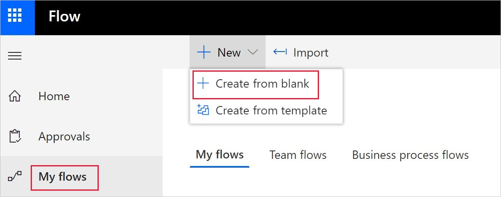
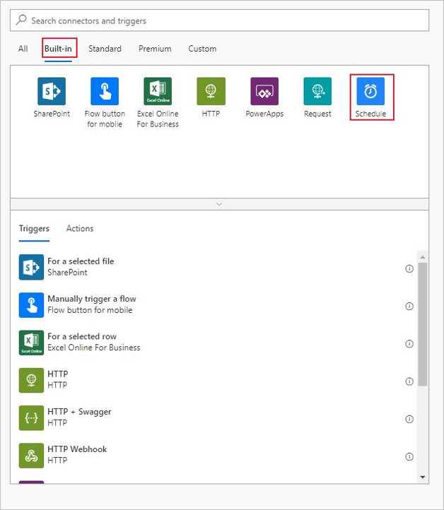
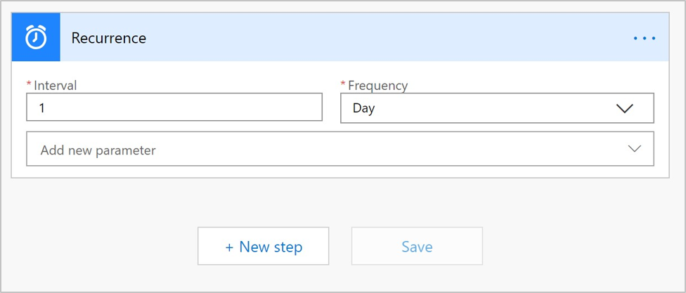
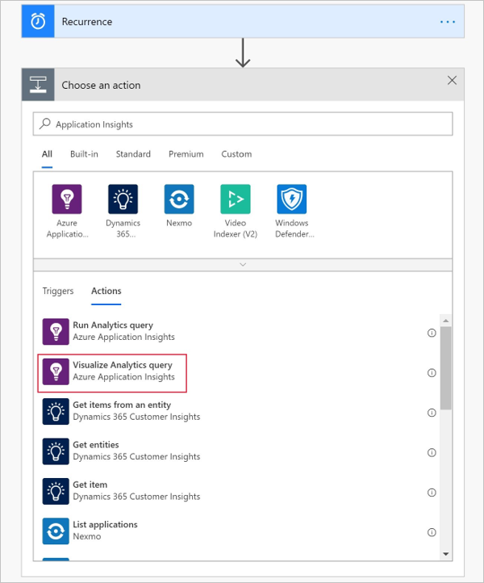
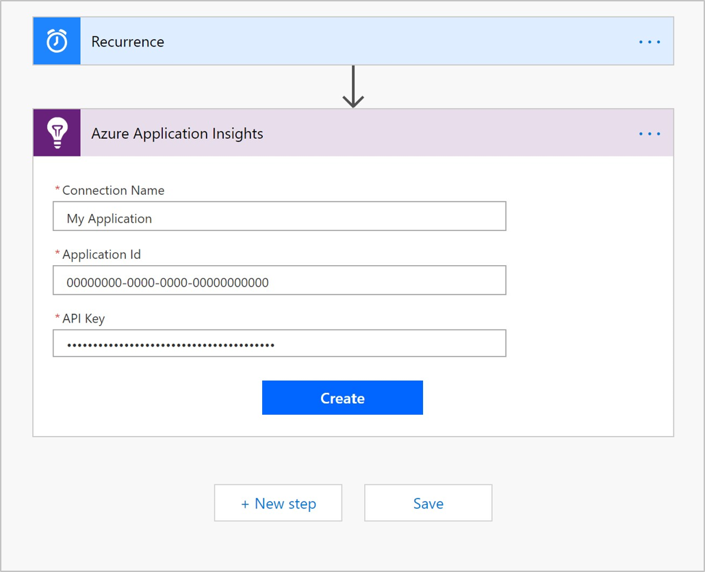
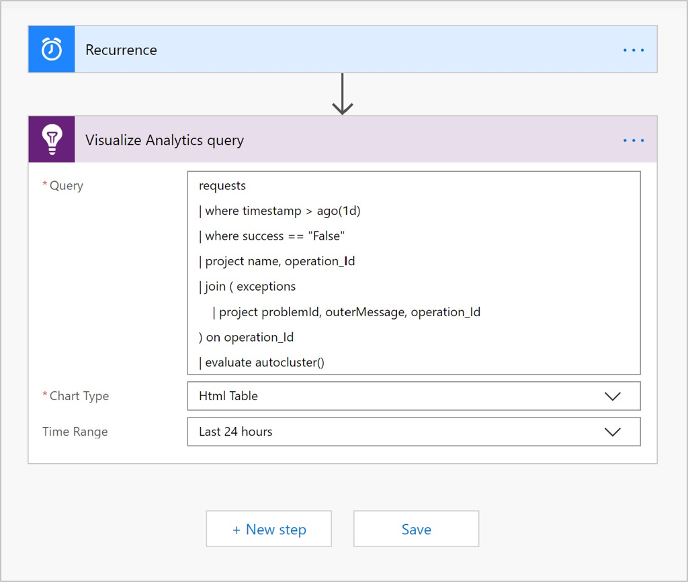
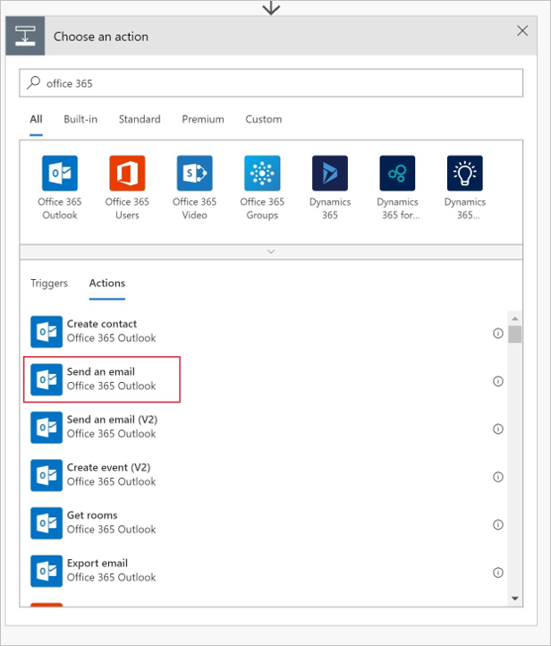
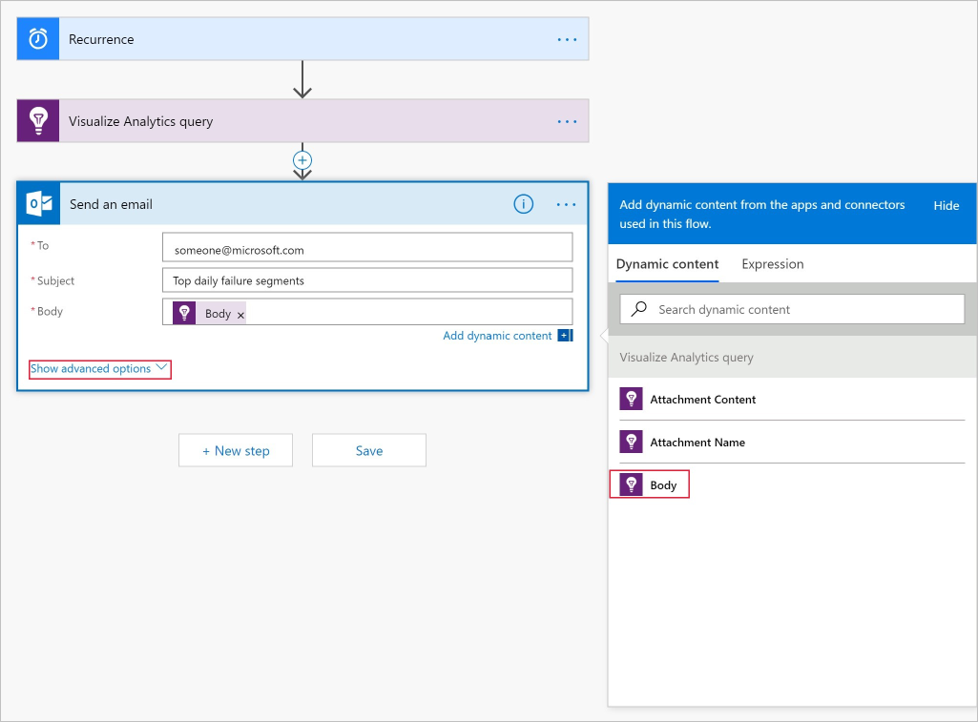
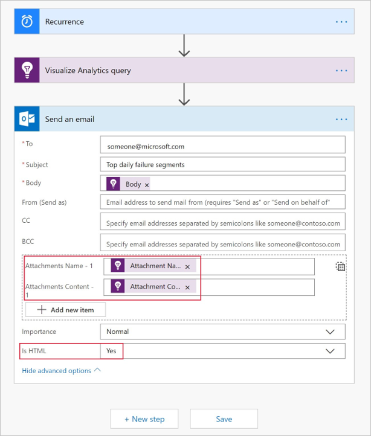
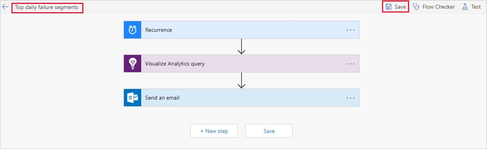

# Automate Azure Application Insights processes with the connector for Microsoft Flow

Do you find yourself repeatedly running the same queries on your telemetry data to check that your service is functioning properly? Are you looking to automate these queries for finding trends and anomalies and then build your own workflows around them? The Azure Application Insights connector for Microsoft Flow is the right tool for these purposes.

With this integration, you can now automate numerous processes without writing a single line of code. After you create a flow by using an Application Insights action, the flow automatically runs your Application Insights Analytics query. 

You can add additional actions as well. Microsoft Flow makes hundreds of actions available. For example, you can use Microsoft Flow to automatically send an email notification or create a bug in Azure DevOps. You can also use one of the many [templates](https://ms.flow.microsoft.com/en-us/connectors/shared_applicationinsights/?slug=azure-application-insights) that are available for the connector for Microsoft Flow. These templates speed up the process of creating a flow. 

<!--The Application Insights connector also works with [Azure Power Apps](https://powerapps.microsoft.com/en-us/) and [Azure Logic Apps](https://azure.microsoft.com/services/logic-apps/?v=17.23h). --> 

## Create a flow for Application Insights

In this tutorial, you will learn how to create a flow that uses the Analytics auto-cluster algorithm to group attributes in the data for a web application. The flow automatically sends the results by email, just one example of how you can use Microsoft Flow and Application Insights Analytics together. 

### Step 1: Create a flow
1. Sign in to [Microsoft Flow](https://flow.microsoft.com), and then select **My Flows**.
2. Click **New** then **Create from blank**.

    

### Step 2: Create a trigger for your flow
1. In the Build-in tab select **Schedule**, and then select **Schedule - Recurrence**.

    

1. In the **Interval** box, enter **1**, and in the **Frequency** box, select **Day**.
2. Click **New step**

    


### Step 3: Add an Application Insights action
1. Search for **Azure Application Insights**.
2. Click **Azure Application Insights - Visualize Analytics query**.
 
    

### Step 4: Connect to an Application Insights resource

To complete this step, you need an application ID and an API key for your resource. You can retrieve them from the Azure portal, as shown in the following diagram:


- Provide a name for your connection, along with the application ID and API key.

    

### Step 5: Specify the Analytics query and chart type
This example query selects the failed requests within the last day and correlates them with exceptions that occurred as part of the operation. Analytics correlates them based on the operation_Id identifier. The query then segments the results by using the autocluster algorithm. 

When you create your own queries, verify that they are working properly in Analytics before you add it to your flow.

- Add the following Analytics query, and select the HTML table chart type. Then select **New step**.

    ```
    requests
    | where timestamp > ago(1d)
    | where success == "False"
    | project name, operation_Id
    | join ( exceptions
        | project problemId, outerMessage, operation_Id
    ) on operation_Id
    | evaluate autocluster()
    ```
    
    

### Step 6: Configure the flow to send email

1. Search for **Office 365 Outlook**.
2. Click **Office 365 Outlook - Send an email**.

    

1. In the **Send an email** window, do the following:

   a. Type the email address of the recipient.

   b. Type a subject for the email.

   c. Click anywhere in the **Body** box and then, on the dynamic content menu that opens at the right, select **Body**.

   d. Click **Show advanced options**.

    

1. On the dynamic content menu, do the following:

    a. Select **Attachment Name**.

    b. Select **Attachment Content**.
    
    c. In the **Is HTML** box, select **Yes**.

    

### Step 7: Save and test your flow
- In the **Flow name** box, add a name for your flow, and then click **Save**.

    

You can wait for the trigger to run this action, or you can run the flow immediately by [running the trigger on demand](https://flow.microsoft.com/blog/run-now-and-six-more-services/).

When the flow runs, the recipients you have specified in the email list receive an email message that looks like the following:


## Next steps

- Learn more about creating [Analytics queries](../../azure-monitor/log-query/get-started-queries.md).
- Learn more about [Microsoft Flow](https://ms.flow.microsoft.com).


<!--Link references-->


