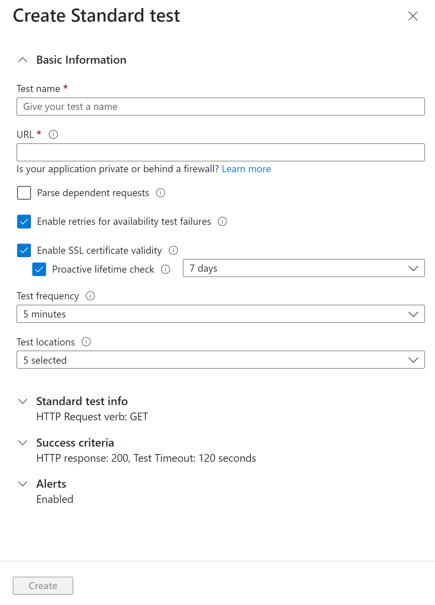
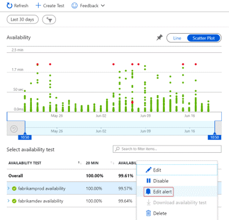
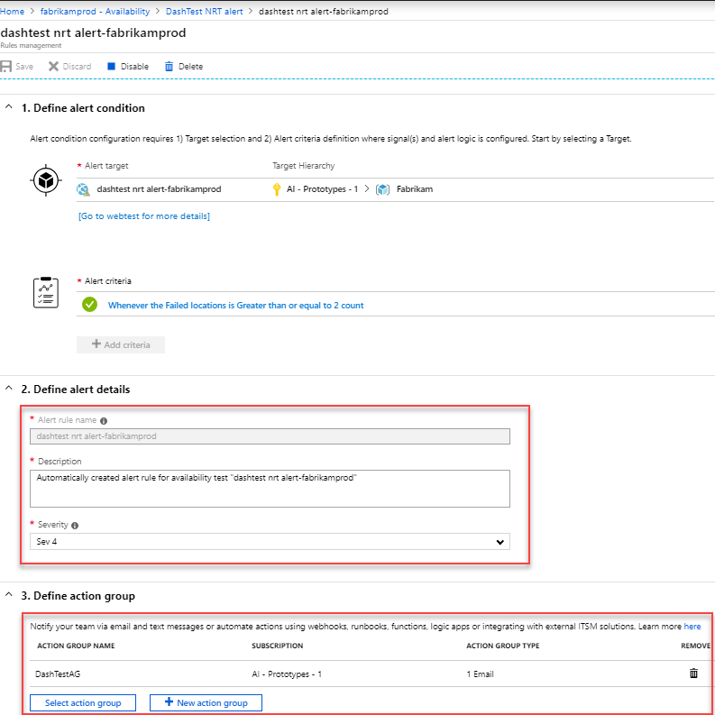
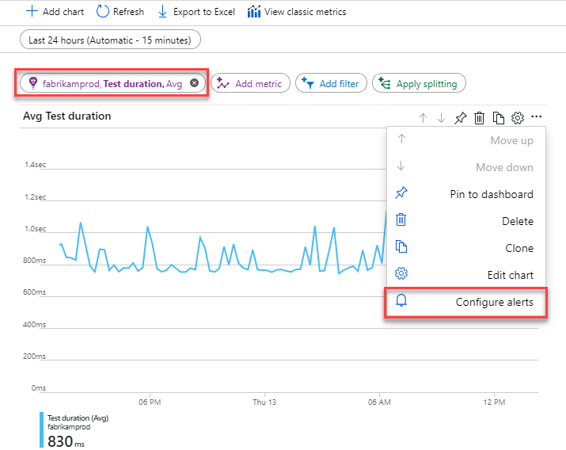

# Availability alerts

[Azure Application Insights](../../azure-monitor/app/app-insights-overview.md) sends web requests to your application at regular intervals from points around the world. It can alert you if your application isn't responding, or if it responds too slowly.

## Enable alerts

Alerts are now automatically enabled by default, but in order to fully configure the alert you first have to initially create your availability test.

> [!NOTE]
>  With the [new unified alerts](https://docs.microsoft.com/azure/monitoring-and-diagnostics/monitoring-overview-unified-alerts), the alert rule severity and notification preferences with [action groups](https://docs.microsoft.com/azure/monitoring-and-diagnostics/monitoring-action-groups) **must be** configured in the alerts experience. Without the following steps, you will only receive in-portal notifications.

1. After saving the availability test, on the details tab click on the ellipsis by the test you just made. Click on "edit alert".

   

2. Set the desired severity level, rule description and most importantly - the action group that has the notification preferences you would like to use for this alert rule.

   

> [!NOTE]
> Availability alerts created through this experience are state-based. This means that when the alert criteria is met a single alert is generated when the site is detected as unavailable. If the site is still down the next time the alert criteria is evaluated this won't generate a new alert. So if your site was down for an hour and you had setup an e-mail alert, you would only receive an e-mail when the site went down, and a subsequent e-mail when the site was back up. You would not receive continuous alerts reminding you that the site was still unavailable.

### Alert on X out of Y locations reporting failures

The X out of Y locations alert rule is enabled by default in the [new unified alerts experience](https://docs.microsoft.com/azure/monitoring-and-diagnostics/monitoring-overview-unified-alerts), when you create a new availability test. You can opt out by selecting the "classic" option or choosing to disable the alert rule.

> [!NOTE]
> Configure the action groups to receive notifications when the alert triggers by following the steps above. Without this step, you will only receive in-portal notifications when the rule triggers.
>

### Alert on availability metrics

Using the [new unified alerts](https://docs.microsoft.com/azure/monitoring-and-diagnostics/monitoring-overview-unified-alerts), you can alert on segmented aggregate availability and test duration metrics as well:

1. Select an Application Insights resource in the Metrics experience, and select an Availability metric:

    

2. Configure alerts option from the menu will take you to the new experience where you can select specific tests or locations to set up alert rule on. You can also configure the action groups for this alert rule here.

### Alert on custom analytics queries

Using the [new unified alerts](https://docs.microsoft.com/azure/monitoring-and-diagnostics/monitoring-overview-unified-alerts), you can alert on [custom log queries](https://docs.microsoft.com/azure/monitoring-and-diagnostics/monitor-alerts-unified-log). With custom queries, you can alert on any arbitrary condition that helps you get the most reliable signal of availability issues. This is also applicable, if you are sending custom availability results using the TrackAvailability SDK.

> [!Tip]
> The metrics on availability data include any custom availability results you may be submitting by calling our TrackAvailability SDK. You can use the alerting on metrics support to alert on custom availability results.
>

## Automate alerts

To automate this process with Azure Resource Manager templates, refer to the [Create a metric alert with Resource Manager template](../../azure-monitor/platform/alerts-metric-create-templates.md#template-for-an-availability-test-along-with-a-metric-alert) documentation.

## Troubleshooting

Dedicated [troubleshooting article](troubleshoot-availability.md).

## Next steps

* [Multi-step web tests](availability-multistep.md)
* [Url ping web tests](monitor-web-app-availability.md)
