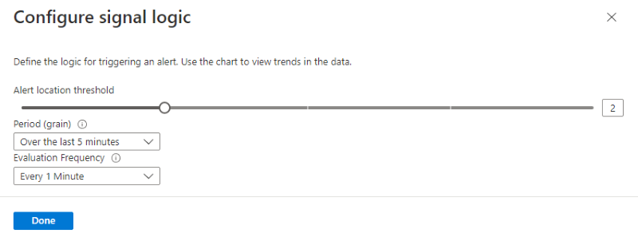
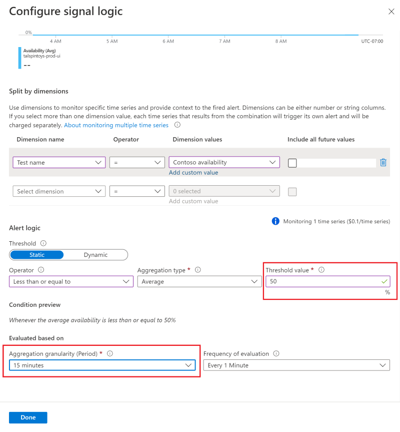

# Availability alerts

[Azure Application Insights](./app-insights-overview.md) sends web requests to your application at regular intervals from points around the world. It can alert you if your application isn't responding, or if it responds too slowly.

## Enable alerts

Alerts are now automatically enabled by default, but in order to fully configure the alert you first have to initially create your availability test.

> [!NOTE]
>  With the [new unified alerts](../alerts/alerts-overview.md), the alert rule severity and notification preferences with [action groups](../alerts/action-groups.md) **must be** configured in the alerts experience. Without the following steps, you will only receive in-portal notifications.

1. After saving the availability test, on the details tab click on the ellipsis by the test you just made. Click on "edit alert".

   

2. Set the desired severity level, rule description and most importantly - the action group that has the notification preferences you would like to use for this alert rule.

   

### Alert frequency

Availability alerts which are created through this experience are state-based. When the alert criteria is met, a single alert gets generated when the website is detected as unavailable. If the website is still down the next time the alert criteria is evaluated, it will not generate a new alert.

For example, if your website is down for an hour and you have set up an e-mail alert with an evaluation frequency of 15 minutes, you will only receive an e-mail when the website goes down, and a subsequent e-mail when it is back up. You will not receive continuous alerts every 15 minutes reminding you that the website is still unavailable.

> [!NOTE]
> If you don't want to receive notifications when your website is down for only a short period of time (e.g. during maintenance) you can change the evaluation frequency to a higher value than the expected downtime, up to 15 minutes. You can also increase the alert location threshold, so it only triggers an alert if the website is down for a certain amount of regions.

To make changes to location threshold, aggregation period, and test frequency, select the condition on the edit page of the alert rule, which will open the **Configure signal logic** window.

> [!TIP]
> For longer downtimes, we recommend to temporarily deactivate the alert rule, or to create a custom rule as shown below. This will give you more options to account for the downtime.

### Custom alert rule

Auto-generated alerts from availability tests have a limited set of options to change the logic. If you need advanced capabilities, you can create a custom alert rule from the **Alerts** tab. Click on **Create** and select **Alert rule**. Choose **Metrics** for **Signal type** to show all available signals, and select **Availability**.

A custom alert rule offers higher values for aggregation period (up to 24 hours instead of 6 hours) and test frequency (up to 1 hour instead of 15 minutes). It also adds options to further define the logic by selecting different operators, aggregation types, and threshold values.

### Alert on X out of Y locations reporting failures

The X out of Y locations alert rule is enabled by default in the [new unified alerts experience](../alerts/alerts-overview.md), when you create a new availability test. You can opt out by selecting the "classic" option or choosing to disable the alert rule.

> [!NOTE]
> Configure the action groups to receive notifications when the alert triggers by following the steps above. Without this step, you will only receive in-portal notifications when the rule triggers.
>

### Alert on availability metrics

Using the [new unified alerts](../alerts/alerts-overview.md), you can alert on segmented aggregate availability and test duration metrics as well:

1. Select an Application Insights resource in the Metrics experience, and select an Availability metric:

    

2. Configure alerts option from the menu will take you to the new experience where you can select specific tests or locations to set up alert rule on. You can also configure the action groups for this alert rule here.

### Alert on custom analytics queries

Using the [new unified alerts](../alerts/alerts-overview.md), you can alert on [custom log queries](../alerts/alerts-unified-log.md). With custom queries, you can alert on any arbitrary condition that helps you get the most reliable signal of availability issues. This is also applicable, if you are sending custom availability results using the TrackAvailability SDK.

> [!Tip]
> The metrics on availability data include any custom availability results you may be submitting by calling our TrackAvailability SDK. You can use the alerting on metrics support to alert on custom availability results.
>

## Automate alerts

To automate this process with Azure Resource Manager templates, refer to the [Create a metric alert with Resource Manager template](../alerts/alerts-metric-create-templates.md#template-for-an-availability-test-along-with-a-metric-alert) documentation.

## Troubleshooting

Dedicated [troubleshooting article](troubleshoot-availability.md).

## Next steps

* [Multi-step web tests](availability-multistep.md)
* [Url ping web tests](monitor-web-app-availability.md)

