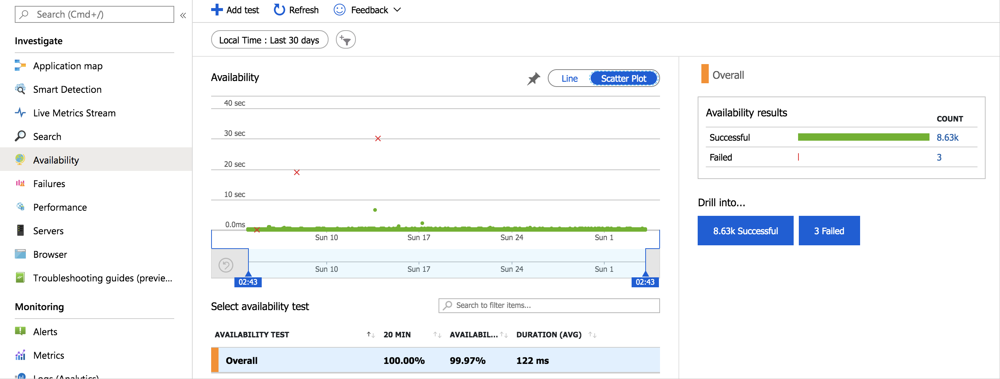

# Create and run custom availability tests using Azure Functions

This article will cover how to create an Azure Function with TrackAvailability() that will run periodically according to the configuration given in TimerTrigger function. The results of this test will be sent to your Application Insights resource, where you will be able to query for and alert on the availability results data. This allows you to create customized tests similar to what you can do via [Availability Monitoring](../../azure-monitor/app/monitor-web-app-availability.md) in the portal. Customized tests will allow you to write more complex availability tests than is possible using the portal UI, monitor an app inside of your Azure VNET, change the endpoint address, or create an availability test even if this feature is not available in your region.


## Create timer triggered function

- If you have an Application Insights Resource:
    - By default Azure Functions creates an Application Insights resource but if you would like to use one of your already created resources you will need to specify that during creation.
    - Follow the instructions on how to [create an Azure Functions resource and Timer triggered function](https://docs.microsoft.com/azure/azure-functions/functions-create-scheduled-function) (stop before clean up) with the following choices.
        -  Click the Application Insights section before selecting **Create**.

            

        - Click **Select existing resource** and type the name of your resource. Select **Apply**

            

        - Select **Create**
- If you do not have an Application Insights Resource created yet for your timer triggered function:
    - By default when you are creating your Azure Functions application it will create an Application Insights resource for you.
    - Follow the instructions on how to [create an Azure Functions resource and Timer triggered function](https://docs.microsoft.com/azure/azure-functions/functions-create-scheduled-function) (stop before clean-up).

## Sample code

Copy the code below into the run.csx file (this will replace the pre-existing code). To do this, go into your Azure Functions application and select your timer trigger function on the left.


> [!NOTE]
> For the Endpoint Address you would use: `EndpointAddress= https://dc.services.visualstudio.com/v2/track`. Unless your resource is located in a region like Azure Government or Azure China in which case consult this article on [overriding the default endpoints](https://docs.microsoft.com/azure/azure-monitor/app/custom-endpoints#regions-that-require-endpoint-modification) and select the appropriate Telemetry Channel endpoint for your region.

```C#
using System;
using System.Diagnostics;
using System.Net.Http;
using System.Threading.Tasks;
using Microsoft.ApplicationInsights;
using Microsoft.ApplicationInsights.DataContracts;
using Microsoft.ApplicationInsights.Extensibility;
using Microsoft.ApplicationInsights.WindowsServer.TelemetryChannel;
using Microsoft.Azure.WebJobs;
using Microsoft.Azure.WebJobs.Host;
using Microsoft.Extensions.Logging;

// [CONFIGURATION_REQUIRED] configure test timeout accordingly for which your request should run
private static readonly HttpClient HttpClient = new HttpClient { Timeout = TimeSpan.FromSeconds(30) };

// The Application Insights Instrumentation Key can be changed by going to the overview page of your Function App, selecting configuration, and changing the value of the APPINSIGHTS_INSTRUMENTATIONKEY Application setting.
//DO NOT replace the code below with your instrumentation key, the key's value is pulled from the environment variable/application setting key/value pair.
private static readonly string InstrumentationKey = Environment.GetEnvironmentVariable("APPINSIGHTS_INSTRUMENTATIONKEY");

// [CONFIGURATION_REQUIRED] Configure EndpointAddress
private static readonly TelemetryConfiguration TelemetryConfiguration = new TelemetryConfiguration(InstrumentationKey, new ServerTelemetryChannel() { EndpointAddress = "<EndpointAddress>" });
private static readonly TelemetryClient TelemetryClient = new TelemetryClient(TelemetryConfiguration);

[FunctionName("Function")]
public static async void Run([TimerTrigger("0 */5 * * * *")]TimerInfo myTimer, ILogger log)
{
    log.LogInformation($"Entering Run at: {DateTime.Now}");

    if (myTimer.IsPastDue)
    {
        log.LogWarning($"[Warning]: Timer is running late! Last ran at: {myTimer.ScheduleStatus.Last}");
    }

    // [CONFIGURATION_REQUIRED] provide {testName} accordingly for your test function
    string testName = "AvailabilityTestFunction";

    // REGION_NAME is a default environment variable that comes with App Service
    string location = Environment.GetEnvironmentVariable("REGION_NAME");

    // [CONFIGURATION_REQUIRED] configure {uri} and {contentMatch} accordingly for your web app. {uri} is the website that you are testing the availability of, make sure to include http:// ot https:// in your url. If {contentMatch} is present on the page, the test will succeed, otherwise it will fail.  
    await AvailabilityTestRun(
        name: testName,
        location: location,
        uri: "<http://example.com>",
        contentMatch: "<Enter a short string of text that is present  in the body of the page your are testing>",
        log: log
    );
}

private static async Task AvailabilityTestRun(string name, string location, string uri, string contentMatch, ILogger log)
{
    log.LogInformation($"Executing availability test run for {name} at: {DateTime.Now}");

    string operationId = Guid.NewGuid().ToString("N");

    var availability = new AvailabilityTelemetry
    {
        Id = operationId,
        Name = name,
        RunLocation = location,
        Success = false
    };

    var stopwatch = new Stopwatch();
    stopwatch.Start();
    bool isMonitoringFailure = false;

    try
    {
        using (var httpResponse = await HttpClient.GetAsync(uri))
        {
            // add test results to availability telemetry property
            availability.Properties.Add("HttpResponseStatusCode", Convert.ToInt32(httpResponse.StatusCode).ToString());

            // check if response content contains specific text
            string content = httpResponse.Content != null ? await httpResponse.Content.ReadAsStringAsync() : "";
            if (httpResponse.IsSuccessStatusCode && content.Contains(contentMatch))
            {
                availability.Success = true;
                availability.Message = $"Test succeeded with response: {httpResponse.StatusCode}";
                log.LogTrace($"[Verbose]: {availability.Message}");
            }
            else if (!httpResponse.IsSuccessStatusCode)
            {
                availability.Message = $"Test failed with response: {httpResponse.StatusCode}";
                log.LogWarning($"[Warning]: {availability.Message}");
            }
            else
            {
                availability.Message = $"Test content does not contain: {contentMatch}";
                log.LogWarning($"[Warning]: {availability.Message}");
            }
        }
    }
    catch (TaskCanceledException e)
    {
        availability.Message = $"Test timed out: {e.Message}";
        log.LogWarning($"[Warning]: {availability.Message}");
    }
    catch (Exception ex)
    {
        // track exception when unable to determine the state of web app
        isMonitoringFailure = true;
        var exceptionTelemetry = new ExceptionTelemetry(ex);
        exceptionTelemetry.Context.Operation.Id = operationId;
        exceptionTelemetry.Properties.Add("TestName", name);
        exceptionTelemetry.Properties.Add("TestLocation", location);
        exceptionTelemetry.Properties.Add("TestUri", uri);
        TelemetryClient.TrackException(exceptionTelemetry);
        log.LogError($"[Error]: {ex.Message}");

        // optional - throw to fail the function
        throw;
    }
    finally
    {
        stopwatch.Stop();
        availability.Duration = stopwatch.Elapsed;
        availability.Timestamp = DateTimeOffset.UtcNow;

        // do not make an assumption as to the state of the web app when monitoring failures occur
        if (!isMonitoringFailure)
        {
            TelemetryClient.TrackAvailability(availability);
            log.LogInformation($"Availability telemetry for {name} is sent.");
        }

        // call flush to ensure telemetries are sent
        TelemetryClient.Flush();
    }
}
```

On the right under view files, select **Add**. Call the new file **function.proj** with the following configuration.

```C#
<Project Sdk="Microsoft.NET.Sdk">
    <PropertyGroup>
        <TargetFramework>netstandard2.0</TargetFramework>
    </PropertyGroup>
    <ItemGroup>
        <PackageReference Include="Microsoft.ApplicationInsights.AspNetCore" Version="2.6.1" />
    </ItemGroup>
</Project>

```


## Check availability

To make sure everything is working, you can look at the graph in the Availability tab of your Application Insights resource.



When you set up your test using Azure Functions you will notice, that unlike using **Add test** in the Availability tab, the name of your test will not appear and you will not be able to interact with it. The results are visualized but you get a summary view instead of the same detailed view you get when you create an availability test via the portal.

To see the end-to-end transaction details, select **Successful** or **Failed** under drill into, then select a sample. You can also get to the end-to-end transaction details by selecting a data point on the graph.


## Query in Logs (Analytics)

You can use Logs(analytics) to view you availability results, dependencies, and more. To learn more about Logs, visit [Log query overview](../../azure-monitor/log-query/log-query-overview.md).


## Next steps

- [Application Map](../../azure-monitor/app/app-map.md)
- [Transaction diagnostics](../../azure-monitor/app/transaction-diagnostics.md)
