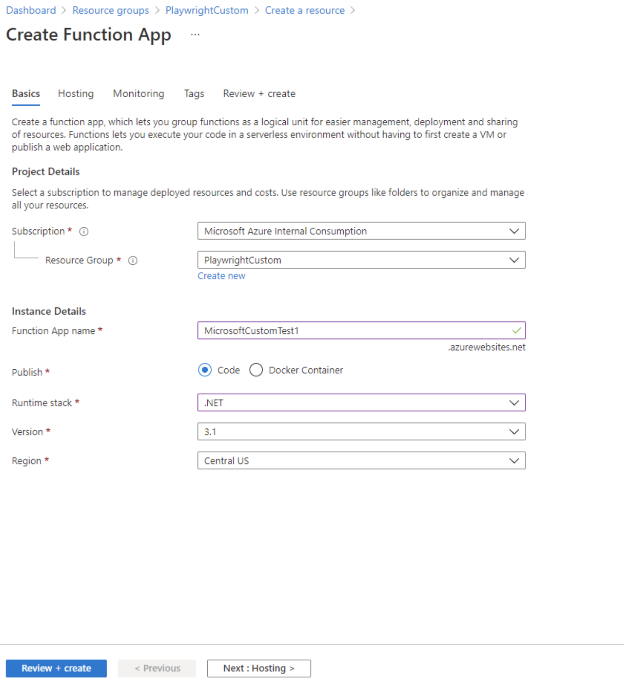
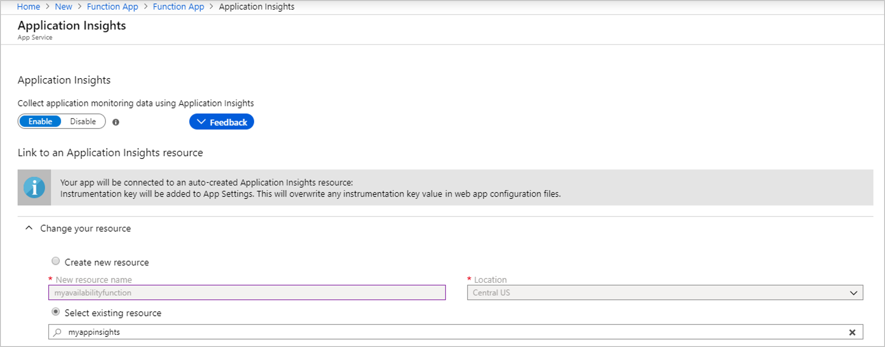
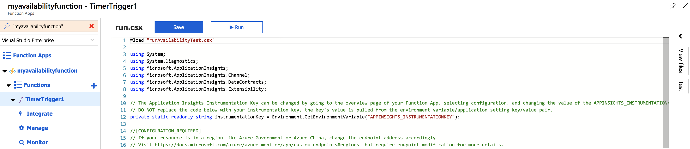
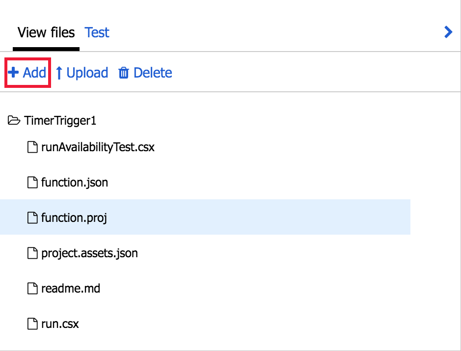
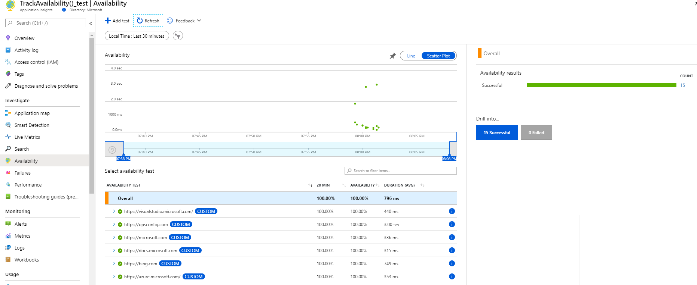
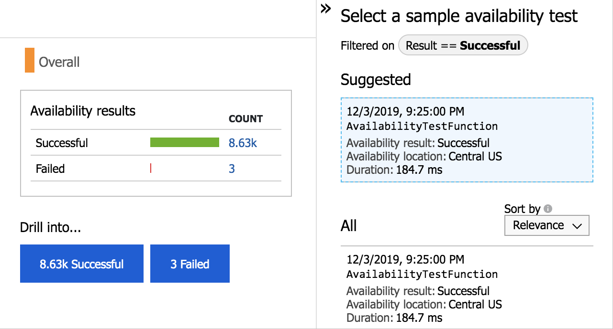
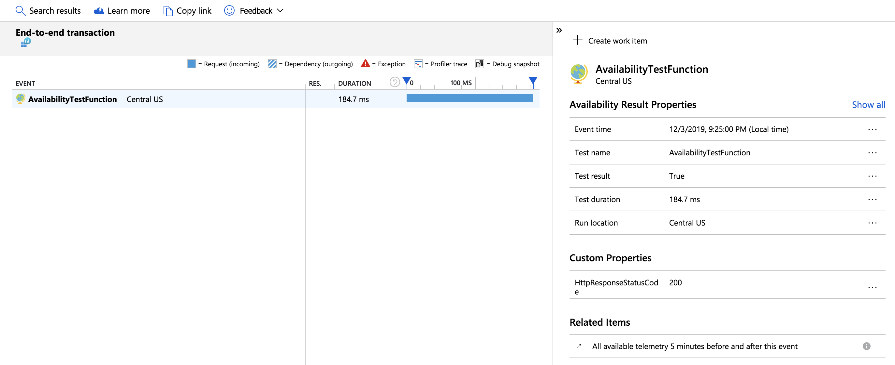
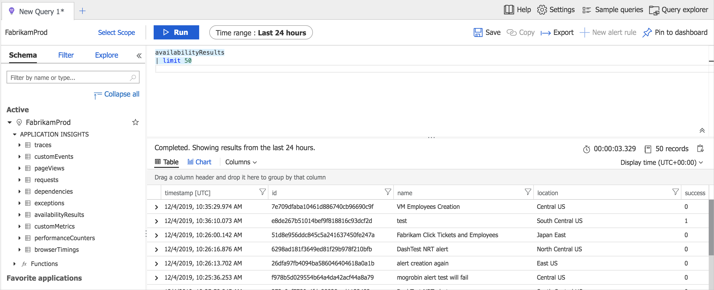
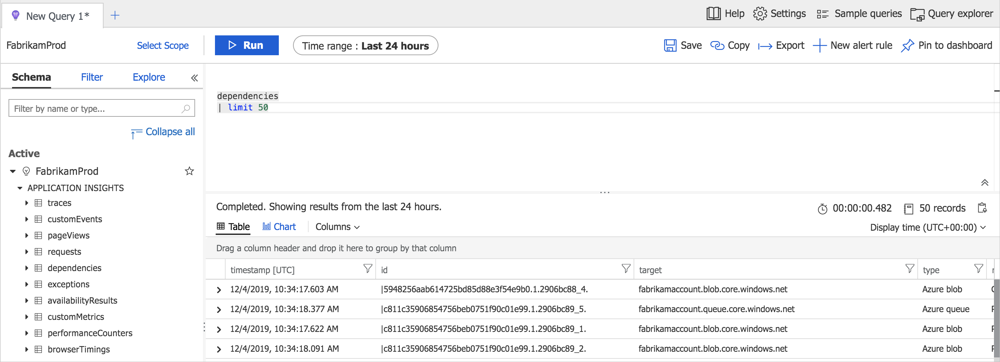

# Create and run custom availability tests using Azure Functions

This article will cover how to create an Azure Function with TrackAvailability() that will run periodically according to the configuration given in TimerTrigger function with your own business logic. The results of this test will be sent to your Application Insights resource, where you will be able to query for and alert on the availability results data. This allows you to create customized tests similar to what you can do via [Availability Monitoring](../../azure-monitor/app/monitor-web-app-availability.md) in the portal. Customized tests will allow you to write more complex availability tests than is possible using the portal UI, monitor an app inside of your Azure VNET, change the endpoint address, or create an availability test even if this feature is not available in your region.

> [!NOTE]
> This example is designed solely to show you the mechanics of how the TrackAvailability() API call works within an Azure Function. Not how to write the underlying HTTP Test code/business logic that would be required to turn this into a fully functional availability test. By default if you walk through this example you will be creating an availability test that will always generate a failure.

## Create timer triggered function

- If you have an Application Insights Resource:
    - By default Azure Functions creates an Application Insights resource but if you would like to use one of your already created resources you will need to specify that during creation.
    - Follow the instructions on how to [create an Azure Functions resource and Timer triggered function](https://docs.microsoft.com/azure/azure-functions/functions-create-scheduled-function) (stop before clean up) with the following choices.
        -  Select the **Monitoring** tab near the top.

            

        - Select the Application Insights dropdown box and type or select the name of your resource.

            

        - Select **Review + create**
- If you do not have an Application Insights Resource created yet for your timer triggered function:
    - By default when you are creating your Azure Functions application it will create an Application Insights resource for you.
    - Follow the instructions on how to [create an Azure Functions resource and Timer triggered function](https://docs.microsoft.com/azure/azure-functions/functions-create-scheduled-function) (stop before clean-up).

## Sample code

Copy the code below into the run.csx file (this will replace the pre-existing code). To do this, go into your Azure Functions application and select your timer trigger function on the left.

>[!div class="mx-imgBorder"]
>

> [!NOTE]
> For the Endpoint Address you would use: `EndpointAddress= https://dc.services.visualstudio.com/v2/track`. Unless your resource is located in a region like Azure Government or Azure China in which case consult this article on [overriding the default endpoints](https://docs.microsoft.com/azure/azure-monitor/app/custom-endpoints#regions-that-require-endpoint-modification) and select the appropriate Telemetry Channel endpoint for your region.

```C#
#load "runAvailabilityTest.csx"
 
using System;
using System.Diagnostics;
using Microsoft.ApplicationInsights;
using Microsoft.ApplicationInsights.Channel;
using Microsoft.ApplicationInsights.DataContracts;
using Microsoft.ApplicationInsights.Extensibility;
 
// The Application Insights Instrumentation Key can be changed by going to the overview page of your Function App, selecting configuration, and changing the value of the APPINSIGHTS_INSTRUMENTATIONKEY Application setting.
// DO NOT replace the code below with your instrumentation key, the key's value is pulled from the environment variable/application setting key/value pair.
private static readonly string instrumentationKey = Environment.GetEnvironmentVariable("APPINSIGHTS_INSTRUMENTATIONKEY");
 
//[CONFIGURATION_REQUIRED]
// If your resource is in a region like Azure Government or Azure China, change the endpoint address accordingly.
// Visit https://docs.microsoft.com/azure/azure-monitor/app/custom-endpoints#regions-that-require-endpoint-modification for more details.
private const string EndpointAddress = "https://dc.services.visualstudio.com/v2/track";
 
private static readonly TelemetryConfiguration telemetryConfiguration = new TelemetryConfiguration(instrumentationKey, new InMemoryChannel { EndpointAddress = EndpointAddress });
private static readonly TelemetryClient telemetryClient = new TelemetryClient(telemetryConfiguration);
 
public async static Task Run(TimerInfo myTimer, ILogger log)
{
    log.LogInformation($"Entering Run at: {DateTime.Now}");
 
    if (myTimer.IsPastDue)
    {
        log.LogWarning($"[Warning]: Timer is running late! Last ran at: {myTimer.ScheduleStatus.Last}");
    }
 
    // [CONFIGURATION_REQUIRED] provide {testName} accordingly for your test function
    string testName = "AvailabilityTestFunction";
 
    // REGION_NAME is a default environment variable that comes with App Service
    string location = Environment.GetEnvironmentVariable("REGION_NAME");
 
    log.LogInformation($"Executing availability test run for {testName} at: {DateTime.Now}");
    string operationId = Guid.NewGuid().ToString("N");
 
    var availability = new AvailabilityTelemetry
    {
        Id = operationId,
        Name = testName,
        RunLocation = location,
        Success = false
    };
 
    var stopwatch = new Stopwatch();
    stopwatch.Start();
 
    try
    {
        await RunAvailbiltyTestAsync(log);
        availability.Success = true;
    }
    catch (Exception ex)
    {
        availability.Message = ex.Message;
 
        var exceptionTelemetry = new ExceptionTelemetry(ex);
        exceptionTelemetry.Context.Operation.Id = operationId;
        exceptionTelemetry.Properties.Add("TestName", testName);
        exceptionTelemetry.Properties.Add("TestLocation", location);
        telemetryClient.TrackException(exceptionTelemetry);
    }
    finally
    {
        stopwatch.Stop();
        availability.Duration = stopwatch.Elapsed;
        availability.Timestamp = DateTimeOffset.UtcNow;
 
        telemetryClient.TrackAvailability(availability);
        // call flush to ensure telemetry is sent
        telemetryClient.Flush();
    }
}

```

On the right under view files, select **Add**. Call the new file **function.proj** with the following configuration.

```C#
<Project Sdk="Microsoft.NET.Sdk">
    <PropertyGroup>
        <TargetFramework>netstandard2.0</TargetFramework>
    </PropertyGroup>
    <ItemGroup>
        <PackageReference Include="Microsoft.ApplicationInsights.AspNetCore" Version="2.8.2" /> <!-- Ensure you’re using the latest version -->
    </ItemGroup>
</Project>

```

>[!div class="mx-imgBorder"]
>

On the right under view files, select **Add**. Call the new file **runAvailabilityTest.csx** with the following configuration.

```C#
public async static Task RunAvailbiltyTestAsync(ILogger log)
{
    // Add your business logic here.
    throw new NotImplementedException();
}

```

## Check availability

To make sure everything is working, you can look at the graph in the Availability tab of your Application Insights resource.

> [!NOTE]
> If you implemented your own business logic in runAvailabilityTest.csx then you will see successful results like in the screenshots below, if you did not then you will see failed results. Tests created with `TrackAvailability()` will appear with **CUSTOM** next to the test name.

>[!div class="mx-imgBorder"]
>

To see the end-to-end transaction details, select **Successful** or **Failed** under drill into, then select a sample. You can also get to the end-to-end transaction details by selecting a data point on the graph.

>[!div class="mx-imgBorder"]
>

>[!div class="mx-imgBorder"]
>

If you ran everything as is (without adding business logic), then you will see that the test failed.

## Query in Logs (Analytics)

You can use Logs(analytics) to view you availability results, dependencies, and more. To learn more about Logs, visit [Log query overview](../../azure-monitor/log-query/log-query-overview.md).

>[!div class="mx-imgBorder"]
>

>[!div class="mx-imgBorder"]
>

## Next steps

- [Application Map](../../azure-monitor/app/app-map.md)
- [Transaction diagnostics](../../azure-monitor/app/transaction-diagnostics.md)
