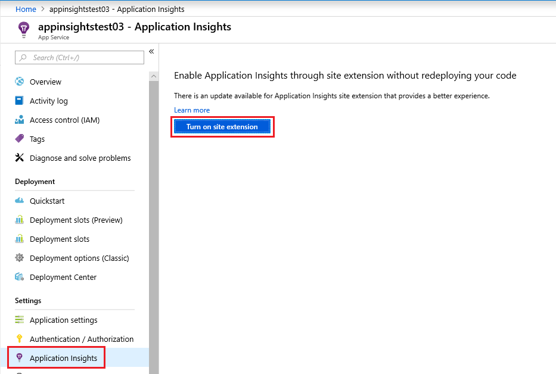
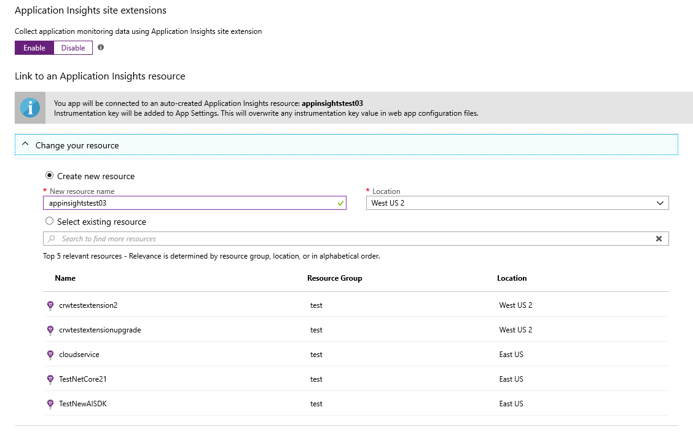

# Monitor Azure App Service performance
In the [Azure portal](https://portal.azure.com) you can set up application performance monitoring for your web apps, mobile back ends, and API apps in [Azure App Service](../../app-service/overview.md). [Azure Application Insights](../../azure-monitor/app/app-insights-overview.md) instruments your app to send telemetry about its activities to the Application Insights service, where it is stored and analyzed. There, metric charts and search tools can be used to help diagnose issues, improve performance, and assess usage.

## Runtime or build time
You can configure monitoring by instrumenting the app in either of two ways:

* **Runtime** - You can select a performance monitoring extension when your app service is already live. It isn't necessary to rebuild or reinstall your app. You get a standard set of packages that monitor response times, success rates, exceptions, dependencies, and so on.

* **Build time** - You can install a package in your app in development. This option is more versatile. In addition to the same standard packages, you can write code to customize the telemetry or to send your own telemetry. You can log specific activities or record events according to the semantics of your app domain. This also gives you the ability to test the latest version of the Application Insights SDK as you can choose to evaluate beta SDKs whereas runtime monitoring is restricted to the latest stable release.

## Runtime instrumentation with Application Insights
If you're currently running an app service in Azure, you already get some monitoring: request and error rates by default. Add Application Insights to get more, such as response times, monitoring calls to dependencies, smart detection, and access to the powerful Kusto query language. 

1. **Select Application Insights** in the Azure control panel for your app service.

    

   * Choose to create a new resource, unless you already set up an Application Insights resource for this application. 

     > [!NOTE]
     > When you click **OK** to create the new resource you will be prompted to **Apply monitoring settings**. Selecting **Continue** will link your new Application Insights resource to your app service, doing so will also **trigger a restart of your app service**. 

     

2. After specifying which resource to use, you can choose how you want application insights to collect data per platform for your application. ASP.NET app monitoring is on-by-default with two different levels of collection.

    

   * .NET **Basic collection** level offers essential single-instance APM capabilities.
    
   * .NET **Recommended collection** level:
       * Adds CPU, memory, and I/O usage trends.
       * Correlates micro-services across request/dependency boundaries.
       * Collects usage trends, and enables correlation from availability results to transactions.
       * Collects exceptions unhandled by the host process.
       * Improves APM metrics accuracy under load, when sampling is used.
    
     .NET Core offers **Recommended collection** or **Disabled** for .NET Core 2.0 and 2.1.

3. **Instrument your app service** after Application Insights has been installed.

   **Enable client-side monitoring** for page view and user telemetry.

    (This is enabled by default for .NET Core apps with **Recommended collection**, regardless of whether the app setting 'APPINSIGHTS_JAVASCRIPT_ENABLED' is present. Granular UI-based support for disabling client-side monitoring is not currently available for .NET Core.)
    
   * Select Settings > Application Settings
   * Under App Settings, add a new key value pair:

     Key: `APPINSIGHTS_JAVASCRIPT_ENABLED`

     Value: `true`
   * **Save** the settings and **Restart** your app.

4. Explore your app's monitoring data by selecting **Settings** > **Application Insights** > **View more in Application Insights**.

Later, you can build the app with Application Insights if you want.

*How do I remove Application Insights, or switch to sending to another resource?*

* In Azure, open the web app control blade, and under Settings, open **Application Insights**. You can turn off Application Insights by clicking **Disable** at the top, or select a new resource in the **Change your resource** section.

## Build the app with Application Insights
Application Insights can provide more detailed telemetry by installing an SDK into your app. In particular, you can collect trace logs, [write custom telemetry](../../azure-monitor/app/api-custom-events-metrics.md), and get more detailed exception reports.

1. **In Visual Studio** (2013 update 2 or later), configure Application Insights for your project.

    Right-click the web project, and select **Add > Application Insights** or **Project** > **Application Insights** > **Configure Application Insights**.

    

    If you're asked to sign in, use the credentials for your Azure account.

    The operation has two effects:

   1. Creates an Application Insights resource in Azure, where telemetry is stored, analyzed, and displayed.
   2. Adds the Application Insights NuGet package to your code (if it isn't there already), and configures it to send telemetry to the Azure resource.
2. **Test the telemetry** by running the app in your development machine (F5).
3. **Publish the app** to Azure in the usual way. 

*How do I switch to sending to a different Application Insights resource?*

* In Visual Studio, right-click the project, choose **Configure Application Insights**, and choose the resource you want. You get the option to create a new resource. Rebuild and redeploy.

## Automate monitoring

In order to enable telemetry collection with Application Insights only the Application settings need to be set:

   

### Application settings definitions

|App setting name |  Definition | Value |
|-----------------|:------------|-------------:|
|ApplicationInsightsAgent_EXTENSION_VERSION | Main extension, which controls runtime monitoring. | `~2` |
|XDT_MicrosoftApplicationInsights_Mode |  In default mode only, essential features are enabled in order to insure optimal performance. | `default` or `recommended`. |
|InstrumentationEngine_EXTENSION_VERSION | Controls if the binary-rewrite engine `InstrumentationEngine` will be turned on. This setting has performance implications and impacts cold start/startup time. | `~1` |
|XDT_MicrosoftApplicationInsights_BaseExtensions | Controls if SQL & Azure table text will be captured along with the dependency calls. Performance warning: this requires the `InstrumentationEngine`. | `~1` |

### App Service Application settings with Azure Resource Manager

Application settings for App Services can be managed and configured with [Azure Resource Manager templates](https://docs.microsoft.com/azure/azure-resource-manager/resource-group-authoring-templates). This method can be used when deploying new App Service resources with Azure Resource Manager automation, or for modifying the settings of existing resources.

The basic structure of the application settings JSON for an app service is below:

```JSON
      "resources": [
        {
          "name": "appsettings",
          "type": "config",
          "apiVersion": "2015-08-01",
          "dependsOn": [
            "[resourceId('Microsoft.Web/sites', variables('webSiteName'))]"
          ],
          "tags": {
            "displayName": "Application Insights Settings"
          },
          "properties": {
            "key1": "value1",
            "key2": "value2"
          }
        }
      ]

```

For an example of an Azure Resource Manager template with Application settings configured for Application Insights this [template](https://github.com/Andrew-MSFT/BasicImageGallery) can be helpful, specifically the section starting on [line 238](https://github.com/Andrew-MSFT/BasicImageGallery/blob/c55ada54519e13ce2559823c16ca4f97ddc5c7a4/CoreImageGallery/Deploy/CoreImageGalleryARM/azuredeploy.json#L238).

### Automate the creation of an Application Insights resource and link to your newly created App Service.

To create an Azure Resource Manager template with all the default Application Insights settings configured, begin the process as if you were going to create a new Web App with Application Insights enabled.

Select **Automation options**

   

This generates the latest Azure Resource Manager template with all required settings configured.

  

> [!NOTE]
> The template will generate application settings in “default” mode. This mode is performance optimized, though you can modify the template to activate whichever features you prefer.

## More telemetry

* [Web page load data](../../azure-monitor/app/javascript.md)
* [Custom telemetry](../../azure-monitor/app/api-custom-events-metrics.md)

## Troubleshooting

### Do I still need to go to Extensions - Add - Application Insights extension for new App Service apps?

No, you no longer need to add the extension manually. Enabling Application Insights via the Settings blade will add all the needed Application settings to enable monitoring. This is now possible, because the files previously added by the extension are now [preinstalled](https://github.com/projectkudu/kudu/wiki/Azure-Site-Extensions) as part of the App Service image. The files are located in `d:\Program Files (x86)\SiteExtensions\ApplicationInsightsAgent`.

### If runtime and build time monitoring are both enabled do I end up with duplicate data?

No, by default if build time monitoring is detected runtime monitoring via the extension will stop sending data and only the build time monitoring configuration will be honored. The determination of whether to disable runtime monitoring is based on detection of any of these three files:

* Microsoft.ApplicationInsights dll
* Microsoft.ASP.NET.TelemetryCorrelation dll
* System.Diagnostics.DiagnosticSource dll

It is important to keep in mind that in many versions of Visual Studio, some or all of these files are added by default to the ASP.NET and ASP.NET Core Visual Studio template files. If your project was created based off of one of the templates even if you haven't explicitly enabled Application Insights, the presence of the file dependency would prevent runtime monitoring from activating.

### APPINSIGHTS_JAVASCRIPT_ENABLED causes incomplete HTML response in NET CORE web applications.

Enabling Javascript via App Services can cause html responses to be cut off.

* Workaround 1: set APPINSIGHTS_JAVASCRIPT_ENABLED Application Setting to false or remove it completely and restart
* Workaround 2: add sdk via code and remove extension (Profiler and Snapshot debugger won't work with this configuration)

To track this issue, go to [Azure extension causing incomplete HTML response](https://github.com/Microsoft/ApplicationInsights-Home/issues/277).

For .NET Core the following are currently **not supported**:

* Self-contained deployment.
* Apps targeting the .NET Framework.
* .NET Core 2.2 applications.

> [!NOTE]
> .NET Core 2.0 and .NET Core 2.1 are supported. When .NET Core 2.2 support is added this article will be updated.

## Next steps
* [Run the profiler on your live app](../../azure-monitor/app/profiler.md).
* [Azure Functions](https://github.com/christopheranderson/azure-functions-app-insights-sample) - monitor Azure Functions with Application Insights
* [Enable Azure diagnostics](../../azure-monitor/platform/diagnostics-extension-to-application-insights.md) to be sent to Application Insights.
* [Monitor service health metrics](../../azure-monitor/platform/data-collection.md) to make sure your service is available and responsive.
* [Receive alert notifications](../../azure-monitor/platform/alerts-overview.md) whenever operational events happen or metrics cross a threshold.
* Use [Application Insights for JavaScript apps and web pages](../../azure-monitor/app/javascript.md) to get client telemetry from the browsers that visit a web page.
* [Set up Availability web tests](../../azure-monitor/app/monitor-web-app-availability.md) to be alerted if your site is down.