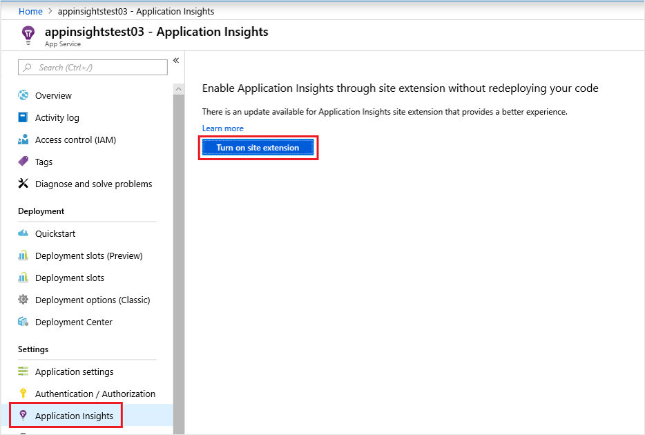
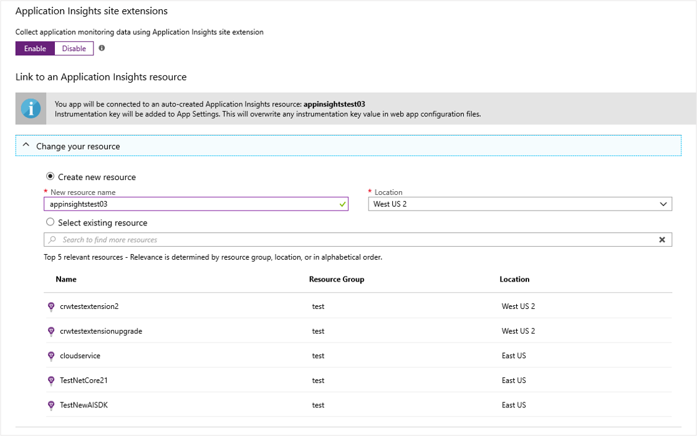
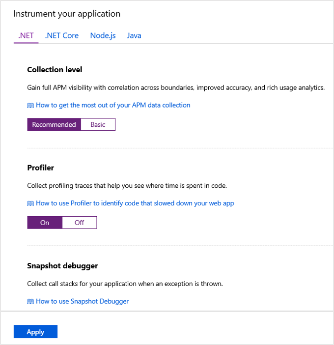
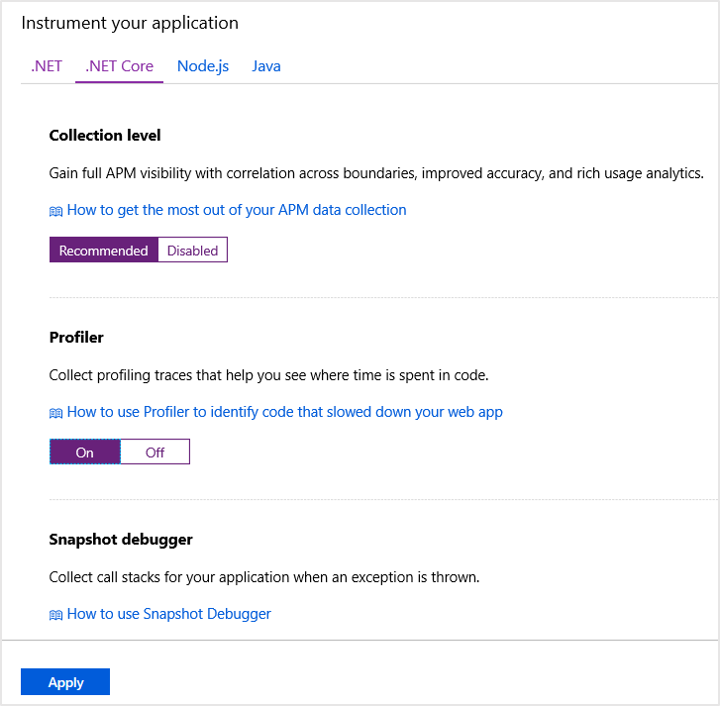
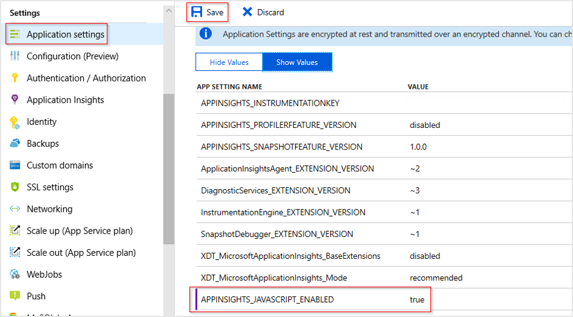
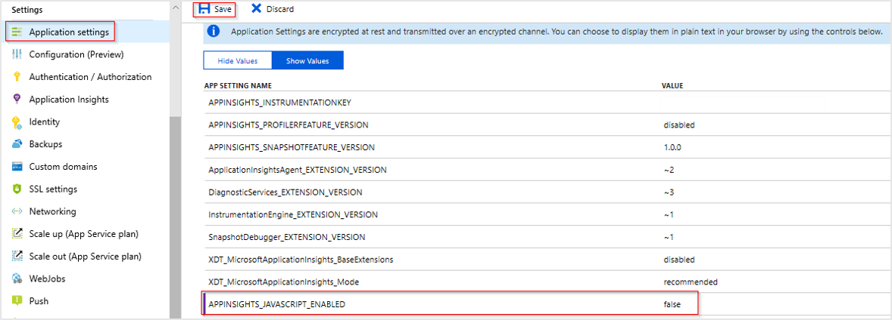
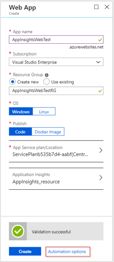
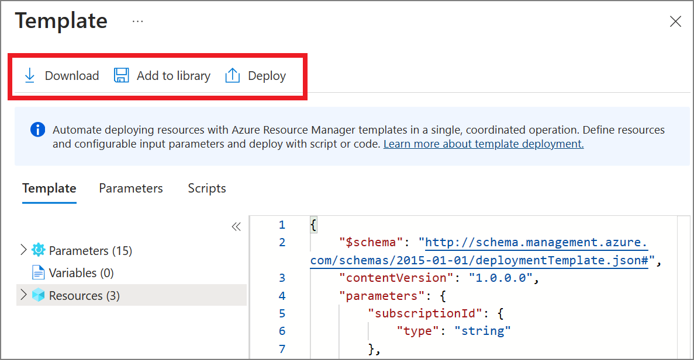
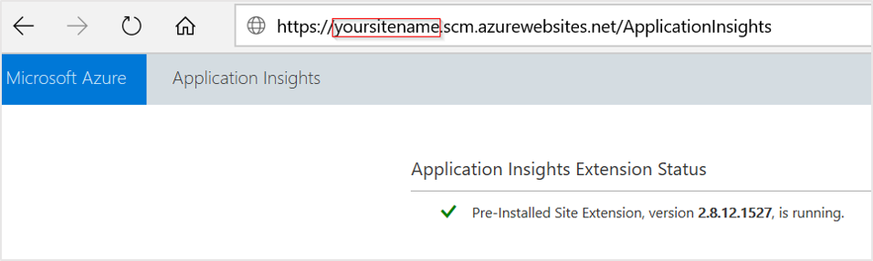
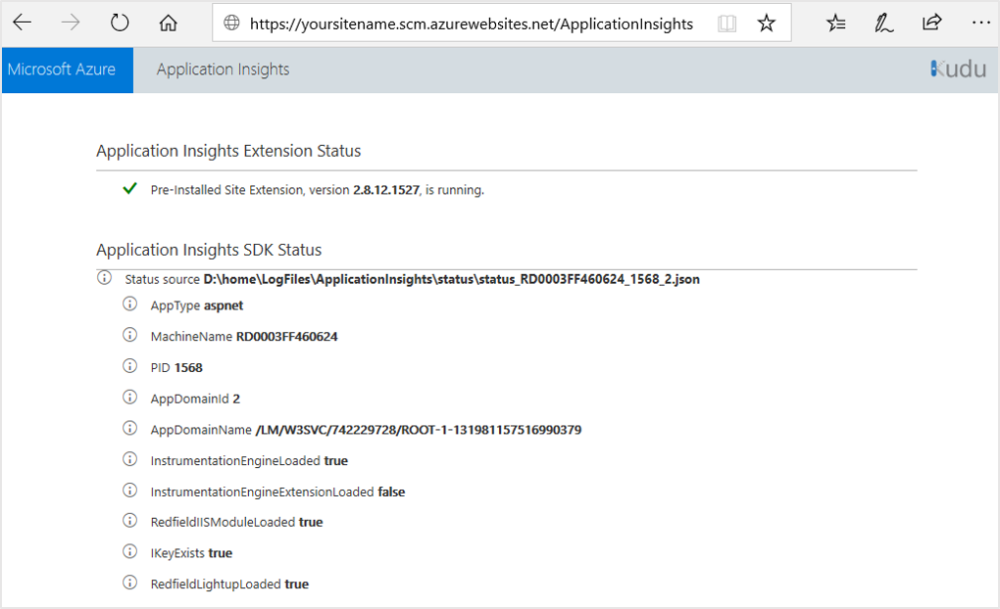

# Monitor Azure App Service performance

Enabling monitoring on your .NET and .NET Core based web applications running on [Azure App Services](https://docs.microsoft.com/azure/app-service/) is now easier than ever. Whereas previously you needed to manually install a site extension, the latest extension/agent is now built into the app service image by default. This article will walk you through enabling Application Insights monitoring as well as provide preliminary guidance for automating the process for large-scale deployments.

> [!NOTE]
> Manually adding an Application Insights site extension via **Development Tools** > **Extensions** is deprecated. This method of extension installation was dependent on manual updates for each new version. The latest stable release of the extension is now  [preinstalled](https://github.com/projectkudu/kudu/wiki/Azure-Site-Extensions) as part of the App Service image. The files are located in `d:\Program Files (x86)\SiteExtensions\ApplicationInsightsAgent` and are automatically updated with each stable release. If you follow the agent based instructions to enable monitoring below, it will automatically remove the deprecated extension for you.

## Enable Application Insights

There are two ways to enable application monitoring for Azure App Services hosted applications:

* **Agent-based application monitoring** (ApplicationInsightsAgent).  
    * This method is the easiest to enable, and no advanced configuration is required. It is often referred to as "runtime" monitoring. For Azure App Services we recommend at a minimum enabling this level of monitoring, and then based on your specific scenario you can evaluate whether more advanced monitoring through manual instrumentation is needed.

* **Manually instrumenting the application through code** by installing the Application Insights SDK.

    * This approach is much more customizable, but it requires [adding a dependency on the Application Insights SDK NuGet packages](https://docs.microsoft.com/azure/azure-monitor/app/asp-net). This method, also means you have to manage the updates to the latest version of the packages yourself.

    * If you need to make custom API calls to track events/dependencies not captured by default with agent-based monitoring, you would need to use this method. Check out the [API for custom events and metrics article](https://docs.microsoft.com/azure/azure-monitor/app/api-custom-events-metrics) to learn more.

> [!NOTE]
> If both agent based monitoring and manual SDK based instrumentation is detected only the manual instrumentation settings will be honored. This is to prevent duplicate data from sent. To learn more about this check out the [troubleshooting section](https://docs.microsoft.com/azure/azure-monitor/app/azure-web-apps#troubleshooting) below.

## Enable agent-based monitoring for .NET applications

> [!NOTE]
> The combination of APPINSIGHTS_JAVASCRIPT_ENABLED and urlCompression is not supported. For more info see the explanation in the [troubleshooting section](https://docs.microsoft.com/azure/azure-monitor/app/azure-web-apps#troubleshooting).


1. **Select Application Insights** in the Azure control panel for your app service.

    

   * Choose to create a new resource, unless you already set up an Application Insights resource for this application. 

     > [!NOTE]
     > When you click **OK** to create the new resource you will be prompted to **Apply monitoring settings**. Selecting **Continue** will link your new Application Insights resource to your app service, doing so will also **trigger a restart of your app service**. 

     

2. After specifying which resource to use, you can choose how you want application insights to collect data per platform for your application. ASP.NET app monitoring is on-by-default with two different levels of collection.

    

   * .NET **Basic collection** level offers essential single-instance APM capabilities.

   * .NET **Recommended collection** level:
       * Adds CPU, memory, and I/O usage trends.
       * Correlates micro-services across request/dependency boundaries.
       * Collects usage trends, and enables correlation from availability results to transactions.
       * Collects exceptions unhandled by the host process.
       * Improves APM metrics accuracy under load, when sampling is used.

3. To configure settings like sampling, which you could previously control via the applicationinsights.config file you can now interact with those same settings via Application settings with a corresponding prefix. 

    * For example, to change the initial sampling percentage, you can create an Application setting of: `MicrosoftAppInsights_AdaptiveSamplingTelemetryProcessor_InitialSamplingPercentage` and a value of `100`.

    * For the list of supported adaptive sampling telemetry processor settings, you can consult the [code](https://github.com/Microsoft/ApplicationInsights-dotnet/blob/master/src/ServerTelemetryChannel/AdaptiveSamplingTelemetryProcessor.cs) and [associated documentation](https://docs.microsoft.com/azure/azure-monitor/app/sampling).

## Enable agent-based monitoring for .NET Core applications

The following versions of .NET Core are supported: ASP.NET Core 2.0, ASP.NET Core 2.1, ASP.NET Core 2.2

Targeting the full framework from .NET Core, self-contained deployment, and ASP.NET Core 3.0 are currently **not supported** with agent/extension based monitoring. ([Manual instrumentation](https://docs.microsoft.com/azure/azure-monitor/app/asp-net-core) via code will work in all of the previous scenarios.)

1. **Select Application Insights** in the Azure control panel for your app service.

    

   * Choose to create a new resource, unless you already set up an Application Insights resource for this application. 

     > [!NOTE]
     > When you click **OK** to create the new resource you will be prompted to **Apply monitoring settings**. Selecting **Continue** will link your new Application Insights resource to your app service, doing so will also **trigger a restart of your app service**. 

     

2. After specifying which resource to use, you can choose how you want Application Insights to collect data per platform for your application. .NET Core offers **Recommended collection** or **Disabled** for .NET Core 2.0,  2.1, and 2.2.

    

## Enable client-side monitoring for .NET applications

Client-side monitoring is opt-in for ASP.NET. To enable client-side monitoring:

* Select **Settings** >** **Application settings****
   * Under Application settings, add a new **app setting name** and **value**:

     Name: `APPINSIGHTS_JAVASCRIPT_ENABLED`

     Value: `true`

   * **Save** the settings and **Restart** your app.



To disable client-side monitoring either remove the associated key value pair from the Application settings, or set the value to false.

## Enable client-side monitoring for .NET Core applications

Client-side monitoring is **enabled by default** for .NET Core apps with **Recommended collection**, regardless of whether the app setting 'APPINSIGHTS_JAVASCRIPT_ENABLED' is present.

If for some reason you would like to disable client-side monitoring:

* Select **Settings** > **Application settings**
   * Under Application settings, add a new **app setting name** and **value**:

     name: `APPINSIGHTS_JAVASCRIPT_ENABLED`

     Value: `false`

   * **Save** the settings and **Restart** your app.



## Automate monitoring

In order to enable telemetry collection with Application Insights, only the Application settings need to be set:

   

### Application settings definitions

|App setting name |  Definition | Value |
|-----------------|:------------|-------------:|
|ApplicationInsightsAgent_EXTENSION_VERSION | Main extension, which controls runtime monitoring. | `~2` |
|XDT_MicrosoftApplicationInsights_Mode |  In default mode only, essential features are enabled in order to insure optimal performance. | `default` or `recommended`. |
|InstrumentationEngine_EXTENSION_VERSION | Controls if the binary-rewrite engine `InstrumentationEngine` will be turned on. This setting has performance implications and impacts cold start/startup time. | `~1` |
|XDT_MicrosoftApplicationInsights_BaseExtensions | Controls if SQL & Azure table text will be captured along with the dependency calls. Performance warning: this setting requires the `InstrumentationEngine`. | `~1` |

### App Service Application settings with Azure Resource Manager

Application settings for App Services can be managed and configured with [Azure Resource Manager templates](https://docs.microsoft.com/azure/azure-resource-manager/resource-group-authoring-templates). This method can be used when deploying new App Service resources with Azure Resource Manager automation, or for modifying the settings of existing resources.

The basic structure of the application settings JSON for an app service is below:

```JSON
      "resources": [
        {
          "name": "appsettings",
          "type": "config",
          "apiVersion": "2015-08-01",
          "dependsOn": [
            "[resourceId('Microsoft.Web/sites', variables('webSiteName'))]"
          ],
          "tags": {
            "displayName": "Application Insights Settings"
          },
          "properties": {
            "key1": "value1",
            "key2": "value2"
          }
        }
      ]
```

For an example of an Azure Resource Manager template with Application settings configured for Application Insights, this [template](https://github.com/Andrew-MSFT/BasicImageGallery) can be helpful, specifically the section starting on [line 238](https://github.com/Andrew-MSFT/BasicImageGallery/blob/c55ada54519e13ce2559823c16ca4f97ddc5c7a4/CoreImageGallery/Deploy/CoreImageGalleryARM/azuredeploy.json#L238).

### Automate the creation of an Application Insights resource and link to your newly created App Service.

To create an Azure Resource Manager template with all the default Application Insights settings configured, begin the process as if you were going to create a new Web App with Application Insights enabled.

Select **Automation options**

   

This option generates the latest Azure Resource Manager template with all required settings configured.

  

Below is a sample, replace all instances of  `AppMonitoredSite` with your site name:

```json
{
    "resources": [
        {
            "name": "[parameters('name')]",
            "type": "Microsoft.Web/sites",
            "properties": {
                "siteConfig": {
                    "appSettings": [
                        {
                            "name": "APPINSIGHTS_INSTRUMENTATIONKEY",
                            "value": "[reference('microsoft.insights/components/AppMonitoredSite', '2015-05-01').InstrumentationKey]"
                        },
                        {
                            "name": "ApplicationInsightsAgent_EXTENSION_VERSION",
                            "value": "~2"
                        }
                    ]
                },
                "name": "[parameters('name')]",
                "serverFarmId": "[concat('/subscriptions/', parameters('subscriptionId'),'/resourcegroups/', parameters('serverFarmResourceGroup'), '/providers/Microsoft.Web/serverfarms/', parameters('hostingPlanName'))]",
                "hostingEnvironment": "[parameters('hostingEnvironment')]"
            },
            "dependsOn": [
                "[concat('Microsoft.Web/serverfarms/', parameters('hostingPlanName'))]",
                "microsoft.insights/components/AppMonitoredSite"
            ],
            "apiVersion": "2016-03-01",
            "location": "[parameters('location')]"
        },
        {
            "apiVersion": "2016-09-01",
            "name": "[parameters('hostingPlanName')]",
            "type": "Microsoft.Web/serverfarms",
            "location": "[parameters('location')]",
            "properties": {
                "name": "[parameters('hostingPlanName')]",
                "workerSizeId": "[parameters('workerSize')]",
                "numberOfWorkers": "1",
                "hostingEnvironment": "[parameters('hostingEnvironment')]"
            },
            "sku": {
                "Tier": "[parameters('sku')]",
                "Name": "[parameters('skuCode')]"
            }
        },
        {
            "apiVersion": "2015-05-01",
            "name": "AppMonitoredSite",
            "type": "microsoft.insights/components",
            "location": "West US 2",
            "properties": {
                "ApplicationId": "[parameters('name')]",
                "Request_Source": "IbizaWebAppExtensionCreate"
            }
        }
    ],
    "parameters": {
        "name": {
            "type": "string"
        },
        "hostingPlanName": {
            "type": "string"
        },
        "hostingEnvironment": {
            "type": "string"
        },
        "location": {
            "type": "string"
        },
        "sku": {
            "type": "string"
        },
        "skuCode": {
            "type": "string"
        },
        "workerSize": {
            "type": "string"
        },
        "serverFarmResourceGroup": {
            "type": "string"
        },
        "subscriptionId": {
            "type": "string"
        }
    },
    "$schema": "https://schema.management.azure.com/schemas/2014-04-01-preview/deploymentTemplate.json#",
    "contentVersion": "1.0.0.0"
}
```

> [!NOTE]
> The template will generate application settings in “default” mode. This mode is performance optimized, though you can modify the template to activate whichever features you prefer.

### Enabling through PowerShell

In order to enable the application monitoring through PowerShell, only the underlying application settings need to be changed. Below is a sample, which enables application monitoring for a website called "AppMonitoredSite" in the resource group "AppMonitoredRG", and configures data to be sent to the "012345678-abcd-ef01-2345-6789abcd" instrumentation key.

[!INCLUDE [updated-for-az](../../../includes/updated-for-az.md)]

```powershell
$app = Get-AzWebApp -ResourceGroupName "AppMonitoredRG" -Name "AppMonitoredSite" -ErrorAction Stop
$newAppSettings = @{} # case-insensitive hash map
$app.SiteConfig.AppSettings | %{$newAppSettings[$_.Name] = $_.Value} #preserve non Application Insights Application settings.
$newAppSettings["APPINSIGHTS_INSTRUMENTATIONKEY"] = "012345678-abcd-ef01-2345-6789abcd"; # enable the ApplicationInsightsAgent
$newAppSettings["ApplicationInsightsAgent_EXTENSION_VERSION"] = "~2"; # enable the ApplicationInsightsAgent
$app = Set-AzWebApp -AppSettings $newAppSettings -ResourceGroupName $app.ResourceGroup -Name $app.Name -ErrorAction Stop
```

## Upgrade monitoring extension/agent

### Upgrading from versions 2.8.9 and up

Upgrading from version 2.8.9 happens automatically, without any additional actions. The new monitoring bits are delivered in the background to the target app service, and on application restart they will be picked up.

To check which version of the extension you are running visit `http://yoursitename.scm.azurewebsites.net/ApplicationInsights`



### Upgrade from versions 1.0.0 - 2.6.5

Starting with version 2.8.9 the pre-installed site extension is used. If you are an earlier version, you can update via one of two ways:

* [Upgrade by enabling via the portal](https://docs.microsoft.com/azure/azure-monitor/app/azure-web-apps#enable-application-insights). (Even if you have the Application Insights extension for Azure App Service installed, the UI shows only **Enable** button. Behind the scenes, the old private site extension will be removed.)

* [Upgrade through PowerShell](https://docs.microsoft.com/azure/azure-monitor/app/azure-web-apps#enabling-through-powershell):

    1. Set the application settings to enable the pre-installed site extension ApplicationInsightsAgent. See [Enabling through powershell](https://docs.microsoft.com/azure/azure-monitor/app/azure-web-apps#enabling-through-powershell).
    2. Manually remove the private site extension named Application Insights extension for Azure App Service.

If the upgrade is done from a version prior to 2.5.1, check that the ApplicationInsigths dlls are removed from the application bin folder [see troubleshooting steps](https://docs.microsoft.com/azure/azure-monitor/app/azure-web-apps#troubleshooting).

## Troubleshooting

Below is our step-by-step troubleshooting guide for extension/agent based monitoring for .NET and .NET Core based applications running on Azure App Services.

> [!NOTE]
> Java and Node.js applications are only supported on Azure App Services via manual SDK based instrumentation and therefore the steps below do not apply to these scenarios.

1. Check that the application is monitored via `ApplicationInsightsAgent`.
    * Check that `ApplicationInsightsAgent_EXTENSION_VERSION` app setting is set to a value of "~2".
2. Ensure that the application meets the requirements to be monitored.
    * Browse to `https://yoursitename.scm.azurewebsites.net/ApplicationInsights`

    

    * Confirm that the `Application Insights Extension Status` is `Pre-Installed Site Extension, version 2.8.12.1527, is running.`
        * If it is not running, follow the [enable Application Insights monitoring instructions](https://docs.microsoft.com/azure/azure-monitor/app/azure-web-apps#enable-application-insights)

    * Confirm that the status source exists and looks like: `Status source D:\home\LogFiles\ApplicationInsights\status\status_RD0003FF0317B6_4248_1.json`
        * If a similar value is not present, it means the application is not currently running or is not supported. To ensure that the application is running, try manually visiting the application url/application endpoints, which will allow the runtime information to become available.

    * Confirm that `IKeyExists` is `true`
        * If it is false, add `APPINSIGHTS_INSTRUMENTATIONKEY with your ikey guid to your application settings.

    * Confirm that there are no entries for `AppAlreadyInstrumented`, `AppContainsDiagnosticSourceAssembly`, and `AppContainsAspNetTelemetryCorrelationAssembly`.
        * If any of these entries exist, remove the following packages from your application: `Microsoft.ApplicationInsights`, `System.Diagnostics.DiagnosticSource`, and `Microsoft.AspNet.TelemetryCorrelation`.

The table below provides a more detailed explanation of what these values mean, their underlying causes, and recommended fixes:

|Problem Value|Explanation|Fix
|---- |----|---|
| `AppAlreadyInstrumented:true` | This value indicates that the extension detected that some aspect of the SDK is already present in the Application, and will back-off. It can be due to a reference to `System.Diagnostics.DiagnosticSource`,  `Microsoft.AspNet.TelemetryCorrelation`, or `Microsoft.ApplicationInsights`  | Remove the references. Some of these references are added by default from certain Visual Studio templates, and older versions of Visual Studio may add references to `Microsoft.ApplicationInsights`.
|`AppAlreadyInstrumented:true` | If the application is targeting .NET Core 2.1 or 2.2, and refers to [Microsoft.AspNetCore.All](https://www.nuget.org/packages/Microsoft.AspNetCore.All) meta-package, then it brings in Application Insights, and extension will back-off. | Customers on .NET Core 2.1,2.2 are [recommended](https://github.com/aspnet/Announcements/issues/287) to use Microsoft.AspNetCore.App meta-package instead.|
|`AppAlreadyInstrumented:true` | This value can also be caused by the presence of the above dlls in the app folder from a previous deployment. | Clean the app folder to ensure that these dlls are removed.|
|`AppContainsAspNetTelemetryCorrelationAssembly: true` | This value indicates that extension detected references to `Microsoft.AspNet.TelemetryCorrelation` in the application, and will back-off. | Remove the reference.
|`AppContainsDiagnosticSourceAssembly**:true`|This value indicates that extension detected references to `System.Diagnostics.DiagnosticSource` in the application, and will back-off.| Remove the reference.
|`IKeyExists:false`|This value indicates that the instrumentation key is not present in the AppSetting, `APPINSIGHTS_INSTRUMENTATIONKEY`. Possible causes: The values may have been accidentally removed, forgot to set the values in automation script, etc. | Make sure the setting is present in the App Service application settings.

### APPINSIGHTS_JAVASCRIPT_ENABLED and urlCompression is not supported

If you use APPINSIGHTS_JAVASCRIPT_ENABLED=true in cases where content is encoded, you might get errors like: 

- 500 URL rewrite error
- 500.53 URL rewrite module error with message Outbound rewrite rules cannot be applied when the content of the HTTP response is encoded ('gzip'). 

This is due to the APPINSIGHTS_JAVASCRIPT_ENABLED application setting being set to true and content-encoding being present at the same time. This scenario is not supported yet. The workaround is to remove APPINSIGHTS_JAVASCRIPT_ENABLED from your application settings. Unfortunately this means that if client/browser-side JavaScript instrumentation is still required, manual SDK references are needed for your webpages. Please follow the [instructions](https://github.com/Microsoft/ApplicationInsights-JS#snippet-setup-ignore-if-using-npm-setup) for manual instrumentation with the JavaScript SDK.

For the latest information on the Application Insights agent/extension, check out the [release notes](https://github.com/Microsoft/ApplicationInsights-Home/blob/master/app-insights-web-app-extensions-releasenotes.md).

## Next steps
* [Run the profiler on your live app](../app/profiler.md).
* [Azure Functions](https://github.com/christopheranderson/azure-functions-app-insights-sample) - monitor Azure Functions with Application Insights
* [Enable Azure diagnostics](../platform/diagnostics-extension-to-application-insights.md) to be sent to Application Insights.
* [Monitor service health metrics](../platform/data-platform.md) to make sure your service is available and responsive.
* [Receive alert notifications](../platform/alerts-overview.md) whenever operational events happen or metrics cross a threshold.
* Use [Application Insights for JavaScript apps and web pages](javascript.md) to get client telemetry from the browsers that visit a web page.
* [Set up Availability web tests](monitor-web-app-availability.md) to be alerted if your site is down.
