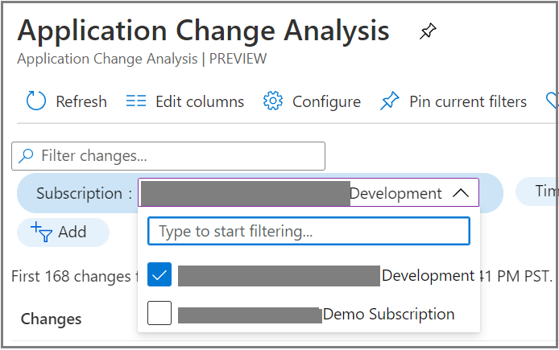
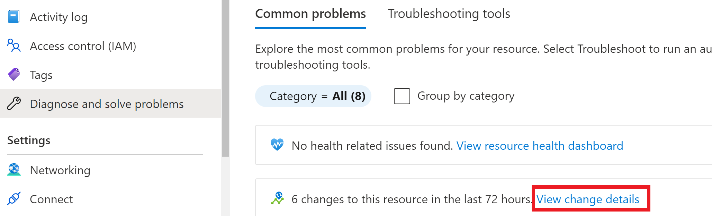

# Visualizations for Application Change Analysis (preview)

## Standalone UI

In Azure Monitor, there is a standalone pane for Change Analysis to view all changes with insights into application dependencies and resources.

Search for Change Analysis in the search bar on Azure portal to launch the experience.

All resources under a selected subscription are displayed with changes from the past 24 hours. All changes are displayed with old value and new value to provide insights at one glance.

Clicking into a change to view full Resource Manager snippet and other properties.

For any feedback, use the send feedback button or email changeanalysisteam@microsoft.com.

### Multiple subscription support

The UI supports selecting multiple subscriptions to view resource changes. Use the subscription filter:

## Application Change Analysis in the Diagnose and solve problems tool

Application Change Analysis is a standalone detector in the Web App diagnose and solve problems tools. It is also aggregated in **Application Crashes** and **Web App Down detectors**. As you enter the Diagnose and Solve Problems tool, the **Microsoft.ChangeAnalysis** resource provider will automatically be registered. Follow these instructions to enable web app in-guest change tracking.

1. Select **Availability and Performance**.

    

2. Select **Application Changes**. The feature is also available in **Application Crashes**.

   

3. The link leads to Application Change Analysis UI scoped to the web app. If web app in-guest change tracking is not enabled, follow the banner to get file and app settings changes.

   

4. Turn on **Change Analysis** and select **Save**. The tool displays all web apps under an App Service plan. You can use the plan level switch to turn on Change Analysis for all web apps under a plan.

    

5. Change data is also available in select **Web App Down** and **Application Crashes** detectors. You'll see a graph that summarizes the type of changes over time along with details on those changes. By default, changes in the past 24 hours are displayed to help with immediate problems.

     

## Diagnose and Solve Problems tool
Change Analysis is available as an insight card in Diagnose and Solve Problem tool. If a resource experiences issues and there are changes discovered in the past 72 hours, the insights card will display the number of changes. Clicking on view change details link will lead to the filtered view from Change Analysis standalone UI.

## Virtual Machine Diagnose and Solve Problems

Go to Diagnose and Solve Problems tool for a Virtual Machine.  Go to **Troubleshooting Tools**, browse down the page and select **Analyze recent changes** to view changes on the Virtual Machine.

## Activity Log Change History

The [View change history](../essentials/activity-log.md#view-change-history) feature in Activity Log calls Application Change Analysis service backend to get changes associated with an operation. **Change history** used to call [Azure Resource Graph](../../governance/resource-graph/overview.md) directly, but swapped the backend to call Application Change Analysis so changes returned will include resource level changes from [Azure Resource Graph](../../governance/resource-graph/overview.md), resource properties from [Azure Resource Manager](../../azure-resource-manager/management/overview.md), and in-guest changes from PaaS services such as App Services web app. 
In order for the Application Change Analysis service to be able to scan for changes in users' subscriptions, a resource provider needs to be registered. The first time entering **Change History** tab, the tool will automatically start to register **Microsoft.ChangeAnalysis** resource provider. After registered, changes from **Azure Resource Graph** will be available immediately and cover the past 14 days. Changes from other sources will be available after ~4 hours after subscription is onboard.

## VM Insights integration

Users having [VM Insights](../vm/vminsights-overview.md) enabled can view what changed in their virtual machines that might of caused any spikes in a metrics chart such as CPU or Memory. Change data is integrated in the VM Insights side navigation bar. User can view if any changes happened in the VM and select **Investigate Changes** to view change details in Application Change Analysis standalone UI.

## Next steps

- Learn how to [troubleshoot problems in Change Analysis](change-analysis-troubleshoot.md)
