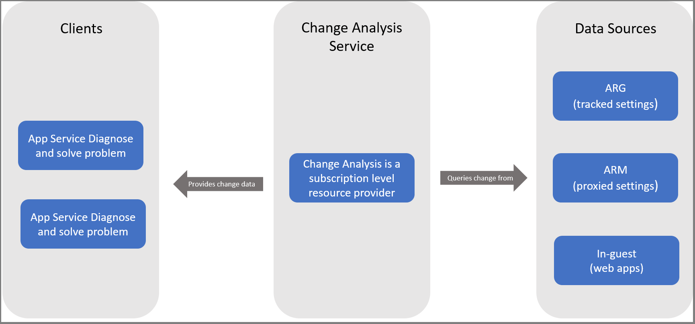
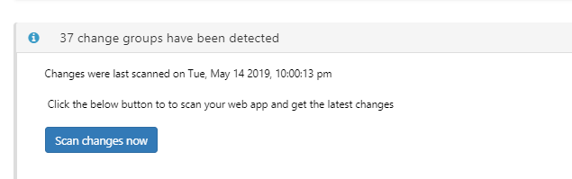
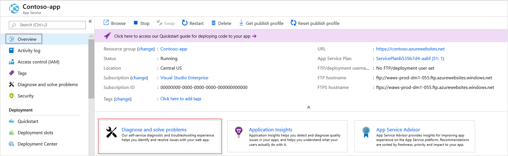
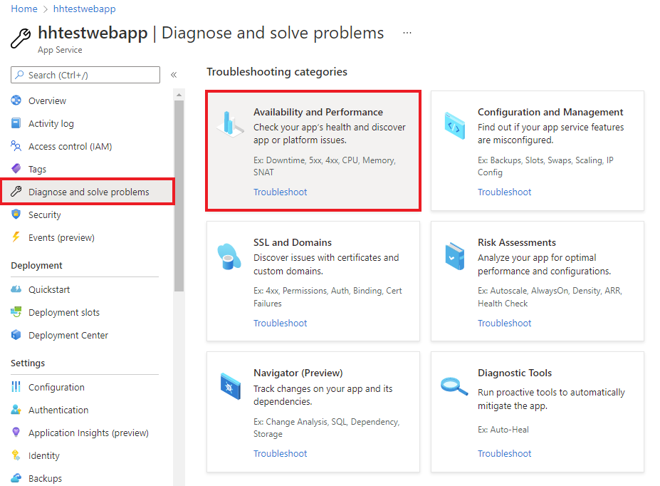
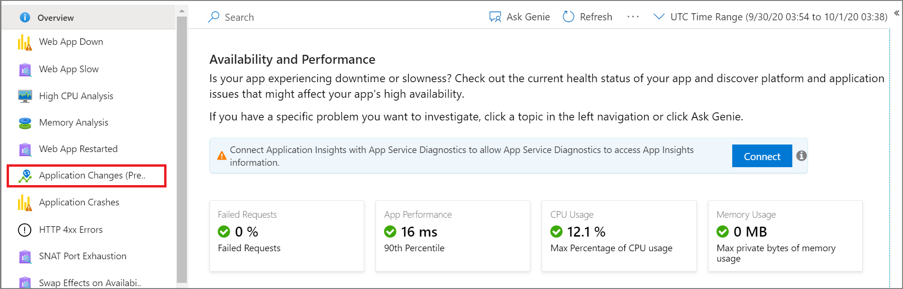
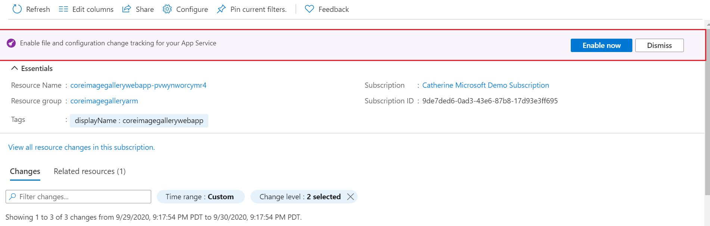
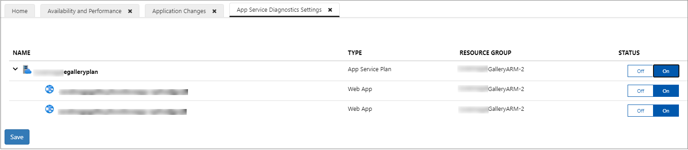
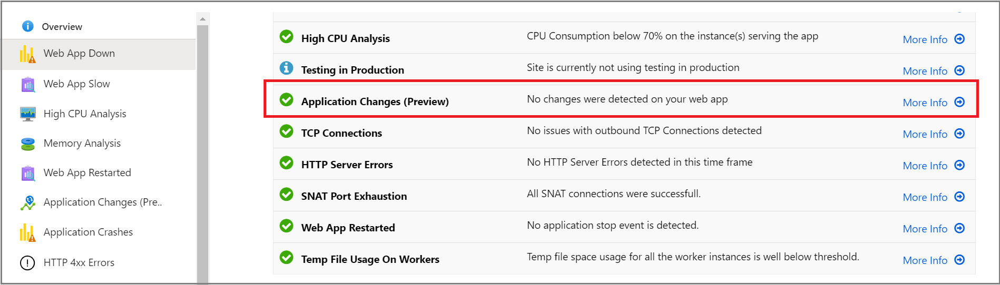
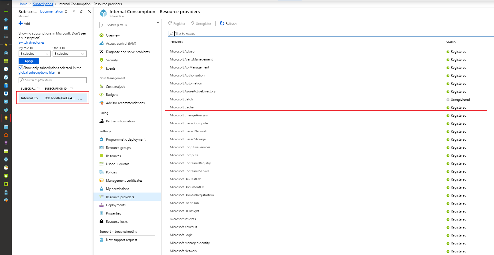

# Use Application Change Analysis (preview) in Azure Monitor

When a live site issue or outage occurs, quickly determining the root cause is critical. Standard monitoring solutions might alert you to a problem. They might even indicate which component is failing. But this alert won't always immediately explain the failure's cause. You know your site worked five minutes ago, and now it's broken. What changed in the last five minutes? This is the question that Application Change Analysis is designed to answer in Azure Monitor.

Building on the power of [Azure Resource Graph](https://docs.microsoft.com/azure/governance/resource-graph/overview), Change Analysis provides insights into your Azure application changes to increase observability and reduce MTTR (mean time to repair).

> [!IMPORTANT]
> Change Analysis is currently in preview. This preview version is provided without a service-level agreement. This version is not recommended for production workloads. Some features might not be supported or might have constrained capabilities. For more information, see [Supplemental terms of use for Microsoft Azure previews](https://azure.microsoft.com/support/legal/preview-supplemental-terms/).

## Overview

Change Analysis detects various types of changes, from the infrastructure layer all the way to application deployment. It's a subscription-level Azure resource provider that checks resource changes in the subscription. Change Analysis provides data for various diagnostic tools to help users understand what changes might have caused issues.

The following diagram illustrates the architecture of Change Analysis:



Currently Change Analysis is integrated into the **Diagnose and solve problems** experience in the App Service web app. To enable change detection and view changes in the web app, see the *Change Analysis for the Web Apps feature* section later in this article.

### Azure Resource Manager deployment changes

Using [Azure Resource Graph](https://docs.microsoft.com/azure/governance/resource-graph/overview), Change Analysis provides a historical record of how the Azure resources that host your application have changed over time. Change Analysis can detect, for example, changes in IP configuration rules, managed identities, and SSL settings. So if a tag is added to a web app, Change Analysis reflects the change. This information is available as long as the `Microsoft.ChangeAnalysis` resource provider is enabled in the Azure subscription.

### Changes in web app deployment and configuration

Change Analysis captures the deployment and configuration state of an application every 4 hours. It can detect, for example, changes in the application environment variables. The tool computes the differences and presents what has changed. Unlike Resource Manager changes, code deployment change information might not be available immediately in the tool. To view the latest changes in Change Analysis, select **Scan changes now**.



### Dependency changes

Changes to resource dependencies can also cause issues in a web app. For example, if a web app calls into a Redis cache, the Redis cache SKU could affect the web app performance. To detect changes in dependencies, Change Analysis checks the web app's DNS record. In this way, it identifies changes in all app components that could cause issues.

## Change Analysis for the Web Apps feature

In Azure Monitor, Change Analysis is currently built into the self-service **Diagnose and solve problems** experience. Access this experience from the **Overview** page of your App Service application.



### Enable Change Analysis in the Diagnose and solve problems tool

1. Select **Availability and Performance**.

    

1. Select **Application Changes**. Not that the feature is also available in **Application Crashes**.

   

1. To enable Change Analysis, select **Enable now**.

   

1. Turn on **Change Analysis** and select **Save**.

    


1. To access Change Analysis, select **Diagnose and solve problems** > **Availability and Performance** > **Application Crashes**. You'll see a graph that summarizes the type of changes over time along with details on those changes:

     


### Enable Change Analysis at scale

If your subscription includes numerous web apps, enabling the service at the level of the web app would be inefficient. In this case, follow these alternative instructions.

### Register the Change Analysis resource provider for your subscription

1. Register the Change Analysis feature flag (preview). Because the feature flag is in preview, you need to register it to make it visible to your subscription:

   1. Open [Azure Cloud Shell](https://azure.microsoft.com/features/cloud-shell/).

      

   1. Change the shell type to **PowerShell**.

      

   1. Run the following PowerShell command:

        ``` PowerShell
        Set-AzContext -Subscription <your_subscription_id> #set script execution context to the subscription you are trying to enable
        Get-AzureRmProviderFeature -ProviderNamespace "Microsoft.ChangeAnalysis" -ListAvailable #Check for feature flag availability
        Register-AzureRmProviderFeature -FeatureName PreviewAccess -ProviderNamespace Microsoft.ChangeAnalysis #Register feature flag
        ```

1. Register the Change Analysis resource provider for the subscription.

   - Go to **Subscriptions**, and select the subscription you want to enable in the change service. Then select resource providers:

        

       - Select **Microsoft.ChangeAnalysis**. Then at the top of the page, select **Register**.

       - After the resource provider is enabled, you can set a hidden tag on the web app to detect changes at the level of deployment. To set a hidden tag, follow the instructions under **Unable to fetch Change Analysis information**.

   - Alternatively, you can use a PowerShell script to register the resource provider:

        ```PowerShell
        Get-AzureRmResourceProvider -ListAvailable | Select-Object ProviderNamespace, RegistrationState #Check if RP is ready for registration

        Register-AzureRmResourceProvider -ProviderNamespace "Microsoft.ChangeAnalysis" #Register the Change Analysis RP
        ```

        To use PowerShell to set a hidden tag on a web app, run the following command:

        ```powershell
        $webapp=Get-AzWebApp -Name <name_of_your_webapp>
        $tags = $webapp.Tags
        $tags[“hidden-related:diagnostics/changeAnalysisScanEnabled”]=$true
        Set-AzResource -ResourceId <your_webapp_resourceid> -Tag $tag
        ```

     > [!NOTE]
     > After you add the hidden tag, you might still need to wait up to 4 hours before you start seeing changes. Results are delayed because Change Analysis scans your web app only every 4 hours. The 4-hour schedule limits the scan's performance impact.

## Next steps

- Enable Application Insights for [Azure App Services apps](azure-web-apps.md).
- Enable Application Insights for [Azure VM and Azure virtual machine scale set IIS-hosted apps](azure-vm-vmss-apps.md).
- Learn more about [Azure Resource Graph](https://docs.microsoft.com/azure/governance/resource-graph/overview), which helps power Change Analysis.
