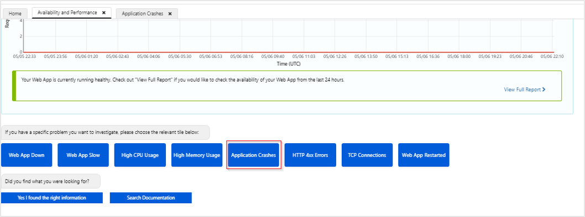
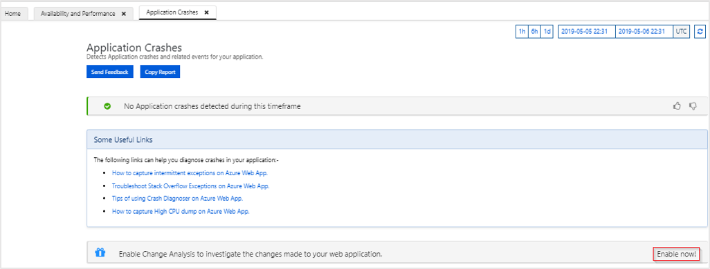

# Application Change Analysis (public preview)

When a live site issue/outage occurs, determining root cause quickly is critical. Standard monitoring solutions may help you rapidly identify that there is a problem, and often even which component is failing. But this won't always lead to an immediate explanation for why the failure is occurring. Your site worked five minutes ago, now it's broken. What changed in the last five minutes? This is the question that the new feature Azure Monitor application change analysis is designed to answer. By building on the power of the [Azure Resource Graph](https://docs.microsoft.com/azure/governance/resource-graph/overview) application change analysis provides insight into your Azure application changes to increase observability and reduce MTTR (Mean Time To Repair).

> [!IMPORTANT]
> Azure Monitor application change analysis is currently in public preview.
> This preview version is provided without a service level agreement, and it's not recommended for production workloads. Certain features might not be supported or might have constrained capabilities.
> For more information, see [Supplemental Terms of Use for Microsoft Azure Previews](https://azure.microsoft.com/support/legal/preview-supplemental-terms/).

## Overview of Change Analysis service
The change analysis service detects various types of changes from infrastructure layer all the way to application deployment. It is a subscription level Azure resource provider that looks into resource changes in the subscription and provides data for various diagnostics tools to help users understand what changes might have caused issues.

The following diagram illustrates the architecture of change analysis service:


Currently the tool is integrated into the App Services web app diagnose and solve problems experience. See *Change Analysis service for App Services Web App* section on how to enable and view changes made to a web app.

### Azure Resource Manager deployment changes
Leveraging [Azure Resource Graph](https://docs.microsoft.com/azure/governance/resource-graph/overview) the change analysis tool provides a historical record of how the Azure resources that host your application have changed over time. For example, if a web app had a tag added to it, the change will be reflected in the change analysis tool.
This information is always available as long as the `Microsoft.ChangeAnalysis` resource provider is onboarded to the Azure subscription.

### Web Application deployment and configuration changes
Change Analysis tool captures deployment and configuration state of an application every 4 hours to compute the differences and present what has changed. Examples of such changes include application environment variable changes, IP configuration rule changes, Managed Service Identity changes, SSL settings changes, and so on.
Unlike Resource Manager changes, this type of change information may not be available immediately in the tool. To view the latest changes, use the 'Scan changes now' button in the tool.


### Dependency changes
Dependencies resource could also be the cause of issues. For example, if a web app calls into a Redis cache, the web app performance can be impacted by Redis cache SKU. By looking into the web app DNS record change analysis service also present the dependencies change information to identify changes in all components of an app that could have caused issues.


## Change Analysis service for App Services Web App

Azure Monitor application change analysis is currently built into the self-service **Diagnose and solve problems** experience, which can be accessed from the **Overview** section of your Azure App Service application:


### Enable change analysis in Diagnose and solve problems tool

1. Select **Availability and Performance**

    

2. Click the **Application Crashes** tile.

   

3. To enable **Change Analysis** select **Enable now**.

   

4. To take advantage of the full change analysis functionality set **Change Analysis**, **Scan for code changes**, and **Always on** to **On** and select **Save**.

    

    If **Change Analysis** is enabled, you will be able to detect resource level changes. If **Scan for code changes** is enabled, you will also see deployment files and site configuration changes. Enabling **Always on** will optimize the change scanning performance, but may incur additional costs from a billing perspective.

5.  Once everything  is enabled, selecting **Diagnose and solve problems** > **Availability and Performance** > **Application Crashes** will allow you to access the change analysis experience. The graph will summarize the type of changes that happened over time along with details on those changes:

     


### Enable Change Analysis service at scale
If you have a lot of web apps in your Subscription, enable the service at per web app level will be inefficient. Here are some alternative onboarding instructions.

#### Registering Change Analysis resource provider for your subscription

1. Register Change Analysis preview feature flag

    Since this feature is in preview, you need to firstly register the feature flag for it to be visible to your subscription.
    - Open [Azure Cloud Shell](https://azure.microsoft.com/features/cloud-shell/).

    

    - Change the shell type to PowerShell:

    

    - Run the following PowerShell command:

    ``` PowerShell

    Set-AzContext -Subscription <your_subscription_id> #set script execution context to the subscription you are trying to onboard
    Get-AzureRmProviderFeature -ProviderNamespace "Microsoft.ChangeAnalysis" -ListAvailable #Check for feature flag availability
    Register-AzureRmProviderFeature -FeatureName PreviewAccess -ProviderNamespace Microsoft.ChangeAnalysis #Register feature flag

    ```

2. Register Change Analysis Resource Provider for the subscription

    - Navigate to Subscriptions, select the subscription you want to onboard the change service, then click Resource providers:

        

    - Select *Microsoft.ChangeAnalysis* and click *Register* on the top of the page.

    - Once Resource Provider is onboarded, follow instructions from *Unable to fetch Change Analysis information* below to set hidden tag on the web app to enable deployment level change detection on the web app.

3. Alternatively to step 2 above, you can register for the Resource Provider via PowerShell script:

    ```PowerShell
    Get-AzureRmResourceProvider -ListAvailable | Select-Object ProviderNamespace, RegistrationState #Check if RP is ready for registration

    Register-AzureRmResourceProvider -ProviderNamespace "Microsoft.ChangeAnalysis" #Register the Change Analysis RP
    ```

4. To set a hidden tag on a web app using PowerShell, run the following command:

    ```powershell
    $webapp=Get-AzWebApp -Name <name_of_your_webapp>
    $tags = $webapp.Tags
    $tags[“hidden-related:diagnostics/changeAnalysisScanEnabled”]=$true
    Set-AzResource -ResourceId <your_webapp_resourceid> -Tag $tag
    ```

> [!NOTE]
> Once the hidden tag is added, you may still need to initially wait up to 4 hours to be able to first view changes. This is due to the 4 hour freqeuncy that the change analysis service uses to scan your web app while limiting the performance impact of the scan.

## Next steps

- Improve your monitoring of Azure App Services [by enabling the Application Insights features](azure-web-apps.md) of Azure Monitor.
- Enhance your understanding of the [Azure Resource Graph](https://docs.microsoft.com/azure/governance/resource-graph/overview) which helps power Azure Monitor application change analysis.
