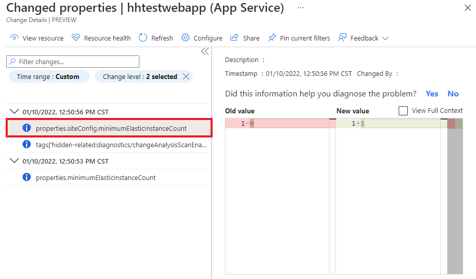

# Use Application Change Analysis (preview) in Azure Monitor

When a live site issue or outage occurs, quickly determining the root cause is critical. Standard monitoring solutions might alert you to a problem. They might even indicate which component is failing. But this alert won't always immediately explain the failure's cause. You know your site worked five minutes ago, and now it's broken. What changed in the last five minutes? This is the question that Application Change Analysis is designed to answer in Azure Monitor.

Building on the power of [Azure Resource Graph](../../governance/resource-graph/overview.md), Change Analysis provides insights into your Azure application changes to increase observability and reduce MTTR (mean time to repair).

> [!IMPORTANT]
> Change Analysis is currently in preview. This preview version is provided without a service-level agreement. This version is not recommended for production workloads. Some features might not be supported or might have constrained capabilities. For more information, see [Supplemental terms of use for Microsoft Azure previews](https://azure.microsoft.com/support/legal/preview-supplemental-terms/).

## Overview

Change Analysis detects various types of changes, from the infrastructure layer all the way to application deployment. It's a subscription-level Azure resource provider that checks resource changes in the subscription. Change Analysis provides data for various diagnostic tools to help users understand what changes might have caused issues.

The following diagram illustrates the architecture of Change Analysis:


## Supported resource types

Application Change Analysis service supports resource property level changes in all Azure resource types, including common resources like:
- Virtual Machine
- Virtual machine scale set
- App Service
- Azure Kubernetes service
- Azure Function
- Networking resources: Network Security Group, Virtual Network, Application Gateway, etc.
- Data services: Storage, SQL, Redis Cache, Cosmos DB, etc.

## Data sources

Application change analysis queries for Azure Resource Manager tracked properties, proxied configurations, and web app in-guest changes. In addition, the service tracks resource dependency changes to diagnose and monitor an application end-to-end.

### Azure Resource Manager tracked properties changes

Using [Azure Resource Graph](../../governance/resource-graph/overview.md), Change Analysis provides a historical record of how the Azure resources that host your application have changed over time. Tracked settings such as managed identities, Platform OS upgrade, and hostnames can be detected.

### Azure Resource Manager proxied setting changes

Settings such as IP Configuration rule, TLS settings, and extension versions are not yet available in Azure Resource Graph, so Change Analysis queries and computes these changes securely to provide more details in what changed in the app.

### Changes in web app deployment and configuration (in-guest changes)

Change Analysis captures the deployment and configuration state of an application every 4 hours. It can detect, for example, changes in the application environment variables. The tool computes the differences and presents what has changed. Unlike Resource Manager changes, code deployment change information might not be available immediately in the tool. To view the latest changes in Change Analysis, select **Refresh**.


Currently all text-based files under site root **wwwroot** with the following extensions are supported:
- *.json
- *.xml
- *.ini
- *.yml
- *.config
- *.properties
- *.html
- *.cshtml
- *.js
- requirements.txt
- Gemfile
- Gemfile.lock
- config.gemspec

### Dependency changes

Changes to resource dependencies can also cause issues in a resource. For example, if a web app calls into a Redis cache, the Redis cache SKU could affect the web app performance. Another example is if port 22 was closed in a Virtual Machine's Network Security Group, it will cause connectivity errors.

#### Web App diagnose and solve problems navigator (Preview)

To detect changes in dependencies, Change Analysis checks the web app's DNS record. In this way, it identifies changes in all app components that could cause issues.
Currently the following dependencies are supported in **Web App Diagnose and solve problems | Navigator (Preview)**:

- Web Apps
- Azure Storage
- Azure SQL

#### Related resources

Application Change Analysis detects related resources. Common examples are Network Security Group, Virtual Network, Application Gateway, and Load Balancer related to a Virtual Machine.
The network resources are usually automatically provisioned in the same resource group as the resources using it, so filtering the changes by resource group will show all changes for the Virtual Machine and related networking resources.



## Application Change Analysis service enablement

The Application Change Analysis service computes and aggregates change data from the data sources mentioned above. It provides a set of analytics for users to easily navigate through all resource changes and to identify which change is relevant in the troubleshooting or monitoring context.
"Microsoft.ChangeAnalysis" resource provider needs to be registered with a subscription for the Azure Resource Manager tracked properties and proxied settings change data to be available. As you enter the Web App diagnose and solve problems tool or bring up the Change Analysis standalone tab, this resource provider is automatically registered.
For web app in-guest changes, separate enablement is required for scanning code files within a web app. For more information, see [Change Analysis in the Diagnose and solve problems tool](change-analysis-visualizations.md#application-change-analysis-in-the-diagnose-and-solve-problems-tool) section later in this article for more details.

## Cost
Application Change Analysis is a free service - it does not incur any billing cost to subscriptions with it enabled. The service also does not have any performance impact for scanning Azure Resource properties changes. When you enable Change Analysis for web apps in-guest file changes (or enable the Diagnose and Solve problems tool), it will have negligible performance impact on the web app and no billing cost.


## Enable Change Analysis at scale for Web App in-guest file and environment variable changes

If your subscription includes numerous web apps, enabling the service at the level of the web app would be inefficient. Run the following script to enable all web apps in your subscription.

Pre-requisites:

- PowerShell Az Module. Follow instructions at [Install the Azure PowerShell module](/powershell/azure/install-az-ps)

Run the following script:

```PowerShell
# Log in to your Azure subscription
Connect-AzAccount

# Get subscription Id
$SubscriptionId = Read-Host -Prompt 'Input your subscription Id'

# Make Feature Flag visible to the subscription
Set-AzContext -SubscriptionId $SubscriptionId

# Register resource provider
Register-AzResourceProvider -ProviderNamespace "Microsoft.ChangeAnalysis"

# Enable each web app
$webapp_list = Get-AzWebApp | Where-Object {$_.kind -eq 'app'}
foreach ($webapp in $webapp_list)
{
    $tags = $webapp.Tags
    $tags[“hidden-related:diagnostics/changeAnalysisScanEnabled”]=$true
    Set-AzResource -ResourceId $webapp.Id -Tag $tags -Force
}

```

## Next steps

- Learn about [visualizations in Change Analysis](change-analysis-visualizations.md)
- Learn how to [troubleshoot problems in Change Analysis](change-analysis-troubleshoot.md)
- Enable Application Insights for [Azure App Services apps](azure-web-apps.md).
- Enable Application Insights for [Azure VM and Azure virtual machine scale set IIS-hosted apps](azure-vm-vmss-apps.md).
