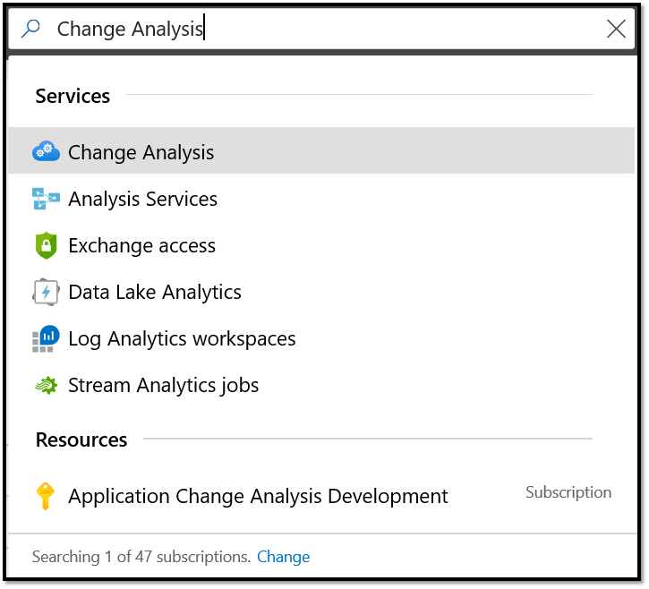
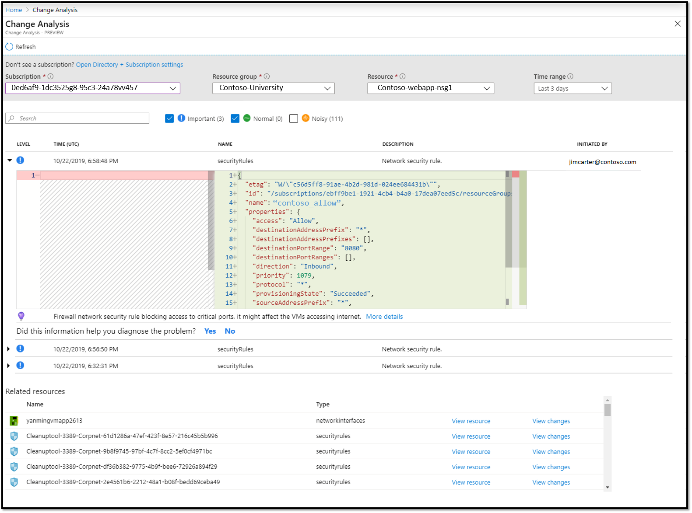
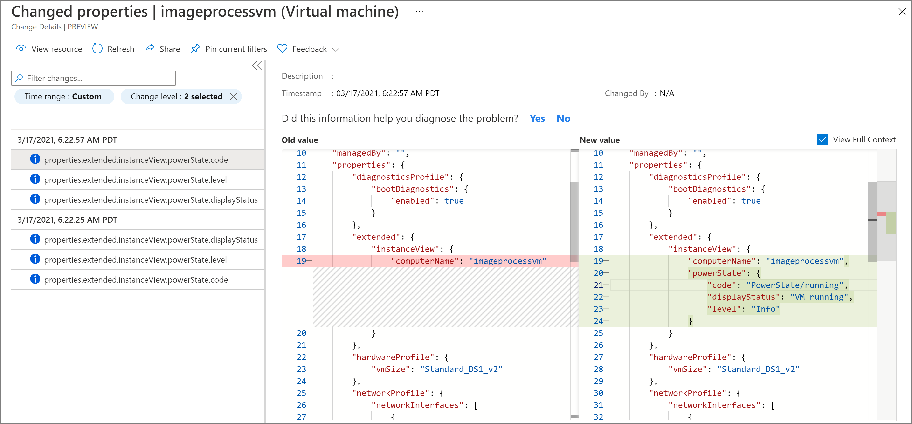
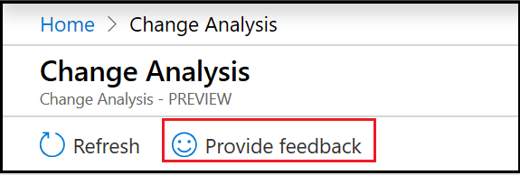
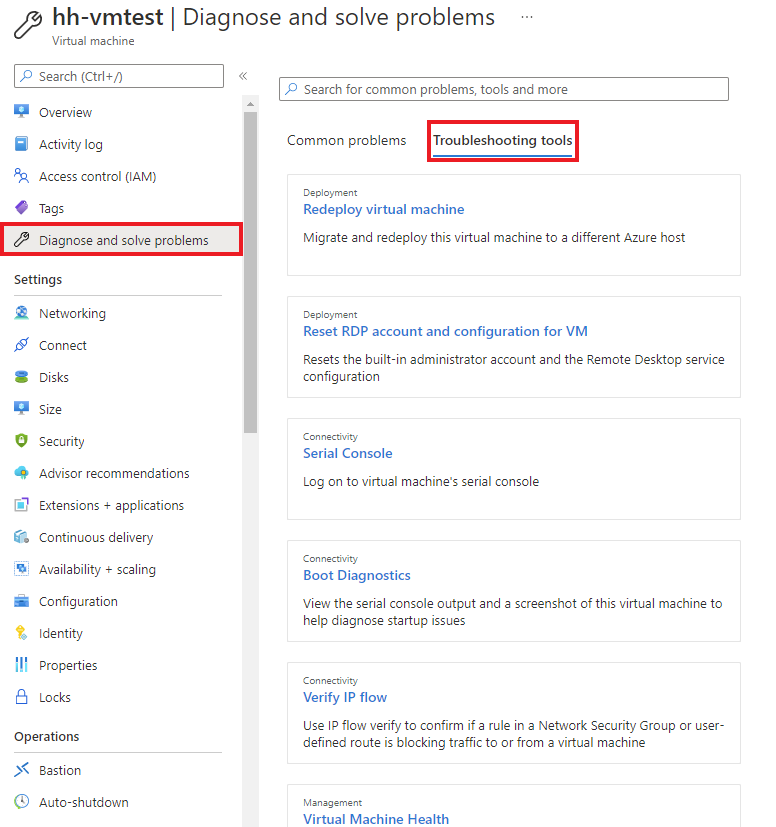
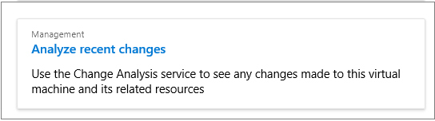
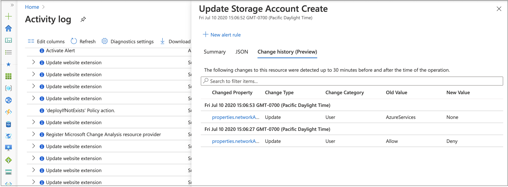
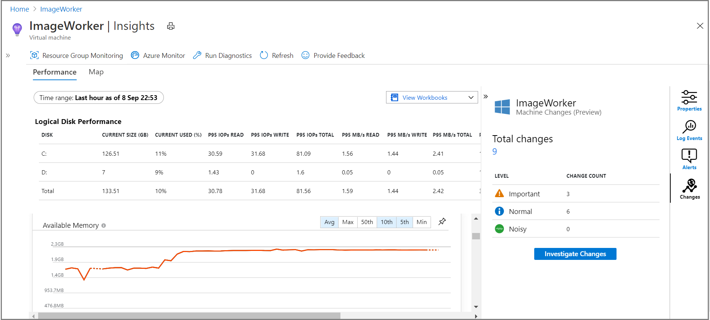
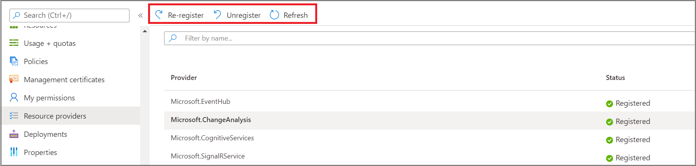

# Use Application Change Analysis (preview) in Azure Monitor

When a live site issue or outage occurs, quickly determining the root cause is critical. Standard monitoring solutions might alert you to a problem. They might even indicate which component is failing. But this alert won't always immediately explain the failure's cause. You know your site worked five minutes ago, and now it's broken. What changed in the last five minutes? This is the question that Application Change Analysis is designed to answer in Azure Monitor.

Building on the power of [Azure Resource Graph](../../governance/resource-graph/overview.md), Change Analysis provides insights into your Azure application changes to increase observability and reduce MTTR (mean time to repair).

> [!IMPORTANT]
> Change Analysis is currently in preview. This preview version is provided without a service-level agreement. This version is not recommended for production workloads. Some features might not be supported or might have constrained capabilities. For more information, see [Supplemental terms of use for Microsoft Azure previews](https://azure.microsoft.com/support/legal/preview-supplemental-terms/).

## Overview

Change Analysis detects various types of changes, from the infrastructure layer all the way to application deployment. It's a subscription-level Azure resource provider that checks resource changes in the subscription. Change Analysis provides data for various diagnostic tools to help users understand what changes might have caused issues.

The following diagram illustrates the architecture of Change Analysis:


## Data sources

Application change analysis queries for Azure Resource Manager tracked properties, proxied configurations and web app in-guest changes. In addition, the service tracks resource dependency changes to diagnose and monitor an application end-to-end.

### Azure Resource Manager tracked properties changes

Using [Azure Resource Graph](../../governance/resource-graph/overview.md), Change Analysis provides a historical record of how the Azure resources that host your application have changed over time. Tracked settings such as managed identities, Platform OS upgrade, and hostnames can be detected.

### Azure Resource Manager proxied setting changes

Settings such as IP Configuration rule, TLS settings, and extension versions are not yet available in Azure Resource Graph, so Change Analysis queries and computes these changes securely to provide more details in what changed in the app.

### Changes in web app deployment and configuration (in-guest changes)

Change Analysis captures the deployment and configuration state of an application every 4 hours. It can detect, for example, changes in the application environment variables. The tool computes the differences and presents what has changed. Unlike Resource Manager changes, code deployment change information might not be available immediately in the tool. To view the latest changes in Change Analysis, select **Refresh**.


### Dependency changes

Changes to resource dependencies can also cause issues in a web app. For example, if a web app calls into a Redis cache, the Redis cache SKU could affect the web app performance. To detect changes in dependencies, Change Analysis checks the web app's DNS record. In this way, it identifies changes in all app components that could cause issues.
Currently the following dependencies are supported:
- Web Apps
- Azure Storage
- Azure SQL

## Application Change Analysis service

The Application Change Analysis service computes and aggregates change data from the data sources mentioned above. It provides a set of analytics for users to easily navigate through all resource changes and to identify which change is relevant in the troubleshooting or monitoring context.
"Microsoft.ChangeAnalysis" resource provider needs to be registered with a subscription for the Azure Resource Manager tracked properties and proxied settings change data to be available. As you enter the Web App diagnose and solve problems tool or bring up the Change Analysis standalone tab, this resource provider is automatically registered. It does not have any performance or cost implementations for your subscription. When you enable Change Analysis for web apps (or enable the Diagnose and Solve problems tool), it will have negligible performance impact on the web app and no billing cost.
For web app in-guest changes, separate enablement is required for scanning code files within a web app. For more information, see [Change Analysis in the Diagnose and solve problems tool](#application-change-analysis-in-the-diagnose-and-solve-problems-tool) section later in this article for more details.

## Visualizations for Application Change Analysis

### Standalone UI

In Azure Monitor, there is a standalone pane for Change Analysis to view all changes with insights into application dependencies and resources.

Search for Change Analysis in the search bar on Azure portal to launch the experience.



All resources under a selected subscription are displayed with changes from the past 24 hours. To optimize for the page load performance the service is displaying 10 resources at a time. Click on next pages to view more resources. We are working on removing this limitation.



Clicking into a resource to view all its changes. If needed, drill down into a change to view json formatted change details and insights.



For any feedback, use the send feedback button in the blade or email changeanalysisteam@microsoft.com.



### Web App Diagnose and Solve Problems

In Azure Monitor, Change Analysis is also built into the self-service **Diagnose and solve problems** experience. Access this experience from the **Overview** page of your App Service application.


### Application Change Analysis in the Diagnose and solve problems tool

Application Change Analysis is a standalone detector in the Web App diagnose and solve problems tools. It is also aggregated in **Application Crashes** and **Web App Down detectors**. As you enter the Diagnose and Solve Problems tool, the **Microsoft.ChangeAnalysis** resource provider will automatically be registered. Follow these instructions to enable web app in-guest change tracking.

1. Select **Availability and Performance**.

    

2. Select **Application Changes**. The feature is also available in **Application Crashes**.

   

3. The link leads to Application Change Aalysis UI scoped to the web app. If web app in-guest change tracking is not enabled, follow the banner to get file and app settings changes.

   

4. Turn on **Change Analysis** and select **Save**. The tool displays all web apps under an App Service plan. You can use the plan level switch to turn on Change Analysis for all web apps under a plan.

    

5. Change data is also available in select **Web App Down** and **Application Crashes** detectors. You'll see a graph that summarizes the type of changes over time along with details on those changes. By default, changes in the past 24 hours are displayed to help with immediate problems.

     


### Virtual Machine Diagnose and Solve Problems

Go to Diagnose and Solve Problems tool for a Virtual Machine.  Go to **Troubleshooting Tools**, browse down the page and select **Analyze recent changes** to view changes on the Virtual Machine.





### Activity Log Change History
The [View change history](../platform/activity-log.md#view-change-history) feature in Activity Log calls Application Change Analysis service backend to get changes associated with an operation. **Change history** used to call [Azure Resource Graph](../../governance/resource-graph/overview.md) directly, but swapped the backend to call Application Change Analysis so changes returned will include resource level changes from [Azure Resource Graph](../../governance/resource-graph/overview.md), resource properties from [Azure Resource Manager](../../azure-resource-manager/management/overview.md), and in-guest changes from PaaS services such as App Services web app. 
In order for the Application Change Analysis service to be able to scan for changes in users' subscriptions, a resource provider needs to be registered. The first time entering **Change History** tab, the tool will automatically start to register **Microsoft.ChangeAnalysis** resource provider. After registered, changes from **Azure Resource Graph** will be available immediately and cover the past 14 days. Changes from other sources will be available after ~4 hours after subscription is onboard.



### VM Insights integration
Users having [VM Insights](../insights/vminsights-overview.md) enabled can view what changed in their virtual machines that might caused any spikes in a metrics chart such as CPU or Memory and wonder what caused it. Change data is integrated in the VM Insights side navigation bar. User can view if any changes happened in the VM and click **Investigate Changes** to view change details in Application Change Analysis standalone UI.

[](./media/change-analysis/vm-insights.png#lightbox)


## Enable Change Analysis at scale

If your subscription includes numerous web apps, enabling the service at the level of the web app would be inefficient. Run the following script to enable all web apps in your subscription.

Pre-requisites:

- PowerShell Az Module. Follow instructions at [Install the Azure PowerShell module](/powershell/azure/install-az-ps)

Run the following script:

```PowerShell
# Log in to your Azure subscription
Connect-AzAccount

# Get subscription Id
$SubscriptionId = Read-Host -Prompt 'Input your subscription Id'

# Make Feature Flag visible to the subscription
Set-AzContext -SubscriptionId $SubscriptionId

# Register resource provider
Register-AzResourceProvider -ProviderNamespace "Microsoft.ChangeAnalysis"

# Enable each web app
$webapp_list = Get-AzWebApp | Where-Object {$_.kind -eq 'app'}
foreach ($webapp in $webapp_list)
{
    $tags = $webapp.Tags
    $tags[“hidden-related:diagnostics/changeAnalysisScanEnabled”]=$true
    Set-AzResource -ResourceId $webapp.Id -Tag $tags -Force
}

```

## Troubleshoot

### Having trouble registering Microsoft.Change Analysis resource provider from Change history tab
If it's the first time you view Change history after its integration with Application Change Analysis, you will see it automatically registering a resource provider **Microsoft.ChangeAnalysis**. In rare cases it might fail for the following reasons:

- **You don't have enough permissions to register Microsoft.ChangeAnalysis resource provider**. This error message means your role in the current subscription does not have the **Microsoft.Support/register/action** scope associated with it. This might happen if you are not the owner of a subscription and got shared access permissions through a coworker. i.e. view access to a resource group. To fix this, You can contact the owner of your subscription to register the **Microsoft.ChangeAnalysis** resource provider. This can be done in Azure portal through **Subscriptions | Resource providers** and search for ```Microsoft.ChangeAnalysis``` and register in the UI, or through Azure PowerShell or Azure CLI.

    Register resource provider through PowerShell: 
    ```PowerShell
    # Register resource provider
    Register-AzResourceProvider -ProviderNamespace "Microsoft.ChangeAnalysis"
    ```

- **Failed to register Microsoft.ChangeAnalysis resource provider**. This message means something failed immediately as the UI sent request to register the resource provider, and it's not related to permission issue. Likely it might be a temporary internet connectivity issue. Try refreshing the page and checking your internet connection. If the error persists, contact changeanalysishelp@microsoft.com

- **This is taking longer than expected**. This message means the registration is taking longer than 2 minutes. This is unusual but does not necessarily mean something went wrong. You can go to **Subscriptions | Resource provider** to check for **Microsoft.ChangeAnalysis** resource provider registration status. You can try to use the UI to unregister, re-register or refresh to see if it helps. If issue persists, contact changeanalysishelp@microsoft.com for support.
    


## Next steps

- Enable Application Insights for [Azure App Services apps](azure-web-apps.md).
- Enable Application Insights for [Azure VM and Azure virtual machine scale set IIS-hosted apps](azure-vm-vmss-apps.md).
- Learn more about [Azure Resource Graph](../../governance/resource-graph/overview.md), which helps power Change Analysis.