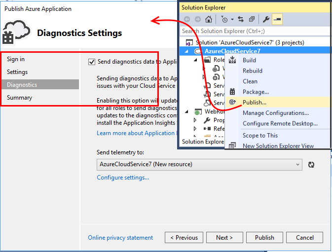
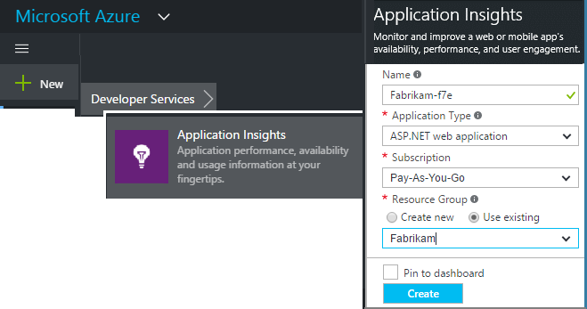
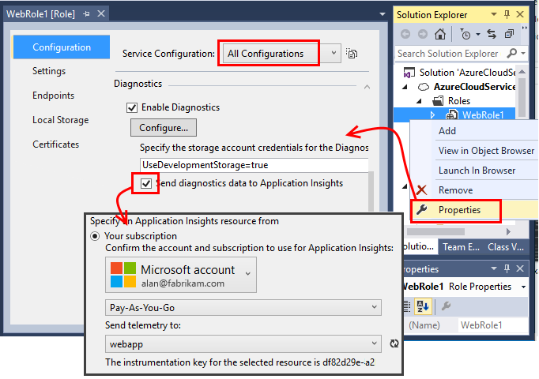
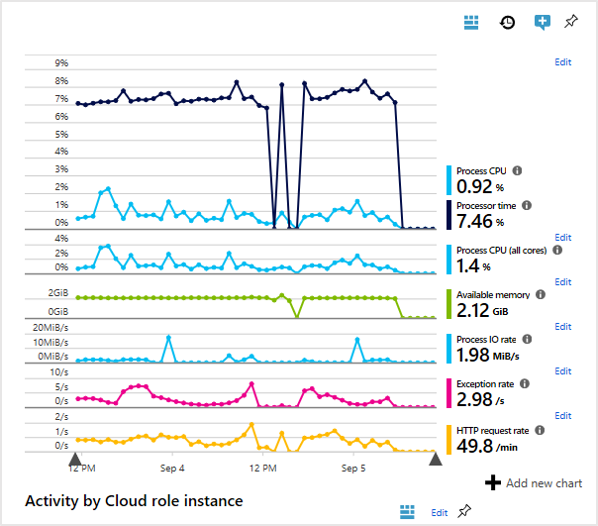

# Application Insights for Azure cloud services
[Application Insights][start] can monitor [Azure cloud service apps](https://azure.microsoft.com/services/cloud-services/) for availability, performance, failures, and usage by combining data from Application Insights SDKs with [Azure Diagnostics](https://docs.microsoft.com/azure/monitoring-and-diagnostics/azure-diagnostics) data from your cloud services. With the feedback you get about the performance and effectiveness of your app in the wild, you can make informed choices about the direction of the design in each development lifecycle.


## Prerequisites
Before you begin, you need:

* An [Azure](https://azure.com) subscription. Sign in with your Microsoft account for Windows, Xbox Live, or other Microsoft cloud services. 
* Microsoft Azure tools 2.9 or later.
* Developer Analytics Tools 7.10 or later.

## Get started quickly
The quickest and easiest way to monitor your cloud service with Application Insights is to choose that option when you publish your service to Azure.



This option instruments your app at runtime, giving you all the telemetry that you need to monitor requests, exceptions, and dependencies in your web role. It also monitors performance counters from your worker roles. Any diagnostics traces generated by your app are also sent to Application Insights.

If this option is all you need, you're done. 

Your next steps are [viewing metrics from your app](../../azure-monitor/app/metrics-explorer.md), [querying your data with Analytics](../../azure-monitor/app/analytics.md). 

To monitor performance in the browser, you might also want to set up [availability tests](../../azure-monitor/app/monitor-web-app-availability.md) and [add code to your webpages](../../azure-monitor/app/javascript.md).

The next sections discuss the following additional options:

* Send data from various components and build configurations to separate resources.
* Add custom telemetry from your app.

## Sample app instrumented with Application Insights
In this [sample app](https://github.com/Microsoft/ApplicationInsights-Home/tree/master/Samples/AzureEmailService), Application Insights is added to a cloud service with two worker roles hosted in Azure. 

In the next section, you learn how to adapt your own cloud service project in the same way.

## Plan resources and resource groups
The telemetry from your app is stored, analyzed, and displayed in an Azure resource of type Application Insights. 

Each resource belongs to a resource group. Resource groups are used to manage costs, to grant access to team members, and to deploy updates in a single coordinated transaction. For example, you could [write a script to deploy](../../azure-resource-manager/resource-group-template-deploy.md) an Azure cloud service and its Application Insights monitoring resources all in one operation.

### Resources for components
We recommend that you create a separate resource for each component of your app. That is, you create a resource for each web role and worker role. You can analyze each component separately, but you create a [dashboard](../../azure-monitor/app/overview-dashboard.md) that brings together the key charts from all the components, so that you can compare and monitor them together in a single view. 

An alternative approach is to send the telemetry from more than one role to the same resource, but [add a dimension property to each telemetry item](../../azure-monitor/app/api-filtering-sampling.md#add-properties-itelemetryinitializer) that identifies its source role. In this approach, metric charts, such as exceptions, normally show an aggregation of the counts from the various roles, but you can segment the chart by the role identifier, as necessary. You can also filter searches by the same dimension. This alternative makes it a bit easier to view everything at the same time, but it could also lead to some confusion between the roles.

Browser telemetry is usually included in the same resource as its server-side web role.

Put the Application Insights resources for the various components in one resource group. This approach makes it easy to manage them together. 

### Separate development, test, and production
If you are developing custom events for your next feature while the previous version is live, you want to send the development telemetry to a separate Application Insights resource. Otherwise, it can be hard to find your test telemetry among all the traffic from the live site.

To avoid this situation, create separate resources for each build configuration or "stamp" (development, test, production, and so on) of your system. Put the resources for each build configuration in a separate resource group. 

To send the telemetry to the appropriate resources, you can set up the Application Insights SDK so that it picks up a different instrumentation key, depending on the build configuration. 

## Create an Application Insights resource for each role

If you've decided to create a separate resource for each role, and perhaps a separate set for each build configuration, it's easiest to create them all in the Application Insights portal. If you create resources a lot, you can [automate the process](../../azure-monitor/app/powershell.md).

1. In the [Azure portal][portal], select **New** > **Developer Services** > **Application Insights**.  

    

1. In the **Application Type** drop-down list, select **ASP.NET web application**.  
    Each resource is identified by an instrumentation key. You might need this key later if you want to manually configure or verify the configuration of the SDK.


## Set up Azure Diagnostics for each role
Set this option to monitor your app with Application Insights. For web roles, this option provides performance monitoring, alerts, diagnostics, and usage analysis. For other roles, you can search and monitor Azure Diagnostics such as restart, performance counters, and calls to System.Diagnostics.Trace. 

1. In Visual Studio Solution Explorer, under **\<YourCloudService>** > **Roles**, open the properties of each role.

1. In **Configuration**, select the **Send diagnostics data to Application Insights** check box, and then select the Application Insights resource that you created earlier.

If you have decided to use a separate Application Insights resource for each build configuration, select the configuration first.



This has the effect of inserting your Application Insights instrumentation keys into the files named *ServiceConfiguration.\*.cscfg*. Here is the [Sample code](https://github.com/Microsoft/ApplicationInsights-Home/blob/master/Samples/AzureEmailService/AzureEmailService/ServiceConfiguration.Cloud.cscfg).

If you want to vary the level of diagnostics information that's sent to Application Insights, you can do so [by editing the *.cscfg* files directly](../../azure-monitor/platform/diagnostics-extension-to-application-insights.md).

## <a name="sdk"></a>Install the SDK in each project
With this option, you can add custom business telemetry to any role. The option provides a closer analysis of how your app is used and performs.

In Visual Studio, configure the Application Insights SDK for each cloud app project.

1. To configure **web roles**, right-click the project, and then select **Configure Application Insights** or **Add > Application Insights telemetry**.

1. To configure **worker roles**: 

    a. Right-click the project, and then select **Manage NuGet Packages**.

    b. Add [Application Insights for Windows Servers](https://www.nuget.org/packages/Microsoft.ApplicationInsights.WindowsServer/).

    

1. To configure the SDK to send data to the Application Insights resource:

    a. In a suitable startup function, set the instrumentation key from the configuration setting in the *.cscfg* file:
 
    ```csharp
   
     TelemetryConfiguration.Active.InstrumentationKey = RoleEnvironment.GetConfigurationSettingValue("APPINSIGHTS_INSTRUMENTATIONKEY");
    ```
   
    b. Repeat "step a" for each role in your app. See the examples:
   
    * [Web role](https://github.com/Microsoft/ApplicationInsights-Home/blob/master/Samples/AzureEmailService/MvcWebRole/Global.asax.cs#L27)
    * [Worker role](https://github.com/Microsoft/ApplicationInsights-Home/blob/master/Samples/AzureEmailService/WorkerRoleA/WorkerRoleA.cs#L232)
    * [For webpages](https://github.com/Microsoft/ApplicationInsights-Home/blob/master/Samples/AzureEmailService/MvcWebRole/Views/Shared/_Layout.cshtml#L13) 

1. Set the *ApplicationInsights.config* file to be copied always to the output directory.  
    A message in the *.config* file asks you to place the instrumentation key there. However, for cloud apps, it's better to set it from the *.cscfg* file. This approach ensures that the role is correctly identified in the portal.

## Set up Status Monitor to collect full SQL Queries (optional)

This step is only needed if you want to capture full SQL queries on .NET Framework. 

1. In `\*.csdef` file Add [startup task](https://docs.microsoft.com/azure/cloud-services/cloud-services-startup-tasks) for each role similar to 

    ```xml
    <Startup>
      <Task commandLine="AppInsightsAgent\InstallAgent.bat" executionContext="elevated" taskType="simple">
        <Environment>
          <Variable name="ApplicationInsightsAgent.DownloadLink" value="http://go.microsoft.com/fwlink/?LinkID=522371" />
          <Variable name="RoleEnvironment.IsEmulated">
            <RoleInstanceValue xpath="/RoleEnvironment/Deployment/@emulated" />
          </Variable>
        </Environment>
      </Task>
    </Startup>
    ```
    
2. Download [InstallAgent.bat](https://github.com/microsoft/ApplicationInsights-Home/blob/master/Samples/AzureEmailService/WorkerRoleA/AppInsightsAgent/InstallAgent.bat) and [InstallAgent.ps1](https://github.com/microsoft/ApplicationInsights-Home/blob/master/Samples/AzureEmailService/WorkerRoleA/AppInsightsAgent/InstallAgent.ps1), put them into the `AppInsightsAgent` folder on each role project. Make sure to copy them to the output directory through Visual Studio file properties or build scripts.

3. On all Worker Roles, add environment variables: 

    ```xml
      <Environment>
        <Variable name="COR_ENABLE_PROFILING" value="1" />
        <Variable name="COR_PROFILER" value="{324F817A-7420-4E6D-B3C1-143FBED6D855}" />
        <Variable name="MicrosoftInstrumentationEngine_Host" value="{CA487940-57D2-10BF-11B2-A3AD5A13CBC0}" />
      </Environment>
    ```
    
## Run and publish the app

1. Run your app, and sign in to Azure. 

1. Open the Application Insights resources that you created.  
    Individual data points are displayed in [Search](../../azure-monitor/app/diagnostic-search.md), and aggregated data is displayed in [Metric Explorer](../../azure-monitor/app/metrics-explorer.md). 

1. Add more telemetry (see the next sections) and then publish your app to get live diagnostics and usage feedback. 

If there is no data, do the following:
1. To view individual events, open the [Search][diagnostic] tile.
1. In the app, open various pages so that it generates some telemetry.
1. Wait a few seconds, and then click **Refresh**.  
    For more information, see [Troubleshooting][qna].

## View Azure Diagnostics events
You can find the [Azure Diagnostics](https://docs.microsoft.com/azure/monitoring-and-diagnostics/azure-diagnostics) information in Application Insights in the following locations:

* Performance counters are displayed as custom metrics. 
* Windows event logs are shown as traces and custom events.
* Application logs, ETW logs, and any diagnostics infrastructure logs appear as traces.

To view performance counters and counts of events, open [Metrics Explorer](../../azure-monitor/app/metrics-explorer.md) and add the following chart:


To search across the various trace logs that are sent by Azure Diagnostics, use [Search](../../azure-monitor/app/diagnostic-search.md) or an [Analytics query](../../azure-monitor/log-query/get-started-portal.md). For example, suppose you have an unhandled exception that has caused a role to crash and recycle. That information would show up in the Application channel of Windows Event Log. You can use Search to view the Windows Event Log error and get the full stack trace for the exception. Doing so helps you find the root cause of the issue.


## More telemetry
The next sections discuss how to get additional telemetry from various aspects of your app.

## Track requests from worker roles
In web roles, the requests module automatically collects data about HTTP requests. For examples of how you can override the default collection behavior, see the [sample MVCWebRole](https://github.com/Microsoft/ApplicationInsights-Home/tree/master/Samples/AzureEmailService/MvcWebRole). 

You can capture the performance of calls to worker roles by tracking them in the same way as HTTP requests. In Application Insights, the Request telemetry type measures a unit of named server-side work that can be timed and can independently succeed or fail. Although HTTP requests are captured automatically by the SDK, you can insert your own code to track requests to worker roles.

See the two sample worker roles instrumented to report requests: 
* [WorkerRoleA](https://github.com/Microsoft/ApplicationInsights-Home/tree/master/Samples/AzureEmailService/WorkerRoleA)
* [WorkerRoleB](https://github.com/Microsoft/ApplicationInsights-Home/tree/master/Samples/AzureEmailService/WorkerRoleB)

## Exceptions
For information about how to collect unhandled exceptions from various web app types, see [Monitoring exceptions in Application Insights](../../azure-monitor/app/asp-net-exceptions.md).

The sample web role has MVC5 and Web API 2 controllers. The unhandled exceptions from the two are captured with the following handlers:

* [AiHandleErrorAttribute](https://github.com/Microsoft/ApplicationInsights-Home/blob/master/Samples/AzureEmailService/MvcWebRole/Telemetry/AiHandleErrorAttribute.cs) set up for MVC5 controllers [as shown in this example](https://github.com/Microsoft/ApplicationInsights-Home/blob/master/Samples/AzureEmailService/MvcWebRole/App_Start/FilterConfig.cs#L12) 
* [AiWebApiExceptionLogger](https://github.com/Microsoft/ApplicationInsights-Home/blob/master/Samples/AzureEmailService/MvcWebRole/Telemetry/AiWebApiExceptionLogger.cs) set up for Web API 2 controllers [as shown in this example](https://github.com/Microsoft/ApplicationInsights-Home/blob/master/Samples/AzureEmailService/MvcWebRole/App_Start/WebApiConfig.cs#L25) 

For worker roles, you can track exceptions in two ways:

* Use TrackException(ex).
* If you have added the Application Insights trace listener NuGet package, you can use System.Diagnostics.Trace to log exceptions [as shown in this example](https://github.com/Microsoft/ApplicationInsights-Home/blob/master/Samples/AzureEmailService/WorkerRoleA/WorkerRoleA.cs#L107).

## Performance counters
The following counters are collected by default:

* \Process(??APP_WIN32_PROC??)\% Processor Time
* \Memory\Available Bytes
* \.NET CLR Exceptions(??APP_CLR_PROC??)\# of Exceps Thrown / sec
* \Process(??APP_WIN32_PROC??)\Private Bytes
* \Process(??APP_WIN32_PROC??)\IO Data Bytes/sec
* \Processor(_Total)\% Processor Time

For web roles, these counters are also collected:

* \ASP.NET Applications(??APP_W3SVC_PROC??)\Requests/Sec
* \ASP.NET Applications(??APP_W3SVC_PROC??)\Request Execution Time
* \ASP.NET Applications(??APP_W3SVC_PROC??)\Requests In Application Queue

You can specify additional custom or other Windows performance counters by editing *ApplicationInsights.config* [as shown in this example](https://github.com/Microsoft/ApplicationInsights-Home/blob/master/Samples/AzureEmailService/WorkerRoleA/ApplicationInsights.config#L14).

  

## Correlated telemetry for worker roles
For a rich diagnostics experience, you can view what led to a failed or high latency request. With web roles, the SDK automatically sets up a correlation between related telemetry. 

To achieve this view for worker roles, you can use a custom telemetry initializer to set a common Operation.Id context attribute for all the telemetry. Doing so lets you view at a glance whether the latency or failure issue was caused by a dependency or your code. 

Here's how:

* Set the correlationId into a CallContext [as shown in this example](https://github.com/Microsoft/ApplicationInsights-Home/blob/master/Samples/AzureEmailService/WorkerRoleA/WorkerRoleA.cs#L36). In this case, we are using the Request ID as the correlationId.
* Add a custom TelemetryInitializer implementation, to set the Operation.Id to the correlationId that was set previously. For an example, see [ItemCorrelationTelemetryInitializer](https://github.com/Microsoft/ApplicationInsights-Home/blob/master/Samples/AzureEmailService/WorkerRoleA/Telemetry/ItemCorrelationTelemetryInitializer.cs#L13).
* Add the custom telemetry initializer. You could do so in the *ApplicationInsights.config* file or in code [as shown in this example](https://github.com/Microsoft/ApplicationInsights-Home/blob/master/Samples/AzureEmailService/WorkerRoleA/WorkerRoleA.cs#L233).

## Client telemetry
To get browser-based telemetry, such as page view counts, page load times, or script exceptions, and to write custom telemetry in your page scripts, see [Add the JavaScript SDK to your webpages][client].

## Availability tests
To make sure your app stays live and responsive, [Set up web tests][availability].

## Display everything together
For an overall picture of your system, you can display the key monitoring charts together on one [dashboard](../../azure-monitor/app/overview-dashboard.md). For example, you could pin the request and failure counts of each role. 

If your system uses other Azure services, such as Stream Analytics, include their monitoring charts as well. 

If you have a client mobile app, use [App Center](../../azure-monitor/learn/mobile-center-quickstart.md). Create queries in [Analytics](../../azure-monitor/app/analytics.md) to display the event counts, and pin them to the dashboard.

## Example
[The example](https://github.com/Microsoft/ApplicationInsights-Home/tree/master/Samples/AzureEmailService) monitors a service that has a web role and two worker roles.

## Exception "method not found" on running in Azure cloud services
Did you build for .NET 4.6? .NET 4.6 is not automatically supported in Azure cloud services roles. [Install .NET 4.6 on each role](../../cloud-services/cloud-services-dotnet-install-dotnet.md) before running your app.

## Video

> [!VIDEO https://channel9.msdn.com/events/Connect/2016/100/player]

## Next steps
* [Configure sending Azure Diagnostics to Application Insights](../../azure-monitor/platform/diagnostics-extension-to-application-insights.md)
* [Automatically create Application Insights resources](../../azure-monitor/app/powershell.md)
* [Automate Azure Diagnostics](../../azure-monitor/app/powershell-azure-diagnostics.md)
* [Azure Functions](https://github.com/christopheranderson/azure-functions-app-insights-sample)

[api]: ../../azure-monitor/app/api-custom-events-metrics.md
[availability]: ../../azure-monitor/app/monitor-web-app-availability.md
[azure]: ../../azure-monitor/app/app-insights-overview.md
[client]: ../../azure-monitor/app/javascript.md
[diagnostic]: ../../azure-monitor/app/diagnostic-search.md
[netlogs]: ../../azure-monitor/app/asp-net-trace-logs.md
[portal]: https://portal.azure.com/
[qna]: ../../azure-monitor/app/troubleshoot-faq.md
[redfield]: ../../azure-monitor/app/monitor-performance-live-website-now.md
[start]: ../../azure-monitor/app/app-insights-overview.md 
