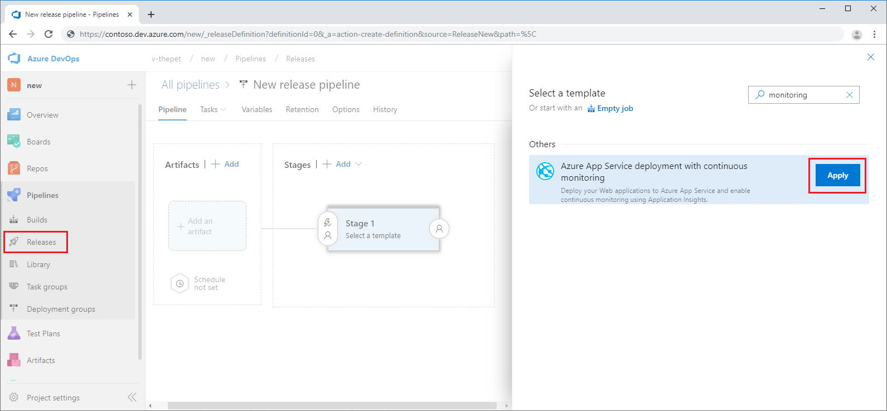
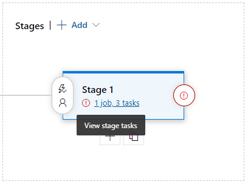
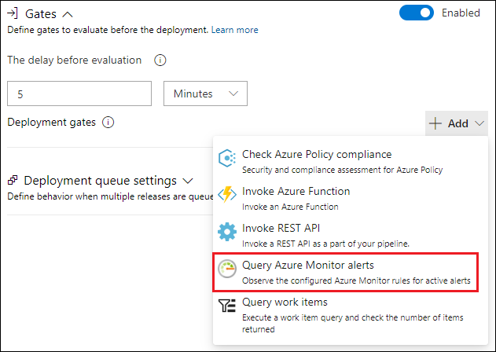
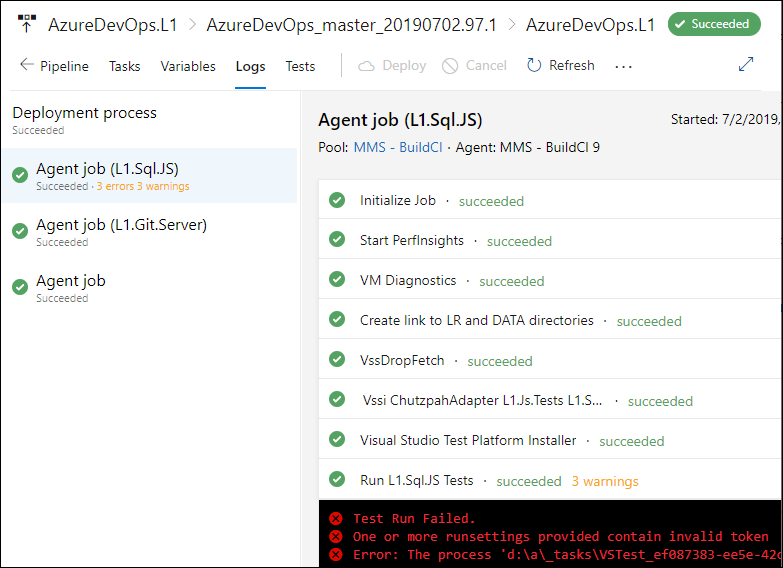

# Add continuous monitoring to your release pipeline

Azure DevOps Services integrates with Azure Application Insights to allow continuous monitoring of your DevOps release pipeline throughout the software development lifecycle. 

Azure DevOps Services now supports continuous monitoring whereby release pipelines can incorporate monitoring data from Application Insights and other Azure resources. When an Application Insights alert is detected, the deployment can remain gated or be rolled back until the alert is resolved. If all checks pass, deployments can proceed automatically from test all the way to production without the need for manual intervention. 

## Configure continuous monitoring

1. Select an existing Azure DevOps Services Project.

2. Hover over **Build and Release** > Select **Releases** > Click the **plus sign** > **Create release definition** > Search for **Monitoring** > **Azure App Service Deployment with Continuous Monitoring.**

   

3. Click **Apply.**

4. Next to the red exclamation point select the text in blue to **View environment tasks.**

   

   A configuration box will appear, use the following table to fill out the input fields.

    | Parameter        | Value |
   | ------------- |:-----|
   | **Environment name**      | Name that describes the release pipeline environment |
   | **Azure subscription** | Drop-down populates with any Azure subscriptions linked to the Azure DevOps Services organization|
   | **App Service name** | Manual entry of a new value may be required for this field depending on other selections |
   | **Resource Group**    | Drop-down populates with available Resource Groups |
   | **Application Insights resource name** | Drop-down populates with all Application Insights resources that correspond to the previously selected resource group.

5. Select **Configure Application Insights alerts**

6. For default alert rules, select **Save** > Enter a descriptive comment > Click **OK**

## Modify alert rules

1. To modify the predefined Alert settings, click the box with **ellipses ...** to the right of **Alert rules.**

   (Out-of-box four alert rules are present: Availability, Failed requests, Server response time, Server exceptions.)

2. Click the drop-down symbol next to **Availability.**

3. Modify the availability **Threshold** to meet your service level requirements.

   

4. Select **OK** > **Save** > Enter a descriptive comment > Click **OK.**

## Add deployment conditions

1. Click **Pipeline** > Select the **Pre** or **Post-deployment conditions** symbol depending on the stage that requires a continuous monitoring gate.

   

2. Set **Gates** to  **Enabled** > **Approval gates**>  Click **Add.**

3. Select **Azure Monitor** (This option gives you the ability to access alerts both from Azure Monitor and Application Insights)

    

4. Enter a **Gates timeout** value.

5. Enter a **Sampling Interval.**

## Deployment gate status logs

Once you add deployment gates, an alert in Application Insights which exceeds your previously defined threshold, guards your deployment from unwanted release promotion. Once the alert is resolved, the deployment can proceed automatically.

To observe this behavior, Select **Releases** > Right-click Release name **open** > **Logs.**

## Next steps

To learn more about Azure Pipelines try these [quickstarts.](https://docs.microsoft.com/azure/devops/pipelines)
