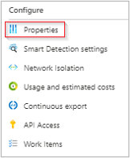
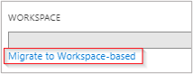
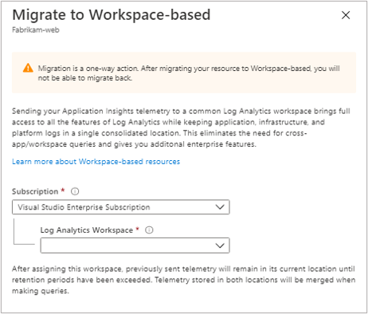
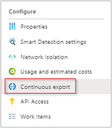
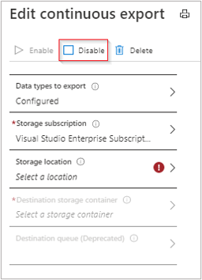

# Migrate to workspace-based Application Insights resources

This guide will walk you through the process of migrating a classic Application Insights resource to a workspace-based resource. Workspace-based resources support full integration between Application Insights and Log Analytics. Workspace-based resources send Application Insights telemetry to a common Log Analytics workspace, which allows you to access [the latest features of Azure Monitor](#new-capabilities) while keeping application, infrastructure, and platform logs in a single consolidated location.

Workspace-based resources enables common Azure role-based access control (Azure RBAC) across your resources, and eliminates the need for cross-app/workspace queries.

**Workspace-based resources are currently available in all commercial regions and Azure US Government**

## New capabilities

Workspace-based Application Insights allows you to take advantage of all the latest capabilities of Azure Monitor and Log Analytics including:

* [Customer-Managed Keys (CMK)](../logs/customer-managed-keys.md) provides encryption at rest for your data with encryption keys that only you have access to.
* [Azure Private Link](../logs/private-link-security.md) allows you to securely link Azure PaaS services to your virtual network using private endpoints.
* [Bring Your Own Storage (BYOS) for Profiler and Snapshot Debugger](./profiler-bring-your-own-storage.md) gives you full control over the encryption-at-rest policy, the lifetime management policy, and network access for all data associated with Application Insights Profiler and Snapshot Debugger. 
* [Capacity Reservation tiers](../logs/manage-cost-storage.md#pricing-model) enable you to save as much as 25% compared to the Pay-As-You-Go price. 
* Faster data ingestion via Log Analytics streaming ingestion.

## Migration process

When you migrate to a workspace-based resource, no data is transferred from your classic resource's storage to the new workspace-based storage. Choosing to migrate will instead change the location where new data is written to a Log Analytics workspace while preserving access to your classic resource data. 

Your classic resource data will persist and be subject to the retention settings on your classic Application Insights resource. All new data ingested post migration will be subject to the [retention settings](../logs/manage-cost-storage.md#change-the-data-retention-period) of the associated Log Analytics workspace, which also supports [different retention settings by data type](../logs/manage-cost-storage.md#retention-by-data-type).
The migration process is **permanent, and cannot be reversed**. Once you migrate a resource to workspace-based Application Insights, it will always be a workspace-based resource. However, once you migrate you are able to change the target workspace as often as needed. 

> [!NOTE]
> Data ingestion and retention for workspace-based Application Insights resources are [billed through the Log Analytics workspace](../logs/manage-cost-storage.md) where the data is located. If you’ve selected data retention greater than 90 days on data ingested into the Classic Application Insights resource prior to migration, data retention will continue to be billed to through that Application Insights resource. [Learn more]( ./pricing.md#workspace-based-application-insights) about billing for workspace-based Application Insights resources.

If you don't need to migrate an existing resource, and instead want to create a new workspace-based Application Insights resource use the [workspace-based resource creation guide](create-workspace-resource.md).

## Pre-requisites 

- A Log Analytics workspace with the access control mode set to the **`use resource or workspace permissions`** setting. 

    - Workspace-based Application Insights resources are not compatible with workspaces set to the dedicated **`workspace based permissions`** setting. To learn more about Log Analytics workspace access control, consult the [Log Analytics configure access control mode guidance](../logs/manage-access.md#configure-access-control-mode)

    - If you don't already have an existing Log Analytics Workspace, [consult the Log Analytics workspace creation documentation](../logs/quick-create-workspace.md).
    
- Continuous export is not supported for workspace-based resources and must be disabled.
Once the migration is complete, you can use [diagnostic settings](../essentials/diagnostic-settings.md) to configure data archiving to a storage account or streaming to Azure Event Hub.  

- Check your current retention settings under **General** > **Usage and estimated costs** > **Data Retention** for your Log Analytics workspace. This setting will impact how long any new ingested data is stored once you migrate your Application Insights resource. If you currently store Application Insights data for longer than the default 90 days and want to retain this larger retention period, you may need to adjust your workspace retention settings.

## Migrate your resource

This section will walk you through the process of migrating a classic Application Insights resource to the new workspace-based resource type.

1. From your Application Insights resource, select **Properties** under the **Configure** heading in the left-hand menu bar.

    

2. Select **`Migrate to Workspace-based`**.
    
     

3. Choose the Log Analytics Workspace where you want all future ingested Application Insights telemetry to be stored.

     
    

Once your resource is migrated, you will see the corresponding workspace info in the **Overview** pane:


Clicking the blue link text will take you to the associated Log Analytics workspace where you can take advantage of the new unified workspace query environment.

## Understanding log queries

We still provide full backwards compatibility for your Application Insights classic resource queries, workbooks, and log-based alerts within the Application Insights experience. 

To write queries against the [new workspace-based table structure/schema](apm-tables.md), you must first navigate to your Log Analytics workspace. 

When you query directly from the Log Analytics UI within your workspace, you will only see the data that is ingested post migration. To see both your classic Application Insights data + new data ingested after migration in a unified query experience use the Logs (Analytics) query view from within your migrated Application Insights resource.

## Programmatic resource migration

### Azure CLI

To access the preview Application Insights Azure CLI commands, you first need to run:

```azurecli
 az extension add -n application-insights
```

If you don't run the `az extension add` command, you will see an error message that states: `az : ERROR: az monitor: 'app-insights' is not in the 'az monitor' command group. See 'az monitor --help'.`

Now you can run the following to create your Application Insights resource:

```azurecli
az monitor app-insights component update --app
                                         --resource-group
                                         [--ingestion-access {Disabled, Enabled}]
                                         [--kind]
                                         [--query-access {Disabled, Enabled}]
                                         [--retention-time]
                                         [--workspace]
```

#### Example

```azurecli
az monitor app-insights component update --app your-app-insights-resource-name -g your_resource_group --workspace "/subscriptions/00000000-0000-0000-0000-000000000000/resourcegroups/test1234/providers/microsoft.operationalinsights/workspaces/test1234555"
```

For the full Azure CLI documentation for this command,  consult the [Azure CLI documentation](/cli/azure/ext/application-insights/monitor/app-insights/component#ext-application-insights-az-monitor-app-insights-component-update).

### Azure PowerShell

The `Update-AzApplicationInsights` PowerShell command does not currently support migrating a classic Application Insights resource to workspace-based. To create a workspace-based resource with PowerShell, you can use the Azure Resource Manager templates below and deploy with PowerShell.

### Azure Resource Manager templates

#### Template file

```json
{
    "$schema": "http://schema.management.azure.com/schemas/2014-04-01-preview/deploymentTemplate.json#",
    "contentVersion": "1.0.0.0",
    "parameters": {
        "name": {
            "type": "string"
        },
        "type": {
            "type": "string"
        },
        "regionId": {
            "type": "string"
        },
        "tagsArray": {
            "type": "object"
        },
        "requestSource": {
            "type": "string"
        },
        "workspaceResourceId": {
            "type": "string"
        }
    },
    "resources": [
        {
            "name": "[parameters('name')]",
            "type": "microsoft.insights/components",
            "location": "[parameters('regionId')]",
            "tags": "[parameters('tagsArray')]",
            "apiVersion": "2020-02-02-preview",
            "properties": {
                "ApplicationId": "[parameters('name')]",
                "Application_Type": "[parameters('type')]",
                "Flow_Type": "Redfield",
                "Request_Source": "[parameters('requestSource')]",
                "WorkspaceResourceId": "[parameters('workspaceResourceId')]"
            }
        }
    ]
}
```

#### Parameters file

```json
{
    "$schema": "https://schema.management.azure.com/schemas/2015-01-01/deploymentParameters.json#",
    "contentVersion": "1.0.0.0",
    "parameters": {
        "type": {
            "value": "web"
        },
        "name": {
            "value": "customresourcename"
        },
        "regionId": {
            "value": "eastus"
        },
        "tagsArray": {
            "value": {}
        },
        "requestSource": {
            "value": "Custom"
        },
        "workspaceResourceId": {
            "value": "/subscriptions/00000000-0000-0000-0000-000000000000/resourcegroups/my_resource_group/providers/microsoft.operationalinsights/workspaces/myworkspacename"
        }
    }
}

```

## Modifying the associated workspace

Once a workspace-based Application Insights resource has been created, you can modify the associated Log Analytics Workspace.

From within the Application Insights resource pane, select **Properties** > **Change Workspace** > **Log Analytics Workspaces**.

## Troubleshooting

### Access mode

**Error message:** *The selected workspace is configured with workspace-based access mode. Some APM features may be impacted. Select another workspace or allow resource-based access in the workspace settings. You can override this error by using CLI.* 

In order for your workspace-based Application Insights resource to operate properly you need to change the access control mode of your target Log Analytics workspace to the **resource or workspace permissions** setting. This setting is located in the Log Analytics workspace UI under **Properties** > **Access control mode**. For detailed instructions, consult the [Log Analytics configure access control mode guidance](../logs/manage-access.md#configure-access-control-mode). If your access control mode is set to the exclusive **Require workspace permissions** setting, migration via the portal migration experience will remain blocked.

If you cannot change the access control mode for security reasons for your current target workspace, we recommend creating a new Log Analytics workspace to use for the migration. 

### Continuous export

**Error message:** *Continuous Export needs to be disabled before continuing. After migration, use Diagnostic Settings for export.* 

The legacy continuous export functionality is not supported for workspace-based resources. Prior to migrating you need to disable continuous export.

1. From your Application Insights resource view, under the **Configure** heading select **Continuous Export**.

    

2. Select **Disable**.

    

- Once you have selected disable, you can navigate back to the migration UI. If the edit continuous export page prompts you that your settings won't be saved, you can select ok for this prompt as it does not pertain to disabling/enabling continuous export.

- Once you have successfully migrated your Application Insights resource to workspace-based, you can use Diagnostic settings to replace the functionality that continuous export used to provide. Select **Diagnostic settings** > **add diagnostic setting** from within your Application Insights resource. You can select all tables, or a subset of tables to archive to a storage account, or to stream to an Azure Event Hub. For detailed guidance on diagnostic settings, refer to the [Azure Monitor diagnostic settings guidance](../essentials/diagnostic-settings.md).

### Retention settings

**Warning Message:** *Your customized Application Insights retention settings will not apply to data sent to the workspace. You will need to reconfigure this separately.*

You don't have to make any changes prior to migrating, but this message is to alert you that your current Application Insights retention settings are not set to the default 90-day retention period. This warning message means you may want to modify the retention settings for your Log Analytics workspace prior to migrating and starting to ingest new data. 

You can check your current retention settings for Log Analytics under **General** > **Usage and estimated costs** > **Data Retention** from within the Log Analytics UI. This setting will impact how long any new ingested data is stored once you migrate your Application Insights resource.

## Next steps

* [Explore metrics](../essentials/metrics-charts.md)
* [Write Analytics queries](../logs/log-query-overview.md)
