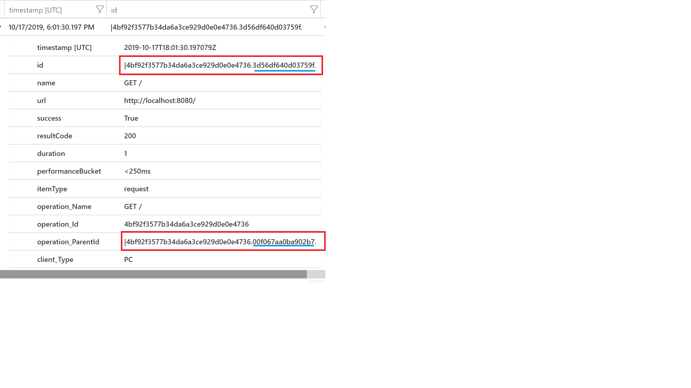

# Telemetry correlation in Application Insights

In the world of microservices, every logical operation requires work to be done in various components of the service. You can monitor each of these components separately by using [Application Insights](../../azure-monitor/app/app-insights-overview.md). Application Insights supports distributed telemetry correlation, which you use to detect which component is responsible for failures or performance degradation.

This article explains the data model used by Application Insights to correlate telemetry sent by multiple components. It covers context-propagation techniques and protocols. It also covers the implementation of correlation tactics on different languages and platforms.

[!INCLUDE [azure-monitor-log-analytics-rebrand](../../../includes/azure-monitor-instrumentation-key-deprecation.md)]

## Data model for telemetry correlation

Application Insights defines a [data model](../../azure-monitor/app/data-model.md) for distributed telemetry correlation. To associate telemetry with a logical operation, every telemetry item has a context field called `operation_Id`. This identifier is shared by every telemetry item in the distributed trace. So even if you lose telemetry from a single layer, you can still associate telemetry reported by other components.

A distributed logical operation typically consists of a set of smaller operations that are requests processed by one of the components. These operations are defined by [request telemetry](../../azure-monitor/app/data-model-request-telemetry.md). Every request telemetry item has its own `id` that identifies it uniquely and globally. And all telemetry items (such as traces and exceptions) that are associated with the request should set the `operation_parentId` to the value of the request `id`.

Every outgoing operation, such as an HTTP call to another component, is represented by [dependency telemetry](../../azure-monitor/app/data-model-dependency-telemetry.md). Dependency telemetry also defines its own `id` that's globally unique. Request telemetry, initiated by this dependency call, uses this `id` as its `operation_parentId`.

You can build a view of the distributed logical operation by using `operation_Id`, `operation_parentId`, and `request.id` with `dependency.id`. These fields also define the causality order of telemetry calls.

In a microservices environment, traces from components can go to different storage items. Every component can have its own connection string in Application Insights. To get telemetry for the logical operation, Application Insights queries data from every storage item. 

When the number of storage items is large, you'll need a hint about where to look next. The Application Insights data model defines two fields to solve this problem: `request.source` and `dependency.target`. The first field identifies the component that initiated the dependency request. The second field identifies which component returned the response of the dependency call.

For information on querying from multiple disparate instances by using the `app` query expression, see [app() expression in Azure Monitor query](../logs/app-expression.md#app-expression-in-azure-monitor-query).

## Example

Let's look at an example. An application called Stock Prices shows the current market price of a stock by using an external API called Stock. The Stock Prices application has a page called Stock page that the client web browser opens by using `GET /Home/Stock`. The application queries the Stock API by using the HTTP call `GET /api/stock/value`.

You can analyze the resulting telemetry by running a query:

```kusto
(requests | union dependencies | union pageViews)
| where operation_Id == "STYz"
| project timestamp, itemType, name, id, operation_ParentId, operation_Id
```

In the results, all telemetry items share the root `operation_Id`. When an Ajax call is made from the page, a new unique ID (`qJSXU`) is assigned to the dependency telemetry, and the ID of the pageView is used as `operation_ParentId`. The server request then uses the Ajax ID as `operation_ParentId`.

| itemType   | name                      | ID           | operation_ParentId | operation_Id |
|------------|---------------------------|--------------|--------------------|--------------|
| pageView   | Stock page                | STYz         |                    | STYz         |
| dependency | GET /Home/Stock           | qJSXU        | STYz               | STYz         |
| request    | GET Home/Stock            | KqKwlrSt9PA= | qJSXU              | STYz         |
| dependency | GET /api/stock/value      | bBrf2L7mm2g= | KqKwlrSt9PA=       | STYz         |

When the call `GET /api/stock/value` is made to an external service, you need to know the identity of that server so you can set the `dependency.target` field appropriately. When the external service doesn't support monitoring, `target` is set to the host name of the service. An example is `stock-prices-api.com`. But if the service identifies itself by returning a predefined HTTP header, `target` contains the service identity that allows Application Insights to build a distributed trace by querying telemetry from that service.

## Correlation headers using W3C TraceContext

Application Insights is transitioning to [W3C Trace-Context](https://w3c.github.io/trace-context/), which defines:

- `traceparent`: Carries the globally unique operation ID and unique identifier of the call.
- `tracestate`: Carries system-specific tracing context.

The latest version of the Application Insights SDK supports the Trace-Context protocol, but you might need to opt in to it. (Backward compatibility with the previous correlation protocol supported by the Application Insights SDK will be maintained.)

The [correlation HTTP protocol, also called Request-Id](https://github.com/dotnet/runtime/blob/master/src/libraries/System.Diagnostics.DiagnosticSource/src/HttpCorrelationProtocol.md), is being deprecated. This protocol defines two headers:

- `Request-Id`: Carries the globally unique ID of the call.
- `Correlation-Context`: Carries the name-value pairs collection of the distributed trace properties.

Application Insights also defines the [extension](https://github.com/lmolkova/correlation/blob/master/http_protocol_proposal_v2.md) for the correlation HTTP protocol. It uses `Request-Context` name-value pairs to propagate the collection of properties used by the immediate caller or callee. The Application Insights SDK uses this header to set the `dependency.target` and `request.source` fields.

The [W3C Trace-Context](https://w3c.github.io/trace-context/) and Application Insights data models map in the following way:

| Application Insights                   | W3C TraceContext                                      |
|------------------------------------    |-------------------------------------------------|
| `Id` of `Request` and `Dependency`     | [parent-id](https://w3c.github.io/trace-context/#parent-id)                                     |
| `Operation_Id`                         | [trace-id](https://w3c.github.io/trace-context/#trace-id)                                           |
| `Operation_ParentId`                   | [parent-id](https://w3c.github.io/trace-context/#parent-id) of this span's parent span. This field must be empty if it's a root span.|

For more information, see [Application Insights telemetry data model](../../azure-monitor/app/data-model.md).

### Enable W3C distributed tracing support for .NET apps

W3C TraceContext-based distributed tracing is enabled by default in all recent
.NET Framework/.NET Core SDKs, along with backward compatibility with legacy Request-Id protocol.

### Enable W3C distributed tracing support for Java apps

#### Java 3.0 agent

  Java 3.0 agent supports W3C out of the box, and no more configuration is needed.

#### Java SDK

- **Incoming configuration**

  For Java EE apps, add the following code to the `<TelemetryModules>` tag in *ApplicationInsights.xml*:

  ```xml
  <Add type="com.microsoft.applicationinsights.web.extensibility.modules.WebRequestTrackingTelemetryModule>
     <Param name = "W3CEnabled" value ="true"/>
     <Param name ="enableW3CBackCompat" value = "true" />
  </Add>
  ```

  For Spring Boot apps, add these properties:

  - `azure.application-insights.web.enable-W3C=true`
  - `azure.application-insights.web.enable-W3C-backcompat-mode=true`

- **Outgoing configuration**

  Add the following code to *AI-Agent.xml*:

  ```xml
  <Instrumentation>
    <BuiltIn enabled="true">
      <HTTP enabled="true" W3C="true" enableW3CBackCompat="true"/>
    </BuiltIn>
  </Instrumentation>
  ```

  > [!NOTE]
  > Backward compatibility mode is enabled by default, and the `enableW3CBackCompat` parameter is optional. Use it only when you want to turn backward compatibility off.
  >
  > Ideally, you'll' turn off this mode when all your services are updated to newer versions of SDKs that support the W3C protocol. We highly recommend that you move to these newer SDKs as soon as possible.

It's important to make sure the incoming and outgoing configurations are exactly the same.

### Enable W3C distributed tracing support for web apps

This feature is in `Microsoft.ApplicationInsights.JavaScript`. It's disabled by default. To enable it, use `distributedTracingMode` config. AI_AND_W3C is provided for backward compatibility with any legacy services instrumented by Application Insights.

- **[npm-based setup](./javascript.md#npm-based-setup)**

   Add the following configuration:
  ```JavaScript
    distributedTracingMode: DistributedTracingModes.W3C
  ```

- **[Snippet-based setup](./javascript.md#snippet-based-setup)**

   Add the following configuration:
  ```
      distributedTracingMode: 2 // DistributedTracingModes.W3C
  ```
> [!IMPORTANT]
> To see all configurations required to enable correlation, see the [JavaScript correlation documentation](./javascript.md#enable-distributed-tracing).

## Telemetry correlation in OpenCensus Python

OpenCensus Python supports [W3C Trace-Context](https://w3c.github.io/trace-context/) without requiring extra configuration.

For a reference, you can find the OpenCensus data model on [this GitHub page](https://github.com/census-instrumentation/opencensus-specs/tree/master/trace).

### Incoming request correlation

OpenCensus Python correlates W3C Trace-Context headers from incoming requests to the spans that are generated from the requests themselves. OpenCensus will correlate automatically with integrations for these popular web application frameworks: Flask, Django, and Pyramid. You just need to populate the W3C Trace-Context headers with the [correct format](https://www.w3.org/TR/trace-context/#trace-context-http-headers-format) and send them with the request.

**Sample Flask application**

```python
from flask import Flask
from opencensus.ext.azure.trace_exporter import AzureExporter
from opencensus.ext.flask.flask_middleware import FlaskMiddleware
from opencensus.trace.samplers import ProbabilitySampler

app = Flask(__name__)
middleware = FlaskMiddleware(
    app,
    exporter=AzureExporter(),
    sampler=ProbabilitySampler(rate=1.0),
)

@app.route('/')
def hello():
    return 'Hello World!'

if __name__ == '__main__':
    app.run(host='localhost', port=8080, threaded=True)
```

This code runs a sample Flask application on your local machine, listening to port `8080`. To correlate trace context, you send a request to the endpoint. In this example, you can use a `curl` command:

```
curl --header "traceparent: 00-4bf92f3577b34da6a3ce929d0e0e4736-00f067aa0ba902b7-01" localhost:8080
```

By looking at the [Trace-Context header format](https://www.w3.org/TR/trace-context/#trace-context-http-headers-format), you can derive the following information:

`version`: `00`

`trace-id`: `4bf92f3577b34da6a3ce929d0e0e4736`

`parent-id/span-id`: `00f067aa0ba902b7`

`trace-flags`: `01`

If you look at the request entry that was sent to Azure Monitor, you can see fields populated with the trace header information. You can find the data under **Logs (Analytics)** in the Azure Monitor Application Insights resource.



The `id` field is in the format `<trace-id>.<span-id>`, where `trace-id` is taken from the trace header that was passed in the request and `span-id` is a generated 8-byte array for this span.

The `operation_ParentId` field is in the format `<trace-id>.<parent-id>`, where both `trace-id` and `parent-id` are taken from the trace header that was passed in the request.

### Log correlation

OpenCensus Python enables you to correlate logs by adding a trace ID, a span ID, and a sampling flag to log records. You add these attributes by installing OpenCensus [logging integration](https://pypi.org/project/opencensus-ext-logging/). The following attributes will be added to Python `LogRecord` objects: `traceId`, `spanId`, and `traceSampled` (applicable only for loggers that are created after the integration).

Install the OpenCensus logging integration:

```console
python -m pip install opencensus-ext-logging
```

**Sample application**

```python
import logging

from opencensus.trace import config_integration
from opencensus.trace.samplers import AlwaysOnSampler
from opencensus.trace.tracer import Tracer

config_integration.trace_integrations(['logging'])
logging.basicConfig(format='%(asctime)s traceId=%(traceId)s spanId=%(spanId)s %(message)s')
tracer = Tracer(sampler=AlwaysOnSampler())

logger = logging.getLogger(__name__)
logger.warning('Before the span')
with tracer.span(name='hello'):
    logger.warning('In the span')
logger.warning('After the span')
```
When this code runs, the following prints in the console:
```
2019-10-17 11:25:59,382 traceId=c54cb1d4bbbec5864bf0917c64aeacdc spanId=0000000000000000 Before the span
2019-10-17 11:25:59,384 traceId=c54cb1d4bbbec5864bf0917c64aeacdc spanId=70da28f5a4831014 In the span
2019-10-17 11:25:59,385 traceId=c54cb1d4bbbec5864bf0917c64aeacdc spanId=0000000000000000 After the span
```

Notice that there's a `spanId` present for the log message that's within the span. The `spanId` is the same as that which belongs to the span named `hello`.

You can export the log data by using `AzureLogHandler`. For more information, see [Set up Azure Monitor for your Python application](./opencensus-python.md#logs).

We can also pass trace information from one component to another for proper correlation. For example, consider a scenario where there are two components, `module1` and `module2`. Module1 calls functions in Module2. To get logs from both `module1` and `module2` in a single trace, we can use the following approach:

```python
# module1.py
import logging

from opencensus.trace import config_integration
from opencensus.trace.samplers import AlwaysOnSampler
from opencensus.trace.tracer import Tracer
from module2 import function_1

config_integration.trace_integrations(['logging'])
logging.basicConfig(format='%(asctime)s traceId=%(traceId)s spanId=%(spanId)s %(message)s')
tracer = Tracer(sampler=AlwaysOnSampler())

logger = logging.getLogger(__name__)
logger.warning('Before the span')
with tracer.span(name='hello'):
   logger.warning('In the span')
   function_1(tracer)
logger.warning('After the span')

# module2.py

import logging

from opencensus.trace import config_integration
from opencensus.trace.samplers import AlwaysOnSampler
from opencensus.trace.tracer import Tracer

config_integration.trace_integrations(['logging'])
logging.basicConfig(format='%(asctime)s traceId=%(traceId)s spanId=%(spanId)s %(message)s')
tracer = Tracer(sampler=AlwaysOnSampler())

def function_1(parent_tracer=None):
    if parent_tracer is not None:
        tracer = Tracer(
                    span_context=parent_tracer.span_context,
                    sampler=AlwaysOnSampler(),
                )
    else:
        tracer = Tracer(sampler=AlwaysOnSampler())

    with tracer.span("function_1"):
        logger.info("In function_1")
```

## Telemetry correlation in .NET

Correlation is handled by default when onboarding an app. No special actions are required.

* [Application Insights for ASP.NET Core applications](asp-net-core.md#application-insights-for-aspnet-core-applications)
* [Configure Application Insights for your ASP.NET website](asp-net.md#configure-application-insights-for-your-aspnet-website)
* [Application Insights for Worker Service applications (non-HTTP applications)](worker-service.md#application-insights-for-worker-service-applications-non-http-applications)

.NET runtime supports distributed with the help of [Activity](https://github.com/dotnet/runtime/blob/master/src/libraries/System.Diagnostics.DiagnosticSource/src/ActivityUserGuide.md) and [DiagnosticSource](https://github.com/dotnet/runtime/blob/master/src/libraries/System.Diagnostics.DiagnosticSource/src/DiagnosticSourceUsersGuide.md)

The Application Insights .NET SDK uses `DiagnosticSource` and `Activity` to collect and correlate telemetry.

<a name="java-correlation"></a>
## Telemetry correlation in Java

[Java agent](./java-in-process-agent.md) supports automatic correlation of telemetry. It automatically populates `operation_id` for all telemetry (like traces, exceptions, and custom events) issued within the scope of a request. It also propagates the correlation headers that were described earlier for service-to-service calls via HTTP, if the [Java SDK agent](java-2x-agent.md) is configured.

> [!NOTE]
> Application Insights Java agent autocollects requests and dependencies for JMS, Kafka, Netty/Webflux, and more. For Java SDK, only calls made via Apache HttpClient are supported for the correlation feature. Automatic context propagation across messaging technologies like Kafka, RabbitMQ, and Azure Service Bus isn't supported in the SDK.

To collect custom telemetry, you need to instrument the application with Java 2.6 SDK.

### Role names

You might want to customize the way component names are displayed in [Application Map](../../azure-monitor/app/app-map.md). To do so, you can manually set `cloud_RoleName` by taking one of the following actions:

- For Application Insights Java, set the cloud role name as follows:

    ```json
    {
      "role": {
        "name": "my cloud role name"
      }
    }
    ```

  You can also set the cloud role name by using the environment variable `APPLICATIONINSIGHTS_ROLE_NAME`.

- With Application Insights Java SDK 2.5.0 and later, you can specify `cloud_RoleName`
  by adding `<RoleName>` to your *ApplicationInsights.xml* file:

   :::image type="content" source="media/migrate-from-instrumentation-keys-to-connection-strings/migrate-from-instrumentation-keys-to-connection-strings.png" alt-text="Screenshot that shows Application Insights overview and connection string." lightbox="media/migrate-from-instrumentation-keys-to-connection-strings/migrate-from-instrumentation-keys-to-connection-strings.png":::

  ```xml
  <?xml version="1.0" encoding="utf-8"?>
  <ApplicationInsights xmlns="http://schemas.microsoft.com/ApplicationInsights/2013/Settings" schemaVersion="2014-05-30">
     <ConnectionString>InstrumentationKey=00000000-0000-0000-0000-000000000000</ConnectionString>
     <RoleName>** Your role name **</RoleName>
     ...
  </ApplicationInsights>
  ```

- If you use Spring Boot with the Application Insights Spring Boot Starter, set your custom name for the application in the *application.properties* file:

  `spring.application.name=<name-of-app>`

You can also set the cloud role name via environment variable or system property. See [Configuring cloud role name](./java-standalone-config.md#cloud-role-name) for details.

## Next steps

- Write [custom telemetry](../../azure-monitor/app/api-custom-events-metrics.md).
- For advanced correlation scenarios in ASP.NET Core and ASP.NET, see [Track custom operations](custom-operations-tracking.md).
- Learn more about [setting cloud_RoleName](./app-map.md#set-or-override-cloud-role-name) for other SDKs.
- Onboard all components of your microservice on Application Insights. Check out the [supported platforms](./platforms.md).
- See the [data model](./data-model.md) for Application Insights types.
- Learn how to [extend and filter telemetry](./api-filtering-sampling.md).
- Review the [Application Insights config reference](configuration-with-applicationinsights-config.md).
