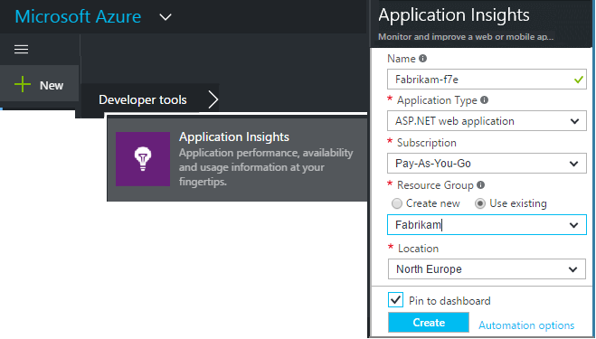
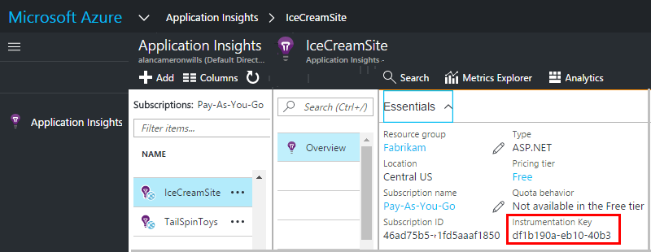

# Create an Application Insights resource
Azure Application Insights displays data about your application in a Microsoft Azure *resource*. Creating a new resource is therefore part of [setting up Application Insights to monitor a new application][start]. In many cases, creating a resource can be done automatically by the IDE. But in some cases, you create a resource manually - for example, to have separate resources for development and production builds of your application.

After you have created the resource, you get its instrumentation key and use that to configure the SDK in the application. The resource key links the telemetry to the resource.

## Sign up to Microsoft Azure
If you haven't got a [Microsoft account, get one now](https://live.com). (If you use services like Outlook.com, OneDrive, Windows Phone, or XBox Live, you already have a Microsoft account.)

You also need a subscription to [Microsoft Azure](https://azure.com). If your team or organization has an Azure subscription, the owner can add you to it, using your Windows Live ID. You're only charged for what you use. The default basic plan allows for a certain amount of experimental use free of charge.

When you've got access to a subscription, log in to Application Insights at [https://portal.azure.com](https://portal.azure.com), and use your Live ID to login.

## Create an Application Insights resource
In the [portal.azure.com](https://portal.azure.com), add an Application Insights resource:

* **Application type** affects what you see on the overview blade and the properties available in [metric explorer][metrics]. If you don't see your type of app, choose General.
* **Subscription** is your payment account in Azure.
* **Resource group** is a convenience for managing properties like access control. If you have already created other Azure resources, you can choose to put this new resource in the same group.
* **Location** is where we keep your data.
* **Pin to dashboard** puts a quick-access tile for your resource on your Azure Home page. Recommended.

When your app has been created, a new blade opens. This blade is where you see performance and usage data about your app. 

To get back to it next time you log in to Azure, look for your app's quick-start tile on the start board (home screen). Or click Browse to find it.

## Copy the instrumentation key
The instrumentation key identifies the resource that you created. You need it to give to the SDK.

## Install the SDK in your app
Install the Application Insights SDK in your app. This step depends heavily on the type of your application. 

Use the instrumentation key to configure [the SDK that you install in your application][start].

The SDK includes standard modules that send telemetry without you having to write any code. To track user actions or diagnose issues in more detail, [use the API][api] to send your own telemetry.

## See telemetry data
Close the quick start blade to return to your application blade in the Azure portal.

Click the Search tile to see [Diagnostic Search][diagnostic], where the first events appear. 

If you're expecting more data, click **Refresh** after a few seconds  .

## Creating a resource automatically
You can write a [PowerShell script](../../azure-monitor/app/powershell.md) to create a resource automatically.

## Next steps
* [Diagnostic Search](../../azure-monitor/app/diagnostic-search.md)
* [Explore metrics](../../azure-monitor/app/metrics-explorer.md)
* [Write Analytics queries](../../azure-monitor/app/analytics.md)

<!--Link references-->

[api]: ../../azure-monitor/app/api-custom-events-metrics.md
[diagnostic]: ../../azure-monitor/app/diagnostic-search.md
[metrics]: ../../azure-monitor/app/metrics-explorer.md
[start]: ../../azure-monitor/app/app-insights-overview.md

