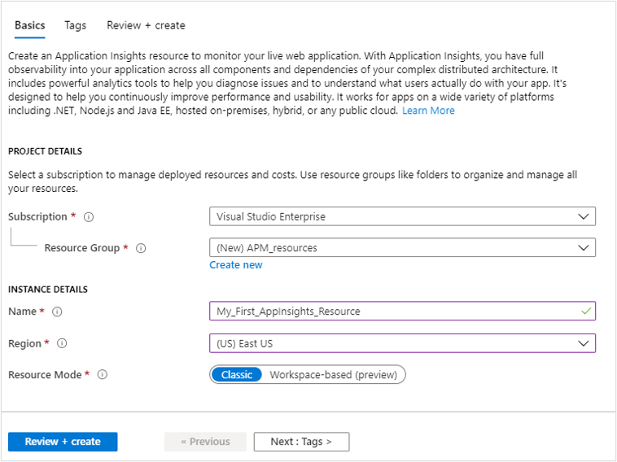
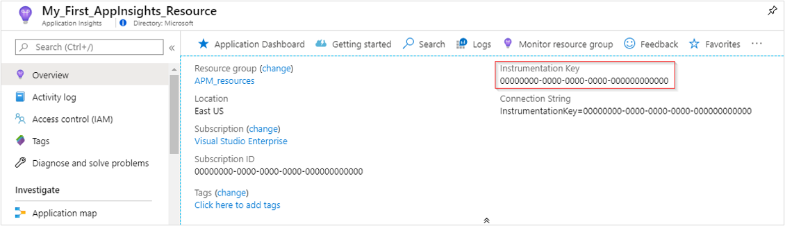

# Create an Application Insights resource

Azure Application Insights displays data about your application in a Microsoft Azure *resource*. Creating a new resource is therefore part of [setting up Application Insights to monitor a new application][start]. After you have created your new resource, you can get its instrumentation key and use that to configure the Application Insights SDK. The instrumentation key links your telemetry to the resource.

## Sign in to Microsoft Azure

If you don't have an Azure subscription, create a [free](https://azure.microsoft.com/free/) account before you begin.

## Create an Application Insights resource

Sign in to the [Azure portal](https://portal.azure.com), and create an Application Insights resource:

   | Settings        |  Value           | Description  |
   | ------------- |:-------------|:-----|
   | **Name**      | Globally Unique Value | Name that identifies the app you are monitoring. |
   | **Resource Group**     | myResourceGroup      | Name for the new or existing resource group to host App Insights data. |
   | **Location** | East US | Choose a location near you, or near where your app is hosted. |

Enter the appropriate values into the required fields, and then select **Review + create**.

When your app has been created, a new pane opens. This pane is where you see performance and usage data about your monitored application. 

## Copy the instrumentation key

The instrumentation key identifies the resource that you want to associate your telemetry data with. You will need copy to add the instrumentation key to your application's code.

## Install the SDK in your app

Install the Application Insights SDK in your app. This step depends heavily on the type of your application.

Use the instrumentation key to configure [the SDK that you install in your application][start].

The SDK includes standard modules that send telemetry without you having to write any additional code. To track user actions or diagnose issues in more detail, [use the API][api] to send your own telemetry.

## Creating a resource automatically
You can write a [PowerShell script](../../azure-monitor/app/powershell.md) to create a resource automatically.

## Next steps
* [Diagnostic Search](../../azure-monitor/app/diagnostic-search.md)
* [Explore metrics](../../azure-monitor/app/metrics-explorer.md)
* [Write Analytics queries](../../azure-monitor/app/analytics.md)

<!--Link references-->

[api]: ../../azure-monitor/app/api-custom-events-metrics.md
[diagnostic]: ../../azure-monitor/app/diagnostic-search.md
[metrics]: ../../azure-monitor/app/metrics-explorer.md
[start]: ../../azure-monitor/app/app-insights-overview.md