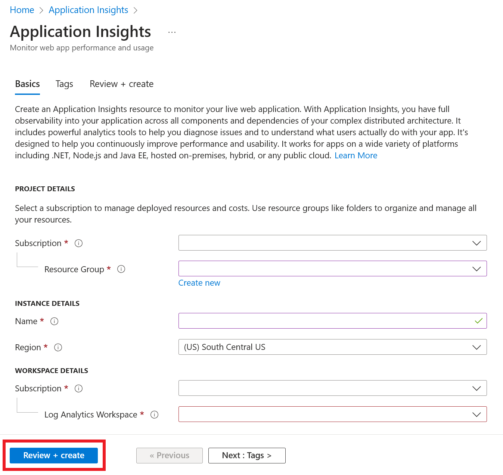
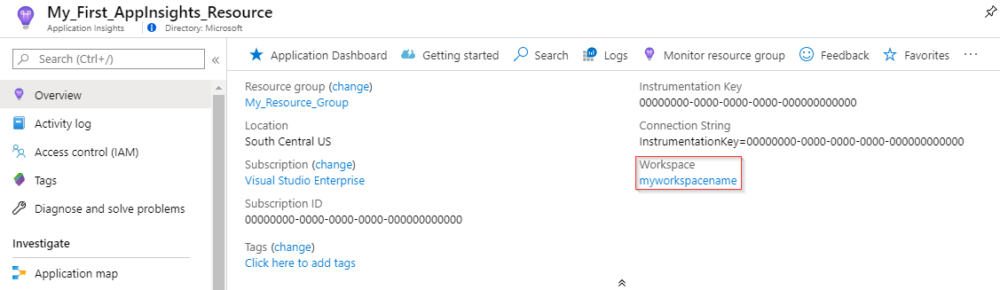

# Workspace-based Application Insights resources

Workspace-based resources support full integration between Application Insights and Log Analytics. You can now choose to send your Application Insights telemetry to a common Log Analytics workspace, which allows you full access to all the features of Log Analytics while keeping application, infrastructure, and platform logs in a single consolidated location.

This also allows for common Azure role-based access control (Azure RBAC) across your resources, and eliminates the need for cross-app/workspace queries.

> [!NOTE]
> Data ingestion and retention for workspace-based Application Insights resources are billed through the Log Analytics workspace where the data is located. [Learn more]( ./pricing.md#workspace-based-application-insights) about billing for workspace-based Application Insights resources.

## New capabilities

Workspace-based Application Insights allows you to take advantage of the latest capabilities of Azure Monitor and Log Analytics including:

* [Customer-Managed Keys (CMK)](../logs/customer-managed-keys.md) provides encryption at rest for your data with encryption keys to which only you have access.
* [Azure Private Link](../logs/private-link-security.md) allows you to securely link Azure PaaS services to your virtual network using private endpoints.
* [Bring Your Own Storage (BYOS) for Profiler and Snapshot Debugger](./profiler-bring-your-own-storage.md) gives you full control over the encryption-at-rest policy, the lifetime management policy, and network access for all data associated with Application Insights Profiler and Snapshot Debugger. 
* [Commitment Tiers](../logs/manage-cost-storage.md#pricing-model) enable you to save as much as 30% compared to the Pay-As-You-Go price. 
* Faster data ingestion via Log Analytics streaming ingestion.

## Create workspace-based resource

Sign in to the [Azure portal](https://portal.azure.com), and create an Application Insights resource:

> [!div class="mx-imgBorder"]
> 

If you don't already have an existing Log Analytics Workspace, [consult the Log Analytics workspace creation documentation](../logs/quick-create-workspace.md).

**Workspace-based resources are currently available in all commercial regions and Azure Government**

Once your resource is created, you will see the corresponding workspace info in the **Overview** pane:



Clicking the blue link text will take you to the associated Log Analytics workspace where you can take advantage of the new unified workspace query environment.

> [!NOTE]
> We still provide full backwards compatibility for your Application Insights classic resource queries, workbooks, and log-based alerts within the Application Insights experience. To query/view against the [new workspace-based table structure/schema](apm-tables.md) you must first navigate to your Log Analytics workspace. Selecting **Logs (Analytics)** from within the Application Insights panes will give you access to the classic Application Insights query experience.

## Copy the connection string

The [connection string](./sdk-connection-string.md?tabs=net) identifies the resource that you want to associate your telemetry data with. It also allows you to modify the endpoints your resource will use as a destination for your telemetry. You will need to copy the connection string and add it to your application's code or to an environment variable.

## Monitoring configuration

Once a workspace-based Application Insights resource has been created, configuring monitoring is relatively straightforward.

### Code-based application monitoring

For code-based application monitoring, you would just install the appropriate Application Insights SDK and point it to the instrumentation key or connection string to your newly created resource.  

For detailed documentation on setting up an Application Insights SDK for code-based monitoring consult the language/framework specific documentation:

- [ASP.NET](./asp-net.md)
- [ASP.NET Core](./asp-net-core.md)
- [Background tasks & modern console applications (.NET/.NET Core)](./worker-service.md)
- [Classic console applications (.NET)](./console.md) 
- [Java](./java-in-process-agent.md)
- [JavaScript](./javascript.md)
- [Node.js](./nodejs.md)
- [Python](./opencensus-python.md)

### Codeless monitoring and Visual Studio resource creation

For codeless monitoring of services like Azure Functions and Azure App Services, you will also need to first create your workspace-based Application Insights resource and then point to that resource during the monitoring configuration phase.

While these services offer the option to create a new Application Insights resource within their own resource creation process, resources created via these UI options are currently restricted to the classic Application Insights experience.

The same applies to the Application Insights resource creation experience in Visual Studio for ASP.NET and ASP.NET Core. You must select an existing workspace-based resource from with the Visual Studio monitoring enablement UI. Selecting create new resource from within Visual Studio will limit you to creating a classic Application Insights resource.

## Creating a resource automatically

### Azure CLI

To access the preview Application Insights Azure CLI commands, you first need to run:

```azurecli
 az extension add -n application-insights
```

If you don't run the `az extension add` command, you will see an error message that states: `az : ERROR: az monitor: 'app-insights' is not in the 'az monitor' command group. See 'az monitor --help'.`

Now you can run the following to create your Application Insights resource:

```azurecli
az monitor app-insights component create --app
                                         --location
                                         --resource-group
                                         [--application-type]
                                         [--ingestion-access {Disabled, Enabled}]
                                         [--kind]
                                         [--only-show-errors]
                                         [--query-access {Disabled, Enabled}]
                                         [--tags]
                                         [--workspace]
```

#### Example

```azurecli
az monitor app-insights component create --app demoApp --location eastus --kind web -g my_resource_group --workspace "/subscriptions/00000000-0000-0000-0000-000000000000/resourcegroups/test1234/providers/microsoft.operationalinsights/workspaces/test1234555"
```

For the full Azure CLI documentation for this command,  consult the [Azure CLI documentation](/cli/azure/monitor/app-insights/component#az_monitor_app_insights_component_create).

### Azure PowerShell

The `New-AzApplicationInsights` PowerShell command does not currently support creating a workspace-based Application Insights resource. To create a workspace-based resource with PowerShell, you can use the Azure Resource Manager templates below and deploy with PowerShell.

### Azure Resource Manager templates

#### Template file

```json
{
    "$schema": "http://schema.management.azure.com/schemas/2014-04-01-preview/deploymentTemplate.json#",
    "contentVersion": "1.0.0.0",
    "parameters": {
        "name": {
            "type": "string"
        },
        "type": {
            "type": "string"
        },
        "regionId": {
            "type": "string"
        },
        "tagsArray": {
            "type": "object"
        },
        "requestSource": {
            "type": "string"
        },
        "workspaceResourceId": {
            "type": "string"
        }
    },
    "resources": [
        {
            "name": "[parameters('name')]",
            "type": "microsoft.insights/components",
            "location": "[parameters('regionId')]",
            "tags": "[parameters('tagsArray')]",
            "apiVersion": "2020-02-02-preview",
            "properties": {
                "ApplicationId": "[parameters('name')]",
                "Application_Type": "[parameters('type')]",
                "Flow_Type": "Redfield",
                "Request_Source": "[parameters('requestSource')]",
                "WorkspaceResourceId": "[parameters('workspaceResourceId')]"
            }
        }
    ]
}
```

#### Parameters file

```json
{
    "$schema": "https://schema.management.azure.com/schemas/2015-01-01/deploymentParameters.json#",
    "contentVersion": "1.0.0.0",
    "parameters": {
        "type": {
            "value": "web"
        },
        "name": {
            "value": "customresourcename"
        },
        "regionId": {
            "value": "eastus"
        },
        "tagsArray": {
            "value": {}
        },
        "requestSource": {
            "value": "Custom"
        },
        "workspaceResourceId": {
            "value": "/subscriptions/00000000-0000-0000-0000-000000000000/resourcegroups/my_resource_group/providers/microsoft.operationalinsights/workspaces/myworkspacename"
        }
    }
}

```

## Modifying the associated workspace

Once a workspace-based Application Insights resource has been created, you can modify the associated Log Analytics Workspace.

From within the Application Insights resource pane, select **Properties** > **Change Workspace** > **Log Analytics Workspaces**

## Export telemetry

The legacy continuous export functionality is not supported for workspace-based resources. Instead, select **Diagnostic settings** > **add diagnostic setting** from within your Application Insights resource. You can select all tables, or a subset of tables to archive to a storage account, or to stream to an Azure Event Hub.

> [!NOTE]
> There are currently no additional charges for the telemetry export. Pricing information for this feature will be available on the [Azure Monitor pricing page](https://azure.microsoft.com/pricing/details/monitor/).  Prior to the start of billing, notifications will be sent. Should you choose to continue using <feature name> after the notice period, you will be billed at the applicable rate. 
 

## Next steps

* [Explore metrics](../essentials/metrics-charts.md)
* [Write Analytics queries](../logs/log-query-overview.md)
