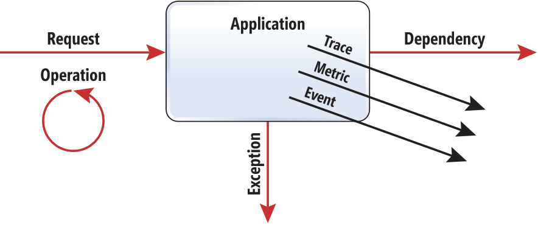

# Application Insights telemetry data model

[Azure Application Insights](../../azure-monitor/app/app-insights-overview.md) sends telemetry from your web application to the Azure portal, so that you can analyze the performance and usage of your application. The telemetry model is standardized so that it is possible to create platform and language-independent monitoring. 

Data collected by Application Insights models this typical application execution pattern:

The following types of telemetry are used to monitor the execution of your app. The following three types are typically automatically collected by the Application Insights SDK from the web application framework:

* [**Request**](data-model-request-telemetry.md) - Generated to log a request received by your app. For example, the Application Insights web SDK automatically generates a Request telemetry item for each HTTP request that your web app receives. 

    An **Operation** is the threads of execution that processes a request. You can also [write code](../../azure-monitor/app/api-custom-events-metrics.md#trackrequest) to monitor other types of operation, such as a "wake up" in a web job or function that periodically processes data.  Each operation has an ID. This ID that can be used to [group](../../azure-monitor/app/correlation.md) all telemetry generated while your app is processing the request. Each operation either succeeds or fails, and has a duration of time.
* [**Exception**](data-model-exception-telemetry.md) - Typically represents an exception that causes an operation to fail.
* [**Dependency**](data-model-dependency-telemetry.md) - Represents a call from your app to an external service or storage such as a REST API or SQL. In ASP.NET, dependency calls to SQL are defined by `System.Data`. Calls to HTTP endpoints are defined by `System.Net`. 

Application Insights provides three additional data types for custom telemetry:

* [Trace](data-model-trace-telemetry.md) - used either directly, or through an adapter to implement diagnostics logging using an instrumentation framework that is familiar to you, such as `Log4Net` or `System.Diagnostics`.
* [Event](data-model-event-telemetry.md) - typically used to capture user interaction with your service, to analyze usage patterns.
* [Metric](data-model-metric-telemetry.md) - used to report periodic scalar measurements.

Every telemetry item can define the [context information](data-model-context.md) like application version or user session id. Context is a set of strongly typed fields that unblocks certain scenarios. When application version is properly initialized, Application Insights can detect new patterns in application behavior correlated with redeployment. Session id can be used to calculate the outage or an issue impact on users. Calculating distinct count of session id values for certain failed dependency, error trace or critical exception gives a good understanding of an impact.

Application Insights telemetry model defines a way to [correlate](../../azure-monitor/app/correlation.md) telemetry to the operation of which it’s a part. For example, a request can make a SQL Database calls and recorded diagnostics info. You can set the correlation context for those telemetry items that tie it back to the request telemetry.

## Schema improvements

Application Insights data model is a simple and basic yet powerful way to model your application telemetry. We strive to keep the model simple and slim to support essential scenarios and allow to extend the schema for advanced use.

To report data model or schema problems and suggestions use GitHub [ApplicationInsights-Home](https://github.com/Microsoft/ApplicationInsights-Home/labels/schema) repository.

## Next steps

- [Write custom telemetry](../../azure-monitor/app/api-custom-events-metrics.md)
- Learn how to [extend and filter telemetry](../../azure-monitor/app/api-filtering-sampling.md).
- Use [sampling](../../azure-monitor/app/sampling.md) to minimize amount of telemetry based on data model.
- Check out [platforms](../../azure-monitor/app/platforms.md) supported by Application Insights.
