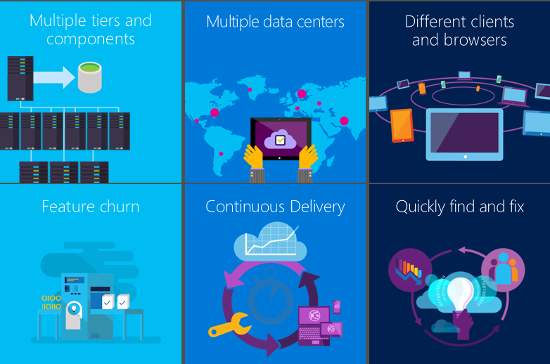
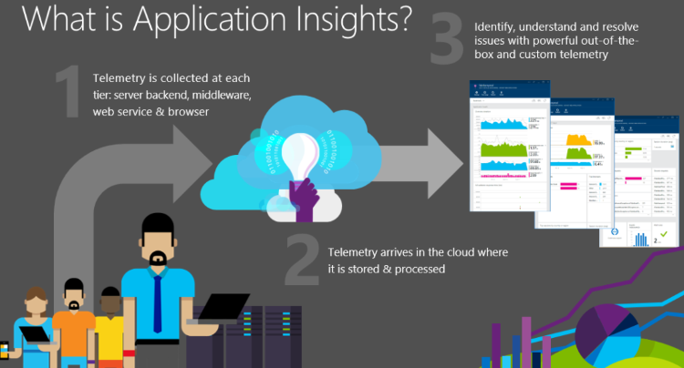
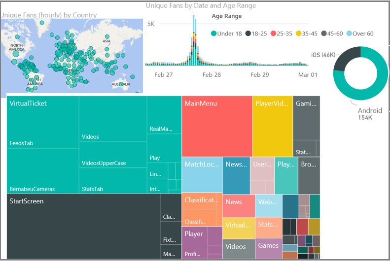
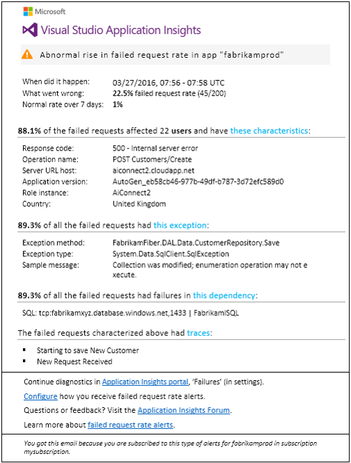
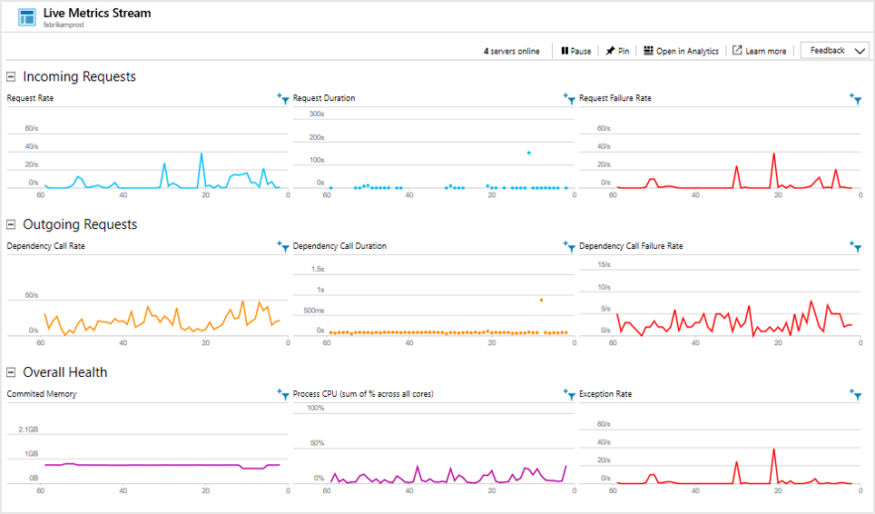
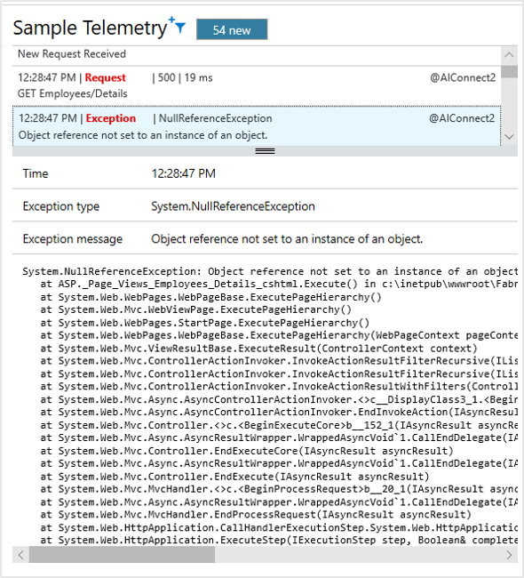
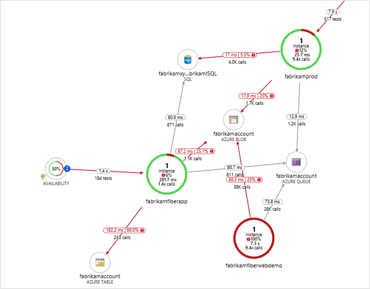
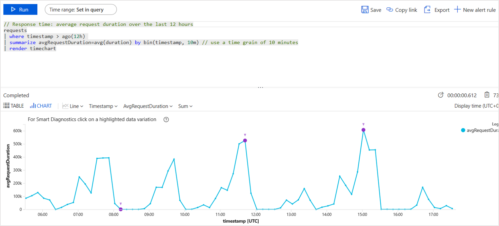

# Deep diagnostics for web apps and services with Application Insights

This article explains how Application Insights fits into the DevOps cycle.

## Why do I need Application Insights?
Application Insights monitors your running web app. It tells you about failures and performance issues and helps you analyze how customers use your app. It works for apps running on platforms like ASP.NET, Java EE, and Node.js. It's hosted in the cloud or on-premises.

It's essential to monitor a modern application while it's running. You want to detect failures before your customers do. You also want to discover and fix performance issues that slow things down or cause an inconvenience to your users. When the system is performing to your satisfaction, you also want to know what the users are doing with it. For example, are they using the latest feature? Are they succeeding with it?

Modern web applications are developed in a cycle of continuous delivery:

- Release a new feature or improvement.
- Observe how well it works for users.
- Plan the next increment of development based on that knowledge.

A key part of this cycle is the observation phase. Application Insights provides the tools to monitor a web application for performance and usage.

The most important aspect of this process is diagnostics and diagnosis. If the application fails, business is lost. The prime role of a monitoring framework is to:

- Detect failures reliably.
- Notify you immediately.
- Present you with the information needed to diagnose the problem.

Application Insights performs these tasks.

### Where do bugs come from?
Failures in web systems typically arise from configuration issues or bad interactions between their many components. The first task when you tackle a live site incident is to identify the locus of the problem. Which component or relationship is the cause?

In a simpler era, a computer program ran in one computer. Developers tested it thoroughly before shipping it, and after shipping, they rarely saw or thought about it again. Users had to put up with any residual bugs for many years.

The process is vastly different now. Your app has a multitude of different devices to run on, and it can be difficult to guarantee the exact same behavior on each one. Hosting apps in the cloud means bugs can be fixed fast. But it also means there's continuous competition and the expectation of new features at frequent intervals.

In these conditions, the only way to keep firm control on the bug count is automated unit testing. It's impossible to manually retest everything on every delivery. Unit test is now a commonplace part of the build process. Tools such as the Xamarin Test Cloud help by providing automated UI testing on multiple browser versions. These testing regimes allow us to hope that the rate of bugs found inside an app can be kept to a minimum.

Typical web applications have many live components. Along with the client (in a browser or device app) and the web server, there's likely to be substantial back-end processing. Perhaps the back end is a pipeline of components or a loose collection of collaborating pieces. Many of them won't be in your control. They're external services on which you depend.

In configurations like these, it can be difficult and uneconomical to test for, or foresee, every possible failure mode, other than in the live system itself.

### Questions
Here are some questions to ask when you're developing a web system:

* Is your app crashing?
* What exactly happened? If it failed a request, you want to know how it got there. You need a trace of events.
* Is your app fast enough? How long does it take to respond to typical requests?
* Can the server handle the load? When the rate of requests rises, does the response time hold steady?
* How responsive are your dependencies, such as the REST APIs, databases, and other components that your app calls? In particular, if the system is slow, is it your component, or are you getting slow responses from someone else?
* Is your app up or down? Can it be seen from around the world? You need to know if it stops.
* What's the root cause? Was the failure in your component or a dependency? Is it a communication issue?
* How many users are affected? If you have more than one issue to tackle, which is the most important?

## What is Application Insights?

1. Application Insights instruments your app and sends telemetry about it while the app is running. Either you can build the Application Insights SDK into the app or you can apply instrumentation at runtime. The former method is more flexible because you can add your own telemetry to the regular modules.
1. The telemetry is sent to the Application Insights portal, where it's stored and processed. Although Application Insights is hosted in Azure, it can monitor any web apps, not just Azure apps.
1. The telemetry is presented to you in the form of charts and tables of events.

There are two main types of telemetry: aggregated and raw instances.

* Instance data might include a report of a request that's been received by your web app. You can find for and inspect the details of a request by using the Search tool in the Application Insights portal. The instance might include data like how long your app took to respond to the request and the requested URL and the approximate location of the client.
* Aggregated data includes counts of events per unit time so that you can compare the rate of requests with the response times. It also includes averages of metrics like request response times.

The main categories of data are:

* Requests to your app (usually HTTP requests) with data on URL, response time, and success or failure.
* Dependencies like REST and SQL calls made by your app, also with URI, response times, and success.
* Exceptions, including stack traces.
* Page view data, which comes from users' browsers.
* Metrics like performance counters and metrics you write yourself.
* Custom events that you can use to track business events.
* Log traces used for debugging.

## Case study: Real Madrid F.C.
The web service of [Real Madrid Football Club](https://www.realmadrid.com/) serves about 450 million fans around the world. Fans access it through web browsers and the club's mobile apps. Fans can book tickets and also access information and video clips on results, players, and upcoming games. They can search with filters like numbers of goals scored. There are also links to social media. The user experience is highly personalized and is designed as a two-way communication to engage fans.

The solution [is a system of services and applications on Azure](https://www.microsoft.com/inculture/sports/real-madrid/). Scalability is a key requirement. Traffic is variable and can reach high volumes during and around matches.

For Real Madrid, it's vital to monitor the system's performance. Application Insights provides a comprehensive view across the system to ensure a reliable and high level of service.

The club also gets in-depth understanding of its fans like where they are (only 3% are in Spain), what interest they have in players, historical results, and upcoming games, and how they respond to match outcomes.

Most of this telemetry data is automatically collected with no added code, which simplifies the solution and reduces operational complexity. For Real Madrid, Application Insights deals with 3.8 billion telemetry points each month.

Real Madrid uses the Power BI module to view its telemetry.

## Smart detection
[Proactive diagnostics](../alerts/proactive-diagnostics.md) is a recent feature. Without any special configuration by you, Application Insights automatically detects and alerts you about unusual rises in failure rates in your app. It's smart enough to ignore a background of occasional failures and also rises that are simply proportionate to an increase in requests.

For example, there might be a failure in one of the services you depend on. Or perhaps the new build you deployed isn't working well. You'll know about it as soon as you look at your email. There are also webhooks so that you can trigger other apps.

Another aspect of this feature performs a daily in-depth analysis of your telemetry, looking for unusual patterns of performance that are hard to discover. For example, it can find slow performance associated with a particular geographical area or with a specific browser version.

In both cases, the alert tells you the symptoms it's discovered. It also gives you the data you need to help diagnose the problem, such as relevant exception reports.

Customer Samtec said, "During a recent feature cutover, we found an under-scaled database that was hitting its resource limits and causing timeouts. Proactive detection alerts came through literally as we were triaging the issue, very near real time as advertised. This alert coupled with the Azure platform alerts helped us almost instantly fix the issue. Total downtime <10 minutes."

## Live Metrics Stream
Deploying the latest build can be an anxious experience. If there are any problems, you want to know about them right away so that you can back out if necessary. Live Metrics Stream gives you key metrics with a latency of about one second.

It lets you immediately inspect a sample of any failures or exceptions.

## Application Map
Application Map automatically discovers your application topology. It lays the performance information on top of the map to let you easily identify performance bottlenecks and problematic flows across your distributed environment. With Application Map, you can discover application dependencies on Azure services.

You can triage a problem by understanding if it's code related or dependency related. From a single place, you can drill into the related diagnostics experience. For example, your application might be failing because of performance degradation in a SQL tier. With Application Map, you can see it immediately and drill into the SQL Index Advisor or Query Insights experience.

## Application Insights Log Analytics
With [Log Analytics](../logs/log-query-overview.md), you can write arbitrary queries in a powerful SQL-like language. Diagnosing across the entire app stack becomes easy as various perspectives get connected. Then you can ask the right questions to correlate service performance with business metrics and customer experience.

You can query all your telemetry instance and metric raw data stored in the portal. The language includes filter, join, aggregation, and other operations. You can calculate fields and perform statistical analysis. Tabular and graphical visualizations are available.

For example, it's easy to:

* Segment your application's request performance data by customer tiers to understand their experience.
* Search for specific error codes or custom event names during live site investigations.
* Drill down into the app usage of specific customers to understand how features are acquired and adopted.
* Track sessions and response times for specific users to enable support and operations teams to provide instant customer support.
* Determine frequently used app features to answer feature prioritization questions.

Customer DNN said, "Application Insights has provided us with the missing part of the equation for being able to combine, sort, query, and filter data as needed. Allowing our team to use their own ingenuity and experience to find data with a powerful query language has allowed us to find insights and solve problems we didn't even know we had. A lot of interesting answers come from the questions starting with *'I wonder if...'.*"

## Development tools integration

Application Insights integrates with development tools.

### Configure Application Insights
Visual Studio and Eclipse have tools to configure the correct SDK packages for the project you're developing. There's a menu command to add Application Insights.

If you happen to be using a trace logging framework, such as Log4N, NLog, or System.Diagnostics.Trace, you get the option to send the logs to Application Insights along with the other telemetry so that you can easily correlate the traces with requests, dependency calls, and exceptions.

### Search telemetry in Visual Studio
As you develop and debug a feature, you can view and search the telemetry directly in Visual Studio. You can use the same search facilities as in the web portal.

When Application Insights logs an exception, you can view the data point in Visual Studio and jump straight to the relevant code.

During debugging, you can keep the telemetry in your development machine. You can view it in Visual Studio without sending it to the portal. This local option avoids mixing debugging with production telemetry.

### Work items
When an alert is raised, Application Insights can automatically create a work item in your work tracking system.

## Other considerations

Find out more about Application Insights:

* [Privacy and storage](./data-retention-privacy.md): Your telemetry is kept on Azure secure servers.
* **Performance**: The impact is low because telemetry is batched.
* [Pricing](../logs/cost-logs.md#application-insights-billing): You can get started for free, and that continues while you're in low volume.

## Next steps
Getting started with Application Insights is easy. The main options are:

* Use [IIS servers](./status-monitor-v2-overview.md).
* Instrument your project during development. You can do it for [ASP.NET](./asp-net.md) or [Java](./opentelemetry-enable.md?tabs=java) apps, [Node.js](./nodejs.md), and a host of [other types](./app-insights-overview.md#supported-languages).
* Instrument [any webpage](./javascript.md) by adding a short code snippet.