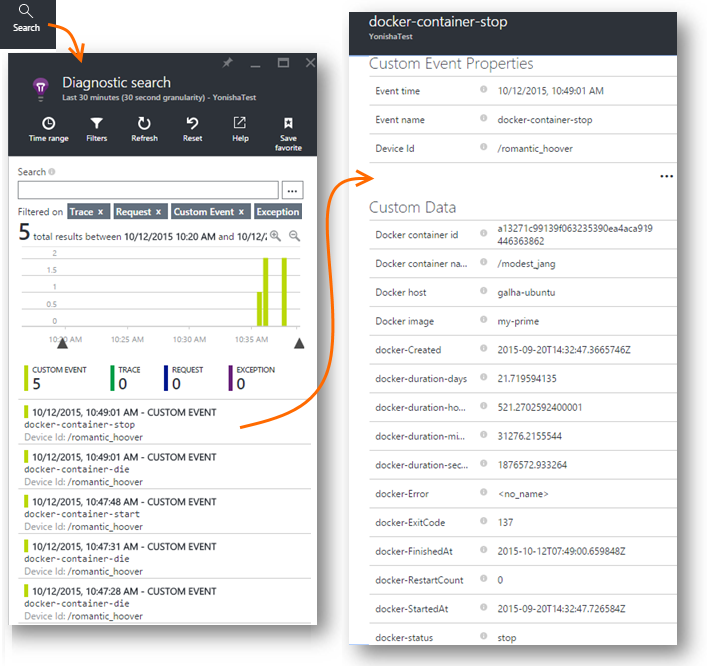
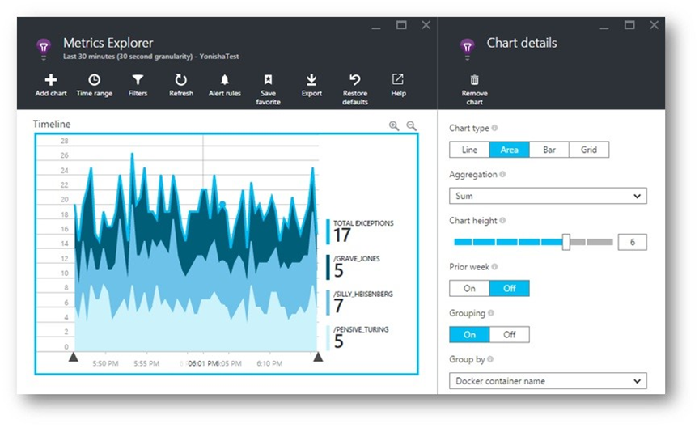

# Monitor Docker applications in Application Insights (Deprecated)

> [!NOTE]
> This solution has been deprecated. To learn more about our current investments in container monitoring we recommend checking out [Azure Monitor for containers](https://docs.microsoft.com/azure/azure-monitor/insights/container-insights-overview).

Lifecycle events and performance counters from [Docker](https://www.docker.com/) containers can be charted on Application Insights. Install the [Application Insights](https://hub.docker.com/r/microsoft/applicationinsights/) image in a container in your host, and it will display performance counters for the host, as well as for the other images.

With Docker, you distribute your apps in lightweight containers complete with all dependencies. They'll run on any host machine that runs a Docker Engine.

When you run the [Application Insights image](https://hub.docker.com/r/microsoft/applicationinsights/) on your Docker host, you get these benefits:

* Lifecycle telemetry about all the containers running on the host - start, stop, and so on.
* Performance counters for all the containers. CPU, memory, network usage, and more.
* If you [installed Application Insights SDK for Java](../../azure-monitor/app/java-get-started.md) in the apps running in the containers, all the telemetry of those apps will have additional properties identifying the container and host machine. So for example, if you have instances of an app running in more than one host, you can easily filter your app telemetry by host.

## Set up your Application Insights resource

1. Sign into [Microsoft Azure portal](https://azure.com) and open the Application Insights resource for your app; or [create a new one](../../azure-monitor/app/create-new-resource.md ). 
   
    *Which resource should I use?* If the apps that you are running on your host were developed by someone else, then you need to [create a new Application Insights resource](../../azure-monitor/app/create-new-resource.md ). This is where you view and analyze the telemetry. (Select 'General' for the app type.)
   
    But if you're the developer of the apps, then we hope you [added Application Insights SDK](../../azure-monitor/app/java-get-started.md) to each of them. If they're all really components of a single business application, then you might configure all of them to send telemetry to one resource, and you'll use that same resource to display the Docker lifecycle and performance data. 
   
    A third scenario is that you developed most of the apps, but you are using separate resources to display their telemetry. In that case, you probably also want to create a separate resource for the Docker data.

2. Click the **Essentials** drop-down and copy the Instrumentation Key. You use this to tell the SDK where to send its telemetry.

Keep that browser window handy, as you'll come back to it soon to look at your telemetry.

## Run the Application Insights monitor on your host

Now that you've got somewhere to display the telemetry, you can set up the containerized app that will collect and send it.

1. Connect to your Docker host.
2. Edit your instrumentation key into this command, and then run it:
   
   ```
   
   docker run -v /var/run/docker.sock:/docker.sock -d microsoft/applicationinsights ikey=000000-1111-2222-3333-444444444
   ```

Only one Application Insights image is required per Docker host. If your application is deployed on multiple Docker hosts, then repeat the command on every host.

## Update your app
If your application is instrumented with the [Application Insights SDK for Java](../../azure-monitor/app/java-get-started.md), add the following line into the ApplicationInsights.xml file in your project, under the `<TelemetryInitializers>` element:

```xml

    <Add type="com.microsoft.applicationinsights.extensibility.initializer.docker.DockerContextInitializer"/> 
```

This adds Docker information such as container and host id to every telemetry item sent from your app.

## View your telemetry
Go back to your Application Insights resource in the Azure portal.

Click through the Docker tile.

You'll shortly see data arriving from the Docker app, especially if you have other containers running on your Docker engine.

### Docker container events


To investigate individual events, click [Search](../../azure-monitor/app/diagnostic-search.md). Search and filter 
to find the events you want. Click any event to get more detail.

### Exceptions by container name


### Docker context added to app telemetry
Request telemetry sent from the application instrumented with AI SDK, is enriched with Docker context information.

## Q & A
*What does Application Insights give me that I can't get from Docker?*

* Detailed breakdown of performance counters by container and image.
* Integrate container and app data in one dashboard.
* [Export telemetry](export-telemetry.md) for further analysis to a database, Power BI or other dashboard.

*How do I get telemetry from the app itself?*

* Install the Application Insights SDK in the app. 
Learn how for: [Java web apps](../../azure-monitor/app/java-get-started.md), [Windows web apps](../../azure-monitor/app/asp-net.md).

## Video

> [!VIDEO https://channel9.msdn.com/events/Connect/2016/100/player]

## Next steps

* [Application Insights for Java](../../azure-monitor/app/java-get-started.md)
* [Application Insights for Node.js](../../azure-monitor/app/nodejs.md)
* [Application Insights for ASP.NET](../../azure-monitor/app/asp-net.md)
