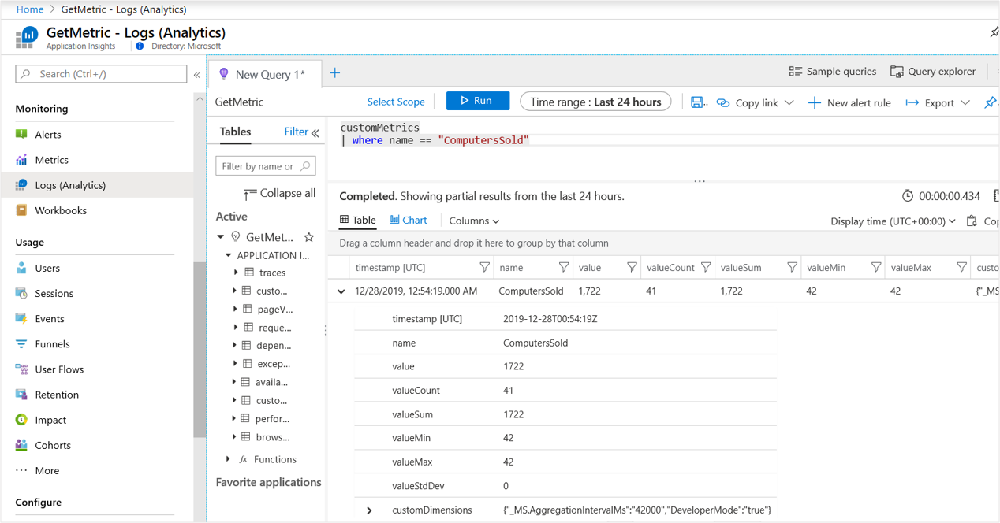
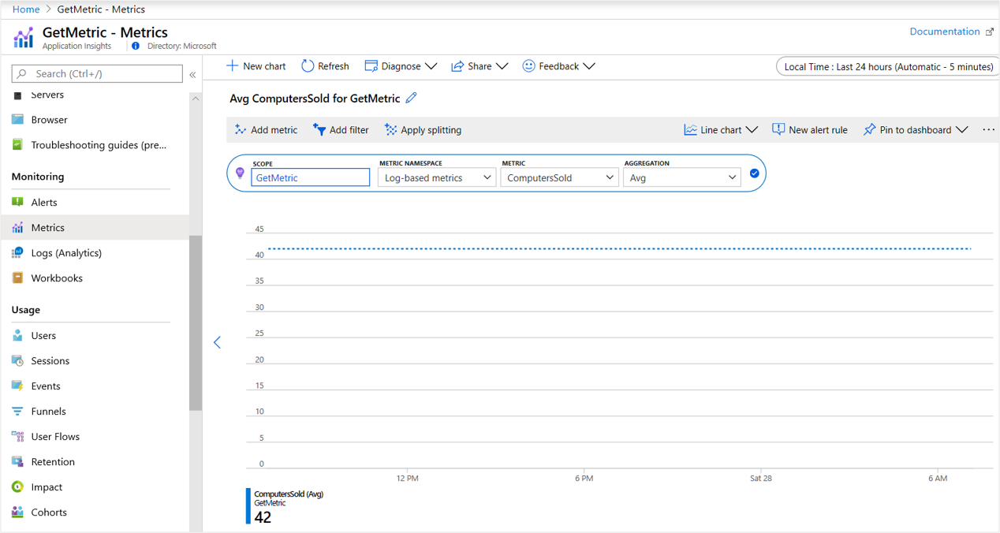
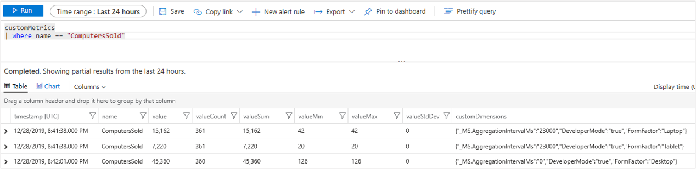
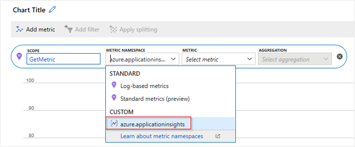
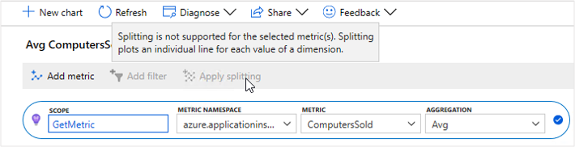
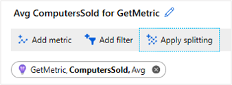
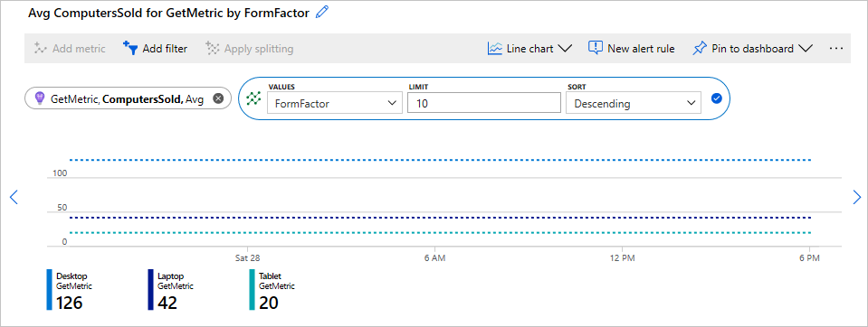

# Custom metric collection in .NET and .NET Core

The Azure Monitor Application Insights .NET and .NET Core SDKs have two different methods of collecting custom metrics, `TrackMetric()`, and `GetMetric()`. The key difference between these two methods is local aggregation. `TrackMetric()` lacks pre-aggregation while `GetMetric()` has pre-aggregation. The recommended approach is to use aggregation, therefore, `TrackMetric()` is no longer the preferred method of collecting custom metrics. This article will walk you through using the GetMetric() method, and some of the rationale behind how it works.

## TrackMetric versus GetMetric

`TrackMetric()` sends raw telemetry denoting a metric. It is inefficient to send a single telemetry item for each value. `TrackMetric()` is also inefficient in terms of performance since every `TrackMetric(item)` goes through the full SDK pipeline of telemetry initializers and processors. Unlike `TrackMetric()`, `GetMetric()` handles local pre-aggregation for you and then only submits an aggregated summary metric at a fixed interval of one minute. So if you need to closely monitor some custom metric at the second or even millisecond level you can do so while only incurring the storage and network traffic cost of only monitoring every minute. This also greatly reduces the risk of throttling occurring since the total number of telemetry items that need to be sent for an aggregated metric are greatly reduced.

In Application Insights, custom metrics collected via `TrackMetric()` and `GetMetric()` are not subject to [sampling](https://docs.microsoft.com/azure/azure-monitor/app/sampling). Sampling important metrics can lead to scenarios where alerting you may have built around those metrics could become unreliable. By never sampling your custom metrics, you can generally be confident that when your alert thresholds are breached, an alert will fire.  But since custom metrics aren't sampled, there are some potential concerns.

If you need to track trends in a metric every second, or at an even more granular interval this can result in:

- Increased data storage costs. There is a cost associated with how much data you send to Azure Monitor. (The more data you send the greater the overall cost of monitoring.)
- Increased network traffic/performance overhead. (In some scenarios this could have both a monetary and application performance cost.)
- Risk of ingestion throttling. (The Azure Monitor service drops ("throttles") data points when your app sends a very high rate of telemetry in a short time interval.)

Throttling is of particular concern in that like sampling, throttling can lead to missed alerts since the condition to trigger an alert could occur locally and then be dropped at the ingestion endpoint due to too much data being sent. This is why for .NET and .NET Core we don't recommend using `TrackMetric()` unless you have implemented your own local aggregation logic. If you are trying to track every instance an event occurs over a given time period, you may find that [`TrackEvent()`](https://docs.microsoft.com/azure/azure-monitor/app/api-custom-events-metrics#trackevent) is a better fit. Though keep in mind that unlike custom metrics, custom events are subject to sampling. You can of course still use `TrackMetric()` even without writing your own local pre-aggregation, but if you do so be aware of the pitfalls.

In summary `GetMetric()` is the recommended approach since it does pre-aggregation, it accumulates values from all the Track() calls and sends a summary/aggregate once every minute. This can significantly reduce the cost and performance overhead by sending fewer data points, while still collecting all relevant information.

> [!NOTE]
> Only the .NET and .NET Core SDKs have a GetMetric() method. If you are using Java you can use [Micrometer metrics](https://docs.microsoft.com/azure/azure-monitor/app/micrometer-java) or `TrackMetric()`. For Python you can use [OpenCensus.stats](https://docs.microsoft.com/azure/azure-monitor/app/opencensus-python#metrics) to send custom metrics. For JavaScript and Node.js you would still use `TrackMetric()`, but keep in mind the caveats that were outlined in the previous section.

## Getting started with GetMetric

For our examples, we are going to use a basic .NET Core 3.1 worker service application. If you would like to exactly replicate the test environment that was used with these examples, follow steps 1-6 of the [monitoring worker service article](https://docs.microsoft.com/azure/azure-monitor/app/worker-service#net-core-30-worker-service-application) to add Application Insights to a basic worker service project template. These concepts apply to any general application where the SDK can be used including web apps and console apps.

### Sending metrics

Replace the contents of your `worker.cs` file with the following:

```csharp
using System;
using System.Threading;
using System.Threading.Tasks;
using Microsoft.Extensions.Hosting;
using Microsoft.Extensions.Logging;
using Microsoft.ApplicationInsights;

namespace WorkerService3
{
    public class Worker : BackgroundService
    {
        private readonly ILogger<Worker> _logger;
        private TelemetryClient _telemetryClient;

        public Worker(ILogger<Worker> logger, TelemetryClient tc)
        {
            _logger = logger;
            _telemetryClient = tc;
        }

        protected override async Task ExecuteAsync(CancellationToken stoppingToken)
        {   // The following line demonstrates usages of GetMetric API.
            // Here "computersSold", a custom metric name, is being tracked with a value of 42 every second.
            while (!stoppingToken.IsCancellationRequested)
            {
                _telemetryClient.GetMetric("computersSold").TrackValue(42);

                _logger.LogInformation("Worker running at: {time}", DateTimeOffset.Now);
                await Task.Delay(1000, stoppingToken);
            }
        }
    }
}
```

If you run the code above and watch the telemetry being sent via the Visual Studio output window or a tool like Telerik's Fiddler, you will see the while loop repeatedly executing with no telemetry being sent and then a single telemetry item will be sent by around the 60-second mark, which in the case of our test looks as follows:

```json
Application Insights Telemetry: {"name":"Microsoft.ApplicationInsights.Dev.00000000-0000-0000-0000-000000000000.Metric", "time":"2019-12-28T00:54:19.0000000Z",
"ikey":"00000000-0000-0000-0000-000000000000",
"tags":{"ai.application.ver":"1.0.0.0",
"ai.cloud.roleInstance":"Test-Computer-Name",
"ai.internal.sdkVersion":"m-agg2c:2.12.0-21496",
"ai.internal.nodeName":"Test-Computer-Name"},
"data":{"baseType":"MetricData",
"baseData":{"ver":2,"metrics":[{"name":"computersSold",
"kind":"Aggregation",
"value":1722,
"count":41,
"min":42,
"max":42,
"stdDev":0}],
"properties":{"_MS.AggregationIntervalMs":"42000",
"DeveloperMode":"true"}}}}
```

This single telemetry item represents an aggregate of 41 distinct metric measurements. Since we were sending the same value over and over again we have a *standard deviation (stDev)* of 0 with an identical *maximum (max)*, and *minimum (min)* values. The *value* property represents a sum of all the individual values that were aggregated.

If we examine our Application Insights resource in the Logs (Analytics) experience, this individual telemetry item would look as follows:



> [!NOTE]
> While the raw telemetry item did not contain an explicit sum property/field once ingested we create one for you. In this case both the `value` and `valueSum` property represent the same thing.

You can also access your custom metric telemetry in the [_Metrics_](https://docs.microsoft.com/azure/azure-monitor/platform/metrics-charts) section of the portal. As both a [log-based, and custom metric](pre-aggregated-metrics-log-metrics.md). (The screenshot below is an example of log-based.)


### Caching metric reference for high-throughput usage

In some cases metric values are observed very frequently. For example, a high-throughput service that processes 500 requests/second may want to emit 20 telemetry metrics for each request. This means tracking 10,000 values per second. In such high-throughput scenarios, users may need to help the SDK by avoiding some lookups.

For example, in this case, the example above performed a lookup for a handle for the metric "ComputersSold" and then tracked an observed value 42. Instead, the handle may be cached for multiple track invocations:

```csharp
//...

        protected override async Task ExecuteAsync(CancellationToken stoppingToken)
        {
            // This is where the cache is stored to handle faster lookup
            Metric computersSold = _telemetryClient.GetMetric("ComputersSold");
            while (!stoppingToken.IsCancellationRequested)
            {

                computersSold.TrackValue(42);

                computersSold.TrackValue(142);

                _logger.LogInformation("Worker running at: {time}", DateTimeOffset.Now);
                await Task.Delay(50, stoppingToken);
            }
        }

```

In addition to caching the metric handle, the example above also reduced the `Task.Delay` to 50 milliseconds so that the loop would execute more frequently resulting in 772 `TrackValue()` invocations.

## Multi-dimensional metrics

The examples in the previous section show zero-dimensional metrics. Metrics can also be multi-dimensional. We currently support up to 10 dimensions.

 Here is an example of how to create a one-dimensional metric:

```csharp
//...

        protected override async Task ExecuteAsync(CancellationToken stoppingToken)
        {
            // This is an example of a metric with a single dimension.
            // FormFactor is the name of the dimension.
            Metric computersSold= _telemetryClient.GetMetric("ComputersSold", "FormFactor");

            while (!stoppingToken.IsCancellationRequested)
            {
                // The number of arguments (dimension values)
                // must match the number of dimensions specified while GetMetric.
                // Laptop, Tablet, etc are values for the dimension "FormFactor"
                computersSold.TrackValue(42, "Laptop");
                computersSold.TrackValue(20, "Tablet");
                computersSold.TrackValue(126, "Desktop");


                _logger.LogInformation("Worker running at: {time}", DateTimeOffset.Now);
                await Task.Delay(50, stoppingToken);
            }
        }

```

Running this code for at least 60 seconds will result in three distinct telemetry items being sent to Azure, each representing the aggregation of one of the three form factors. As before you can examine these in Logs (Analytics) view:



As well as in the Metrics explorer experience:



However, you will notice that you aren't able to split the metric by your new custom dimension, or view your custom dimension with the metrics view:



By default multi-dimensional metrics within the Metric explorer experience are not turned on in Application Insights resources.

### Enable multi-dimensional metrics

To enable multi-dimensional metrics for an Application Insights resource, Select **Usage and estimated costs** > **Custom Metrics** > **Enable alerting on custom metric dimensions** > **OK**. More details about this can be found [here](pre-aggregated-metrics-log-metrics.md#custom-metrics-dimensions-and-pre-aggregation).

Once you have made that change and send new multi-dimensional telemetry, you will be able to **Apply splitting**.

> [!NOTE]
> Only newly sent metrics after the feature was turned on in the portal will have dimensions stored.



And view your metric aggregations for each _FormFactor_ dimension:



### How to use MetricIdentifier when there are more than three dimensions

Currently 10 dimensions are supported however, greater than three dimensions requires the use of `MetricIdentifier`:

```csharp
// Add "using Microsoft.ApplicationInsights.Metrics;" to use MetricIdentifier
// MetricIdentifier id = new MetricIdentifier("[metricNamespace]","[metricId],"[dim1]","[dim2]","[dim3]","[dim4]","[dim5]");
MetricIdentifier id = new MetricIdentifier("CustomMetricNamespace","ComputerSold", "FormFactor", "GraphicsCard", "MemorySpeed", "BatteryCapacity", "StorageCapacity");
Metric computersSold  = _telemetryClient.GetMetric(id);
computersSold.TrackValue(110,"Laptop", "Nvidia", "DDR4", "39Wh", "1TB");
```

## Custom metric configuration

If you want to alter the metric configuration, you need to do this in the place where the metric is initialized.

### Special dimension names

Metrics do not use the telemetry context of the `TelemetryClient` used to access them, special dimension names available as constants in `MetricDimensionNames` class is the best workaround for this limitation.

Metric aggregates sent by the below "Special Operation Request Size"-metric will **not** have their `Context.Operation.Name` set to "Special Operation". Whereas `TrackMetric()` or any other TrackXXX() will have `OperationName` set correctly to "Special Operation".

``` csharp
        //...
        TelemetryClient specialClient;
        private static int GetCurrentRequestSize()
        {
            // Do stuff
            return 1100;
        }
        int requestSize = GetCurrentRequestSize()

        protected override async Task ExecuteAsync(CancellationToken stoppingToken)
        {
            while (!stoppingToken.IsCancellationRequested)
            {
                //...
                specialClient.Context.Operation.Name = "Special Operation";
                specialClient.GetMetric("Special Operation Request Size").TrackValue(requestSize);
                //...
            }
                   
        }
```

In this circumstance, use the special dimension names listed in the `MetricDimensionNames` class  in order to specify `TelemetryContext` values.

For example, when the metric aggregate resulting from the next statement is sent to the Application Insights cloud endpoint, its `Context.Operation.Name` data field will be set to "Special Operation":

```csharp
_telemetryClient.GetMetric("Request Size", MetricDimensionNames.TelemetryContext.Operation.Name).TrackValue(requestSize, "Special Operation");
```

The values of this special dimension will be copied into the `TelemetryContext` and will not be used as a 'normal' dimension. If you want to also keep an operation dimension for normal metric exploration, you need to create a separate dimension for that purpose:

```csharp
_telemetryClient.GetMetric("Request Size", "Operation Name", MetricDimensionNames.TelemetryContext.Operation.Name).TrackValue(requestSize, "Special Operation", "Special Operation");
```

### Dimension and time-series capping

 To prevent the telemetry subsystem from accidentally using up your resources, you can control the maximum number of data series per metric. The default limits are no more than 1000 total data series per metric, and no more than 100 different values per dimension.

 In the context of dimension and time series capping we use `Metric.TrackValue(..)` to make sure that the limits are observed. If the limits are already reached, `Metric.TrackValue(..)` will return "False" and the value will not be tracked. Otherwise it will return "True". This is useful if the data for a metric originates from user input.

The `MetricConfiguration` constructor takes some options on how to manage different series within the respective metric and an object of a class implementing `IMetricSeriesConfiguration` that specifies aggregation behavior for each individual series of the metric:

``` csharp
var metConfig = new MetricConfiguration(seriesCountLimit: 100, valuesPerDimensionLimit:2,
                new MetricSeriesConfigurationForMeasurement(restrictToUInt32Values: false));

Metric computersSold = _telemetryClient.GetMetric("ComputersSold", "Dimension1", "Dimension2", metConfig);

// Start tracking.
computersSold.TrackValue(100, "Dim1Value1", "Dim2Value1");
computersSold.TrackValue(100, "Dim1Value1", "Dim2Value2");

// The following call gives 3rd unique value for dimension2, which is above the limit of 2.
computersSold.TrackValue(100, "Dim1Value1", "Dim2Value3");
// The above call does not track the metric, and returns false.
```

* `seriesCountLimit` is the max number of data time series a metric can contain. Once this limit is reached, calls to `TrackValue()`.
* `valuesPerDimensionLimit` limits the number of distinct values per dimension in a similar manner.
* `restrictToUInt32Values` determines whether or not only non-negative integer values should be tracked.

Here is an example of how to send a message to know if cap limits are exceeded:

```csharp
if (! computersSold.TrackValue(100, "Dim1Value1", "Dim2Value3"))
{
// Add "using Microsoft.ApplicationInsights.DataContract;" to use SeverityLevel.Error
_telemetryClient.TrackTrace("Metric value not tracked as value of one of the dimension exceeded the cap. Revisit the dimensions to ensure they are within the limits",
SeverityLevel.Error);
}
```

## Next steps

* [Learn more ](https://docs.microsoft.com/azure/azure-monitor/app/worker-service)about monitoring worker service applications.
* For further details on [log-based and pre-aggregated metrics](https://docs.microsoft.com/azure/azure-monitor/app/pre-aggregated-metrics-log-metrics).
* [Metric Explorer](https://docs.microsoft.com/azure/azure-monitor/platform/metrics-getting-started)
* How to enable Application Insights for [ASP.NET Core Applications](asp-net-core.md)
* How to enable Application Insights for [ASP.NET Applications](asp-net.md)
