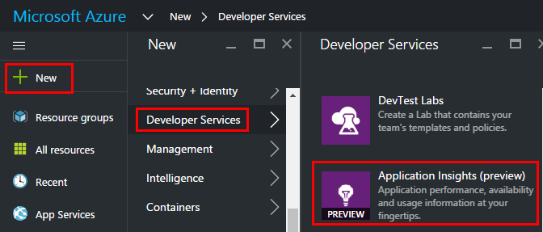
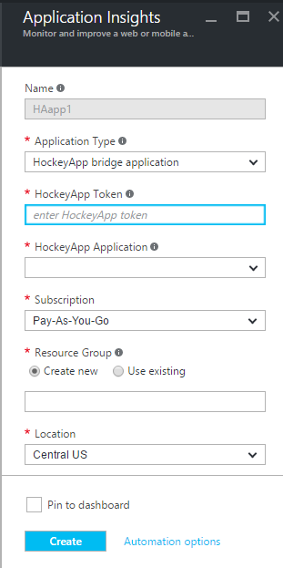
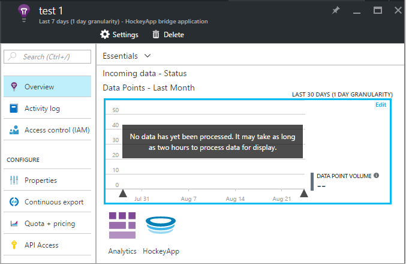
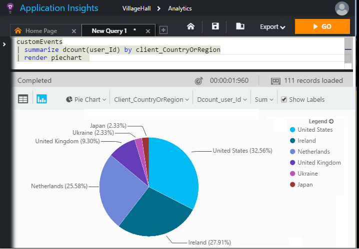

# Exploring HockeyApp data in Application Insights

> [!NOTE]
> HockeyApp is no longer available for new applications. Existing HockeyApp deployments will continue to work. Visual Studio App Center is now the recommended service from Microsoft for monitoring new mobile apps. [Learn how to set up your apps with App Center and Application Insights](../../azure-monitor/learn/mobile-center-quickstart.md).

[HockeyApp](https://azure.microsoft.com/services/hockeyapp/) is a service for monitoring live desktop and mobile apps. From HockeyApp, you can send custom and trace telemetry to monitor usage and assist in diagnosis (in addition to getting crash data). This stream of telemetry can be queried using the powerful [Analytics](../../azure-monitor/app/analytics.md) feature of [Azure Application Insights](../../azure-monitor/app/app-insights-overview.md). In addition, you can [export the custom and trace telemetry](export-telemetry.md). To enable these features, you set up a bridge that relays HockeyApp custom data to Application Insights.

## The HockeyApp Bridge app
The HockeyApp Bridge App is the core feature that enables you to access your HockeyApp custom and trace telemetry in Application Insights through the Analytics and Continuous Export features. Custom and trace events collected by HockeyApp after the creation of the HockeyApp Bridge App will be accessible from these features. Let's see how to set up one of these Bridge Apps.

In HockeyApp, open Account Settings, [API Tokens](https://rink.hockeyapp.net/manage/auth_tokens). Either create a new token or reuse an existing one. The minimum rights required are "read only". Take a copy of the API token.

Open the Microsoft Azure portal and [create an Application Insights resource](../../azure-monitor/app/create-new-resource.md ). Set Application Type to "HockeyApp bridge application":

You don't need to set a name - this will automatically be set from the HockeyApp name.

The HockeyApp bridge fields appear. 

Enter the HockeyApp token you noted earlier. This action populates the "HockeyApp Application" dropdown menu with all your HockeyApp applications. Select the one you want to use, and complete the remainder of the fields. 

Open the new resource. 

Note that the data takes a while to start flowing.

That's it! Custom and trace data collected in your HockeyApp-instrumented app from this point forward is now also available to you in the Analytics and Continuous Export features of Application Insights.

Let's briefly review each of these features now available to you.

## Analytics
Analytics is a powerful tool for ad hoc querying of your data, allowing you to diagnose and analyze your telemetry and quickly discover root causes and patterns.

* [Learn more about Analytics](../../azure-monitor/log-query/get-started-portal.md)

## Continuous export
Continuous Export allows you to export your data into an Azure Blob Storage container. This is very useful if you need to keep your data for longer than the retention period currently offered by Application Insights. You can keep the data in blob storage, process it into a SQL Database, or your preferred data warehousing solution.

[Learn more about Continuous Export](export-telemetry.md)

## Next steps
* [Apply Analytics to your data](../../azure-monitor/log-query/get-started-portal.md)

