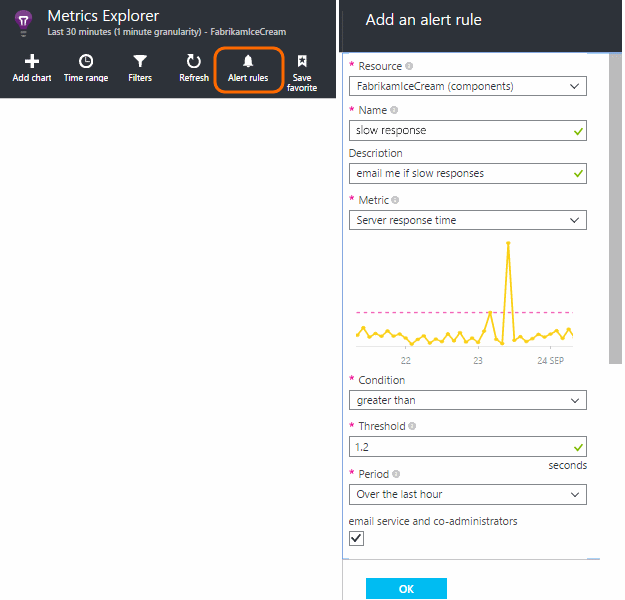
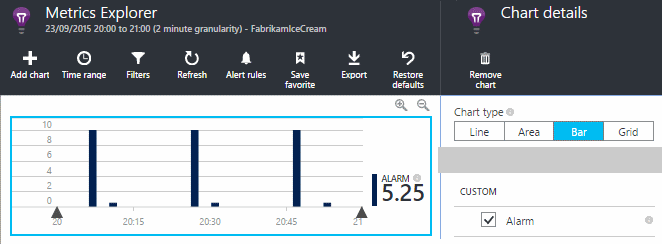
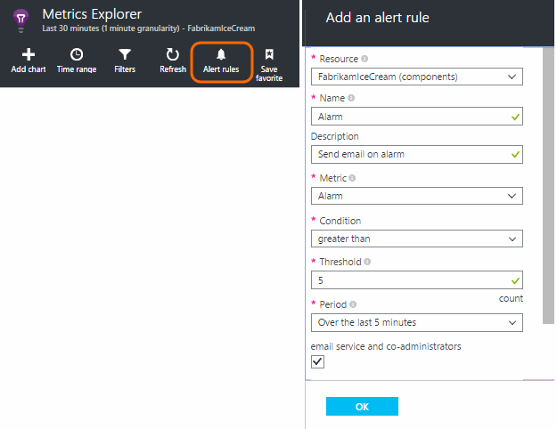
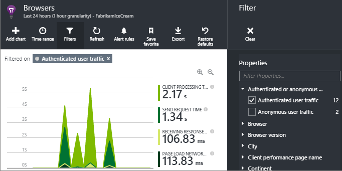

# How do I ... in Application Insights?
## Get an email when ...
### Email if my site goes down
Set an [availability web test](../../azure-monitor/app/monitor-web-app-availability.md).

### Email if my site is overloaded
Set an [alert](../../azure-monitor/platform/alerts-log.md) on **Server response time**. A threshold between 1 and 2 seconds should work.



Your app might also show signs of strain by returning failure codes. Set an alert on **Failed requests**.

If you want to set an alert on **Server exceptions**, you might have to do [some additional setup](../../azure-monitor/app/asp-net-exceptions.md) in order to see data.

### Email on exceptions
1. [Set up exception monitoring](../../azure-monitor/app/asp-net-exceptions.md)
2. [Set an alert](../../azure-monitor/platform/alerts-log.md) on the Exception count metric

### Email on an event in my app
Let's suppose you'd like to get an email when a specific event occurs. Application Insights doesn't provide this facility directly, but it can [send an alert when a metric crosses a threshold](../../azure-monitor/platform/alerts-log.md).

Alerts can be set on [custom metrics](../../azure-monitor/app/api-custom-events-metrics.md#trackmetric), though not custom events. Write some code to increase a metric when the event occurs:

    telemetry.TrackMetric("Alarm", 10);

or:

    var measurements = new Dictionary<string,double>();
    measurements ["Alarm"] = 10;
    telemetry.TrackEvent("status", null, measurements);

Because alerts have two states, you have to send a low value when you consider the alert to have ended:

    telemetry.TrackMetric("Alarm", 0.5);

Create a chart in [metric explorer](../../azure-monitor/platform/metrics-charts.md) to see your alarm:



Now set an alert to fire when the metric goes above a mid value for a short period:



Set the averaging period to the minimum.

You'll get emails both when the metric goes above and below the threshold.

Some points to consider:

* An alert has two states ("alert" and "healthy"). The state is evaluated only when a metric is received.
* An email is sent only when the state changes. This is why you have to send both high and low-value metrics.
* To evaluate the alert, the average is taken of the received values over the preceding period. This occurs every time a metric is received, so emails can be sent more frequently than the period you set.
* Since emails are sent both on "alert" and "healthy", you might want to consider re-thinking your one-shot event as a two-state condition. For example, instead of a "job completed" event, have a "job in progress" condition, where you get emails at the start and end of a job.

### Set up alerts automatically
[Use PowerShell to create new alerts](../../azure-monitor/platform/alerts-log.md)

## Use PowerShell to Manage Application Insights
* [Create new resources](https://docs.microsoft.com/azure/azure-monitor/app/create-new-resource#creating-a-resource-automatically)
* [Create new alerts](../../azure-monitor/platform/alerts-log.md)

## Separate telemetry from different versions

* Multiple roles in an app: Use a single Application Insights resource, and filter on [cloud_Rolename](../../azure-monitor/app/app-map.md).
* Separating development, test, and release versions: Use different Application Insights resources. Pick up the instrumentation keys from web.config. [Learn more](../../azure-monitor/app/separate-resources.md)
* Reporting build versions: Add a property using a telemetry initializer. [Learn more](../../azure-monitor/app/separate-resources.md)

## Monitor backend servers and desktop apps
[Use the Windows Server SDK module](../../azure-monitor/app/windows-desktop.md).

## Visualize data
#### Dashboard with metrics from multiple apps
* In [Metric Explorer](../../azure-monitor/platform/metrics-charts.md), customize your chart and save it as a favorite. Pin it to the Azure dashboard.

#### Dashboard with data from other sources and Application Insights
* [Export telemetry to Power BI](../../azure-monitor/app/export-power-bi.md ).

Or

* Use SharePoint as your dashboard, displaying data in SharePoint web parts. [Use continuous export and Stream Analytics to export to SQL](../../azure-monitor/app/code-sample-export-sql-stream-analytics.md).  Use PowerView to examine the database, and create a SharePoint web part for PowerView.

<a name="search-specific-users"></a>

### Filter out anonymous or authenticated users
If your users sign in, you can set the [authenticated user ID](../../azure-monitor/app/api-custom-events-metrics.md#authenticated-users). (It doesn't happen automatically.)

You can then:

* Search on specific user IDs


* Filter metrics to either anonymous or authenticated users



## Modify property names or values
Create a [filter](../../azure-monitor/app/api-filtering-sampling.md#filtering). This lets you modify or filter telemetry before it is sent from your app to Application Insights.

## List specific users and their usage
If you just want to [search for specific users](#search-specific-users), you can set the [authenticated user ID](../../azure-monitor/app/api-custom-events-metrics.md#authenticated-users).

If you want a list of users with data such as what pages they look at or how often they log in, you have two options:

* [Set authenticated user ID](../../azure-monitor/app/api-custom-events-metrics.md#authenticated-users), [export to a database](../../azure-monitor/app/code-sample-export-sql-stream-analytics.md) and use suitable tools to analyze your user data there.
* If you have only a small number of users, send custom events or metrics, using the data of interest as the metric value or event name, and setting the user ID as a property. To analyze page views, replace the standard JavaScript trackPageView call. To analyze server-side telemetry, use a telemetry initializer to add the user ID to all server telemetry. You can then filter and segment metrics and searches on the user ID.

## Reduce traffic from my app to Application Insights
* In [ApplicationInsights.config](../../azure-monitor/app/configuration-with-applicationinsights-config.md), disable any modules you don't need, such the performance counter collector.
* Use [Sampling and filtering](../../azure-monitor/app/api-filtering-sampling.md) at the SDK.
* In your web pages, Limit the number of Ajax calls reported for every page view. In the script snippet after `instrumentationKey:...` , insert: `,maxAjaxCallsPerView:3` (or a suitable number).
* If you're using [TrackMetric](../../azure-monitor/app/api-custom-events-metrics.md#trackmetric), compute the aggregate of batches of metric values before sending the result. There's an overload of TrackMetric() that provides for that.

Learn more about [pricing and quotas](../../azure-monitor/app/pricing.md).

## Disable telemetry
To **dynamically stop and start** the collection and transmission of telemetry from the server:

### ASP.NET Classic applications

```csharp
    using  Microsoft.ApplicationInsights.Extensibility;

    TelemetryConfiguration.Active.DisableTelemetry = true;
```

### Other applications
It is not recommended to use `TelemetryConfiguration.Active` singleton on console or ASP.NET Core applications.
if you created `TelemetryConfiguration` instance yourself - set `DisableTelemetry` to `true`.

For ASP.NET Core applications you may access `TelemetryConfiguration` instance using [ASP.NET Core dependency injection](/aspnet/core/fundamentals/dependency-injection/). Please find more details in [ApplicationInsights for ASP.NET Core applications](../../azure-monitor/app/asp-net-core.md) article.

## Disable selected standard collectors
You can disable standard collectors (for example, performance counters, HTTP requests, or dependencies)

* **ASP.NET applications** - Delete or comment out the relevant lines in [ApplicationInsights.config](../../azure-monitor/app/configuration-with-applicationinsights-config.md)
* **ASP.NET Core applications** - Follow telemetry modules configuration options in [ApplicationInsights ASP.NET Core](../../azure-monitor/app/asp-net-core.md#configuring-or-removing-default-telemetrymodules)

## View system performance counters
Among the metrics you can show in metrics explorer are a set of system performance counters. There's a predefined blade titled **Servers** that displays several of them.


### If you see no performance counter data
* **IIS server** on your own machine or on a VM. [Install Status Monitor](../../azure-monitor/app/monitor-performance-live-website-now.md).
* **Azure web site** - we don't support performance counters yet. There are several metrics you can get as a standard part of the Azure web site control panel.
* **Unix server** - [Install collectd](../../azure-monitor/app/java-collectd.md)

### To display more performance counters
* First, [add a new chart](../../azure-monitor/platform/metrics-charts.md) and see if the counter is in the basic set that we offer.
* If not, [add the counter to the set collected by the performance counter module](../../azure-monitor/app/performance-counters.md).
