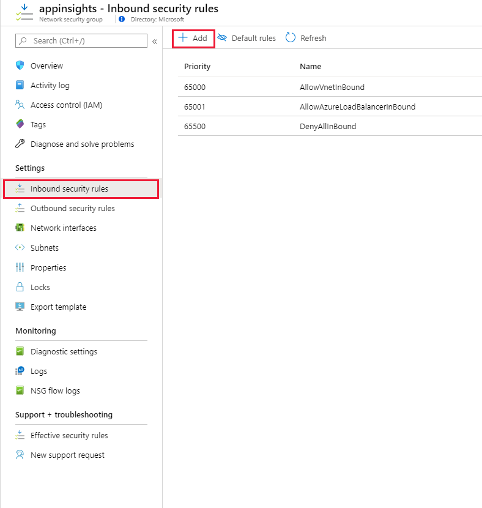
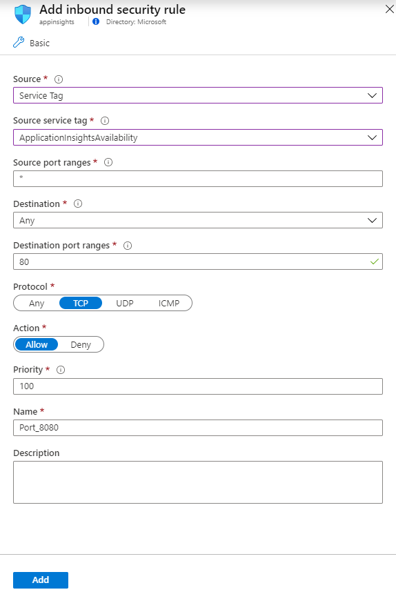

# IP addresses used by Application Insights and Log Analytics
The [Azure Application Insights](../../azure-monitor/app/app-insights-overview.md) service uses a number of IP addresses. You might need to know these addresses if the app that you are monitoring is hosted behind a firewall.

> [!NOTE]
> Although these addresses are static, it's possible that we will need to change them from time to time. All Application Insights traffic represents outbound traffic with the exception of availability monitoring and webhooks which require inbound firewall rules.

> [!TIP]
> You can use Azure [network service tags](https://docs.microsoft.com/azure/virtual-network/service-tags-overview
) to manage access if you are using Azure Network Security Groups. If you are managing access for hybrid/on premises resources you can download the equivalent IP address lists as [JSON files](https://docs.microsoft.com/azure/virtual-network/service-tags-overview#discover-service-tags-by-using-downloadable-json-files) which are updated each week: . To cover all the exceptions in this article you would need to use the service tags: 'ActionGroup', 'ApplicationInsightsAvailability', 'AzureMonitor'.

Alternatively, you can subscribe to this page as a RSS feed by adding https://github.com/MicrosoftDocs/azure-docs/commits/master/articles/azure-monitor/app/ip-addresses.md.atom to your favorite RSS/ATOM reader to get notified of the latest changes.


## Outgoing ports
You need to open some outgoing ports in your server's firewall to allow the Application Insights SDK and/or Status Monitor to send data to the portal:

| Purpose | URL | IP | Ports |
| --- | --- | --- | --- |
| Telemetry |dc.applicationinsights.azure.com<br/>dc.applicationinsights.microsoft.com<br/>dc.services.visualstudio.com |40.114.241.141<br/>104.45.136.42<br/>40.84.189.107<br/>168.63.242.221<br/>52.167.221.184<br/>52.169.64.244<br/>40.85.218.175<br/>104.211.92.54<br/>52.175.198.74<br/>51.140.6.23<br/>40.71.12.231<br/>13.69.65.22<br/>13.78.108.165<br/>13.70.72.233<br/>20.44.8.7<br/>13.86.218.248<br/>40.79.138.41<br/>52.231.18.241<br/>13.75.38.7<br/>102.133.155.50<br/>52.162.110.67<br/>191.233.204.248<br/>13.69.66.140<br/>13.77.52.29<br/>51.107.59.180<br/>40.71.12.235<br/>20.44.8.10<br/>40.71.13.169<br/>13.66.141.156<br/>40.71.13.170<br/>13.69.65.23<br/>20.44.17.0 | 443 |
| Live Metrics Stream (East US) |use.rt.prod.applicationinsights.trafficmanager.net |23.96.28.38<br/>13.92.40.198<br/>40.112.49.101<br/>40.117.80.207 |443 |
| Live Metrics Stream (South Central US) |ussc.rt.prod.applicationinsights.trafficmanager.net |157.55.177.6<br/>104.44.140.84<br/>104.215.81.124<br/>23.100.122.113 |443 |
| Live Metrics Stream (North Europe) |eun.rt.prod.applicationinsights.trafficmanager.net |40.115.103.168<br/>40.115.104.31<br/>40.87.140.215<br/>40.87.138.220 |443 |
| Live Metrics Stream (West Europe) |euw.rt.prod.applicationinsights.trafficmanager.net |13.80.134.255<br/>40.68.61.229<br/>23.101.69.223<br/>52.232.106.242 |443 |
| Live Metrics Stream (East Asia) |ase.rt.prod.applicationinsights.trafficmanager.net |23.100.90.7<br/>23.101.13.65<br/>23.101.0.142<br/>23.101.9.4 |443 |
| Live Metrics Stream (Southeast Asia) |asse.rt.prod.applicationinsights.trafficmanager.net |207.46.224.101<br/>207.46.236.191<br/>137.116.151.139<br/>13.76.87.86 |443 |

## Status Monitor
Status Monitor Configuration - needed only when making changes.

| Purpose | URL | IP | Ports |
| --- | --- | --- | --- |
| Configuration |`management.core.windows.net` | |`443` |
| Configuration |`management.azure.com` | |`443` |
| Configuration |`login.windows.net` | |`443` |
| Configuration |`login.microsoftonline.com` | |`443` |
| Configuration |`secure.aadcdn.microsoftonline-p.com` | |`443` |
| Configuration |`auth.gfx.ms` | |`443` |
| Configuration |`login.live.com` | |`443` |
| Installation | `globalcdn.nuget.org`, `packages.nuget.org` ,`api.nuget.org/v3/index.json` `nuget.org`, `api.nuget.org`, `dc.services.vsallin.net` | |`443` |

## Availability tests
This is the list of addresses from which [availability web tests](../../azure-monitor/app/monitor-web-app-availability.md) are run. If you want to run web tests on your app, but your web server is restricted to serving specific clients, then you will have to permit incoming traffic from our availability test servers.

### Service tag

If you are using Azure Network Security Groups, simply add an **inbound port rule** to allow traffic from Application Insights availability tests by selecting **Service Tag** as the **Source** and **ApplicationInsightsAvailability** as the **Source service tag**.

>[!div class="mx-imgBorder"]
>

>[!div class="mx-imgBorder"]
>

Open ports 80 (http) and 443 (https) for incoming traffic from these addresses (IP addresses are grouped by location):

### Addresses grouped by location

> [!NOTE]
> These addresses are listed using Classless Inter-Domain Routing (CIDR) notation. This means that an entry like `51.144.56.112/28` is equivalent to 16 IPs starting at `51.144.56.112` and ending at `51.144.56.127`.

```
Australia East
20.40.124.176/28
20.40.124.240/28
20.40.125.80/28

Brazil South
191.233.26.176/28
191.233.26.128/28
191.233.26.64/28

France Central (Formerly France South)
20.40.129.96/28
20.40.129.112/28
20.40.129.128/28
20.40.129.144/28

France Central
20.40.129.32/28
20.40.129.48/28
20.40.129.64/28
20.40.129.80/28

East Asia
52.229.216.48/28
52.229.216.64/28
52.229.216.80/28

North Europe
52.158.28.64/28
52.158.28.80/28
52.158.28.96/28
52.158.28.112/28

Japan East
52.140.232.160/28
52.140.232.176/28
52.140.232.192/28

West Europe
51.144.56.96/28
51.144.56.112/28
51.144.56.128/28
51.144.56.144/28
51.144.56.160/28
51.144.56.176/28

UK South
51.105.9.128/28
51.105.9.144/28
51.105.9.160/28

UK West
20.40.104.96/28
20.40.104.112/28
20.40.104.128/28
20.40.104.144/28

Southeast Asia
52.139.250.96/28
52.139.250.112/28
52.139.250.128/28
52.139.250.144/28

West US
40.91.82.48/28
40.91.82.64/28
40.91.82.80/28
40.91.82.96/28
40.91.82.112/28
40.91.82.128/28

Central US
13.86.97.224/28
13.86.97.240/28
13.86.98.48/28
13.86.98.0/28
13.86.98.16/28
13.86.98.64/28

North Central US
23.100.224.16/28
23.100.224.32/28
23.100.224.48/28
23.100.224.64/28
23.100.224.80/28
23.100.224.96/28
23.100.224.112/28
23.100.225.0/28

South Central US
20.45.5.160/28
20.45.5.176/28
20.45.5.192/28
20.45.5.208/28
20.45.5.224/28
20.45.5.240/28

East US
20.42.35.32/28
20.42.35.64/28
20.42.35.80/28
20.42.35.96/28
20.42.35.112/28
20.42.35.128/28

Azure US Government (Not needed if you are an Azure Public cloud customer)

20.140.48.160/27
20.140.56.160/27
20.140.64.160/27
20.140.72.160/27
52.127.49.96/27
```  

## Application Insights & Log Analytics APIs

| Purpose | URI |  IP | Ports |
| --- | --- | --- | --- |
| API |`api.applicationinsights.io`<br/>`api1.applicationinsights.io`<br/>`api2.applicationinsights.io`<br/>`api3.applicationinsights.io`<br/>`api4.applicationinsights.io`<br/>`api5.applicationinsights.io`<br/>`dev.applicationinsights.io`<br/>`dev.applicationinsights.microsoft.com`<br/>`dev.aisvc.visualstudio.com`<br/>`www.applicationinsights.io`<br/>`www.applicationinsights.microsoft.com`<br/>`www.aisvc.visualstudio.com`<br/>`api.loganalytics.io`<br/>`*.api.loganalytics.io`<br/>`dev.loganalytics.io`<br>`docs.loganalytics.io`<br/>`www.loganalytics.io` |20.37.52.188 <br/> 20.37.53.231 <br/> 20.36.47.130 <br/> 20.40.124.0 <br/> 20.43.99.158 <br/> 20.43.98.234 <br/> 13.70.127.61 <br/> 40.81.58.225 <br/> 20.40.160.120 <br/> 23.101.225.155 <br/> 52.139.8.32 <br/> 13.88.230.43 <br/> 52.230.224.237 <br/> 52.242.230.209 <br/> 52.173.249.138 <br/> 52.229.218.221 <br/> 52.229.225.6 <br/> 23.100.94.221 <br/> 52.188.179.229 <br/> 52.226.151.250 <br/> 52.150.36.187 <br/> 40.121.135.131 <br/> 20.44.73.196 <br/> 20.41.49.208 <br/> 40.70.23.205 <br/> 20.40.137.91 <br/> 20.40.140.212 <br/> 40.89.189.61 <br/> 52.155.118.97 <br/> 52.156.40.142 <br/> 23.102.66.132 <br/> 52.231.111.52 <br/> 52.231.108.46 <br/> 52.231.64.72 <br/> 52.162.87.50 <br/> 23.100.228.32 <br/> 40.127.144.141 <br/> 52.155.162.238 <br/> 137.116.226.81 <br/> 52.185.215.171 <br/> 40.119.4.128 <br/> 52.171.56.178 <br/> 20.43.152.45 <br/> 20.44.192.217 <br/> 13.67.77.233 <br/> 51.104.255.249 <br/> 51.104.252.13 <br/> 51.143.165.22 <br/> 13.78.151.158 <br/> 51.105.248.23 <br/> 40.74.36.208 <br/> 40.74.59.40 <br/> 13.93.233.49 <br/> 52.247.202.90 |80,443 |
| Azure Pipeline annotations extension |aigs1.aisvc.visualstudio.com |dynamic|443 | 

## Application Insights Analytics

| Purpose | URI | IP | Ports |
| --- | --- | --- | --- |
| Analytics Portal | analytics.applicationinsights.io | dynamic | 80,443 |
| CDN | applicationanalytics.azureedge.net | dynamic | 80,443 |
| Media CDN | applicationanalyticsmedia.azureedge.net | dynamic | 80,443 |

Note: *.applicationinsights.io domain is owned by Application Insights team.

## Log Analytics Portal

| Purpose | URI | IP | Ports |
| --- | --- | --- | --- |
| Portal | portal.loganalytics.io | dynamic | 80,443 |
| CDN | applicationanalytics.azureedge.net | dynamic | 80,443 |

Note: *.loganalytics.io domain is owned by the Log Analytics team.

## Application Insights Azure portal Extension

| Purpose | URI | IP | Ports |
| --- | --- | --- | --- |
| Application Insights Extension | stamp2.app.insightsportal.visualstudio.com | dynamic | 80,443 |
| Application Insights Extension CDN | insightsportal-prod2-cdn.aisvc.visualstudio.com<br/>insightsportal-prod2-asiae-cdn.aisvc.visualstudio.com<br/>insightsportal-cdn-aimon.applicationinsights.io | dynamic | 80,443 |

## Application Insights SDKs

| Purpose | URI | IP | Ports |
| --- | --- | --- | --- |
| Application Insights JS SDK CDN | az416426.vo.msecnd.net | dynamic | 80,443 |
| Application Insights Java SDK | aijavasdk.blob.core.windows.net | dynamic | 80,443 |

## Action Group webhooks

| Purpose | IP | Ports
| --- | --- | --- |
| Alerting | 13.72.19.232 <br/>13.106.57.181<br/>13.106.54.3<br/>13.106.54.19<br/>13.106.38.142<br/>13.106.38.148<br/>13.106.57.196<br/>13.106.57.197<br/>52.244.68.117<br/>52.244.65.137<br/>52.183.31.0<br/>52.184.145.166<br/>51.4.138.199<br/>51.5.148.86<br/>51.5.149.19 | 443 |

## Profiler

| Purpose | URI | IP | Ports |
| --- | --- | --- | --- |
| Agent | agent.azureserviceprofiler.net<br/>*.agent.azureserviceprofiler.net | 20.190.60.38<br/>20.190.60.32<br/>52.173.196.230<br/>52.173.196.209<br/>23.102.44.211<br/>23.102.45.216<br/>13.69.51.218<br/>13.69.51.175<br/>138.91.32.98<br/>138.91.37.93<br/>40.121.61.208<br/>40.121.57.2<br/>51.140.60.235<br/>51.140.180.52<br/>52.138.31.112<br/>52.138.31.127<br/>104.211.90.234<br/>104.211.91.254<br/>13.70.124.27<br/>13.75.195.15<br/>52.185.132.101<br/>52.185.132.170<br/>20.188.36.28<br/>40.89.153.171<br/>52.141.22.239<br/>52.141.22.149<br/>102.133.162.233<br/>102.133.161.73<br/>191.232.214.6<br/>191.232.213.239 | 443
| Portal | gateway.azureserviceprofiler.net | dynamic | 443
| Storage | *.core.windows.net | dynamic | 443

## Snapshot Debugger

> [!NOTE]
> Profiler and Snapshot Debugger share the same set of IP addresses.

| Purpose | URI | IP | Ports |
| --- | --- | --- | --- |
| Agent | ppe.azureserviceprofiler.net<br/>*.ppe.azureserviceprofiler.net | 20.190.60.38<br/>20.190.60.32<br/>52.173.196.230<br/>52.173.196.209<br/>23.102.44.211<br/>23.102.45.216<br/>13.69.51.218<br/>13.69.51.175<br/>138.91.32.98<br/>138.91.37.93<br/>40.121.61.208<br/>40.121.57.2<br/>51.140.60.235<br/>51.140.180.52<br/>52.138.31.112<br/>52.138.31.127<br/>104.211.90.234<br/>104.211.91.254<br/>13.70.124.27<br/>13.75.195.15<br/>52.185.132.101<br/>52.185.132.170<br/>20.188.36.28<br/>40.89.153.171<br/>52.141.22.239<br/>52.141.22.149<br/>102.133.162.233<br/>102.133.161.73<br/>191.232.214.6<br/>191.232.213.239 | 443
| Portal | ppe.gateway.azureserviceprofiler.net | dynamic | 443
| Storage | *.core.windows.net | dynamic | 443
