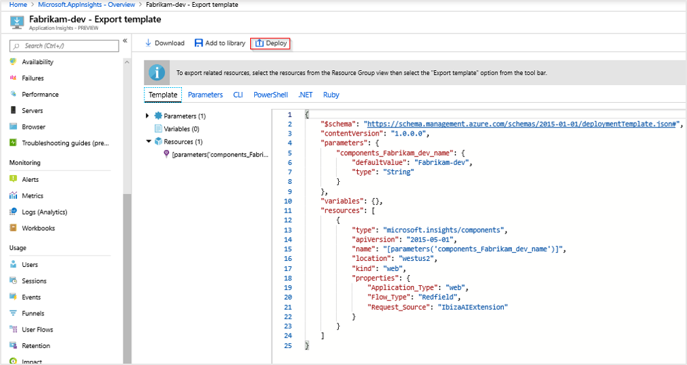
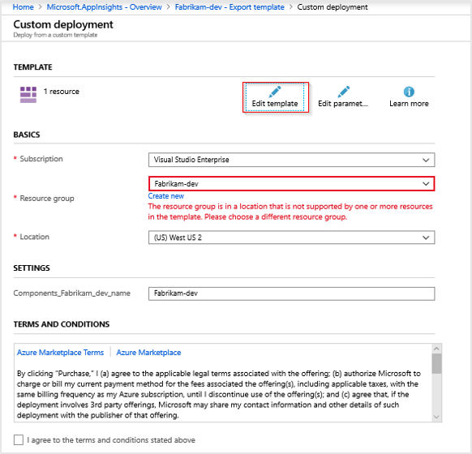
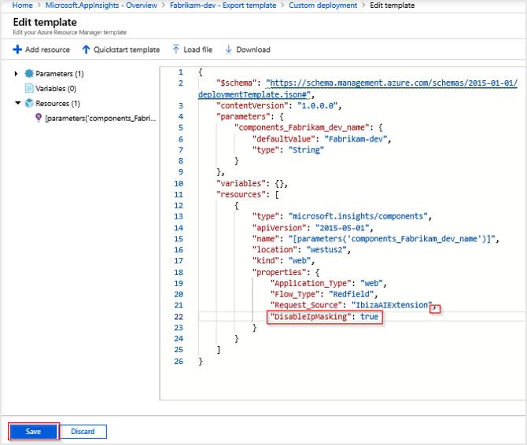

# Geolocation and IP address handling

This article explains how geolocation lookup and IP address handling work in Application Insights, along with how to modify the default behavior.

## Default behavior

By default, IP addresses are temporarily collected but not stored in Application Insights. This process follows some basic steps.

When telemetry is sent to Azure, Application Insights uses the IP address to do a geolocation lookup. Application Insights uses the results of this lookup to populate the fields `client_City`, `client_StateOrProvince`, and `client_CountryOrRegion`. The address is then discarded, and `0.0.0.0` is written to the `client_IP` field.

To remove geolocation data, see the following articles:

* [Remove the client IP initializer](../app/configuration-with-applicationinsights-config.md)
* [Use a custom initializer](../app/api-filtering-sampling.md)

The telemetry types are:

* **Browser telemetry**: Application Insights collects the sender's IP address. The ingestion endpoint calculates the IP address.
* **Server telemetry**: The Application Insights telemetry module temporarily collects the client IP address. The IP address isn't collected locally when the `X-Forwarded-For` header is set. When the incoming IP address list has more than one item, the last IP address is used to populate geolocation fields.

This behavior is by design to help avoid unnecessary collection of personal data and IP address location information. Whenever possible, we recommend avoiding the collection of personal data.

> [!NOTE]
> Although the default is to not collect IP addresses, you can override this behavior. We recommend verifying that the collection doesn't break any compliance requirements or local regulations.
>
> To learn more about handling personal data in Application Insights, see [Guidance for personal data](../logs/personal-data-mgmt.md).

When IP addresses aren't collected, city and other geolocation attributes populated by our pipeline by using the IP address also aren't collected. You can mask IP collection at the source. There are two ways to do it. You can:

* Remove the client IP initializer. For more information, see [Configuration with Applications Insights Configuration](configuration-with-applicationinsights-config.md).
* Provide your own custom initializer. For more information, see an [API filtering example](api-filtering-sampling.md).

## Storage of IP address data

To enable IP collection and storage, the `DisableIpMasking` property of the Application Insights component must be set to `true`. You can set this property through Azure Resource Manager templates (ARM templates) or by calling the REST API.

### ARM template

```json
{
       "id": "/subscriptions/<subscription-id>/resourceGroups/<resource-group-name>/providers/microsoft.insights/components/<resource-name>",
       "name": "<resource-name>",
       "type": "microsoft.insights/components",
       "location": "westcentralus",
       "tags": {
              
       },
       "kind": "web",
       "properties": {
              "Application_Type": "web",
              "Flow_Type": "Redfield",
              "Request_Source": "IbizaAIExtension",
              // ...
              "DisableIpMasking": true
       }
}
```

### Portal

If you need to modify the behavior for only a single Application Insights resource, use the Azure portal.

1. Go to your Application Insights resource, and then select **Automation** > **Export template**.

1. Select **Deploy**.

    

1. Select **Edit template**.

    

    > [!NOTE]
    > If you experience the error shown in the preceding screenshot, you can resolve it. It states: "The resource group is in a location that is not supported by one or more resources in the template. Please choose a different resource group." Temporarily select a different resource group from the dropdown list and then re-select your original resource group.

1. In the JSON template, locate `properties` inside `resources`. Add a comma to the last JSON field, and then add the following new line: `"DisableIpMasking": true`. Then select **Save**.

    

1. Select **Review + create** > **Create**.

    > [!NOTE]
    > If you see "Your deployment failed," look through your deployment details for the one with the type `microsoft.insights/components` and check the status. If that one succeeds, the changes made to `DisableIpMasking` were deployed.

1. After the deployment is complete, new telemetry data will be recorded.

    If you select and edit the template again, you'll see only the default template without the newly added property. If you aren't seeing IP address data and want to confirm that `"DisableIpMasking": true` is set, run the following PowerShell commands:
    
    ```powershell
    # Replace `Fabrikam-dev` with the appropriate resource and resource group name.
    # If you aren't using Azure Cloud Shell, you need to connect to your Azure account
    # Connect-AzAccount 
    $AppInsights = Get-AzResource -Name 'Fabrikam-dev' -ResourceType 'microsoft.insights/components' -ResourceGroupName 'Fabrikam-dev'
    $AppInsights.Properties
    ```
    
    A list of properties is returned as a result. One of the properties should read `DisableIpMasking: true`. If you run the PowerShell commands before you deploy the new property with Azure Resource Manager, the property won't exist.

### REST API

The following [REST API](/rest/api/azure/) payload makes the same modifications:

```
PATCH https://management.azure.com/subscriptions/<sub-id>/resourceGroups/<rg-name>/providers/microsoft.insights/components/<resource-name>?api-version=2018-05-01-preview HTTP/1.1
Host: management.azure.com
Authorization: AUTH_TOKEN
Content-Type: application/json
Content-Length: 54

{
       "location": "<resource location>",
       "kind": "web",
       "properties": {
              "Application_Type": "web",
              "DisableIpMasking": true
       }
}
```

## Telemetry initializer

If you need a more flexible alternative than `DisableIpMasking`, you can use a [telemetry initializer](./api-filtering-sampling.md#addmodify-properties-itelemetryinitializer) to copy all or part of the IP address to a custom field. The code for this class is the same across .NET versions.

```csharp
using Microsoft.ApplicationInsights.Channel;
using Microsoft.ApplicationInsights.DataContracts;
using Microsoft.ApplicationInsights.Extensibility;

namespace MyWebApp
{
    public class CloneIPAddress : ITelemetryInitializer
    {
        public void Initialize(ITelemetry telemetry)
        {
            ISupportProperties propTelemetry = telemetry as ISupportProperties;

            if (propTelemetry !=null && !propTelemetry.Properties.ContainsKey("client-ip"))
            {
                string clientIPValue = telemetry.Context.Location.Ip;
                propTelemetry.Properties.Add("client-ip", clientIPValue);
            }
        }
    } 
}
```

> [!NOTE]
> If you can't access `ISupportProperties`, make sure you're running the latest stable release of the Application Insights SDK. `ISupportProperties` is intended for high cardinality values. `GlobalProperties` is more appropriate for low cardinality values like region name and environment name.


# [.NET 6.0+](#tab/framework)

```csharp
 using Microsoft.ApplicationInsights.Extensibility;
 using CustomInitializer.Telemetry;

builder.services.AddSingleton<ITelemetryInitializer, CloneIPAddress>();
```

# [.NET 5.0](#tab/dotnet5)

```csharp
 using Microsoft.ApplicationInsights.Extensibility;
 using CustomInitializer.Telemetry;

 public void ConfigureServices(IServiceCollection services)
{
    services.AddSingleton<ITelemetryInitializer, CloneIPAddress>();
}
```

# [ASP.NET Framework](#tab/dotnet6)

```csharp
using Microsoft.ApplicationInsights.Extensibility;

namespace MyWebApp
{
    public class MvcApplication : System.Web.HttpApplication
    {
        protected void Application_Start()
        {
              //Enable your telemetry initializer:
              TelemetryConfiguration.Active.TelemetryInitializers.Add(new CloneIPAddress());
        }
    }
}

```

---

# [Node.js](#tab/nodejs)

### Node.js

```javascript
appInsights.defaultClient.addTelemetryProcessor((envelope) => {
    const baseData = envelope.data.baseData;
    if (appInsights.Contracts.domainSupportsProperties(baseData)) {
        const ipAddress = envelope.tags[appInsights.defaultClient.context.keys.locationIp];
        if (ipAddress) {
            baseData.properties["client-ip"] = ipAddress;
        }
    }
});
```
# [Client-side JavaScript](#tab/javascript)

### Client-side JavaScript

Unlike the server-side SDKs, the client-side JavaScript SDK doesn't calculate an IP address. By default, IP address calculation for client-side telemetry occurs at the ingestion endpoint in Azure.

If you want to calculate the IP address directly on the client side, you need to add your own custom logic and use the result to set the `ai.location.ip` tag. When `ai.location.ip` is set, the ingestion endpoint doesn't perform IP address calculation, and the provided IP address is used for the geolocation lookup. In this scenario, the IP address is still zeroed out by default.

To keep the entire IP address calculated from your custom logic, you could use a telemetry initializer that would copy the IP address data that you provided in `ai.location.ip` to a separate custom field. But again, unlike the server-side SDKs, the client-side SDK won't calculate the address for you if it can't rely on third-party libraries or your own custom logic.

```javascript
appInsights.addTelemetryInitializer((item) => {
    const ipAddress = item.tags && item.tags["ai.location.ip"];
    if (ipAddress) {
        item.baseData.properties = {
            ...item.baseData.properties,
            "client-ip": ipAddress
        };
    }
});

```  

If client-side data traverses a proxy before forwarding to the ingestion endpoint, IP address calculation might show the IP address of the proxy and not the client.

---

### View the results of your telemetry initializer

If you send new traffic to your site and wait a few minutes, you can then run a query to confirm that the collection is working:

```kusto
requests
| where timestamp > ago(1h) 
| project appName, operation_Name, url, resultCode, client_IP, customDimensions.["client-ip"]
```

Newly collected IP addresses will appear in the `customDimensions_client-ip` column. The default `client-ip` column will still have all four octets zeroed out.

If you're testing from localhost, and the value for `customDimensions_client-ip` is `::1`, this value is expected behavior. The `::1` value represents the loopback address in IPv6. It's equivalent to `127.0.0.1` in IPv4.

## Next steps

* Learn more about [personal data collection](../logs/personal-data-mgmt.md) in Application Insights.
* Learn more about how [IP address collection](https://apmtips.com/posts/2016-07-05-client-ip-address/) works in Application Insights. This article is an older external blog post written by one of our engineers. It predates the current default behavior where the IP address is recorded as `0.0.0.0`. The article goes into greater depth on the mechanics of the built-in telemetry initializer.
