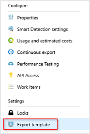
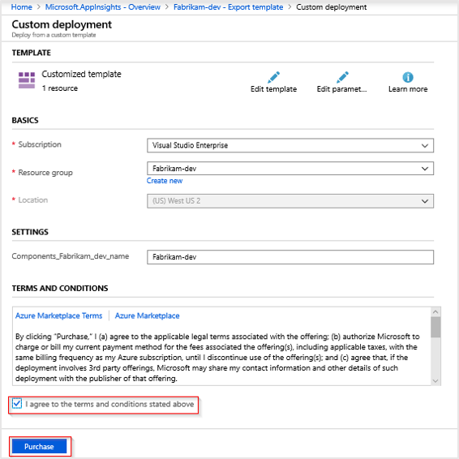

# Geolocation and IP address handling

This article explains how geolocation lookup and IP address handling occur in Application Insights along with how to modify the default behavior.

## Default behavior

By default IP addresses are temporarily collected, but not stored in Application Insights. The basic process is as follows:

IP addresses are sent to Application Insights as part of telemetry data. Upon reaching the ingestion endpoint in Azure, the IP address is used to perform a geolocation lookup using [GeoLite2 from MaxMind](https://dev.maxmind.com/geoip/geoip2/geolite2/). The results of this lookup are used to populate the following fields `client_City`, `client_StateOrProvince`, `client_CountryOrRegion`. At this point, the IP address is discarded and `0.0.0.0` is written to the `client_IP` field.

* Browser telemetry: We temporarily collect the sender's IP address. IP address is calculated by the ingestion endpoint.
* Server telemetry: The Application Insights module temporarily collects the client IP address. It is not collected if `X-Forwarded-For` is set.

This behavior is by design to help avoid unnecessary collection of personal data. Whenever possible, we recommend avoiding the collection of personal data. 

## Overriding default behavior

While the default behavior is to minimize the collection of personal data, we still offer the flexibility to collect and store IP address data. Before choosing to store any personal data like IP addresses, we strongly recommend verifying that this does not break any compliance requirements or local regulations that you may be subject to. To learn more about personal data handling in Application Insights, consult the [guidance for personal data](https://docs.microsoft.com/azure/azure-monitor/platform/personal-data-mgmt).

## Storing IP address data

In order to enable IP collection and storage, the `DisableIpMasking` property of the Application Insights component must be set to `true`. This property can be set either through Azure Resource Manager templates or by calling the REST API. 

### Azure Resource Manager Template

```json
{
       "id": "/subscriptions/<subscription-id>/resourceGroups/<resource-group-name>/providers/microsoft.insights/components/<resource-name>",
       "name": "<resource-name>",
       "type": "microsoft.insights/components",
       "location": "westcentralus",
       "tags": {
              
       },
       "kind": "web",
       "properties": {
              "Application_Type": "web",
              "Flow_Type": "Redfield",
              "Request_Source": "IbizaAIExtension",
              // ...
              "DisableIpMasking": true
       }
}
```

### Portal 

If you only need to modify the behavior for a single Application Insights resource the easiest way to accomplish this is via the Azure portal.  

1. Go your Application Insights resource > **Settings** > **Export Template** 

    

2. Select **Deploy**

    

3. Select **Edit Template**. (If your template has additional properties or resources that do not appear in this example template, proceed with caution to ensure that all resources will accept the template deployment as an incremental change/update.)

    

4. Make the following changes to the json for your resource and then click **Save**:

    

    > [!WARNING]
    > If you experience an error that says: **_The resource group is in a location that is not supported by one or more resources in the template. Please choose a different resource group._** Temporarily select a different resource group from the dropdown and then re-select your original resource group to resolve the error.

5. Select **I agree** > **Purchase**. 

    

    In this case nothing new is being purchased, we are just updating the config of the existing Application Insights resource.

6. Once the deployment is complete new telemetry data will be recorded.

    If you were to select and edit template again you would only see the default template and would not see your newly added property and its associated value. If you aren't seeing IP address data and want to confirm that `"DisableIpMasking": true` is set. Run the following PowerShell: (Replace `Fabrikam-dev` with the appropriate resource and resource group name.)
    
    ```powershell
    # If you aren't using the cloud shell you will need to connect to your Azure account
    # Connect-AzAccount 
    $AppInsights = Get-AzResource -Name 'Fabrikam-dev' -ResourceType 'microsoft.insights/components' -ResourceGroupName 'Fabrikam-dev'
    $AppInsights.Properties
    ```
    
    A list of properties will be returned as a result. One of the properties should read `DisableIpMasking: true`. If you run the PowerShell prior to deploying the new property with Azure Resource Manager, the property will not exist.

### Rest API

The [Rest API](https://docs.microsoft.com/rest/api/azure/) payload to make the same modifications is as follows:

```
PATCH https://management.azure.com/subscriptions/<sub-id>/resourceGroups/<rg-name>/providers/microsoft.insights/components/<resource-name>?api-version=2018-05-01-preview HTTP/1.1
Host: management.azure.com
Authorization: AUTH_TOKEN
Content-Type: application/json
Content-Length: 54

{
       "location": "<resource location>",
       "kind": "web",
       "properties": {
              "Application_Type": "web",
              "DisableIpMasking": true
       }
}
```

## Telemetry initializer

If you need a more flexible alternative than `DisableIpMasking` to  record all or part of IP addresses, you can use a [telemetry initializer](https://docs.microsoft.com/azure/azure-monitor/app/api-filtering-sampling#addmodify-properties-itelemetryinitializer) to copy all or part the IP to a custom field. 

### ASP.NET / ASP.NET Core

```csharp
using Microsoft.ApplicationInsights.Channel;
using Microsoft.ApplicationInsights.DataContracts;
using Microsoft.ApplicationInsights.Extensibility;

namespace MyWebApp
{
    public class CloneIPAddress : ITelemetryInitializer
    {
        public void Initialize(ITelemetry telemetry)
        {
            ISupportProperties propTelemetry = telemetry as ISupportProperties;

            if (propTelemetry !=null && !propTelemetry.Properties.ContainsKey("client-ip"))
            {
                string clientIPValue = telemetry.Context.Location.Ip;
                propTelemetry.Properties.Add("client-ip", clientIPValue);
            }
        }
    } 
}
```

> [!NOTE]
> If you are unable to access `ISupportProperties`, check and make sure you are running the latest stable release of the Application Insights SDK. `ISupportProperties` are intended for high cardinality values, whereas `GlobalProperties` are more appropriate for low cardinality values like region name, environment name, etc. 

### Enable telemetry initializer for ASP.NET

```csharp
using Microsoft.ApplicationInsights.Extensibility;


namespace MyWebApp
{
    public class MvcApplication : System.Web.HttpApplication
    {
        protected void Application_Start()
        {
              //Enable your telemetry initializer:
              TelemetryConfiguration.Active.TelemetryInitializers.Add(new CloneIPAddress());
        }
    }
}

```

### Enable telemetry initializer for ASP.NET Core

You can create your telemetry initializer the same way for ASP.NET Core as ASP.NET but to enable the initializer, use the following example for reference:

```csharp
 using Microsoft.ApplicationInsights.Extensibility;
 using CustomInitializer.Telemetry;
 public void ConfigureServices(IServiceCollection services)
{
    services.AddSingleton<ITelemetryInitializer, CloneIPAddress>();
}
```

### Node.js

```javascript
appInsights.defaultClient.addTelemetryProcessor((envelope) => {
    const baseData = envelope.data.baseData;
    if (appInsights.Contracts.domainSupportsProperties(baseData)) {
        const ipAddress = envelope.tags[appInsights.defaultClient.context.keys.locationIp];
        if (ipAddress) {
            baseData.properties["client-ip"] = ipAddress;
        }
    }
});
```

### Client-side JavaScript

Unlike the server-side SDKs, the client-side Javascript SDK does not calculate IP address. By default IP address calculation for client-side telemetry is performed at the ingestion endpoint in Azure upon telemetry arrival. This means that if you were sending client-side data to a proxy and then forwarding to the ingestion endpoint, IP address calculation may show the IP address of the proxy and not the client. If no proxy is used this should not be an issue.

If you wish to calculate IP address directly on the client-side you would need to add your own custom logic to perform this calculation and use the result to set the `ai.location.ip` tag. When `ai.location.ip` is set, IP address calculation is not performed by the ingestion endpoint and the provided IP address is honored and used for performing the geo lookup. In this scenario, IP address will still be zeroed out by default. 

To retain the entire IP address calculated from your custom logic, you could use a telemetry initializer that would copy the IP address data you provided in `ai.location.ip` to a separate custom field. But again unlike the server-side SDKs, without relying on 3rd party libraries or your own custom client-side IP collection logic the client-side SDK will not calculate the IP for you.    


```javascript
appInsights.addTelemetryInitializer((item) => {
    const ipAddress = item.tags && item.tags["ai.location.ip"];
    if (ipAddress) {
        item.baseData.properties = {
            ...item.baseData.properties,
            "client-ip": ipAddress
        };
    }
});

```  

### View the results of your telemetry initializer

If you then trigger new traffic against your site and wait approximately 2-5 minutes to ensure it had time to be ingested, you can run a Kusto query to see if IP address collection is working:

```kusto
requests
| where timestamp > ago(1h) 
| project appName, operation_Name, url, resultCode, client_IP, customDimensions.["client-ip"]
```

Newly collected IP addresses should appear in the `customDimensions_client-ip` column. The default `client-ip` column will still have all 4 octets either zeroed out or only displaying the first three octets depending on how you have configured IP address collection at the component level. If you are testing locally after implementing the telemetry initializer and the value you see for `customDimensions_client-ip` is `::1` this is expected behavior. `::1` represents the loopback address in IPv6. It is equivalent to `127.0.01` in IPv4 and is the result you will see when testing from localhost.

## Next Steps

* Learn more about [personal data collection](https://docs.microsoft.com/azure/azure-monitor/platform/personal-data-mgmt) in Application Insights.

* Learn more about how [IP address collection](https://apmtips.com/posts/2016-07-05-client-ip-address/) in Application Insights works. (This is an older external blog post written by one of our engineers. It predates the current default behavior where IP address is recorded as `0.0.0.0`, but it goes into greater depth on the mechanics of the built-in `ClientIpHeaderTelemetryInitializer`.)
