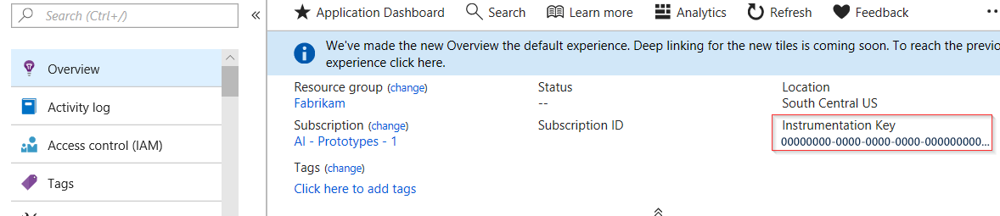

# collectd: Linux performance metrics in Application Insights


To explore Linux system performance metrics in [Application Insights](../../azure-monitor/app/app-insights-overview.md), install [collectd](https://collectd.org/), together with its Application Insights plug-in. This open-source solution gathers various system and network statistics.

Typically you'll use collectd if you have already [instrumented your Java web service with Application Insights][java]. It gives you more data to help you to enhance your app's performance or diagnose problems. 

## Get your instrumentation key
In the [Microsoft Azure portal](https://portal.azure.com), open the [Application Insights](../../azure-monitor/app/app-insights-overview.md) resource where you want the data to appear. (Or [create a new resource](../../azure-monitor/app/create-new-resource.md ).)

Take a copy of the instrumentation key, which identifies the resource.



## Install collectd and the plug-in
On your Linux server machines:

1. Install [collectd](https://collectd.org/) version 5.4.0 or later.
2. Download the [Application Insights collectd writer plugin](https://github.com/microsoft/ApplicationInsights-Java/tree/master/collectd/src/main/java/com/microsoft/applicationinsights/collectd/internal). Note the version number.
3. Copy the plugin JAR into `/usr/share/collectd/java`.
4. Edit `/etc/collectd/collectd.conf`:
   * Ensure that [the Java plugin](https://collectd.org/wiki/index.php/Plugin:Java) is enabled.
   * Update the JVMArg for the java.class.path to include the following JAR. Update the version number to match the one you downloaded:
   * `/usr/share/collectd/java/applicationinsights-collectd-1.0.5.jar`
   * Add this snippet, using the Instrumentation Key from your resource:

```XML

     LoadPlugin "com.microsoft.applicationinsights.collectd.ApplicationInsightsWriter"
     <Plugin ApplicationInsightsWriter>
        InstrumentationKey "Your key"
     </Plugin>
```

Here's part of a sample configuration file:

```XML

    ...
    # collectd plugins
    LoadPlugin cpu
    LoadPlugin disk
    LoadPlugin load
    ...

    # Enable Java Plugin
    LoadPlugin "java"

    # Configure Java Plugin
    <Plugin "java">
      JVMArg "-verbose:jni"
      JVMArg "-Djava.class.path=/usr/share/collectd/java/applicationinsights-collectd-1.0.5.jar:/usr/share/collectd/java/collectd-api.jar"

      # Enabling Application Insights plugin
      LoadPlugin "com.microsoft.applicationinsights.collectd.ApplicationInsightsWriter"

      # Configuring Application Insights plugin
      <Plugin ApplicationInsightsWriter>
        InstrumentationKey "12345678-1234-1234-1234-123456781234"
      </Plugin>

      # Other plugin configurations ...
      ...
    </Plugin>
    ...
```

Configure other [collectd plugins](https://collectd.org/wiki/index.php/Table_of_Plugins), which can collect various data from different sources.

Restart collectd according to its [manual](https://collectd.org/wiki/index.php/First_steps).

## View the data in Application Insights
In your Application Insights resource, open [Metrics and add charts][metrics], selecting the metrics you want to see from the Custom category.

By default, the metrics are aggregated across all host machines from which the metrics were collected. To view the metrics per host, in the Chart details blade, turn on Grouping and then choose to group by CollectD-Host.

## To exclude upload of specific statistics
By default, the Application Insights plugin sends all the data collected by all the enabled collectd 'read' plugins. 

To exclude data from specific plugins or data sources:

* Edit the configuration file. 
* In `<Plugin ApplicationInsightsWriter>`, add directive lines like this:

| Directive | Effect |
| --- | --- |
| `Exclude disk` |Exclude all data collected by the `disk` plugin |
| `Exclude disk:read,write` |Exclude the sources named `read` and `write` from the `disk` plugin. |

Separate directives with a newline.

## Problems?
*I don't see data in the portal*

* Open [Search][diagnostic] to see if the raw events have arrived. Sometimes they take longer to appear in metrics explorer.
* You might need to [set firewall exceptions for outgoing data](../../azure-monitor/app/ip-addresses.md)
* Enable tracing in the Application Insights plugin. Add this line within `<Plugin ApplicationInsightsWriter>`:
  * `SDKLogger true`
* Open a terminal and start collectd in verbose mode, to see any issues it is reporting:
  * `sudo collectd -f`

## Known issue

The Application Insights Write plugin is incompatible with certain Read plugins. Some plugins sometimes send "NaN" where the Application Insights plugin expects a floating-point number.

Symptom: The collectd log shows errors that include "AI: ... SyntaxError: Unexpected token N".

Workaround: Exclude data collected by the problem Write plugins. 

<!--Link references-->

[api]: ../../azure-monitor/app/api-custom-events-metrics.md
[apiexceptions]: ../../azure-monitor/app/api-custom-events-metrics.md#track-exception
[availability]: ../../azure-monitor/app/monitor-web-app-availability.md
[diagnostic]: ../../azure-monitor/app/diagnostic-search.md
[eclipse]: app-insights-java-eclipse.md
[java]: java-get-started.md
[javalogs]: java-trace-logs.md
[metrics]: ../../azure-monitor/platform/metrics-charts.md


